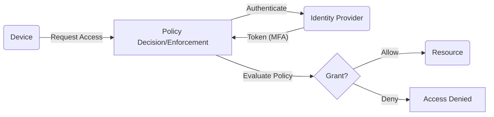

# Hardening Ubuntu Web Servers with Zero Trust  
**Executive Summary:** This report details a zero-trust approach to securing Ubuntu cloud‑style VPS web servers (suitable for government/healthcare contexts).  We assume **both external and internal threats** (i.e. no one on the network is trusted) and aim to protect Confidentiality, Integrity, Availability, and auditability of sensitive data (e.g. patient records).  Controls include **identity and least-privilege access**, **microsegmentation**, **continuous verification**, and **comprehensive telemetry**.  We recommend steps to harden the Ubuntu OS (kernel tuning, SSH, firewall, AppArmor, updates), secure common web stacks (NGINX/Apache, PHP/Python/Node, databases with TLS/HSTS/OCSP), and harden container/VM usage (Docker CIS Benchmarks, custom networks, rootless mode).  We cover logging/monitoring (EDR/IDS, auditd, SIEM), secure CI/CD and patching, backups/DR, and incident response.  A prioritized checklist and example configurations (SSH, iptables, sysctl, Docker policies) are provided.  

## Threat Model & Security Objectives  
**Threat Model:** Assume sophisticated attackers can be *internal (insiders, compromised accounts)* or *external (internet threats)*.  Attacks include credential theft, lateral movement, supply-chain compromise, zero-days, phishing (with remote access), untrusted networks, and network-based attacks (MITM, ARP spoofing).  We assume no implicit trust: every access request must be individually verified.  This aligns with modern environments: cloud servers, BYOD, remote work, hybrid apps.  

**Security Objectives:** Protect confidentiality (encrypt data at rest/in transit), integrity (e.g. signed code, write-once logs), availability (redundant design), and auditability (detailed logging/forensics).  Regulatory requirements (e.g. HIPAA, ISO 27001) mandate safeguarding electronic PHI – the HIPAA Security Rule explicitly requires protecting the **confidentiality, integrity, and availability** of patient data.  Audit controls must record all security‑relevant events (access grants, config changes, errors) for incident investigation and compliance.  In Zero Trust, we assume breach (simulate “assume breach” mindset) and focus on containment: microsegmentation, least privilege, and rapid detection/response.  

**Security Controls:** We apply core Zero Trust pillars to server hardening:  
- **Identity & Authentication:** Central IAM (SSSD/LDAP, federated SSO), strong passwords/MFA, device certificates, no shared accounts.  
- **Least Privilege:** Minimal OS install, lock down user rights (sudoers, file ACLs), drop container capabilities, chroot/jails.  
- **Microsegmentation:** Strict network isolation by VLAN or Docker/Kubernetes networks, firewall/iptables rules per subnet/host, internal networks.  Only explicitly allowed flows.  
- **Continuous Verification:** Periodic re-authentication, session timeouts, MFA re-challenge, attestation (e.g. server vetting, integrity checks) on each request.  
- **Telemetry & Monitoring:** Collect comprehensive logs (syslog, auditd), network flow logs, host/process telemetry (EDR/OSSEC), and feed into SIEM/IDS for real-time alerting.  

These map to controls as follows:  

| **Control Category**      | **Responsibility**        | **Controls / Tools**                             |
|---------------------------|---------------------------|--------------------------------------------------|
| **Identity/Acess Mgmt**   | Sysadmins / IT Sec Team   | Central IAM (SSSD/LDAP, Active Directory, Okta), MFA, Kerberos, TOTP/FIDO U2F, RBAC, SUDO policies |
| **OS Hardening**          | Sysadmins                 | CIS benchmarks (Ubuntu CIS, STIG), Ubuntu Security Guide, Kernel patches, AppArmor profiles, PAM hardening |
| **SSH & Admin Access**    | Sysadmins                 | Disable root login, key-based auth, forced 2FA (U2F/TOTP), strong Ciphers/MTU, Fail2Ban, limited forwarding |
| **Network Segmentation**  | Network/Sysadmins         | VLANs, firewalls (iptables/nftables, UFW), Docker/K8s networks, VPC subnets, ZeroTrust proxies |
| **Least Privilege/PrivDrop** | DevOps/Sysadmins      | Drop Linux capabilities (seccomp), use user namespaces, chroot, noexec/nosuid on filesystems |
| **Process Hardening**     | Sysadmins / DevOps        | Remove unnecessary services (Telnet, NIS), disable core dumps, limit cron jobs, set `ulimit` |
| **Logging/Auditing**     | SecOps / Sysadmins        | Auditd, syslog/rsyslog, Wazuh/OSSEC, file integrity (AIDE), central SIEM (Splunk/ELK), log rotation |
| **Monitoring/EDR/IDS**    | SecOps                    | Host IDS (OSSEC, Tripwire), Network IDS (Suricata, Zeek), EDR agents, Prometheus/Grafana alerts |
| **Patching/Updates**      | Sysadmins/DevOps          | Automated patches (unattended-upgrades), CI/CD pipeline with scanning (Trivy/Clair, Pentest) |
| **Backup & DR**           | IT Ops / Business         | Encrypted offsite backups, snapshotting (cloud), runbooks for restore, multi-region failover |
| **Compliance Auditing**   | SecOps / Audit Team       | Maintain CIS/NIST/HIPAA audit logs, hardened baseline reports, file integrity alerts, regular scans |

## Zero-Trust Architecture Mapping  

In Zero Trust, **no actor or network is inherently trusted**.  Every access (to servers or data) goes through a policy decision: authenticate identity, check posture, then authorize.  A simple flowchart:  



Under the hood, this means:  

- **Identity Controls:** All users/devices must authenticate before accessing any service. Use MFA, certificates, or tokens for every connection. For example, require SSH logins with YubiKey/U2F and no static passwords. Integrate with directory services (SSSD/LDAP, Active Directory) so access can be centrally managed and revoked. (Mapping: user identity ⟶ Ubuntu user accounts + PAM/SSH config.)  

- **Least Privilege:** Users get only the minimal rights. For instance, disable SSH root login and require use of individual accounts with `sudo`. On Ubuntu, put admin users in a specific group (e.g. `sudo`) and enforce `sudo` with strong password and logging. Harden services (NGINX, databases) to run under restricted accounts, remove write permissions, and apply Linux capabilities restrictions so that “root” in a container is not full host root.  

- **Micro-Segmentation:** Divide the network into trust zones. Even inside the cloud VPC, treat each subnet or Docker network as an untrusted zone. Use host firewalls (iptables/UFW) to block all traffic by default, then open only necessary ports (e.g. HTTP/HTTPS) to known subnets. Use Docker user-defined networks or Kubernetes network policies to isolate app tiers (web vs database vs internal API). For example, run database containers on a non-public internal network, and only expose them to app containers on the same network (no public NAT or open bridge).  

- **Continuous Verification:** Re-authenticate on every session, not just once. Use short-lived tokens (TLS session resumption can be disabled or limited), and require users to re-enter credentials/MFA if connection is idle or new resources are accessed. Implement host-based integrity checks (AIDE, Tripwire) and periodic vulnerability scans to ensure the server posture remains “known good.” (This is more policy/process than a single tool, but e.g. NIST suggests constantly monitoring device state and patch levels.)  

- **Telemetry & Analytics:** Log everything – all SSH logins, sudo commands, file changes, network flows, and application errors. Feed logs to a SIEM (Splunk, ELK) and EDR tools (OSSEC, Wazuh, CrowdStrike) for real-time alerts. For instance, configure `auditd` to record changes to /etc, track processes execve calls, and send syslog to a central server. Zero Trust relies on “knowing” every action, so ensure robust logging per NIST/HIPAA recommendations (e.g. log retention 6 years for HIPAA).  Alert on anomalies (e.g. multiple failed logins, config tampering) to detect breaches quickly.  

## Ubuntu VPS Hardening Steps  

**1. System Updates & Packages:** Always apply security patches promptly. Enable automated updates (e.g. Ubuntu’s `unattended-upgrades` for the *universe*- provided kernels and packages). Use Ubuntu LTS or ESM kernels. Install only needed software: remove GUI, Avahi, NIS, telnet, rsh, etc. For example, disable or purge `cloud-init` modules you don’t use, and run `systemctl disable --now` on any unwanted services (CUPS, DHCP server, X11). This reduces the attack surface.  

**2. Filesystem & Bootloader Hardening:** As per CIS, mount critical filesystems with restrictive flags (e.g. `/tmp`, `/var/tmp`, `/dev/shm` with `noexec,nosuid,nodev`) to prevent unauthorized binary execution. Encrypt disks: enable LUKS on data drives; cloud boot volumes can leverage built-in encryption (AWS EBS encryption, Azure Disk Encryption) if needed. Where possible, enable Secure Boot to protect the kernel and boot chain (note: not all clouds support it, but bare-metal or OpenStack can). Protect GRUB: set a password for boot entry editing. Disable legacy/unused boot entries. Use `grub2` and verify `/boot/grub/grub.cfg` is not world-writable.  

**3. Kernel Parameters (sysctl):** Tune kernel network settings:  
- `net.ipv4.ip_forward = 0` (unless router) and `net.ipv6.conf.all.disable_ipv6 = 1` if IPv6 not in use.  
- Enable reverse path filtering (`net.ipv4.conf.all.rp_filter = 1`) and TCP SYN cookies (`net.ipv4.tcp_syncookies = 1`).  
- Disable ICMP redirects (`net.ipv4.conf.all.send_redirects = 0`).  
- Set `fs.suid_dumpable = 0` to disable core dumps of SUID programs.  
- Kernel security modules: ensure AppArmor is enforced on all profiles (Ubuntu ships many; use `aa-status`). Disable unneeded modules via `/etc/modprobe.d/blacklist.conf` (e.g. remove `dccp`, `sctp` modules if not used) to limit kernel attack surface.  

**4. SSH Hardening:** Edit `/etc/ssh/sshd_config`:  
   - `PermitRootLogin no` (disable root login).  
   - `PasswordAuthentication no` (force key/MFA only) and `PubkeyAuthentication yes`.  
   - Set `MaxAuthTries 4` or lower to limit brute-force.  
   - Use only modern Ciphers/Kex (e.g. disable `ssh-rsa`, allow only `rsa-sha2-512` or ED25519 keys).  
   - Enable `LoginGraceTime 30s`, `PermitEmptyPasswords no`, and `UsePAM yes` with `MaxStartups` low.  
   - Enable SSH session recording if required (shell session logging).  
   - Consider requiring SSH 2FA (with Google Authenticator or FIDO).  Use the Ubuntu Server doc for setting up U2F for SSH.  
   - Set an SSH banner warning if needed.  Finally, restart SSH.  

**5. User and Sudo Management:** Remove or lock all unused user accounts. Force strong password policies (see `libpam-pwquality` and `pam_faillock`). Enforce a password aging policy via `/etc/login.defs`.  Admin users should have unique accounts; avoid shared creds. Restrict sudoers: in `/etc/sudoers`, remove `NOPASSWD` entries, and specify which commands can be run. (For instance, only allow `NOPASSWD: /usr/bin/apt update, /usr/bin/systemctl restart httpd` if needed; otherwise require password). Record all sudo commands via `Defaults logfile="/var/log/sudo.log"`. Disallow X11/Xhost forwarding.  

**6. PAM and Authentication:** Use `/etc/pam.d/common-auth` to lock accounts after N failures (`pam_faillock`), and enforce `/etc/pam.d/common-password` with `minlen=12, ucredit=-1, lcredit=-1, dcredit=-1`. Use `common-session` to run `pam_tty_audit` for audit logging of user input. Consider enabling two-factor in PAM.  

**7. AppArmor and Process Isolation:** Ensure AppArmor is **enforced** for key services (e.g. `dnsmasq`, `Nginx`, `mysqld`). Load all recommended profiles (`/etc/apparmor.d`) and put them in *enforce* mode with `aa-enforce <profile>`. If a service lacks a profile, create one (Ubuntu docs provide guides). Use `aa-logprof` to refine profiles. Also consider chrooting services if possible (e.g. `OpenSSH` has `ChrootDirectory` for limited shell jails).  

**8. Firewall:** Use `ufw` or raw `iptables`/`nftables`. At minimum, `ufw default deny incoming, allow outgoing` and explicitly allow needed ports (e.g. `ufw allow ssh,http,https`). For finer control, use `iptables` chains: e.g.  
```bash
iptables -P INPUT DROP
iptables -A INPUT -m conntrack --ctstate ESTABLISHED,RELATED -j ACCEPT
iptables -A INPUT -p tcp -m multiport --dports 22,80,443 -j ACCEPT
iptables -A INPUT -p icmp -j DROP   # or limit ping
```
Block all other traffic. Disable ICMP redirects. On Ubuntu, you can also use `nftables` for more readable rules. For Docker hosts, Docker may manipulate iptables automatically – review Docker’s chains (see section below). Always **save** rules (`iptables-save`).  

**9. Network Namespaces & Virtualization:** If using Linux containers or virtualization, isolate network stacks. For example, do not bridge the Docker default network to the host’s main network if sensitive; create separate user-defined bridge networks. Avoid using the `host` network driver unless absolutely needed (it disables container isolation). Consider using `none` driver for containers that should have no network. On VMs, disable unnecessary NICs. Use cloud security groups (AWS, Azure NSGs) as an external firewall layer too.  

**10. Logging and Time:** Enable detailed logging. Turn on `auditd` to record at least: changes to `/etc`, `execve`, `ptrace`, and network config changes. Forward logs to a central collector (syslog or journald remote). Ensure timestamps are accurate (use `chrony` with an NTP or internal GPS clock). Configure long retention of logs (days≥90 for critical events) per compliance.  

**11. Package Management:** Use signed repositories only. In `/etc/apt/sources.list.d`, ensure `signed-by` GPG keys are set. Remove any leftover CD/DVD entries. Enable `apt-autoremove` for old kernels. For added safety, consider `apt-listchanges` to notify you of important package changes.  

## Web Stack Specifics  

**Web Server (NGINX/Apache):** Use only one and remove the other if not needed. Harden config: disable directory listing and unnecessary modules. Enable TLS v1.2+ (disable SSLv3/SSLv2/TLSv1.0/1.1) and use strong ciphers (no RC4/3DES; e.g. use AES-GCM, CHACHA20, ECDHE key exchange). Add **HSTS** headers (`Strict-Transport-Security`) to enforce HTTPS, and use **OCSP Stapling** to speed up TLS revocation checks. For example:  
```nginx
ssl_protocols TLSv1.2 TLSv1.3;
ssl_prefer_server_ciphers on;
ssl_ciphers 'ECDHE-ECDSA-AES256-GCM-SHA384:ECDHE-RSA-CHACHA20-POLY1305:...';
ssl_stapling on;
add_header Strict-Transport-Security "max-age=63072000; includeSubDomains; preload" always;
add_header X-Frame-Options "DENY" always;
```
Disable server tokens to not leak version (`server_tokens off` in Nginx, `ServerSignature Off` in Apache). Restrict allowed HTTP methods (e.g. only GET, POST, OPTIONS) and disable TRACE/DELETE unless needed. Use ModSecurity or a WAF if available for application-layer filtering.  

**Programming Languages:** Run application code (PHP/Python/Node) with minimal privileges. For PHP-FPM, use chroot or `open_basedir` to limit file access, and disable dangerous functions (like `exec`, `shell_exec`) in `php.ini`. Keep runtime (PHP/Node) up to date, and use LTS versions. For Python/Node apps, use virtual environments, and run as non-root user. Enable `node --security` or Python sandboxing (if available). Implement input validation and CSRF protection in the app itself (beyond the server’s scope).  

**Database (MySQL/PostgreSQL):** Bind the DB server to localhost or internal IP only (`bind-address = 127.0.0.1`). Disable remote root or admin login (`mysql> DELETE FROM mysql.user WHERE user='root' AND host!='localhost';`). Use TLS for database connections (force `SSL_MODE=REQUIRED` in client configs). Enforce strong passwords and unique DB users per app. Remove sample databases (e.g. `testdb`). Use row-level permissions and stored procedures if needed for further isolation. Enable query logging/auditing (e.g. `mysqld_audit` or `pgAudit`). Regularly update/patch the database software.  

**TLS/Certificates:** Store certificates securely (not on web root). Use Let’s Encrypt or enterprise CA with automated renewal. Enable **OCSP Stapling** as above and check revocation. Use a strong Diffie-Hellman group (e.g. 4096-bit). For key protection, use hardware modules (HSM or KMS) if available, or at least `chmod 400` on private keys.  

**HTTPS Security:** Redirect all HTTP to HTTPS. Use HSTS with preloading for all subdomains if not serving any plaintext content. Disable SSLv3/TLS1.0.  

**Static File Protection:** Limit upload directories: mount uploads with `noexec` and scan for malware. Set `X-Content-Type-Options: nosniff` to prevent MIME attacks, and `X-Frame-Options: DENY` to prevent clickjacking (see [75] snippet). Use Content-Security-Policy headers to restrict external scripts.  

## Containers (Docker) vs VM vs Bare-Metal  

**Bare VPS (traditional):** Offers full control of OS; good isolation from noisy neighbors but slower provisioning. On bare Ubuntu servers, hardening is as above. Without virtualization, host is single point of failure; use clustering for HA.  

**VMs:** Ubuntu on a VM (KVM, VMware) provides kernel isolation, so a kernel exploit is limited to the VM. Hardening steps are the same inside the VM. Ensure VM hypervisor is secure (updates, no nested virtualization expose host). Use cloud provider IAM roles to restrict VM management.  
- VMs can use Secure Boot if supported, and disk encryption (each VM volume).  
- Hypervisor-level firewalls (AWS Security Groups, Azure NSG) add defense in depth.  

**Containers (Docker):** Containers share the host kernel, so a container escape can compromise the host. Thus, extra caution is needed. Follow CIS Docker Bench and Docker Docs:  
   - **Docker Daemon:** Run Docker in rootless mode if possible (Docker 20+ supports it). Otherwise, limit users in the `docker` group because Docker is root-equivalent. Do **not** expose the Docker API over HTTP – use the Unix socket and TLS when remote (Socket is default after 0.5.2 to avoid CSRF). If exposing, secure with TLS certs and firewall.  
   - **Images:** Use minimal base images (Alpine, Distroless). Follow the Docker CIS Benchmark for image build (e.g. remove package manager, disable SSH in container). Sign images with a content trust mechanism (Docker content trust is retired; use Cosign). Regularly pull updates and scan images (Clair/Trivy).  
   - **Runtime:** Drop all unnecessary capabilities and set `--security-opt=no-new-privileges` on containers. Use `--user` to run processes as non-root inside. Enable user namespaces (`--userns-remap`) to map container root to an unprivileged host UID. Mount only needed volumes with `ro` where possible. Avoid `--privileged` mode or bind-mounting `/` (as [40] warns, it would give the container full host fs access).  
   - **Docker Networks:** By default, Docker’s `bridge` network allows containers to talk freely. For security, create user-defined bridges or overlay networks with no auto-mesh. For example: `docker network create --driver bridge myapp-net` and attach only related containers. Mark truly private networks using `--internal` (so no external access). With Docker Engine 28+, traffic to unpublished ports is **dropped by default** to prevent LAN access. Ensure you’re on v28+, or manually implement drop rules (`iptables -I DOCKER-USER -d 172.17.0.0/16 -j DROP`). Segment container networks per trust zone (e.g. web-tier vs db-tier).  
   - **Firewalling for Containers:** Even though Docker sets some iptables, add a `DOCKER-USER` chain at the top to enforce host policy. Example: `iptables -I DOCKER-USER -j DROP` to block by default, then allow published ports. This ensures containers cannot be reached from the host network unless explicitly allowed.  
   - **Security Tools:** Use **Docker Bench for Security** (by CIS) to audit your host and containers automatically. It checks dozens of best-practices. Also consider Falco or eBPF tools to detect unexpected behavior at runtime.  

## Logging, Monitoring, EDR/IDS, and SIEM  

- **System Audit Logs:** Enable `auditd`. Audit at least: file changes under `/etc, /usr/bin, /var/log`, `useradd/groupadd`, SSH and sudo commands. Ensure `/var/log/audit/audit.log` is remote-logged or collected (rsyslog to central). On Ubuntu, install `audispd-plugins` to forward to syslog/remote SIEM.  

- **Intrusion Detection:** Deploy a host-based IDS (OSSEC/Wazuh, Tripwire, AIDE) to monitor file changes and suspicious processes. At the network perimeter (or VPC level), use a NIDS like Suricata/Zeek to inspect traffic patterns (e.g. unusual outbound connections).  

- **EDR (Endpoint Detection/Response):** Consider commercial or open-source EDR agents on servers (e.g. CrowdStrike, CarbonBlack, or OpenEDR). These provide real-time analytics and containment.  

- **Log Aggregation/SIEM:** Centralize all logs (syslog, application logs, IDS alerts) into a SIEM (Elastic Stack, Splunk, Azure Sentinel). Correlate events: e.g. login from VPN then Docker container launch = potential breach. Use dashboards and set alerts for high severity (e.g. multiple failed logins, integrity violations, admin privilege escalation).  

- **Monitoring:** Implement uptime and performance monitoring (Prometheus/Grafana). Alert if CPU/Memory spikes (could indicate crypto mining). Monitor web server (HTTP status) and SSL certificate expiry.  

- **Forensics:** If an incident occurs, have disk imaging tools (Clonezilla, AWS snapshots) ready. Keep OSINT and logs timestamp-synced (using NTP) for timeline reconstruction. Maintain an incident response plan (steps to isolate, analyze, recover).  

## Patch Management & Secure Deployment (CI/CD)  

- **Automated Patching:** Use Ubuntu’s `unattended-upgrades` to automatically apply security updates daily. For major upgrades, use orchestration (Ansible/Chef). Test patches in a staging VM/container before production.  

- **CI/CD Security:** Integrate static analysis (linting, vulnerability scanning) into your pipeline. For example, run `npm audit`, `bandit` (for Python), or SAST tools on each commit. Use pinned dependency versions. Don’t store secrets in code – use Vault/KMS for DB passwords. Docker images should be rebuilt on base-image updates and rescanned.  

- **Infrastructure as Code:** Manage servers via IaC (Terraform, CloudFormation). Store code in version control with review. Use signed commits/tags for releases. In deployments, use minimal IAM roles (principle of least privilege for CI/CD agents). Prefer immutable deployments (replace vs patch).  

- **Content Trust:** Use image signing. Docker Content Trust is deprecated; instead sign images with Cosign (as Docker does for its Hardened Images). Verify signatures on pull. For artifact repositories (Docker Hub, ECR), enable automated scanning and set policies (e.g. block images with critical CVEs).  

- **Secrets Management:** In CI/CD, pull secrets from vaults (HashiCorp Vault, AWS Secrets Manager). Don’t bake secrets into machine images.  

## Backup, Disaster Recovery & Incident Response  

- **Backups:** Automate encrypted backups of critical data and configs. For web servers, back up `/etc/`, webroot, and databases nightly. Use incremental backups and store offsite (cloud storage with immutability). Test restores regularly. Maintain a separate vault for encryption keys/credentials.  

- **High Availability & DR:** For critical web apps (e.g. hospital portal), use multi-zone redundancy (load-balanced NGINX, database replication). Prepare DR runbooks: e.g. “in outage, spin up AMI from recent image + data restore script.”  

- **Incident Response:** Draft an IR plan: identification, containment, eradication, recovery steps. If breach suspected, isolate affected server (e.g. detach from network or revoke keys), preserve logs/disk image. Notify compliance/legal as per HIPAA breach rules. After resolution, perform a root cause analysis and patch vulnerabilities. Keep documentation of IR actions for audit.  

## Audit Controls & Evidence  

To demonstrate compliance (HIPAA, ISO27001, etc.), collect evidence:  
- **Policy Documentation:** Have documented security policies (passwords, patching, backup) and show logs of enforcement.  
- **Configuration Audits:** Periodically run CIS/SCAP audits (e.g. Ubuntu CIS benchmarks via OpenSCAP, or the Ubuntu Security Guide) and store the reports. These form evidence that controls are implemented.  
- **Change Logs:** Enable change tracking (`etckeeper` for /etc changes, Git for infrastructure code). Keep immutable logs of config changes and admins actions.  
- **User Access Logs:** Retain auth logs, sudo logs, database audit trails as records. This shows who accessed what and when.  
- **Vulnerability Scans:** Run regular Nessus or OpenVAS scans; archive reports. Show remediation of critical findings.  
- **Training Records:** For some regs (like HIPAA), maintain staff training logs on security awareness.  

## Prioritized Checklist  

We assign *High/Medium/Low* priority based on impact:  

- **[H]** *OS Patching:* Enable unattended-upgrades and install all critical security updates immediately.  
- **[H]** *SSH & Accounts:* Disable root login, enforce keys+MFA, limit MaxAuthTries. Clean unused accounts.  
- **[H]** *Firewall:* Set default-deny iptables/UFW rules; allow only needed ports (22,80,443). Test block all else.  
- **[H]** *Encryption:* Enable TLS 1.2+/HSTS on web servers; encrypt disks or cloud volumes.  
- **[H]** *IAM & RBAC:* Use centralized identity (SSSD/AD), enforce MFA on admin access.  
- **[M]** *AppArmor/SELinux:* Ensure profiles are enforcing on core services.  
- **[M]** *Container Hardening:* Implement Docker CIS controls: run latest Docker 28.x+ (dropping unpublished ports by default), no privileged containers, use bench.  
- **[M]** *Backup/DR:* Automated encrypted backups; test restores quarterly.  
- **[M]** *Logging & SIEM:* Forward all logs to SIEM/EDR; implement alerts for critical events (suspicious access, config changes).  
- **[M]** *CI/CD Pipelines:* Enable image scanning, use signed commits/artifacts, least-perm for deployment agents.  
- **[L]** *Secure Boot:* Enable if cloud or hardware supports it; set GRUB password.  
- **[L]** *Network Hardening:* Disable IPv6 if unused; disable ICMP redirects. Microsegment Docker networks (e.g. use `--internal`).  
- **[L]** *Periodic Audits:* Schedule monthly CIS Benchmark scans (Ubuntu STIG/CIS, Docker bench) and remediate.  

**Example Commands/Snippets:**  
```bash
# Disable SSH root login and enforce key auth
sed -i '/^PermitRootLogin/s/yes/no/' /etc/ssh/sshd_config
sed -i '/^#PasswordAuthentication/s/#//' /etc/ssh/sshd_config
sed -i 's/^PasswordAuthentication .*/PasswordAuthentication no/' /etc/ssh/sshd_config
systemctl reload sshd

# UFW: default deny, allow SSH/HTTP/HTTPS
ufw default deny incoming
ufw allow ssh
ufw allow 80/tcp
ufw allow 443/tcp
ufw enable

# Sysctl hardening example
cat <<EOF > /etc/sysctl.d/99-hardening.conf
net.ipv4.ip_forward = 0
net.ipv4.conf.all.rp_filter = 1
net.ipv4.tcp_syncookies = 1
net.ipv4.conf.all.send_redirects = 0
fs.suid_dumpable = 0
EOF
sysctl --system

# Harden Docker daemon (example flag in daemon.json)
cat <<EOF > /etc/docker/daemon.json
{
  "disable-legacy-registry": true,
  "userns-remap": "default",
  "ip-forward-no-drop": true
}
EOF
systemctl restart docker

# Nginx security headers (in site conf)
add_header X-Content-Type-Options "nosniff" always;
add_header X-Frame-Options "DENY" always;
add_header Strict-Transport-Security "max-age=31536000; includeSubDomains" always;

# Run Docker Bench for Security (self-check)
git clone https://github.com/docker/docker-bench-security.git /opt/docker-bench
cd /opt/docker-bench
sudo sh docker-bench-security.sh
```

## Common Pitfalls & Mitigations  

- **Overlooking the Host:** Securing only containers and forgetting the host OS. Docker escape exploits mean you must lock down Ubuntu itself (apply patches, use AppArmor). Always apply host-level CIS controls as well.  
- **Open Docker Networks:** Using Docker’s default bridge without restrictions can expose containers inside the LAN. Mitigate by using the new Docker v28 default drop rules or custom bridge networks.  
- **Lax SSH Settings:** Leaving `PermitRootLogin yes` or weak ciphers exposes root. Mitigate by enforcing no-root, key-only, and fail2ban.  
- **Stale Credentials:** Hard-coded database credentials or AWS keys in code: rotate secrets regularly, use Vault.  
- **Ignoring Logs:** Not monitoring logs is common. Ensure logs are not left on only local disk (encrypt and ship them), and review them (set up IDS alerts).  
- **Weak TLS:** Using outdated TLS (SSLv3/TLS1.0) or self-signed certs. Always use strong CA-signed certs, disable old protocols.  
- **Inadequate Backups:** Relying on snapshots without testing. Always perform restore drills.  
- **Insufficient Segmentation:** Putting all apps on one network / flat firewall rule. Use internal network constructs (e.g. private subnets, internal Docker networks) to enforce “need-to-know” network access.  

**Tools Summary:** Use Ubuntu’s built‑ins (AppArmor, UFW), CIS/CAT tools, Docker Bench, OpenSCAP. For monitoring: ELK stack, Wazuh/OSSEC, OSQuery or Falco. For credentials: Vault, AWS KMS. Keep all solutions up to date. 

**References:** Authoritative guidelines were followed, including Ubuntu’s and CIS security guides, NIST SP800-207 on zero trust principles, Docker’s official docs and CIS benchmark info, as well as security blogs like Aqua’s Docker best practices and NHS network segmentation guidance. Each configuration example is drawn from these sources to ensure compliance with industry standards. The above hardening roadmap is comprehensive yet practical for Ubuntu cloud VPS servers in strict environments.