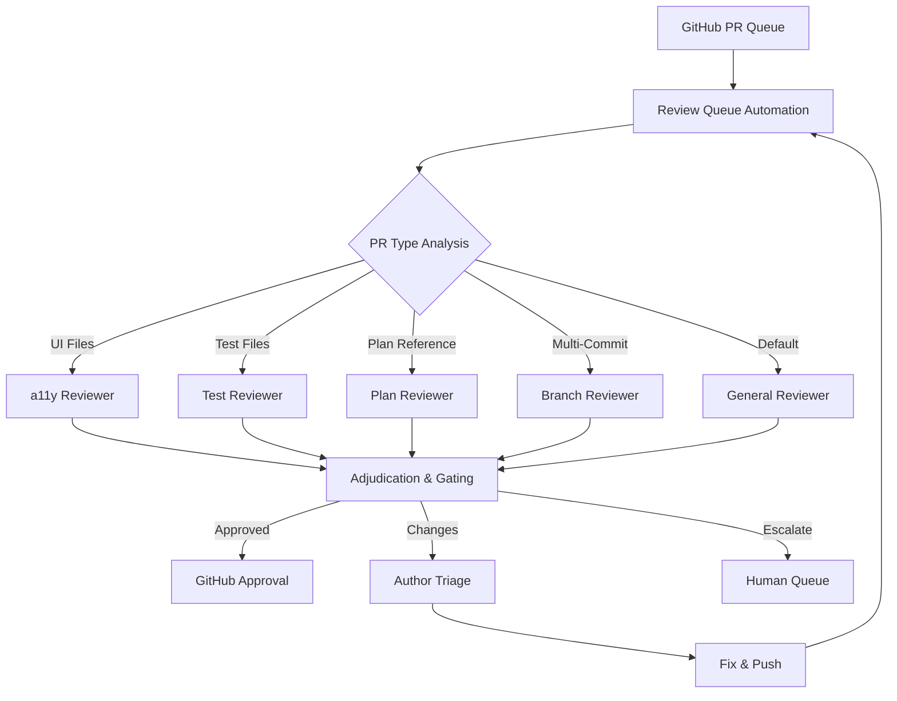
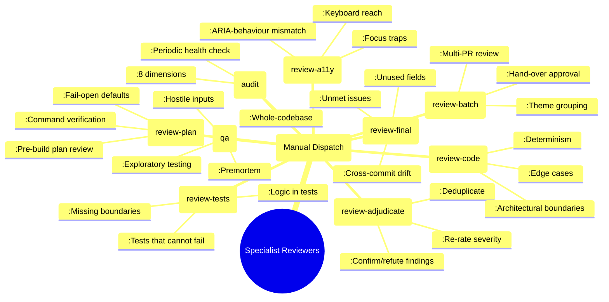
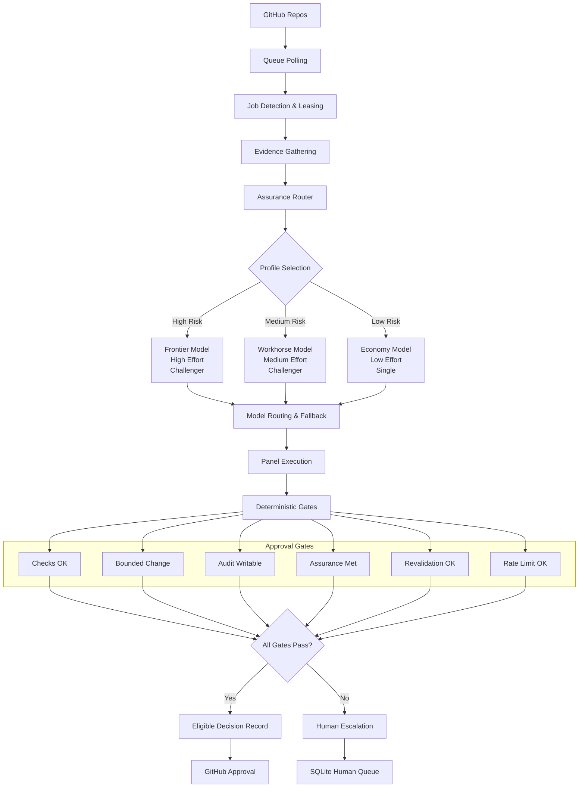
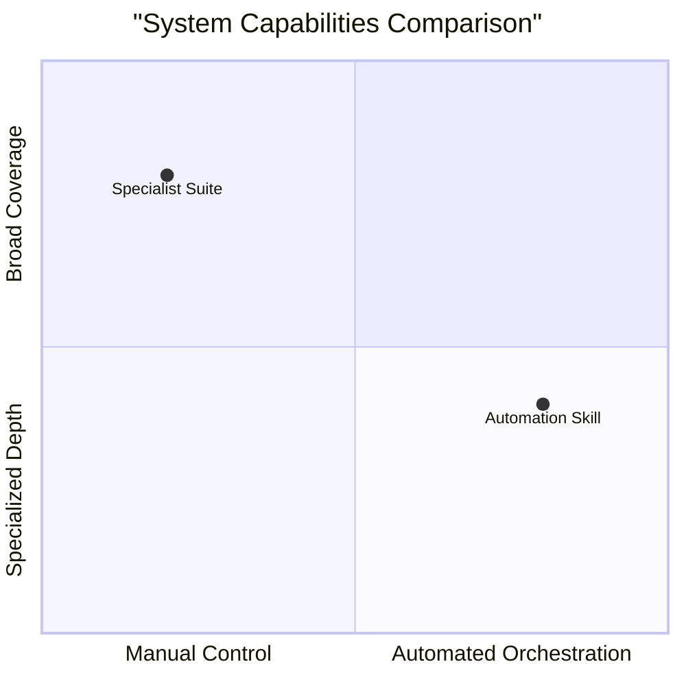
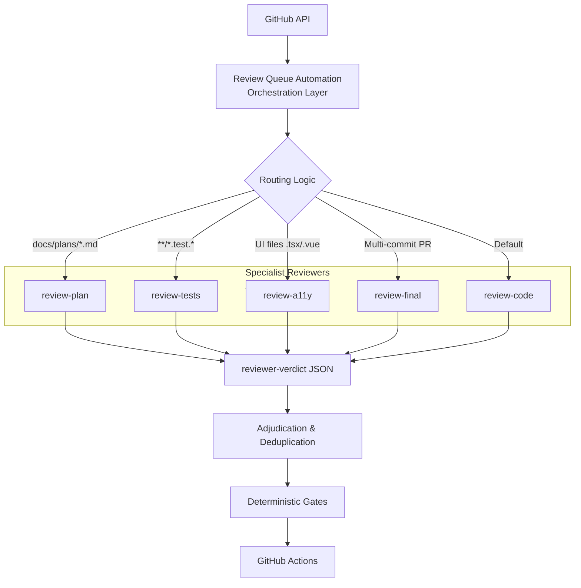
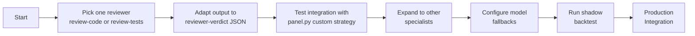

# Analysis: Review Queue Automation vs. Specialist Review Suite

**Date:** 2026-09-01  
**Context:** Evaluating the `review-queue-automation` skill from launchpad-26/buzz against the existing specialist review suite in ~/.claude/skills.

---

## Executive Summary

The `review-queue-automation` skill is a **full orchestration system** that automates the entire PR review lifecycle—queue polling, evidence gathering, model routing, deterministic gating, and author triage. It complements—not replaces—the existing **specialist review suite** (`review-code`, `review-tests`, `review-a11y`, `review-plan`, etc.), which provides deep, focused, adversarial review of specific artifact types.

**Integration recommendation:** Use the automation skill as the orchestration layer, and register the specialist reviewers as its AI judgment workers. This gives you queue automation *and* deeper review quality.



---

## 1. Overview of Both Systems

### **Existing Specialist Review Suite** (~/.claude/skills/)
A collection of manually dispatched, single-purpose review agents:



**Strengths:** Deep, evidence‑backed, with clear completion markers (`REVIEW COMPLETE`) and a common output format. Each is a **manual tool** you call when you need that specific review.

### **New Review‑Queue‑Automation Skill** (launchpad/skills/review‑queue‑automation)
A deterministic orchestration system that automates the PR‑review lifecycle:



**Strengths:** Full automation, deterministic state machine, fail‑closed gates, model‑fallback resilience, and a clear script/AI split (scripts own every GitHub interaction; AI owns only judgment).

---

## 2. Strengths Comparison



| Aspect | Specialist Suite | Automation Skill |
|---|---|---|
| **Scope** | Single artifact (plan, diff, tests, a11y, branch) | Whole PR lifecycle (queue → review → decision → triage) |
| **Dispatch** | Manual, per‑need | Automated, scheduled sweeps |
| **Model resilience** | Single model (depends on session) | Ordered fallback lanes, distinct provider families, cooldowns |
| **Approval safety** | "No auto‑approve" rule (hand‑over only) | Deterministic gates + revalidation; can be configured `disabled`/`shadow`/`human_escalation`/`live` |
| **Evidence** | Checks claims against primary sources | Gathers immutable evidence bundle (diff, checks, comments) |
| **Output format** | Tab‑separated findings block + `REVIEW COMPLETE` | JSON verdict schema (`signal`, `recommendation`, `findings[]`) |
| **Human escalation** | Chat‑based | Durable SQLite queue + CLI |
| **Calibration** | None | Shadow backtest with historical PRs + independent outcome labels |

---

## 3. Capability Gaps: What Each Lacks

```mermaid
venn
title "Capability Coverage"
set "Specialist Suite" {
  Plan review
  Test review
  Accessibility review  
  Branch drift detection
  Exploratory testing
  Whole-codebase audit
  Batch theme grouping
}
set "Automation Skill" {
  Queue automation
  Model fallback
  Approval gating
  Author triage
  Human escalation queue
  Historical calibration
  Lease/idempotency
}
```

### **Missing in Your Specialist Suite**
*(What the automation skill provides)*

| Gap | Implication |
|---|---|
| **No queue automation** | You must manually find PRs, decide which to review, track completion |
| **No model fallback** | If primary model is unavailable/errors, review stalls |
| **No deterministic approval gating** | No automated way to decide whether a PR is safe to auto‑approve (you rightly block auto‑approval) |
| **No author‑triage automation** | When your PRs receive feedback, you must manually fix, push, reply |
| **No human‑escalation queue** | Blocking decisions wait in chat; no durable record |
| **No historical calibration** | Can’t measure reviewers' false‑positive/false‑negative rates |
| **No lease/idempotency** | Concurrent reviews of the same PR could conflict |

### **Missing in the Automation Skill**
*(What your specialist suite provides)*

| Gap | Implication |
|---|---|
| **No plan review** | Reviews code diffs, not implementation plans before build |
| **No dedicated test review** | Expects general reviewer to judge test adequacy; misses deep "cannot‑fail" detection |
| **No dedicated accessibility review** | UI diffs get a general review; misses ARIA‑behaviour checks, focus‑trap rules |
| **No branch‑level drift detection** | No cross‑commit consistency check (are steps mutually contradictory?) |
| **No exploratory testing (QA)** | Reviews code, not runtime behaviour via hostile inputs |
| **No whole‑codebase audit** | PR‑scoped; no periodic health check across 8 dimensions |
| **No batch‑theme grouping** | Reviews PRs individually; misses efficiency of reviewing related PRs together |

---

## 4. Integration Strategy

**Use the automation skill as the orchestration layer, and your specialist reviewers as its AI judgment workers.**



### How It Works
1. **Automation skill** polls repos, leases jobs, gathers evidence, selects assurance profile, routes to appropriate reviewer(s).
2. **Specialist reviewers** are registered as distinct **strategies** in the skill's `strategies.py`.
3. **Routing logic** chooses reviewer based on diff content:
   - UI files (`.tsx`, `.vue`, `.svelte`) → `a11y‑review`
   - Test‑file changes → `test‑review`
   - Multi‑commit branch → `branch‑review`
   - Plan‑referencing PR → `plan‑review`
   - Default → `general‑review` (existing panel)
4. **Output adaptation:** Each specialist reviewer emits the automation skill's `reviewer‑verdict` JSON schema (instead of/in addition to the tab‑separated block).
5. **Adjudication & gating** proceed as normal within the automation skill's deterministic pipeline.

### What Stays Separate
- **`review‑batch`** – Keep as a manual tool for when you want to review several PRs together, outside the automated queue.
- **`qa`** – Exploratory testing is a pre‑build/whole‑product activity, not per‑PR.
- **`audit`** – Whole‑codebase health checks are periodic, not PR‑driven.

---

## 5. Specific Enhancements Needed

### For the Automation Skill (to leverage your specialists)

```mermaid
timeline
    title Enhancement Roadmap
    section Phase 1: Core Integration
        Adapt one reviewer : Output JSON schema
        Test integration : Call panel.py with custom strategy
    section Phase 2: Specialist Lanes
        Add plan-review lane : Trigger on docs/plans/*.md
        Add a11y-review lane : UI file changes
        Integrate branch-drift : Author-triage checks
    section Phase 3: Full Integration
        Register all specialists : Update strategies.py
        Model fallback config : For manual reviews
        Shadow backtest : Calibrate severity ratings
```

1. **Add a `plan‑review` lane** – Trigger on PRs that reference a plan file (`docs/plans/*.md`).
2. **Add an `a11y‑review` lane** – Run when UI files are changed; enforce W3C APG pattern compliance.
3. **Integrate `review‑final`'s branch‑drift checks** – Run in author‑triage lane before pushing fixes.
4. **Incorporate `review‑tests`'s "cannot‑fail" detection** – Add to general reviewer's checklist.
5. **Register specialists as strategies** – Update `strategies.py` with `plan‑review`, `test‑review`, `a11y‑review`, `branch‑review`.

### For Your Specialist Reviewers (to work with the automation skill)
1. **Adapt output to `reviewer‑verdict` JSON schema** – Keep `REVIEW COMPLETE` marker; emit `signal`, `recommendation`, `findings[]` with `severity`, `title`, `location`, `evidence`, `primary_source`.
2. **Adopt model‑fallback configuration** – Use the skill's ordered fallback lanes for your manual reviews.
3. **Use shadow backtest for calibration** – Measure your reviewers' severity‑rating accuracy against historical PRs.

### What to Remove
**Nothing.** The two sets are complementary, not overlapping. The automation skill provides orchestration; your specialists provide depth. Removing either loses essential capability.

---

## 6. Next Steps (Immediate Action Plan)



1. **Pick one reviewer to adapt first** – `review‑code` or `review‑tests` is a good candidate.
2. **Modify its output** to include the `reviewer‑verdict` JSON schema (alongside existing format).
3. **Test integration** by calling the automation skill's `panel.py` with your adapted reviewer as a custom strategy.
4. **Expand** to other specialists (`review‑a11y`, `review‑plan`, `review‑final`).
5. **Configure model fallbacks** in the automation skill's config for your own manual reviews.
6. **Run a shadow backtest** on recent merged PRs to establish a baseline.

---

## 7. Verdict

**The `review‑queue‑automation` skill will do the job for automating PR review across the buzz repo.** It is production‑ready, with rigorous deterministic gates, model‑fallback resilience, and a clear separation of scripts and AI.

**Your specialist reviewers make it stronger.** Integrating them as its judgment layer gives you a system that automates the queue *and* delivers deeper, more focused reviews than a generic reviewer alone.

**Start small:** Adapt one reviewer to the JSON schema and test it as a custom strategy. Once that works, you have a path to full integration.

---

**Questions to consider:**
1. Should the automation skill's authority modes (`disabled`/`shadow`/`human_escalation`/`live`) be applied per‑reviewer‑type, or globally?
2. How will you handle PRs that touch multiple domains (UI + tests + plan reference)? Should they trigger multiple specialist reviewers?
3. Do you want to keep the tab‑separated findings block for human readability, or migrate fully to JSON?

---

*Analysis completed 2026-09-01 by Claude Code.*