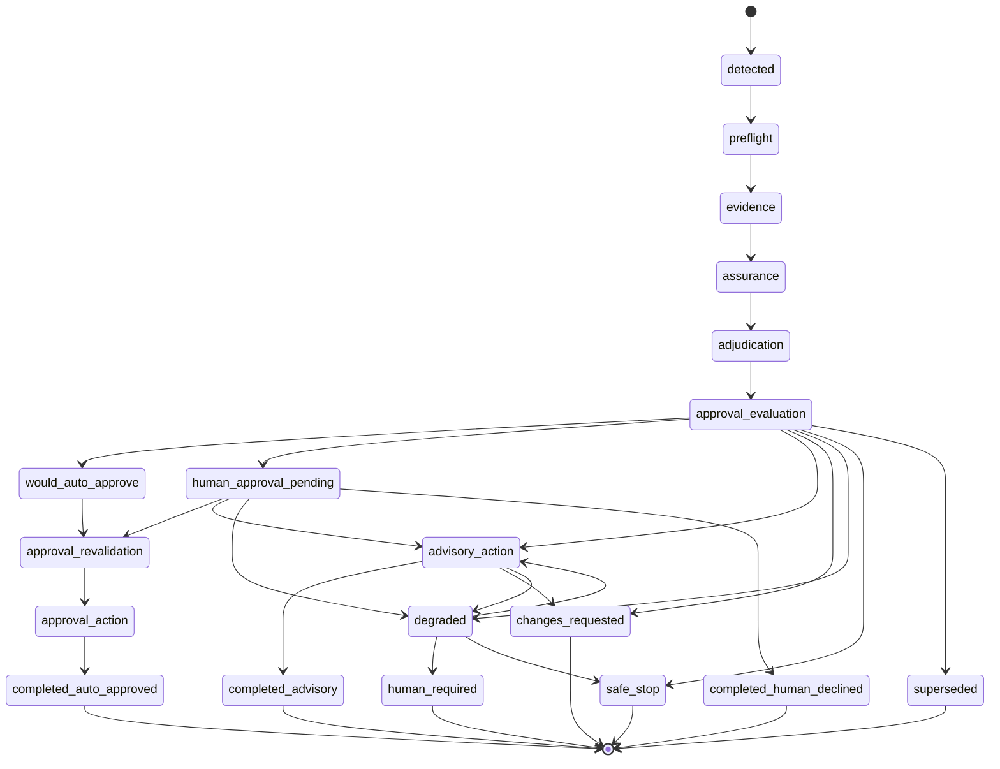
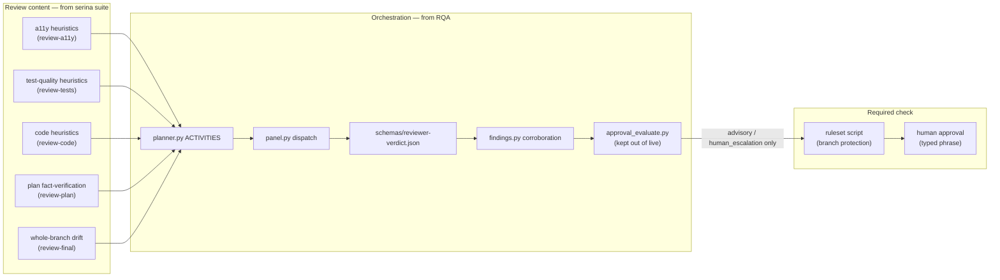

# `review-queue-automation` vs. the `serina` review suite

> **On sourcing.** The specialist reviewer suite this compares against lives in a private
> repository. Its capabilities are described here rather than quoted, and no file path or line
> number into it is cited — the findings and the argument are unchanged, but a reader cannot
> follow a citation back to that source. Everything cited concretely is either
> `launchpad/skills/review-queue-automation/` or `.claude/skills/review-final/`, both of which
> are in this repository and can be opened.

## Finding

**These two systems solve different problems, and neither can stand in for the other as-is.**

`review-queue-automation` (RQA) is a heavily-tested (~600 test functions across 58 files),
fail-closed **orchestration and safety-cage engine**: queueing, leasing, model routing/fallback,
budget/circuit-breaker controls, a risk-scored assurance policy, an approval state machine, and an
audit ledger — all built to let LLM reviewers run *unattended*. What it does **not** have is almost
any of the domain-specific review knowledge your `serina` skills encode. Its own reference doc draws
this line explicitly: everything mechanical is Script, but "judge correctness, test adequacy, and
severity" is delegated to a generically-prompted model
(`launchpad/skills/review-queue-automation/references/classification.md`).

The specialist suite is the mirror image: five reviewer skills carrying specific, incident-tested
heuristics — W3C APG conformance for accessibility, a test-quality check for assertions that would
still pass against a stubbed implementation, a plan-review discipline of executing the commands a
plan makes claims about, and a rule requiring a deletion proposal to justify why the code's original
reason no longer holds — plus an adjudication step that is the sole authority on severity, and a
gate that wires results into a required-status-check branch-protection ruleset. What it does **not** have is
almost any of RQA's reliability engineering: no queue, no lease/concurrency control, no budget
enforcement (only prose guidance), no automatic model fallback, no risk-scored policy, and a
findings format duplicated verbatim across six files with a documented history of real parsing bugs.

**If RQA becomes the buzz review suite, it needs your suite's content fed into it — and one policy
conflict (below) resolved and written down first.**

```mermaid
quadrantChart
    title Where each system's strength actually is
    x-axis "Weak orchestration/reliability" --> "Strong orchestration/reliability"
    y-axis "Weak review-content specificity" --> "Strong review-content specificity"
    quadrant-1 "Target: adopt RQA's engine, feed it serina's content"
    quadrant-2 "serina review suite today"
    quadrant-3 "Neither system lives here"
    quadrant-4 "RQA today"
    serina suite: [0.28, 0.82]
    RQA (as shipped): [0.88, 0.22]
```

---

## What each system actually is

| | `review-queue-automation` | `serina` review suite |
|---|---|---|
| **Unit of work** | Job = `repo + pull_number + head_sha + lane`; a new head SHA creates a new job and supersedes the old one (`references/contracts.md:5,11`; `scripts/queue.py:159`) | One PR, one human-supervised session at a time |
| **Who judges content** | A generically-prompted external LLM CLI (native Claude, native Codex, or OpenRouter), read-only, given an evidence bundle and a JSON contract to fill in (`scripts/panel.py:598-616`) | Five specifically-tuned skills, each with a numbered "what to hunt" list built from real incidents |
| **Verdict format** | Strict JSON, `additionalProperties: false` (`schemas/reviewer-verdict.json`) | Tab-separated text inside a fenced ` ```findings ` block, terminated by a `REVIEW COMPLETE` sentinel line — the same convention copy-pasted into six SKILL.md files |
| **Severity authority** | Corroboration logic: a blocker counts only if two distinct provider families report the same fingerprinted finding, or one family cites an actually-failing check (`scripts/findings.py`) | `review-adjudicate` — the sole authoritative re-rater; a reviewer's proposed severity is never final |
| **Scale** | Designed for a queue sweep across many open PRs, unattended, on a schedule | One PR, or (via `review-batch`) up to a human-run batch of many PRs with heavy human-judgment steps that are explicitly "not delegable" |
| **Ships as** | 42 Python scripts, single `dispatcher.py` entry point, fully locked down by default (`approval.mode=disabled`, all `authority.*=disabled` — `OPERATORS.md:6-9`) | 5 reviewer skills + `review-adjudicate` + `review-final` + `review-batch`, glued together by a human or calling agent running its gate scripts in sequence — no single invokable pipeline |

---

## RQA's job lifecycle (the part your suite has no equivalent of)

Every job moves through a formal state machine with a **degradation ladder that only ever descends**
(`scripts/states.py:5-22,43-116`) — live approval can drop to human-pending, then advisory, then
degraded, then safe-stop, but authority is never relaxed back up mid-job. This branching, multi-exit
shape is exactly what the specialist suite is missing: its `verdict.sh` gives two states pinned to one SHA
(`READY`/`NOT_READY`), not a lifecycle.



Authority only ever descends this ladder — `live approval → human pending → advisory → degraded
evidence → safe stop` (`scripts/states.py:19-22`). Nothing in the `serina` suite has an equivalent
concept: your gate is binary (does `review-gate` read `success` or not), with no notion of "degrade
gracefully to advisory instead of failing outright when a reviewer errors."

---

## What RQA is missing that your suite has — should be **added**

| Gap in RQA | Evidence from your suite | Why it matters |
|---|---|---|
| **No accessibility review dimension at all** | The specialist a11y reviewer carries four hard Blocker rules covering focus trapping, focus management across dialog open/close, W3C APG conformance for custom widgets, and reduced-motion support | Accessibility is a standing non-negotiable for this author's work; RQA's `planner.py` `CHANGE_CLASSES` (`security, contract, dependency, infrastructure, ci, concurrency, docs, tests`) has no `a11y` class and no UI-file routing at all |
| **No test-quality-specific heuristics** | The specialist test reviewer hunts assertions that would survive a stubbed implementation, plus tests-cannot-fail, logic-inside-tests and boundary-as-literal patterns | RQA's `ACTIVITIES` (`scripts/planner.py:47-88`) name generic questions ("judge findings," "falsify correctness") but carry none of this specific, previously-productive content |
| **No fact-verification-by-running-commands discipline** | The specialist plan reviewer treats executing the commands a plan makes claims about as its highest-yield activity, grounded in several cases where the claim would otherwise have shipped wrong | RQA has no plan-review lane at all — it reviews diffs, not pre-code plans |
| **No deletion-justification / boundary-declared rules** | The specialist code reviewer requires a deletion proposal to state why the code exists and why that reason no longer holds — a rule added after repeated wrong deletion recommendations | Generic LLM judgment without this rule has already been shown (in your own history) to get deletion recommendations wrong |
| **No whole-branch drift detection** | `.claude/skills/review-final/SKILL.md:32-99` (in this repository) — traces one value/convention across every commit in a range; the 7-dead-shared-contract-field dashboard incident | RQA is scoped per `(repo, pull_number, head_sha, lane)` — nothing looks at a branch as a whole across commits |
| **No "was every plan step actually gated" check** | `.claude/skills/review-final/check-ledger.sh` (in this repository) — a missing ledger is FAIL not SKIP, because "no ledger exists" is itself positive evidence nothing was gated | RQA's ledger (`scripts/ledger.py`) is a decision/audit trail, not a step-skipped detector — different purpose |
| **No "draft everything, approve nothing" batch discipline** | The specialist batch reviewer builds this on `launchpad/AGENTS.md` and ADR-0019, plus documented stale and misfiled change-request incidents | RQA's default lockdown (`approval.mode=disabled`) achieves a similar *outcome* today, but carries none of the batch-specific triage culture if dispatch is ever turned on |

---

## What RQA has that your suite lacks — worth **adopting**

| Capability in RQA | Absent in your suite (confirmed) | Value |
|---|---|---|
| **Queue + lease + supersede-on-new-head-SHA** | Confirmed absent: no queue or lease isolation mechanism appears anywhere in the specialist suite's gate scripts or reviewer skills | `.claude/skills/review-final/verdict.sh` only guards against reading a *stale* verdict; nothing stops two reviews racing on the same PR |
| **Budget reservation, model fallback with cooldowns, circuit breaker** (`scripts/budget.py`) | The specialist batch reviewer states a tool-call budget as **prose guidance only**, not mechanically enforced anywhere | `references/evidence.md` documents the exact failure this would prevent: reviewers given 4+ PRs began truncating; 5 of 15 reviewers across three real batches truncated silently |
| **Strict JSON verdict schema**, `additionalProperties: false` (`schemas/reviewer-verdict.json`) | Tab-separated text in a fenced block, repeated across the reviewer skills | The suite's own gate script records three separate real parsing bugs caused by that format: marker containment rather than position, an unclosed fence swallowing trailing prose, and a compound false-clean where a present marker with no findings block was misread as a clean run |
| **Cross-provider corroboration** (`scripts/findings.py`) — a blocker counts only with two distinct provider families or one family + a failing check | `review-adjudicate` does this by prose judgment, not a structural requirement | More rigorous, harder to fool by accident |
| **Author-triage self-fix loop** in an isolated worktree at the exact PR head (`scripts/worktree.py:102-228`) | Nothing automates "fix the confirmed findings, commit, push, re-request review" | Real time saved on the very common case of small, clearly-confirmed fixes |
| **Shadow/calibration mode** — backtests a policy against historical PRs, fails closed on gates it can't reconstruct rather than inflating confidence (`scripts/shadow.py`, `scripts/history.py`) | Nothing equivalent | Lets you measure a policy before trusting it live instead of finding out in production |
| **Efficient bulk GraphQL queue inventory** — one paginated query replaces ~151 REST calls per sweep (`scripts/github_query.py`) | N/A — your suite doesn't operate at queue scale | Matters only if/when RQA runs unattended across many PRs |

---

## ⚠️ Policy conflict to resolve before adopting

A standing policy for this repository: review should become a required CI check, built as committed
scripts, and **a model verdict must never turn a check green**.

RQA's core feature, when `approval.mode=live` and the matching `authority.approve=live`, is exactly
that: a model verdict auto-approves and the harness posts the GitHub approval itself
(`scripts/dispatcher.py` → `_execute_live_approval`; `scripts/approval_action.py`). Today it ships
fully locked down (`approval.mode=disabled`, every `authority.*=disabled` —
`OPERATORS.md:6-9`), so nothing violates the rule *right now*. But live approval is the system's
central capability, one config edit away.

Separately — and this cuts the other way — **RQA never touches branch protection or
required-status-checks at all.** No Rulesets API calls, no `.github/workflows/*.yml` references
anywhere in `scripts/`. The specialist suite's ruleset script is the *only* piece of either system
that actually makes a check required. If you want RQA's output to gate merges, you still need an
equivalent wired to RQA's advisory/human-escalation output — RQA alone does not close the loop on
"review becomes a required CI check."

**Recommendation:** treat "`approval.mode` stays out of `live`, permanently, for this repo" as a
written decision (an ADR, not an assumption resting on today's default config), and reuse the
existing ruleset-configuring pattern to wire RQA's advisory output into the actual required check.

---

## Recommended target shape



---

## Strengthen (in RQA, before trusting it here)

- Feed the five reviewer skills' actual heuristic content into `planner.py`'s `ACTIVITIES`
  (`scripts/planner.py:47-88`) and `references/classification.md` — this is the single
  highest-leverage change; everything else in this doc is secondary to it.
- Add a whole-branch/final-review lane — nothing today runs at branch scope rather than per-head-SHA.
- Wire its advisory output into a required-status-check ruleset (see policy conflict above).
- Fix the doc drift in `OPERATORS.md §11`, which claims "no automated retention... yet" while
  `dispatcher.py:2139-2178` shows `retention`, `retention --apply`, `cooldown-reset`, and `backup`
  are fully implemented — an operator trusting only the doc would wrongly conclude the tooling
  doesn't exist.

## Consider removing / simplifying

- **Canary-approval table with no CLI writer** — `OPERATORS.md` documents operators hand-running raw
  `sqlite3 INSERT INTO canaries` because no script writes that table (confirmed: zero
  `INSERT INTO canaries` call sites in `scripts/`). Either ship a real CLI verb or drop the table and
  use the config fallback keys that already work.
- **Two parallel approval-authority mechanisms** (`approval.mode`/`approval_enabled` *and*
  per-activity `authority.*`) — RQA's own code comments (`scripts/approval_evaluate.py:141-143`)
  call this intentional-but-awkward. Worth consolidating for operator clarity.
- **Multi-provider OpenRouter fallback ladder** (Z.ai GLM, DeepSeek, Qwen, Gemini —
  `references/model-fallbacks.md`) is more complexity than day one needs; your existing pattern is
  Claude + Codex only. Scope RQA to that pair first and expand only if
  reliability data says you need to.
- **Author-triage worktree auto-fix** — the one feature that writes code and pushes commits with no
  human in the loop. Given the policy conflict above, keep this in `shadow`/`human_escalation`
  authority mode well past the point everything else is trusted live.

---

## What this doc does not answer

This is a structural comparison, not a decision. It doesn't cover: operational cost of running RQA's
model-panel dispatch at buzz's actual PR volume, how much rewrite `planner.py`'s activity prompts
would need to carry the full content of five SKILL.md files without bloating past model context
limits usefully, or whether the two GitHub transport layers (RQA's GraphQL bulk inventory vs.
`review-pr`'s per-PR REST calls) can coexist without duplicate rate-limit pressure. Related open
issues already tracking pieces of RQA's reliability work: #1769 (test-file routing bug),
#1775 (operator CLI repair), #1776 (job trace + snapshot pinning + spend bound), #1988 (evidence
re-run test gap), #1995 (paused resume/handoff state).
