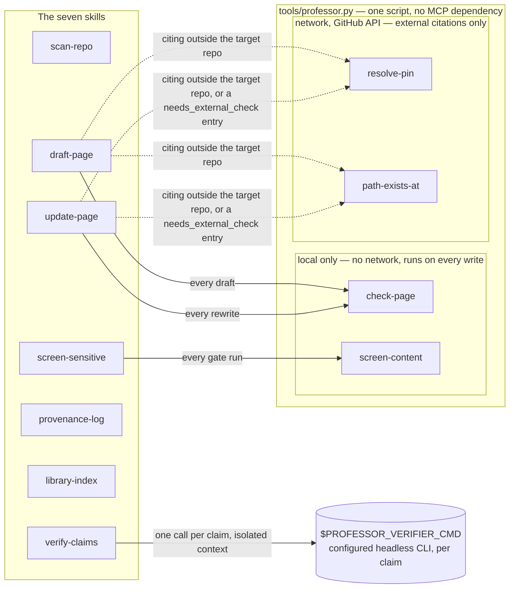
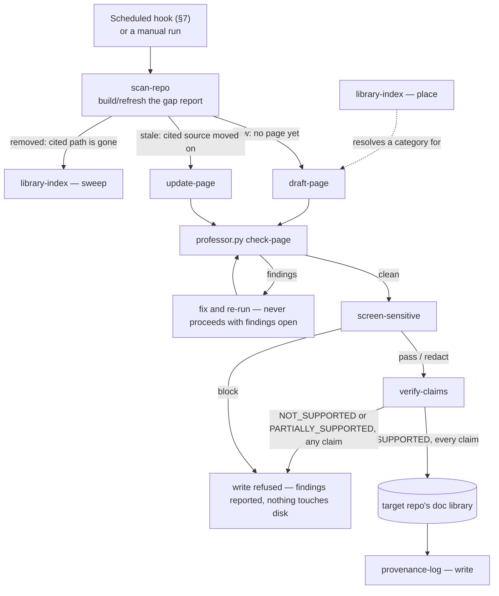
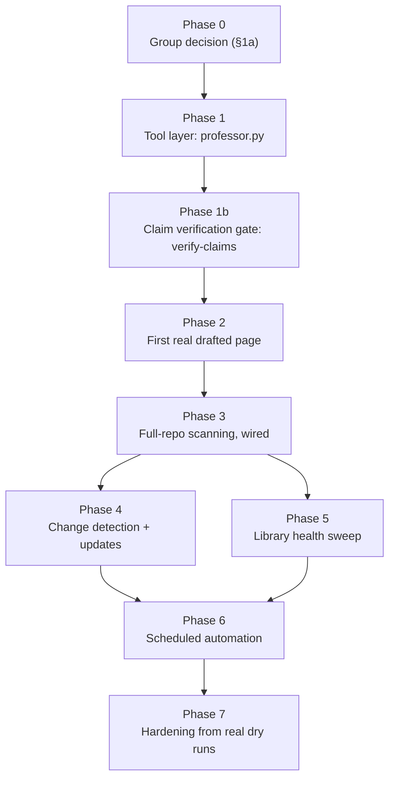

# The Professor — Skill Suite Redesign

Written 2026-09-03. Extends [`the-professor-design.md`](the-professor-design.md) (2026-08-12);
does not supersede it — the three-layer model (persona / tools / gate), the facts-are-tools
test, and the "enforce at the boundary where the violation happens" rule all carry forward
unchanged. This document adds what changes when The Professor stops being scoped to one target
(`launchpad-26/handbook`) and becomes a suite that can be pointed at **any** repo to generate
and maintain its documentation.

## Summary — read this first

**Packaging model — reframed 2026-09-03, at Serina's direction: this is a portable Skill-suite
plugin, not a standalone agent.** The distributable unit is the seven skills plus
`tools/professor.py` plus `tools/contract/` — installable, via a marketplace, into whatever
agent or persona a team already runs. `.plugin/plugin.json` is already Open Plugin Spec format,
which is the right shape for this; nothing about that changes.
`personas/the-professor.persona.md` becomes an **optional companion persona** — a reference
voice/creed for a team that wants a dedicated "Professor" identity running these skills, not a
requirement to use them. This is a re-description of what's already scaffolded, not a rebuild:
none of the seven `SKILL.md` procedures assumed a specific persona to begin with — the voice lives
only in `persona.md`, never in the skills' own instructions — so this reframing changes how the
pack is packaged and described, not how any skill actually works. §5's directory tree and the
README carry this framing now; nothing else in this document needed to change because of it.

**Future goal, explicitly deferred — a Docker-packaged distribution.** Not scoped into any phase
below, and not something this document designs — noted here so it isn't lost. Worth flagging
now, though: this would likely *resolve* Open Questions item 6 (how a session finds
`<pack-root>` when it isn't inside this fork) rather than compete with it — a container gives the
pack a fixed, known internal path, which is exactly the shape of answer item 6's own candidate
list was reaching for. Confirming that connection, and everything else about container
packaging, is left to whoever picks that goal up.

**Status: Phase 0's decision is made and its durable-record review gate is now met
(`ADR-0057-professor-script-only-tool-layer.md`, closing #2098). Phases 1–7 are still a proposal,
not yet built.** The group's consensus, reported 2026-09-03, is to step away from MCP servers
entirely — that's §1a's central question settled, in favor of this document's script-only tool
layer over #1402's dual-mode approach. Nothing beyond the documents and prompts in this branch is
implemented — no script, no working gate, no dry run against a real repo — and Phases 1–7 still
want an explicit go-ahead before anyone starts Phase 1.

**For a human, in three sentences:** The Professor currently drafts documentation for exactly one
repo (`launchpad-26/handbook`) and only from sessions that happen to have registered its MCP
server — pointing it at a different repo gets nothing, because every tool has that one repo's
name baked in (§1). This document replaces the single skill with seven and replaces the MCP server
with one plain script (§1a) — the group has now confirmed that direction over the in-flight
`#1402` fix's dual-mode approach — and breaks the build into eight phases plus Phase 1b (§9) so it
can still be reviewed and shipped a piece at a time instead of as one large change. Diagrams: the
tool-call architecture is in §4, the seven skills' end-to-end flow is at the top of §6, the phase
dependency graph is in §9.

**For an agent asked to build this:** don't start writing code from this summary. Read in order —
§1 (why the old build doesn't generalize), §1a (the MCP-vs-scripts decision — **resolved**, script-
only is the confirmed direction, no need to re-litigate it), then whichever of §3–§8 the phase
you're building depends on, then §9 for that phase's exact deliverable, files, and review gate.
Build phases in dependency order (§9's own diagram lets Phases 4 and 5 run in parallel — "in
order" doesn't mean "strictly sequential," it means "never ahead of what a phase's dependency
line names") — each phase's review gate is what makes the next phase's assumptions
trustworthy, and skipping ahead means building on an assumption nobody has verified yet. If you
find a gap this document doesn't cover, name it back to whoever assigned the phase rather than
filling it with a judgement call the group hasn't seen — that's the same discipline §9's own
phase table asks of every phase.

**Relationship to in-flight work:** [#1402](https://github.com/launchpad-26/buzz/issues/1402)
(worktree `__worktrees/task-1402-professor-root-mcp`, branch `chore/1402-professor-root-mcp`) is
fixing one specific bug right now — `draft-page` can't execute from a session that never
registered the `professor-tools` MCP server — with a **CLI mode added to `tools/server.py`**
alongside its existing MCP mode (both stay live). The group's decision means that dual-mode shape
is **not** the pack's long-term tool layer, whatever happens to that branch procedurally (lands as
a short-lived interim fix, gets redirected to build this document's `professor.py` directly, or is
closed in favor of Phase 1 below) — that procedural call belongs to whoever owns #1402, not to
this document. This document still doesn't touch `tools/server.py`, so nothing here can conflict
with that branch regardless of which way it goes.

| Phase | Delivers | Depends on | Status |
|---|---|---|---|
| 0 | Group decision: script-only tool layer vs. #1402's dual-mode server (§1a) | — | **Decided, durable record MET** — script-only, recorded in `ADR-0057-professor-script-only-tool-layer.md` |
| 1 | `tools/professor.py` — the tool layer itself (4 subcommands, no MCP) | 0 | Not started |
| 1b | Claim verification gate: `verify-claims` (§6.7) | 1 | **Decided 2026-09-04** — mandatory, unskippable; not started |
| 2 | One real drafted page for a real target repo, end to end | 1, 1b | Not started |
| 3 | Full-repo scanning, wired automatically to drafting | 2 | Not started |
| 4 | Change detection + section-scoped updates | 3 | Not started |
| 5 | Library health sweep (duplicates, orphans, broken links) | 3 | Not started |
| 6 | Scheduled automation (GitHub Actions template, live) | 4, 5 | Not started |
| 7 | Hardening from what the real dry runs in 2–6 surfaced | 6 | Not started |

Full detail, deliverables, files touched, and review gates for every phase are in §9.

The eight capabilities this suite was scoped against, and where each is actually addressed —
listed once, together, because individual sections cite "capability 4" or "capability 7" in
passing without ever pointing back to a list a reader could check them against:

| # | Capability | Addressed in |
|---|---|---|
| 1 | Portability — no MCP hard-dependency, works pointed at any repo | §1, §1a, §3, §4 |
| 2 | Code-to-docs generation from the target's own source | §6.2 (`draft-page`) |
| 3 | Change detection and section-scoped doc updates | §6.1 (`scan-repo`), §6.3 (`update-page`) |
| 4 | Provenance tracking, per section | §6.4 (`provenance-log`), §8 |
| 5 | Scheduled scanning | §7 |
| 6 | Sensitive-data filtering before any write | §6.5 (`screen-sensitive`) |
| 7 | Doc library management (index, dedup, orphans, cross-refs) | §6.6 (`library-index`) |
| 8 | Claim verification — a cited source actually supports the claim, not just that the citation resolves | §6.7 (`verify-claims`), Phase 1b (§9) |

---

## 1. Diagnosis: two bugs, only one of which #1402 fixes

The symptom Serina named — "an MCP server that isn't connected in other sessions/repos" — is
real, but it is the smaller of two problems, and fixing only it does not make The Professor
portable.

### Bug A — reachability (in flight, being fixed by #1402)

`draft-page/SKILL.md` says to call `professor-tools`' five tools; nothing in the skill's own
text says what to do if that MCP server was never registered in the current session. A session
started outside the pack's own directory — at the repo root, in a different harness (Codex,
Goose), or in a subagent — has no path to those tools at all. `check_server.py`'s own docstring
confirms `server.py` is spawned as "one bare executable path, no arguments" over MCP stdio; there
was, until #1402, no other way to call it.

This is a **connectivity** bug: the tools are correct and useful, they are simply unreachable
from most sessions. #1402's CLI-mode fix (server.py dispatches on `argv`, falls through to
`mcp.run()` when `argv` is empty) closes it for any harness that can shell out — which is every
harness this fork uses.

### Bug B — target hardcoding (not addressed by #1402, the actual blocker for this task)

Every one of the five tools in `tools/server.py` is written against one repository, baked in as
a module constant:

```python
HANDBOOK_REPO = "launchpad-26/handbook"
```

- `read_contract()` fetches `docs/page-contract.md` from that one repo, always.
- `list_categories()` parses that one repo's `mkdocs.yml` `nav:` list, always.
- `check_page()` clones/refreshes a checkout of that one repo and shells out to *its*
  `scripts/check_provenance.py` and `scripts/page_index.py` — real scripts, correctly run as
  real subprocesses rather than reimplemented (`the-professor-design.md` §8's own reasoning:
  "reimplementing would produce a second parser that drifts from the first"), but they are the
  handbook's scripts, encoding the handbook's frontmatter schema, its four-way claim-prefix
  taxonomy (`[upstream]`/`[launchpad]`/`[cohort]`/`[supporting]`), and its eleven navigation
  categories.

Even with perfect reachability, every one of these five tools only ever answers questions about
the handbook. Pointing The Professor at, say, `buzz-relay` and asking it to draft that crate's
docs gets nothing from any of the five tools — there is no `page-contract.md`, no `mkdocs.yml`
`nav:`, no provenance gate script at any path this server knows to look for, because none of
those things are about `buzz-relay`; they are about the handbook.

**#1402 fixes how the tools are reached. It does not touch what they can be reached to do.**
Bug B is the one that blocks "point The Professor at any repo."

### Is Bug B necessary or accidental?

Accidental — a case of the target being implicit in the first build rather than a deliberate
scoping decision. Nothing about the three-layer design in `the-professor-design.md` §2 requires
a fixed target:

- **Facts are tools** because a model can't be trusted to produce a 40-char SHA or know whether
  a path exists — that reasoning has no repo name in it.
- **The gate is the guarantee, run at the boundary where the violation happens** — also has no
  repo name in it; it says CI/a real script must check the artifact, not that the script must be
  the handbook's.
- The place a repo name *does* legitimately enter the design is `check_page()`'s decision to
  shell out to a **real** gate rather than reimplement one — but that principle only tells you
  not to invent a parser. It says nothing about whose parser. The original build had exactly one
  candidate gate available (the handbook's, because the handbook was the only target), so "the
  real gate" and "the handbook's gate" were the same thing by coincidence of scope, and the code
  never had to distinguish them.

So the fix is not "remove the coupling" — the coupling to *some* contract and *some* gate is
correct and load-bearing, per the design's own rules. The fix is **making the target a
parameter, and giving the suite a default contract + gate of its own** for the (common) case
where the target repo doesn't already have one. §5 below is that fix.

### A consequence worth stating plainly: most of what's needed here isn't GitHub-API shaped

The handbook build needed `gh api` for nearly everything because the handbook cites **five other
repositories it does not have checked out** — resolving a pin and confirming a path both mean
"ask GitHub about a repo I'm not sitting in." That is genuinely a cross-repo problem, and MCP
tools hitting the GitHub API are the right shape for it.

Self-documenting a target repo is a different problem: the source is **local**. A session
pointed at a checked-out repo can read every file, run `git log`, `git diff`, and `git blame`
against it with nothing but a shell — no GitHub API, no network call, no MCP server, needed at
all for the common path. The GitHub-API-shaped tools (`resolve_pin`, `path_exists_at`) still
matter, but only for the narrower case of citing an *external* source (an upstream crate, a spec
in another repo) from within the target repo's own docs — not for the bulk of the work, which is
reading the target's own tree.

This reframing is what makes §4's tool design possible: local, script-based operation isn't a
downgrade path bolted on for when tools are missing, it's the primary path, because the primary
job doesn't need anything else.

### 1a. Why this plan retires MCP entirely (a divergence from #1402 — resolved by the group)

**Resolved 2026-09-03: the group's consensus is to step away from MCP servers.** This section's
reasoning is kept below as the record of *why*, not as an open question anymore — the recommendation
it argues for is the confirmed direction, not one option among several. What follows is unchanged
from before the decision; only its status has changed.

§1's reframing above already shrinks `professor-tools` to a narrow role: resolving a pin or a
path for a citation *outside* the target repo. Once that's the only job left, the question
becomes whether that job is worth keeping an MCP server for at all — and the answer this
document proposes is no.

**What MCP still buys, honestly stated:** a typed, schema-discoverable tool call, and a
transcript that records "this fact was fetched" as a structured tool-use block rather than an
ordinary shell command mixed in with everything else an agent runs. That's a real property, and
it's the one thing a plain script gives up. Anyone reviewing this plan should weigh that loss
deliberately, not have it happen by default because scripts were simpler to write.

**What it costs to keep, also honestly stated:**

- A dependency on the `mcp` Python package, for two functions (`resolve_pin`, `path_exists_at`)
  that are otherwise a `gh api` call and some error handling — no protocol needed.
- A second execution path through the same code (`mcp.run()` vs. argv dispatch) to keep in sync
  and to test, for a feature (MCP registration) that #1402's own investigation found **two of
  this fork's four target harnesses don't even use** — Codex and Goose don't read a root
  `.mcp.json`, so MCP-mode only ever helped Claude Code sessions that had it registered, which is
  the narrow case #1402 exists to work around in the first place.
- A `.mcp.json` registration file and a `mcp_config` field in `plugin.json` that need to exist,
  stay correct, and be explained to anyone reading the pack — for a code path that, per the point
  above, most of this fork's own harnesses never take.

Given the primary job (§1's reframing) needs no GitHub API at all, and the one remaining GitHub-
API-shaped job (external citation) is reachable from every harness as a plain Bash call with no
registration step, this document's recommendation is: **one small script-based toolkit, callable
identically from any harness via Bash, and no MCP mode at all.** Not CLI-as-fallback-to-MCP —
CLI as the only mode, because there is no longer a second mode earning its keep.

**What this means for #1402, concretely — and it is not simply "close it":** #1402's own diff
keeps MCP mode alive (bare invocation still runs `mcp.run()`) and only adds CLI dispatch
alongside it. This document's tool-layer design (§4) does not extend that diff — it's a
different, smaller shape for the same underlying functions, and per the group's decision it's the
shape that ships as the pack's long-term tool layer, not #1402's dual-mode server. **What that
means procedurally for the #1402 branch itself — land as a short-lived interim fix, get
redirected to build `professor.py` directly, or close in favor of Phase 1 — is still whoever owns
#1402's call** (see Open questions, item 4); the group's decision settles *which tool-layer shape
wins*, not *what happens to that specific branch*.

The literal bug #1402 names — MCP not registered in the session — is genuinely gone once nothing
registers anything. But the broader concern behind it, reaching Professor's tooling from an
arbitrary session, is not fully closed by that: it resurfaces as a narrower, different problem
(resolving `<pack-root>` when the session isn't inside this fork — Open questions, item 6,
**resolved 2026-09-04**: `PROFESSOR_PACK_ROOT`) that this document had not addressed until that
item was raised. #1402 should be re-scoped to track that successor problem — now itself
answered, but still worth #1402 tracking whether Phase 1 actually implements the loud-failure
behavior the decision requires — rather than closed as simply superseded, or its own tracking
value is lost at the exact moment this redesign made the underlying question harder, not easier.

---

## 2. What carries forward unchanged

From `the-professor-design.md`, restated because this document assumes them rather than
re-deriving them:

| Rule | From | Still holds because |
|---|---|---|
| Persona holds judgement/voice; tools hold facts; the gate holds the guarantee | §2 | The test ("is being wrong silent and mechanically checkable?") has no target-repo dependency |
| Enforce at the boundary where the violation happens — CI for artifacts, runtime for actions | §2 | A drafted page is still an artifact; a write/secret-leak is still an action |
| Nothing is quoted from a document that changes — read it live | §4 | The target repo's own source changes; so does its own contract, if it has one |
| A pack lives at `launchpad/agents/<name>/`, never `examples/` or `docs/` | "How the next agent gets built" | Unaffected by what the pack points at |
| A pack is a specification the runtime is manually configured to match (Route 2), not something a runtime reads today | §8 | No change in this document to how packs are consumed |
| One identity, growing skills, not a new persona per job | §1 | The suite adds six skills to one persona, not six personas |

---

## 3. New principle this redesign adds: bring your own contract, or borrow ours

The handbook build could assume a contract and a gate already existed at the target because the
target *was* the handbook, and the handbook owns both. A generic target repo usually owns
neither — most repos have no `page-contract.md` equivalent and no provenance gate script.

So the suite ships its own **default** contract and gate (`tools/contract/`, scaffolded in this
branch — see §9), and every skill that needs one resolves it in this order:

1. **Target-repo override** — if `<target-repo-root>/.professor/contract.md` exists, that is
   authoritative for that repo. A team that already has documentation standards points The
   Professor at them instead of adopting the suite's defaults.
2. **Suite default** — `tools/contract/page-contract.md`, shipped with this pack, used when no
   override exists.

Same two-step resolution for the gate (`.professor/check-page` as a target-supplied executable
override, else `tools/professor.py check-page` — the suite's own subcommand, §4/§9, not yet
built) and for the sensitive-data ruleset (`.professor/sensitive-patterns.md` as a data-file
override, else `tools/contract/sensitive-patterns.md`).

**Decided 2026-09-04, by Serina — the same two-step resolution also answers Open Questions item
1** (where drafted pages land, §6.6): `.professor/defer-hook` (a target-supplied executable
override, same shape as `.professor/check-page`), else the suite default of stopping and
reporting rather than drafting. See §6.6's `bootstrap` mode for the full behavior this override
controls.

**And a third thing this same pattern answers — Open Questions item 9** (`verify-claims`'
sub-agent dispatch, §6.7): `$PROFESSOR_VERIFIER_CMD`, an environment variable naming a headless,
single-turn CLI command that a session/target must configure — **no suite-applied default, same
as `$PROFESSOR_PACK_ROOT`**: fails loud with a specific, actionable message if unset, rather than
silently falling back to a guessed command. `claude --print` is the suite's recommended value to
configure it to (the same headless-entry-point assumption §7.1 already makes for the scheduled
path, applied consistently here instead of invented fresh) — a recommendation for what to set, not
something the suite applies for you. Every dispatched claim check is a subprocess call to that
configured command, fed only the cited source span and the claim text, its stdout captured as the
verdict — a plain subprocess call in shape, even though the logic behind it is a model rather than
a script. A harness with no such command available at all cannot run this
suite's mandatory gate — a named limitation, not a silent one.

This is the same "read it live, never quote it" discipline from §4 of the original design,
applied one level up: the *choice of contract* is resolved live, per target, instead of assumed.

---

## 4. The portability fix (capability 1), stated concretely

No MCP, no registration, no dual mode — one small script-based toolkit, callable identically
from any harness via Bash, with a hard split between what needs the network and what doesn't.
The diagram below is the actual call graph — which of the seven skills calls `tools/professor.py`
at all, and which of its four subcommands each one uses:



`scan-repo`, `provenance-log`, and `library-index` have no edge into `toolkit` at all — they
never call `tools/professor.py` in any mode, in any circumstance (§6's per-skill table says so
explicitly for each). **`verify-claims` also has no edge into `toolkit`** — its dispatch (§6.7,
Open Questions item 9) is a direct subprocess call to `$PROFESSOR_VERIFIER_CMD`, not a
`tools/professor.py` subcommand; the tool inventory below still counts four, not five, because
this is a genuinely separate mechanism (a model dispatch, not a deterministic script), drawn
outside the `toolkit` box on purpose rather than folded into it. Solid arrows are calls that
happen on every run; dashed arrows are calls that happen only for the external-citation exception
§1's reframing describes.

**A tool inventory reduction worth calling out on its own, not just a mechanical rename.** The
original build had five tools. This design has four subcommands — but the two that disappear,
`read_contract` and `list_categories`, aren't replaced by anything; they're just gone. Both
existed for one reason: fetch a file from a repo the agent hadn't checked out, without quoting it
into a prompt where it could go stale. Under §3's contract-resolution order, the contract is
always either a file in the target repo's own checkout (`.professor/contract.md`) or a file
bundled in this pack (`tools/contract/page-contract.md`) — both are just paths on disk. Reading a
path on disk is `Read`, not a tool. There was never a version of this redesign where those two
survived as scripts; once the contract stopped living in an unreachable private repo, the reason
for them stopped applying.

That leaves four real subcommands, and they split cleanly by whether they touch the network:
`check-page` and `screen-content` run on every single write and never leave the local checkout;
`resolve-pin` and `path-exists-at` run only when a page cites something outside the target repo,
which — per §1's reframing — is the exception, not the rule.

Every sub-skill's procedure (§6) is written against the local case first. Where a skill needs
`resolve-pin`/`path-exists-at` for an external citation, it says so directly as a Bash
invocation — `draft-page` and `update-page` are the only two skills that ever *call* them.
`scan-repo` and `provenance-log` mention the subcommand names in prose (explaining, respectively,
why `scan-repo` deliberately routes external checks to `update-page` instead of calling them
itself, and how `read` mode's staleness question gets answered elsewhere) without ever invoking
them — a plain `grep` for the bare names would over-match on that prose, so check for the actual
invocation shape instead:
`grep -l "professor\.py resolve-pin\|professor\.py path-exists-at"
launchpad/agents/the-professor/skills/*/SKILL.md` should list exactly `draft-page` and
`update-page` in the finished skill set — that split is the concrete artifact
behind "most of the suite has nothing to be unreachable *from* in the first place," which is a
stronger portability property than a fallback branch on every call would be.

**The target is always a parameter, never a constant.** `scan-repo`, `draft-page`, and
`update-page` — the three skills that start a unit of work from scratch rather than being handed
an already-resolved page/path by another skill — each have their own explicit "Step 0" that
resolves `PROFESSOR_TARGET`: a local path by default (the repo the session is already in, or an
explicit `--target <path>`), or `owner/repo` when the suite is asked to operate on a repo it
doesn't have checked out (rare — mainly for the scheduled-scan hook in §7, run from outside the
target). `provenance-log`, `screen-sensitive`, and `library-index` don't repeat that step — they
receive a page path or a scratch-file path from whichever skill called them, already resolved
against the same target, so a second resolution would be redundant rather than missing. No
subcommand in this design carries a hardcoded repo name; `resolve-pin`/`path-exists-at` keep
taking `repo` as an argument exactly as the original tools did (that part was never hardcoded —
only the *contract fetch* and `check_page`'s clone target were, and both are eliminated above
rather than parameterized), and `check-page` takes `--target <root>` explicitly.

---

## 5. Directory structure

Everything new lives inside the existing pack directory, `launchpad/agents/the-professor/` — no
new top-level cohort exception needed (`launchpad/agents/` is already named in AGENTS.md §3 as
where persona packs go). Bold entries are new in this redesign; the rest already exist.

```
launchpad/agents/the-professor/
  .plugin/plugin.json                description updated; mcp_config field NOT   [PARTIAL —
                                      yet removed (that's Phase 1 work, once the    see note
                                      script-only tool layer actually replaces     below]
                                      .mcp.json's runtime role — plugin.json
                                      never lists skills itself in any case; each
                                      persona's own frontmatter does, per
                                      PERSONA_PACK_SPEC.md, and personas/
                                      the-professor.persona.md below already
                                      does list all seven)
  README.md                          documents the suite + the portability fix   [UPDATED]
  personas/
    the-professor.persona.md         generalized identity, still one persona     [UPDATED]
  skills/
    scan-repo/SKILL.md               1. initial + incremental repo scan          [NEW]
    draft-page/SKILL.md              2. code-to-docs generation                  [REWRITTEN]
    update-page/SKILL.md             3. change detection + section-scoped update [NEW]
    provenance-log/SKILL.md          4. per-section provenance ledger            [NEW]
    screen-sensitive/SKILL.md        5. secrets/PII gate before any write        [NEW]
    library-index/SKILL.md           6. library structure + index maintenance    [NEW]
    verify-claims/SKILL.md           7. adversarial citation-fidelity gate       [NEW]
  tools/
    professor.py                     four subcommands (§4); no MCP dependency —  [FOLLOW-UP,
                                      resolve-pin, path-exists-at, check-page,     not built
                                      screen-content. Replaces server.py +         here, and
                                      check_server.py outright (Open Questions     NOT the
                                      item 5 — decided, no transition period,      same file
                                      no compatibility shim) — see §1a for why     as #1402's
                                      this diverges from #1402, which keeps        diff]
                                      those two files and adds CLI dispatch to
                                      server.py instead of replacing it.
    check_professor.py               test harness, same shape as the existing    [FOLLOW-UP,
                                      check_server.py but exercising four          not built
                                      subcommands instead of five MCP tools        here]
    contract/
      page-contract.md               suite's default doc contract               [NEW]
      sensitive-patterns.md          suite's default screening ruleset          [NEW]
  hooks/
    README.md                        the two scheduled-scan mechanisms          [NEW]
    scheduled-scan.workflow.yml.template   GitHub Actions cron template,        [NEW]
                                            copied into a TARGET repo, not run here
```

**What this means for the pack's existing `.mcp.json` and `tools/server.py`/`check_server.py`:**
under this proposal they are retired, not merely unused — `.mcp.json` stops being read once
nothing registers `professor-tools` as an MCP server, and `server.py`/`check_server.py` are
superseded by `professor.py`/`check_professor.py` above. None of that retirement happens in this
branch (nothing here is built), and if the group doesn't adopt this proposal — choosing #1402's
dual-mode approach instead — none of it should happen at all. The tree above is what the pack
looks like *if this plan is adopted*, not a description of what exists today.

What a **target repo** ends up with once The Professor has been pointed at it (not created by
this branch — this is the shape `library-index`/`scan-repo` produce when run for real):

```
<target-repo>/
  .professor/
    contract.md            optional override of the suite's default contract
    sensitive-patterns.md  optional override of the suite's default ruleset
    library.json           topic → {category, page path once drafted} map, so
                            placement and existence checks aren't re-derived each run
    provenance/
      <page-slug>.jsonl            active log — per-page, append-only, per-section (§8)
      <page-slug>.archive.jsonl    events older than the archive threshold, moved out
                                    by provenance-log's `archive` mode; only exists once
                                    archiving has actually run at least once (§8)
    scan-state.json         one repo-wide last_scanned_commit, plus a pending list for
                            anything an interrupted run didn't finish (§6.1)
  docs/                     (or wherever library-index adopted an existing convention —
                            §6.6; docs/professor-library/ only when nothing existed to
                            adopt)
    index.md                the contents page
    <category>/<page>.md    generated pages, each carrying inline provenance comments
```

---

## 6. Sub-skill catalogue

All seven skills share one persona (The Professor) and one pack — matching the existing
convention of "one identity, growing skills" rather than a persona per job. Each entry below is
the spec the scaffolded `SKILL.md` implements; see the actual files for the full procedure text.

**Known-stale as of 2026-09-04 — corrected after review.** An earlier version of this note claimed
the original six `SKILL.md` files (§6.1–§6.6) still referenced `server.py`/MCP tools, were missing
`PROFESSOR_PACK_ROOT`, and were missing `provenance-log`'s `archive` mode. **All three claims were
checked and are wrong** — a real-code corpus review (Ben Mitchell / Cursor, on PR #2097) caught
this: there are zero `server.py`/`professor-tools` references anywhere in `skills/` (every match on
those terms is a deliberate past-tense reference to the original build, e.g. "the original
`resolve_pin`"), `PROFESSOR_PACK_ROOT` is present in exactly the three skills that call
`tools/professor.py` (`draft-page`, `update-page`, `screen-sensitive`), and `provenance-log` has a
complete `## archive mode` section including the never-archive-the-latest-event rule. That earlier
note was written from inference, not from actually checking the files — exactly the mistake this
document's own house rules warn against.

**What is genuinely still stale, verified directly:** `draft-page` and `update-page`'s own
procedure text still only sequences two gates (`check-page`, `screen-sensitive`) — neither
mentions `verify-claims` (§6.7) at all, and neither has the "run every gate twice, once more
independently as the final step" requirement (§6's flow-diagram note) that this document now
states as universal. `library-index`'s own procedure text likewise predates, and does not yet
implement, `bootstrap`'s defer-and-report behavior (Open Questions item 1) or `sweep`'s
contradiction-detection check (Open Questions item 3). `verify-claims/SKILL.md` itself, drafted
2026-09-04 after these decisions, is current and does not carry any of this. A reconciliation pass
before Phase 1 treats any of the six as final still needs to happen — just for these specific
gaps, not the three originally (and wrongly) claimed ones.

The diagram below is the end-to-end flow — how a hook or a manual run turns into a gap report,
how each branch of that report reaches the skill that handles it, and where the three gates sit
relative to a write. This is the shape worth internalizing before reading the seven entries below
in isolation; the branching (three different outcomes from one scan) and the convergence (two
different skills sharing one gate sequence) are exactly what prose has to describe sequentially
but a reader has to hold all at once.



Four things this diagram makes explicit that the per-skill table below states but doesn't show
spatially: the gates run in a fixed order (contract gate, §4's `check-page`, before the
sensitivity gate, before the claim-verification gate — never reordered, and never in parallel,
cheapest and most deterministic first, the real model call last), all three gates are mandatory
and unskippable — `verify-claims` (§6.7) carries the same severity as `screen-sensitive`, not a
cost-controlled or sampled check — `library-index` shows up twice with two different jobs
(`place`, feeding into a draft in progress; `sweep`, consuming `scan-repo`'s `removed` list
independently) — it is one skill with three (soon four, with contradiction detection, §6.6) modes,
not four skills — and **(decided 2026-09-04, by Serina) every gate in this diagram runs twice, not
once**: this diagram shows the gate order a draft passes through *during drafting*, so the
drafting agent has a chance to fix what a gate flags — but the diagram's outcome (`Disk`, or
`Refused`) is not trusted until the same three gates run **again, independently**, as the true
final step immediately before a write is finalized or a PR opens. "Unskippable" is a prompt
instruction to the drafting agent, not proof it complied; the second, independent pass is the
actual gate of record, on every path this suite has — interactive or scheduled — not only Phase
6's own CI re-verification (§7.1), which is where this idea first appeared before being
generalized here.

### 6.1 `scan-repo` — initial + incremental scan

| | |
|---|---|
| **Purpose** | Build (or refresh) an inventory of the target repo's documentable units — modules, crates, packages, public APIs, CLI commands — and diff it against the existing library to produce a gap list: undocumented units, and units whose source changed since their doc section's recorded provenance commit. |
| **Trigger** | Manually invoked to start work on a new target; invoked by the scheduled-scan hook (§7) on an interval; invoked by `update-page` when it needs to know *what* changed, not just *that* something did. |
| **Inputs** | `PROFESSOR_TARGET` (path or `owner/repo`); optional `--since <commit>` to bound the scan (defaults to `.professor/scan-state.json`'s last-recorded commit, or the full tree on first run). |
| **Outputs** | A gap report (JSON, printed and also written to `.professor/scan-state.json`): `{new: [...documentable units with no doc page...], stale: [...doc sections whose cited source commit is behind current, plus any section citing an external source at all, tagged needs_external_check...], removed: [...local citations confirmed gone at HEAD...], needs_baseline: [...adopted sections with no citations at all yet, fixed 2026-09-05 — see §6.6's bootstrap for how these get created and §6.2's baseline mode for how they get resolved...], pending: [...entries from a prior run that didn't complete...]}`. |
| **Tools** | `git cat-file -e`/`git log`/`git diff --name-status`, `Glob`/`Grep` over the tree — no script, no network, ever, even for sections citing an external source (§8 explains why that's routed to `update-page` instead of checked here). Only exception: if `PROFESSOR_TARGET` is an `owner/repo` the session hasn't checked out (the scheduled-scan hook's own case), the very first step is a plain `git clone`, not a `tools/professor.py` call — cloning isn't one of the four subcommands, it's what makes the rest of this skill's local-only tooling applicable at all. |
| **Hands to** | `draft-page` for each `new` entry, and (fixed 2026-09-05, correcting an earlier version of this row that sent these to `library-index` instead) each `needs_baseline` entry, in that skill's baseline mode; `update-page` for each `stale` entry (including every `needs_external_check` one); `library-index` for each `removed` entry (orphan cleanup). |

### 6.2 `draft-page` — code-to-docs generation (rewritten)

| | |
|---|---|
| **Purpose** | Turn one gap-report entry (a documentable unit with no existing page) into a drafted doc page, reading the **target repo's own source** as the primary evidence rather than five external repos. **Plus, in baseline mode (added 2026-09-05, fixing a real gap a review found)**: retroactively establish real citations for an already-existing, adopted section that has none — content unchanged, only its provenance goes from empty to real. |
| **Trigger** | Called by `scan-repo`'s `new` list, one unit at a time, for the default mode; called by `scan-repo`'s `needs_baseline` list for baseline mode; callable directly for a manually-named topic. |
| **Inputs** | The unit to document (a path, module, or symbol); `PROFESSOR_TARGET`; the resolved contract (§3). |
| **Outputs** | Draft page content (frontmatter + body, shaped per the resolved contract), handed to `screen-sensitive` — never written to disk before that gate runs. |
| **Tools** | `Read`/`Grep` the unit's source directly; `git log -1 --format=%H -- <path>` (plain git, no script) to get the exact commit each cited path is drafted against. `tools/professor.py check-page <draft-file> --target <target-root>` against the finished draft, always — the contract gate, run before the draft ever reaches `screen-sensitive`. For an external citation only (the unit genuinely wraps or depends on another repo): `resolve-pin <repo> <ref>` and `path-exists-at <repo> <commit> <path>`, as direct Bash calls — the one place in this skill the network subcommands from §4 are used. |
| **What changed from the original** | The original `draft-page` hard-required `read_contract`/`list_categories` MCP calls and cited claims against *other* repositories by design (the handbook documents five repos it doesn't contain). This version drafts primarily from local source, resolves the contract per §3's two-step order (a plain file read, no tool at all — §4's tool-inventory reduction), and gets its category/placement from `library-index` (§6.6) instead of a hardcoded `mkdocs.yml`. |
| **Hands to** | `check-page`, then `screen-sensitive`, then `verify-claims` (§6.7), always, before any write — see the flow diagram above for the exact order. **Then all three run again, independently, as the true final step** (decided 2026-09-04 — §6's flow-diagram note) — the mid-draft passes above let this skill fix what a gate flags; the second pass, against the finished file, is what actually authorizes the write. This skill's own done-when is not met by "the gates ran once." |

### 6.3 `update-page` — change detection + section-scoped update

| | |
|---|---|
| **Purpose** | For a doc section flagged `stale` by `scan-repo`, rewrite **only that section**, not the whole page — the capability the original suite had no mechanism for at all (it only ever drafted whole new pages). |
| **Trigger** | Called by `scan-repo`'s `stale` list. |
| **Inputs** | Page path + section anchor; the section's current provenance record (`.professor/provenance/<page>.jsonl`, §8); the current source at the cited path. |
| **Outputs** | For a local (`repo: "self"`) source: a patch touching only the flagged section's markdown span (identified by its heading through the next heading of the same or shallower level) plus its provenance comment; the rest of the page is untouched byte-for-byte — this is checked as part of the skill's own done-when, not assumed. **For a `needs_external_check` entry — fixed 2026-09-05, a review found this wasn't actually possible as originally written, then corrected again 2026-09-05 after a second review caught a self-contradiction and an invented schema field in the first fix**: no rewrite either way. If `resolve-pin`'s current commit matches the recorded one, nothing is wrong — no output at all beyond confirming the check ran. If it doesn't match, **no rewrite and no ledger change** — the recorded `commit` stays exactly as it was, so `scan-repo` reports this section `needs_external_check` again on every future scan (§5's own unconditional-for-any-non-`self`-source behavior already guarantees this, no new persistence mechanism needed); this run instead reports the mismatch (recorded vs. current commit) as a finding for whoever invoked it, same disposition as a `library-index sweep` finding — never a rewrite, because this suite's tool surface has no way to fetch an external file's actual content to ground one in. |
| **Tools** | `Read` the section span; `git diff <old-commit>..<new-commit> -- <path>` (plain git) — **local sources only**, since `scan-repo` never computes a `new_commit` for an external one (its own §5). For a `needs_external_check` entry: `resolve-pin`, to get the external source's *current* commit — never a diff, since a local `git diff` needs a checkout this suite never has for an external repo. `tools/professor.py check-page` against the **whole page** (not just the section) once a local rewrite is done — same contract gate `draft-page` runs, and for the same reason: a section-scoped edit can still break a page-level rule. |
| **Hands to** | `check-page`, then `screen-sensitive`, then `verify-claims` (§6.7), then `provenance-log` to record the new commit/timestamp for just that section. **Then all three gates run again, independently, as the true final step** (decided 2026-09-04 — §6's flow-diagram note), same as `draft-page` — a section-scoped rewrite gets exactly the same final-pass requirement as a whole new page, not a lighter version of it. |

### 6.4 `provenance-log` — per-section provenance ledger

| | |
|---|---|
| **Purpose** | Record, and later answer queries about, who/what/when contributed each doc section — the mechanism behind capability 4. Not a drafting skill; a bookkeeping one, called by the others rather than by a person. |
| **Trigger** | `write`: called by `draft-page` after a page is written (records initial provenance for every section); called by `update-page` after a section rewrite (updates that section's record only). `read`: callable directly to answer "what does this section rest on?" `archive`: on a schedule (§7's interval — see the scheduled-scan workflow template), or on demand. |
| **Inputs** | `write` mode: page path, section anchor, `sources` (each entry carrying its own `commit`/`commit_author`/`commit_at`/`pr` — code-side provenance, distinct from who touched the doc), contributor (agent name + session/task id, or a human's identity if a human edited it directly — detected via a plain `git blame` on the section span, no tool). `read` mode: page path (+ optional anchor), and a `latest`/`history` view. `archive` mode: page path, `--older-than <days>` (default `365`). |
| **Outputs** | `write`: one **appended** line in `.professor/provenance/<page-slug>.jsonl` (never a rewritten entry — §8's "Snapshot vs. append-only log"). **Never** the inline HTML comment — `draft-page`/`update-page` write that themselves, as draft content, before this mode ever runs (their own §6/§4 explain why: `check-page` needs to see the marker before publication, and this mode only runs after). `read`: the requested record(s) — the latest line per section by default (active file only), or the full sequence in `history` view (archive file, if any, then active). `archive`: the active `.jsonl` shrinks to each section's held-out latest event plus anything younger than the threshold; the removed events are durably appended to `.archive.jsonl` first, never lost. |
| **Tools** | `Read`/`Write`/append the `.jsonl` log and its archive file, `git log`/`git blame` for attribution when a section was hand-edited outside the suite. Never calls `tools/professor.py` at all — this skill has none of the original cross-repo citation needs. |
| **Hands to** | Nothing further downstream; it is the ledger, not a pipeline stage. |

### 6.5 `screen-sensitive` — sensitive-data gate before any write

| | |
|---|---|
| **Purpose** | The unskippable gate (capability 6), mirroring the design's own "the gate is the guarantee" rule from §2 of the original document: screen every drafted or rewritten section for secrets, credentials, PII, and other sensitive material **before** it reaches disk, and block or redact rather than let a persona's judgement decide whether something looks safe. |
| **Trigger** | Called by `draft-page` and `update-page`, always, as the last step before a write — never optional, never skipped because "this section is just prose." |
| **Inputs** | Draft content (new page or a single section's patch). |
| **Outputs** | One of: **pass** (content unchanged, write proceeds); **redact** (specific spans replaced with `[REDACTED: <category>]`, content proceeds with the redaction, and the redaction itself is logged — never silently); **block** (write refused entirely, with the finding reported to whoever invoked the skill, same shape as `check_page`'s `findings` list in the original design so review has one place to look). |
| **Tools** | `tools/professor.py screen-content <draft-file>`, running the `[pattern]`-marked categories of `tools/contract/sensitive-patterns.md`'s ruleset (§9, follow-up — the ruleset file scaffolded in this branch is the spec the subcommand implements) as a plain local subprocess. No network, no MCP — this was never a candidate for a network-shaped tool, since a screening gate has no cross-repo dimension to begin with. Per §3, a target-repo override at `.professor/sensitive-patterns.md` takes precedence over the bundled ruleset, but the subcommand that runs it is the same either way. **Plus, added 2026-09-05: one additional dispatch to `$PROFESSOR_VERIFIER_CMD`** for the ruleset's `[dispatch]`-marked categories (roster/access-control names used as data, not attribution) — recognizing what a name is *being used for* is a semantic judgment `screen-content`'s pattern matching cannot do, so it is checked the same way `verify-claims` checks a claim, in fresh isolated context, then merged into this skill's one `pass`/`redact`/`block` outcome. Still local, still unskippable. **Disposition is `redact`, matching `sensitive-patterns.md`'s own table** (this category is listed under "Redact," not "Block" — corrected 2026-09-05, an earlier version of this row said "blocking," contradicting the ruleset it implements). |
| **Why this is a tool/gate, not persona judgement** | Applying the original design's own test from §2: "is being wrong silent and mechanically checkable?" A committed AWS key or a hardcoded email address is exactly that — checkable by pattern, and silently wrong if missed. This belongs behind a script the persona cannot decline to run, same reasoning as the original `resolve_pin`. **The one `[dispatch]` category doesn't pass that literal test** — it isn't pattern-checkable — but it passes the deeper reasoning behind it: the drafting persona still can't be trusted to self-certify "this name isn't roster data," so it goes to an independent, isolated dispatch instead of the persona's own judgement call, same enforcement discipline as `verify-claims`, applied here because a pure pattern check genuinely can't reach this one category. |

### 6.6 `library-index` — library structure + index maintenance

| | |
|---|---|
| **Purpose** | Own the target repo's doc library as a whole: where new pages go (replacing the original's hardcoded `list_categories()` call to one specific `mkdocs.yml`), the contents/index page, and the library's health — duplication, orphaned pages, broken cross-references, and (decided 2026-09-04, reopening Open Questions item 3) cross-page claim contradiction (capability 7). |
| **Trigger** | Called once per target repo on first `scan-repo` run (bootstraps the library — §5's target-repo tree — if none exists, or adopts an existing convention if one does); called by `draft-page` to resolve where a new page belongs; called on a schedule (piggybacking the same interval as §7's scan hook) to sweep for orphans/broken links. |
| **Inputs** | `bootstrap` mode: the target repo's tree, to detect its actual documentation *procedure* — not just whether a `docs/`-shaped folder exists, but where content is authored, what format governs it, and whether a separate build/ship step produces a downstream artifact from it (e.g. a generated projection consumed by other code, the way `launchpad/crates/knowledge` reads a pre-rendered projection of `launchpad/docs/corpus` and never re-derives it — Ruling 11/ADR-0027, this fork's own precedent for exactly this split). `place` mode: a drafted page's topic, to resolve or create its category. `sweep` mode: nothing — reads the whole library. |
| **Outputs** | `bootstrap`, ordinary case (no existing governed system detected): `.professor/library.json` — a topic → `{category, page}` map, `page` filled in once a page actually exists for that topic — and an index page (adopting an existing convention's index if one exists, `docs/professor-library/index.md` if nothing existed to adopt) if neither did. **`bootstrap`, deferred case (decided 2026-09-04, by Serina — resolves Open Questions item 1):** if the target's own documentation procedure is itself an actively-governed generation system — a schema/validator sitting next to the docs, a template directory, an `AGENTS.md`/`CONTRIBUTING.md` that names a specific pipeline and says not to hand-edit its output — `library-index` does not scan, draft, or place anything into it. It resolves `.professor/defer-hook` using §3's own two-step order: **target-supplied override** — an executable at that path, same shape as `.professor/check-page` — is run, and whatever it does (e.g. invoking the target's own drafting pipeline) is this skill's entire output for that run; **suite default** — no override exists — `library-index` stops and reports what it found (the detected system, its location, why bootstrap is not proceeding) to whoever invoked it, same disposition/reporting shape as a gate's `block`. Professor never writes into a target's generated/shipped layer directly, and never guesses at an unfamiliar target's specific pipeline by name — only a target-supplied `defer-hook` can wire that up, keeping the suite itself generic. `place`: a category name to use in the new page's frontmatter — recorded in `library.json` against that topic (leaving `page` for `provenance-log`/the write step to fill in once the file exists), so the next page on the same topic doesn't re-derive it, and a `list_categories()`-shaped call becomes "read `library.json`" instead of "fetch one hardcoded repo's `mkdocs.yml`." `sweep`: a report of duplicate-topic pages (candidate merge targets), pages not reachable from the index (orphans), relative links in the library that don't resolve to a real path (broken cross-refs), **(decided 2026-09-04, reopening Open Questions item 3) contradicting claims** — two behaviour claims, on the same page or different pages, that cite overlapping or the same source span but disagree — and **(added 2026-09-05, fixing a contradiction a review found in `page-contract.md`) published pages with no matching provenance ledger entry** — the check `check-page` explicitly cannot do at draft time (§3, `page-contract.md`'s own "Provenance" section — no ledger entry exists yet for a not-yet-published scratch file), so `sweep` is where it actually happens, against pages that are already published and therefore should already have one; none of these are auto-fixed silently; the report is handed back for review, matching the original design's own "an agent can decline to run its own check" caution about not letting a model self-certify. |
| **Tools** | `Glob`/`Grep`/`Read` over the target repo's tree; `.professor/defer-hook`, if present, as a plain executable (same invocation shape as `.professor/check-page`); never touches `tools/professor.py` in any mode — this skill has no cross-repo dimension at all. |
| **Contradiction detection — how it stays bounded** | Decided 2026-09-04, by Serina. Naive cross-page contradiction checking is all-pairs over the whole library — unbounded, and `verify-claims` (§6.7) already declined that shape for exactly this reason. `sweep` instead groups claims by **cited source** — every claim across the library that cites the same path/span (using `provenance-log`'s own per-section records, §8, rather than re-deriving citations from scratch) lands in the same group — and only dispatches a comparison *within* a group, never across unrelated ones. Two claims about different code can't contradict each other in any way this check is built to catch; two claims about the *same* code citing the *same* span are exactly where drift or disagreement is both likely and cheap to compare, since the group size is bounded by how many pages cite that one span, not by the library's total size. |

### 6.7 `verify-claims` — adversarial citation-fidelity gate (capability 8)

**Decided 2026-09-04, by Serina.** Mechanical citation checking (`check-page`, §3–§4) only proves
a citation *resolves* — a real path, a real commit, current as of drafting. It has never proven
the cited source actually *supports* the sentence in front of it, a gap the original
`the-professor-design.md` (§2) named but never solved either. This skill is the fix: a genuinely
independent, adversarial re-check, added as a **mandatory, unskippable** third gate — the same
severity as `screen-sensitive`, not a sampled or cost-controlled check, even though it is by far
the most expensive gate in the suite (a real model call per claim, where every other gate in this
document is a deterministic script). Accuracy was judged non-negotiable; the cost this creates is
a build/ops problem for whoever implements Phase 1b to solve (batching, a cheaper model tier for
this specific call), not a reason to let an unverified claim reach a target repo's doc library.

| | |
|---|---|
| **Purpose** | For each *behaviour claim* in a draft or updated section — a factual statement about what code does, not an opinion or judgement call, which is never checked — confirm it has a citation at all, and that the citation it has actually supports it, not merely that the citation resolves to a real path/commit. |
| **Trigger** | Called by `draft-page` and `update-page`, always, as the third gate — after `check-page` (contract/citation-resolution) and `screen-sensitive` (sensitive-data), never before either, and never in parallel with them. Runs only against content that has already passed both cheaper gates, so the most expensive check never runs against a draft that was going to be rejected anyway. **Called twice per draft, not once** — see "The final, independent pass" below. |
| **Inputs** | The gated draft content (new page or section patch), already past `screen-sensitive`; for each individual behaviour claim in it, its specific cited source, if it has one (the exact commit + path + span `check-page` already resolved — not the rest of the draft, and not the drafting agent's own reasoning). |
| **Outputs** | Per claim: a verdict of `SUPPORTED`, `NOT_SUPPORTED`, `PARTIALLY_SUPPORTED`, or **`UNSOURCED`** (decided 2026-09-04, by Serina, reopening Open Questions item 3 — a behaviour claim with no citation at all; identified during step 1, before any per-claim dispatch, since there is nothing to check a citation *against*), each with a one-sentence reason. Any verdict other than `SUPPORTED`, on any claim, blocks the write entirely — same disposition/reporting shape as `screen-sensitive`'s `block` (see the flow diagram above): findings reported to whoever invoked the skill, nothing touches disk. All-`SUPPORTED` passes the draft through to the write step. |
| **Mechanism** | For each claim that has a citation, dispatch a genuinely separate check in fresh context — only the cited source span and the specific claim sentence, deliberately *not* the rest of the draft, the drafting agent's reasoning, or the other claims' verdicts. This isolation is the point: a verifier that shares context with the drafter inherits the drafter's own blind spots instead of catching them. A claim with no citation skips dispatch entirely — `UNSOURCED` is immediate, cheaper than the per-claim model call every other verdict requires. **Dispatch itself — RESOLVED 2026-09-04, decided by Serina (Open Questions item 9, §3):** a subprocess call to `$PROFESSOR_VERIFIER_CMD` (a target/session-configured headless, single-turn CLI command — no suite-applied default, fails loud if unset, same as `$PROFESSOR_PACK_ROOT`; `claude --print` is the suite's recommended value to configure, not an automatic fallback), fed only the source span and claim text, its stdout captured as the verdict — the same subprocess shape every other tool call in this suite has, even though the logic behind it is a model, not a script. |
| **Explicitly not solved by this gate** | The verifier itself can be wrong too — this raises confidence, it is not proof. Opinion/judgement claims are never checked, by design — the mechanical-check test from the original design's §2 ("is being wrong silent and mechanically checkable?") doesn't apply to a claim that's attributed judgement rather than a factual assertion. **Cross-page contradiction is no longer out of scope for the suite** (decided 2026-09-04, reopening item 3) — it is handled by `library-index` `sweep` (§6.6), not here, because it needs the whole library, not one draft in isolation. **Claim identification itself is not independently verified** (named 2026-09-05) — step 1's extraction (which sentences even count as behaviour claims) is done by the same drafting agent being checked, not an isolated pass; a claim it mis-classifies as opinion, or never notices at all, never reaches dispatch. Running the whole gate twice (the final-pass rule, above) catches a transient miss, not a systematic one the same agent would repeat identically both times. |
| **The final, independent pass** | Decided 2026-09-04, by Serina — Open Questions item 3's second half generalized into a suite-wide rule (§6's flow-diagram note, below): every gate a draft passes during drafting runs **again, independently, as the true final step**, immediately before a write is finalized or a PR opens — on every path, interactive or scheduled, not only Phase 6's CI. The first pass exists so the drafting agent can fix what it flags; the second pass is the actual gate of record, because "unskippable" is a prompt instruction to the agent during drafting, not proof the agent complied. This doubles `verify-claims`' own per-claim model-call cost — accepted deliberately, same reasoning as the gate's original mandatory decision: accuracy first, cost is a build/ops problem to solve, not a reason to trust a single pass. |
| **The architectural difference this gate introduces, now resolved** | Every other tool in this suite is a plain deterministic script — the entire point of retiring MCP (§1a) was "works identically via Bash, from any harness, no special capability required." `verify-claims` still dispatches a model call, not a script, but the *dispatch itself* is a plain subprocess call to a configured command (`$PROFESSOR_VERIFIER_CMD`, above), same shape as every other tool call — Open Questions item 9's portability concern is answered, not left open. A harness with no headless single-turn CLI at all still cannot run this mandatory gate — a named limitation, not a silent one. |
| **Hands to** | `provenance-log`, on an all-`SUPPORTED` pass — same as `screen-sensitive` would have, had this gate not existed; `verify-claims` slots into the sequence, it doesn't change what happens after it. |

---

## 7. Hooks: scheduled scanning (capability 5)

No new scheduling infrastructure. Two mechanisms, both already standard, chosen per how the
suite is being run — this follows the same "don't invent a new framework" instruction the rest
of this design honors.

### 7.1 Primary: a GitHub Actions cron workflow in the *target* repo

`hooks/scheduled-scan.workflow.yml.template` (scaffolded in this branch) is a template a target
repo adopts by copying it to its own `.github/workflows/professor-scan.yml` — it is not a
workflow that runs in `block/buzz`/this fork; The Professor is meant to be pointed at arbitrary
repos, most of which are not this one. `on: schedule` with a configurable cron expression
(daily, by default — capability 5's "daily (or configurable-interval)"), plus `workflow_dispatch`
for a manual run. The job checks out the target repo, runs `scan-repo` (headless, via whatever
CLI entry the harness of choice exposes — every skill in this suite is already Bash-callable by
construction under §4's script-only design, so this needs no separate CLI-mode work the way the
original MCP-based tool layer would have), and opens a PR/issue with the gap report and any
drafted pages that passed
`screen-sensitive`, rather than pushing directly to the default branch — matching this fork's
own "the gate runs on pull requests, so that's where the guarantee reaches" principle from the
original design's §8.

**Three properties the template adds beyond the basic shape, because the basic shape isn't
actually a boundary on its own:** first, it pins the pack checkout (`PROFESSOR_PACK_REF`) to a
specific tag/commit rather than a floating branch — an unpinned branch means every scheduled run
executes whatever that branch currently holds, which nobody reviewed for this specific target
repo at this specific time.

Second, it re-runs `check-page`/`screen-content`/**`verify-claims`** (extended 2026-09-04 — this
step originally only named the first two), independently, against every page the run touches,
rather than only trusting the drafting agent's own internal gate calls. That property matters
because "the gate is unskippable" (`screen-sensitive`'s own text) is a prompt instruction to the
agent, not an enforced boundary — an agent under time or context pressure could still write a
page without running it, and nothing before this workflow would catch that. Re-verification is
what makes the gate a real boundary instead of a convention the agent could decline to follow,
matching the original design's own "enforce at the boundary where the violation happens" rule
(§2) rather than trusting the action that produced the content to have also checked it. **This is
no longer a Phase-6-only property** — §6's flow-diagram note (decided 2026-09-04) generalizes it
to every path this suite has: `draft-page`/`update-page` run all three gates a second,
independent time as their own final step, on an interactive run exactly as on a scheduled one.

Third — **RESOLVED 2026-09-05, corrected after a review found the template's earlier version
didn't actually implement what this section already claimed**: the template is **two jobs**, not
one, and re-verification genuinely runs in a separate job, not just a later step in the same
mutable one. `scan-and-draft` holds no `contents`/`pull-requests` permission at all — it checks
out the target repo, runs the drafting agent over its content, and hands off a **patch artifact**
of whatever it produced; it never touches a write-capable credential, so a prompt injection that
compromises it has nothing to write with. `verify-and-open-pr` never runs the drafting agent and
never processes raw target-repo content as agent input — it downloads that patch, applies it to a
**completely fresh checkout** neither job has touched before, re-runs all three gates against
every file the patch touches, and only then, with the write-scoped credential this job alone
holds, opens the PR. "Independent" now means what it always claimed to mean: a fresh checkout, no
shared runtime state with the job that processed untrusted content, not merely a later step
reading the same working tree.

**Corrected 2026-09-05, a second review found the previous paragraph overstated this**:
`verify-and-open-pr` still runs `verify-claims`, which dispatches an isolated per-claim check
against a cited source span — so the write-scoped job is not free of every model call over
target-repo content. What's actually true, precisely: it never runs the *drafting agent* — the
open-ended reasoning that reads arbitrary repo content and decides what to write, with tool access
and a place to act on a decision — only `verify-claims`' narrow, isolated dispatch, whose sole
possible output is a constrained verdict per claim, with no tool access of its own and no ability
to act on the write-scoped credential directly; the workflow, not the dispatch, decides what to do
with the verdict. That distinction — no open-ended agent reasoning with a write credential in
reach, versus zero model calls at all — is the real boundary this restructure draws, and the one
worth stating accurately rather than the broader claim that overstated it. This restructure also
closed a second bug the same first review found:
the prior single-job version's re-verification loop (`git diff --name-only HEAD`) only listed
modified *tracked* files, silently skipping every newly-drafted page — `draft-page`'s actual
output. Deriving the changed-file list from the applied patch instead (`git apply --index`, then
`git diff --cached --name-only`) doesn't have that gap, since a freshly-applied patch's files are
staged, new or not.

**Credential decision — RESOLVED 2026-09-04, decided by Serina (Open Questions item 2).** The
default GitHub Actions `GITHUB_TOKEN` — not a separately provisioned PAT or GitHub App — is the
credential this template uses, for the deployment shape it actually describes: a target repo
copies this template into its *own* `.github/workflows/`, so the workflow always runs against the
same repo that hosts it. `GITHUB_TOKEN` is auto-issued per job, scoped only to that repo, expires
when the job ends, and needs no manual secret to create, store, or rotate — the template's
`verify-and-open-pr` job (§7.1's own third property, above) is the only one declaring
`contents: write`/`pull-requests: write` at all; `scan-and-draft` declares `contents: read` and
nothing else. That split is itself part of the already-minimal scope, not something pending
further narrowing. A separately provisioned credential is only needed for a materially different
shape — one central place scanning many repos it doesn't host workflows in — which this template
does not attempt and is not scoped to solve.

**One real adopter-side setting this decision surfaced, not something the template can set for
them:** `peter-evans/create-pull-request` (used below) fails even with `pull-requests: write`
declared unless the target repo's own Settings → Actions → General → Workflow permissions has
"Allow GitHub Actions to create and approve pull requests" checked — a separate toggle from the
repo's default read/write setting for `GITHUB_TOKEN`. The template names this explicitly
(`hooks/scheduled-scan.workflow.yml.template`'s header) so an adopting team hits a documented step
instead of a confusing PR-creation failure with no visible cause.

**Prompt-injection threat model — RESOLVED 2026-09-04, decided by Serina (Open Questions item
7).** The target repo's own content (source, existing docs) reaches the agent as drafting input
every scheduled run — the classic indirect-injection shape, text crafted to look like an
instruction rather than documentation. Several of this suite's existing gates already narrow the
blast radius for specific outcomes, worth naming so this isn't starting from zero: `verify-claims`
(§6.7) runs in fresh, isolated context, blind to the drafting agent's own reasoning, so an injected
instruction that produced a false claim would very likely be caught as `NOT_SUPPORTED` against the
real cited source; `screen-sensitive` (§6.5) already blocks the "exfiltrate a secret into the
docs" outcome specifically; CI re-verification and PR-not-push (this section's own two properties,
above) mean nothing reaches the default branch without an independent re-check and a human
approving the diff.

**What none of those cover: the headless runner's own permission surface.** Whatever executes
`RUNNER_COMMAND` in the CI job has real shell access — every gate named so far assumes the agent
stayed inside the drafting task, not that injected content got it to act outside that task
entirely. **Decision, in two parts, both required, neither optional:**

1. **The headless runner's tool access is scoped to exactly §4/§6's own named surface** — the
   `tools/professor.py` subcommands, and the read-only `git`/`gh` calls §6.1's own procedure
   already uses — nothing broader. No general-purpose shell access, no other network egress. This
   is a concrete Phase 6 build requirement (`RUNNER_COMMAND`'s own implementation, and whatever
   sandboxing the chosen headless entry point supports), not a research question left open.
   **Reinforced 2026-09-05, not superseded**: `RUNNER_COMMAND` now runs in `scan-and-draft`
   (§7.1's third property), which holds no `contents: write`/`pull-requests: write` credential at
   all — a real, scoped `GITHUB_TOKEN` with write access exists only in the separate
   `verify-and-open-pr` job, which never executes `RUNNER_COMMAND` or processes raw target-repo
   content as agent input. Tool-access scoping is still required exactly as stated; it is no
   longer the *only* thing standing between injected content and a write-capable credential.
2. **Mandatory human PR review before merge is named explicitly as the accepted final backstop**
   — not a claim that prompt injection is "solved" by the above, an honest statement that the
   layered gates plus a human reviewing every diff before it reaches the default branch is the
   accepted residual-risk posture, the same posture any unattended CI job that touches an LLM
   needs. Consistent with (and reinforcing, not superseding) this section's existing "the gate runs
   on pull requests, so that's where the guarantee reaches" principle, and with Serina's own
   standing view that human review is the final gate before anything reaches the product line —
   this decision makes that explicit for Phase 6 specifically, rather than leaving it implied by
   "opens a PR" alone.

Phase 6's review gate (§9) must prove both: the runner's actual tool access, not just its intended
scope; and that a deliberately-injected instruction in test target-repo content does not survive
past human review undetected in a dry run.

### 7.2 Alternative: an interactive harness's own scheduler

For a target repo without CI, or during development against this fork itself, the same
`scan-repo` invocation can be scheduled via whatever recurring-task mechanism the harness already
provides (a cron-scheduled agent run, or a session-level interval loop) instead of GitHub
Actions. `hooks/README.md` names this as the fallback and is explicit that it requires a live
session/account to keep the schedule — GitHub Actions is the portable default precisely because
it doesn't.

### 7.3 Optional fast-path: a target repo's own post-commit hook

Not required, but named as a legitimate opt-in for a target repo that already runs `lefthook` or
similar: a post-commit hook that calls `scan-repo --since <the commit just made>` gives
near-real-time gap detection instead of waiting for the next scheduled run. This is additive to
7.1, never a replacement for it — a hook only fires for commits made through it, so a scheduled
sweep is still the only path that reliably catches everything (rebases, force-pushes, commits
made before the hook was installed).

---

## 8. Provenance data model (capability 4)

Two representations of the same fact, written together so they cannot drift:

**`<page-slug>`, defined precisely — added 2026-09-05, fixing a real collision a review found,
then corrected again 2026-09-05 after a second review caught the fix itself being underspecified.**
This term was used throughout this document and never actually defined, and the natural reading
(a page's basename) collides: two pages named `config.md` in different directories would both
resolve to `config.jsonl`, silently merging two unrelated pages' provenance into one file.

**`<page-slug>` is the page's path *relative to the library root* — never the repo root, which is
a different thing and usually a different path** (`library-index`'s own `bootstrap`, §6.6,
resolves the library root once, per target — it might be `docs/`, `launchpad/docs/`, or a fresh
`professor-library/`, and it is never assumed here) — with its trailing `.md` stripped and every
remaining `/` replaced by `--`. Concretely, if `bootstrap` resolved the library root to `docs/`,
a page at `docs/api/config.md` has the relative path `api/config.md` (the library-root prefix
itself is never part of the slug — it's the same for every page in that library, so keeping it
would only add noise) and the slug `api--config`; a page at `docs/cli/config.md` in the same
library slugs to `cli--config` — never colliding, regardless of how many directories share a
filename, because the full relative path, not just the basename, is what's encoded.

**One narrow, named limit, not solved further**: a real path segment that itself contains a
literal `--` (e.g. `docs/my--thing/config.md`) is not distinguishable from the separator by this
encoding — `--` was chosen because it's not a character this suite's own conventions or common
doc-directory naming uses inside a single segment, which makes the collision astronomically
unlikely in practice, not impossible in principle. A fully injective encoding (percent-escaping,
or hashing the path) would close this completely at the cost of a slug a human can no longer read
at a glance in a file listing — not adopted, because the practical benefit doesn't clear that cost
for a collision this narrow. Every skill and file that references `<page-slug>` (§5's directory
tree, `provenance-log/SKILL.md`, and this section's own examples below) means this exact
derivation, not a filename-only shorthand.

**Machine ledger** — `.professor/provenance/<page-slug>.jsonl`, an **append-only log**, not a
snapshot: one line per event, per section, forever, never rewritten or deleted, even to correct a
mistake (append a corrective event instead, the same way you would in accounting — never edit
history). This is a deliberate departure from an earlier draft of this design, which described a
single JSON object per page, rewritten in place on every update — see "Snapshot vs. append-only
log" below for why that changed; every example and every downstream skill's `write`/`read` mode
in this document already assumes the log shape, not the snapshot.

`sources` is an array, one entry per **citation** — not per unique path, each carrying its own
commit — **not** a single shared `source_commit` over a flat path list. That flat shape was tried
first and doesn't survive contact with an external citation: it has nowhere to put a second
repo/ref, and it can't tell you which of several paths a single shared commit is even supposed to
describe once more than one is listed.

**"Per citation," not "per path," clarified 2026-09-05 after a review found this ambiguous once
`span` (below) existed**: a section can have two behaviour claims against the *same* file at
*different* line ranges — that's two `sources[]` entries, same `repo`/`path`/`commit`, different
`span`. Deduplicating by path alone would silently drop one claim's actual location once a second
claim cited the same file. Nothing about this schema is deduplicated automatically; each behaviour
claim in a section gets its own `sources[]` entry when it has a citation at all.

**`span` — added 2026-09-05, fixing a real gap a review found**: an optional line-range string
(`"L42"` for one line, `"L42-L58"` for a range), naming the specific lines a behaviour claim
actually rests on. Optional because not every citation is claim-shaped down to a line — a claim
about a whole file's general structure legitimately has none — but required by `page-contract.md`
whenever the claim describes specific code rather than a file's overall shape (its own "claim
rule" now says so explicitly). Without this, `verify-claims` (§6.7) and contradiction detection
(§6.6) both had to say they check "the exact span already resolved" while nothing in this schema
ever recorded one — this field is what actually makes that true. Filled in by whichever skill
resolves the citation (`draft-page`/`update-page`, since they're the ones reading the source to
write the claim in the first place — no new tool call, just recording which lines were already
read), the same way `commit`/`commit_author`/`commit_at`/`pr` already are.

```json
{"section": "how-tenants-are-resolved", "event": "added", "at": "2026-09-03T04:12:00Z",
 "by": "the-professor",
 "sources": [
   {"repo": "self", "path": "crates/buzz-relay/src/tenant.rs", "span": "L42-L58",
    "commit": "538e5e113fc33571f939c87b925567fd4e277109",
    "commit_at": "2026-08-30T14:22:00Z", "commit_author": "Jane Dev <jane@example.com>",
    "pr": 1987}
 ]}
{"section": "how-tenants-are-resolved", "event": "updated", "at": "2026-10-01T09:00:00Z",
 "by": "the-professor",
 "sources": [
   {"repo": "self", "path": "crates/buzz-relay/src/tenant.rs", "span": "L47-L63",
    "commit": "9f8e7d6c5b4a3928f7e6d5c4b3a29180f7e6d5c4",
    "commit_at": "2026-09-28T11:40:00Z", "commit_author": "Someone Else <someone@example.com>",
    "pr": 2041},
   {"repo": "block/other-crate", "ref": "refs/heads/main", "path": "src/lib.rs", "span": null,
    "commit": "a1b2c3d4e5f6a1b2c3d4e5f6a1b2c3d4e5f6a1b2",
    "commit_at": "2026-08-12T09:03:00Z", "commit_author": "Someone Else <someone@example.com>",
    "pr": null}
 ]}
```

The second example's external source deliberately has `span: null` — its claim describes the
whole cited module's general role, not a specific line range, which `page-contract.md`'s own rule
allows (span is only *required* when the claim is line-specific).

Two lines, one page, one section — the first line from the original draft, the second from a
later `update-page` run that added a second citation. `event` is `"added"` only for a section's
very first line ever; every line after is `"updated"`. **Two different provenance questions,
easy to conflate, kept as separate fields on purpose:** each line's own `by`/`at` answer *"who or
what touched this doc section, and when"* — always either `the-professor` or a human who
hand-edited the page (`provenance-log`'s own hand-edit detection). `commit_author`/`commit_at`/
`pr`, one set per `sources[]` entry *within* a line, answer a completely different question:
*"who wrote the **code change** this claim rests on, when, and through which PR"* — a fact about
the target repo's own history, unrelated to who or what drafted the sentence describing it. A
page `the-professor` drafted yesterday can cite a code change from six months ago by a person who
has nothing to do with this pack; collapsing the two into one set of fields would make it
impossible to tell "who wrote this paragraph" from "who wrote the code the paragraph is about,"
which is exactly the distinction a reader asking "why does this page say that" needs.

**How the three code-provenance fields get filled in, and why `pr` can legitimately be `null`:**
For a `repo: "self"` source, one combined `git log` call at the same moment the commit itself is
resolved (`draft-page` §4, `update-page` §3) gets all three for free:
`git log -1 --format="%H%x1f%aI%x1f%an <%ae>%x1f%s" -- <path>` — hash, author date, "Name
<email>", and subject, split on the `\x1f` separator field-by-field, no second git call needed.
`pr` is then parsed from the subject line's trailing `(#NNNN)` (GitHub's default squash-merge
commit format) if present; if the repo doesn't use that convention, or the commit came from a
regular merge or a direct push with no associated PR, `pr` stays `null` — this is read directly
off the commit, never inferred by a network call, so a repo where PR numbers can't be read this
way legitimately has nothing there rather than a wrong guess.

For an external citation, `resolve-pin`'s **output schema changes** from today's bare SHA string
to a structured object — this is a real interface change Phase 1 (§9) must make, not an
incidental detail: `resolve-pin <repo> <ref>` returns
`{"commit": "<sha>", "commit_author": "<name> <<email>>", "commit_at": "<ISO 8601>", "pr":
<int|null>}`. All four fields come from **one** `gh api repos/{repo}/commits/{ref}` call — the
current implementation already makes this call and reads `.sha` from the response, discarding
`.commit.author.name`, `.commit.author.email`, `.commit.author.date`, and `.commit.message` that
the same response already carries; Phase 1 keeps those instead of a second round-trip. `pr` is
parsed from `.commit.message`'s trailing `(#NNNN)`, **the same rule as the local case**, applied
to the API response's message field instead of `git log`'s `%s` — one parsing rule, two sources,
not two rules to keep in sync. `resolve-pin`'s callers (`draft-page` §4, `update-page` §3) read
all four fields from this one structured response; neither skill calls `path-exists-at` to get
metadata `resolve-pin` already returned.

`repo: "self"` marks a citation inside the target repo itself — no `ref` needed, since it's
checked with a plain local `git log`/`git cat-file`, never `resolve-pin`/`path-exists-at`. Any
other `repo` value is an external citation, checked the way `draft-page` §4–§5 describe:
`resolve-pin` for the commit, `path-exists-at` to confirm the path still exists there. `scan-repo`
checks each source entry's `repo` field to *tell the two apart*, but deliberately does not itself
call `resolve-pin`/`path-exists-at` for the external ones — that would put a network call in a
skill this design otherwise keeps free of one, on every scheduled scan, regardless of how many
external citations exist. Instead `scan-repo` routes any section with a non-`self` source straight
to `update-page`, tagged `needs_external_check`, and `update-page` — which already carries both
subcommands — resolves it from there. Only `draft-page` and `update-page` ever call the network
subcommands; `scan-repo`'s own network-free status (§4) is unchanged by external citations
existing, by design rather than by oversight.

**Human-visible marker**, one HTML comment directly above each section's heading, so provenance
survives even if the sidecar is deleted and stays git-blame-visible in the page's own diff. One
`path@short-commit` pair per source (**plus `#span`, added 2026-09-05, when the ledger entry has
one** — GitHub's own line-range URL fragment shape, so it's a familiar convention rather than an
invented one), semicolon-separated when a section cites more than one:

```markdown
<!-- professor:section sources="tenant.rs@538e5e1#L42-L58" updated_by=the-professor updated_at=2026-09-03 -->
## How tenants are resolved
```

**`draft-page`/`update-page` write this marker themselves, as part of the draft content, before
either gate runs** (their own §6/§4) — it is never written by `provenance-log`, and always
reflects only the latest state, never the full sequence a `history` read can return. Hand-edit
detection (a human touched a section outside this pack entirely) is `provenance-log`'s own job at
`write` time, not something checked here when the marker is written — see that skill's `write`
mode step 1 for the actual mechanism, including why it needs a recognizable identity for this
pack's own commits to tell a human edit apart from one.

**Where this lives, and why not a database:** every log file is a plain file, committed to the
target repo alongside the pages it describes — `.professor/provenance/`, not a service Professor
stands up or a table in a database somewhere. This isn't an oversight; it's the same reasoning
that retired MCP (§1a): a database, even an embedded one, is one more thing a target repo has to
provision, host, or grant credentials for before Professor works on it, which directly undercuts
capability 1 — the entire reason this redesign exists. A committed file needs nothing running,
travels with `git clone`, and gets its own history, diffing, and merge behavior for free from git
itself, which a database would have to reimplement or do without.

**Snapshot vs. append-only log — resolved.** An earlier draft of this design used a *snapshot*:
one JSON object per page, `added_by`/`updated_by` two slots, overwritten in place — so a section
touched by three different contributors over time only ever showed the most recent one, the
middle contributor real but invisible. The shape shown above is the alternative this document
adopts instead: an *append-only log*, one line per event, per section, ever, never rewritten.
`provenance-log`'s `read` mode returns the last line for "what does this section currently rest
on" (the same answer the snapshot would have given, so no downstream skill needs different logic
for the common case) or the full sequence when asked for history. **Decided 2026-09-04 by Serina
(the group delegated remaining open questions to her): the log, not the snapshot** — a JSONL file
appends cleanly in git (new lines only; no rewritten object to produce a noisy diff or a merge
conflict when two branches touch the same page), and it resolves capability 4's "who/what
contributed" more literally than a two-slot snapshot ever could, for close to the same
implementation cost: `write` mode appends a line instead of rewriting a key, which is simpler
code, not more.

**With one condition attached to the decision: bounded growth, via archiving, not left
unmanaged.** Unbounded growth was named as a cost when the log was only a recommendation ("a page
touched weekly for a year accumulates fifty-some lines... small enough that it doesn't change
this decision") — accepted as *small*, but the decision this time adds that small isn't the same
as *unmanaged*, and asked for real controls rather than trusting that it stays small forever.
`provenance-log`'s new `archive` mode (that skill's own text has the full procedure) is the
answer: on a schedule, any event older than a configurable threshold (`--older-than`, default
365 days) moves from the active `.jsonl` to a same-page `.archive.jsonl` — append-only there too,
nothing ever deleted — **except the single most recent event per section, which can never be
archived, regardless of age**, so `latest` view (what every other skill actually reads on the hot
path) stays cheap forever, and only `history` view ever pays the cost of also checking the
archive. This is not a new open question; it's part of this decision, not a separate one.

This deliberately generalizes the original's per-*sentence* `[upstream]`/`[launchpad]` prefix
scheme rather than reusing it as-is: that scheme's four prefixes name **which of five specific
repositories** a claim is about, which only made sense because the handbook synthesizes claims
about five known external repos. A page documenting a target repo's own code has exactly one
relevant "which repo" answer (the target itself), so the meaningful axis becomes **which commit,
and who touched it last** — a section-level, not sentence-level, granularity, chosen because
that's the unit `update-page` (§6.3) actually rewrites.

---

## 9. Phased rollout

Nothing in this branch is built (Summary, above). This section is what "built" means, broken
into eight phases plus Phase 1b, each small enough to review on its own and each stating exactly
what it delivers, what it depends on, and what proves it's actually done — the same discipline
this fork's own issue-sizing culture asks of a Feature and its child Tasks, applied to a proposal
that hasn't been filed as either yet. **All seven `SKILL.md` files are already fully written**
(this branch scaffolds all of them, though the original six predate — and are known-stale
against — the decisions recorded in §6's intro and Open Questions) — no phase below rewrites
skill prompts as its main content; each phase builds the tool/script layer a given skill's
already-written procedure assumes, then proves it against real data. Only where a real dry run
surfaces a defect in a skill's own text does a phase touch a `SKILL.md` file, and that's named
explicitly where it applies.



Phases 4 and 5 can run in parallel once Phase 3 is done — neither depends on the other, both
depend only on Phase 3 having produced a real library to work against. Every other phase is a
strict chain; building out of order means building on an assumption the prior phase's review gate
never actually checked.

### Phase 0 — Group decision (no code) — **DECIDED 2026-09-03, review gate MET 2026-09-04**

**Delivers:** a decision — this document's script-only tool layer, #1402's dual-mode server, or
an explicit hybrid the group defines — made by a human, not inferred from whichever branch has
code first. **Outcome: the group's consensus is to step away from MCP servers entirely — the
script-only tool layer (§4) is confirmed.**
**Depends on:** nothing.
**Review gate:** the decision is recorded somewhere durable (an ADR, if the group treats it as
one — whose call that is belongs to this fork's own process, not this document). **Met**:
`launchpad/decisions/ADR-0057-professor-script-only-tool-layer.md`, closing
[#2098](https://github.com/launchpad-26/buzz/issues/2098) per `launchpad/AGENTS.md` rule 3 — the
decision no longer exists only in this document and wherever the group discussed it, closing the
"lost to the noise" failure mode this fork's own §4 issue-type rules warn about for undocumented
decisions.
**Blocks:** every phase below. No script gets written against an unsettled premise — the premise
was already settled before the durable record landed, so Phase 1 was never actually waiting on
this step, but it's done now regardless.

### Phase 1 — Tool layer

**Delivers:** `tools/professor.py`, four working subcommands (§4) — `resolve-pin` and
`path-exists-at` are thin ports of the current `server.py` functions minus the `@mcp.tool()`
decorators and the `mcp` import; `check-page` implements `tools/contract/page-contract.md`'s
mechanical checks (§3's "what a gate checking this contract should flag" list); `screen-content`
implements `tools/contract/sensitive-patterns.md`'s categories as real pattern matching, not a
manual read-through. Plus `check_professor.py`, a test harness matching `check_server.py`'s own
rigor — real subprocess calls, `resolve-pin`'s output cross-checked against `git ls-remote`
independently, both the true and false case exercised for `path-exists-at`, at least one
compliant and one deliberately-broken fixture run through `check-page` and `screen-content` each.
**This phase implements Open questions item 6's decision**: every skill that calls
`tools/professor.py` (`draft-page`, `update-page`, `screen-sensitive`) resolves `<pack-root>` by
reading `$PROFESSOR_PACK_ROOT`, and fails loud with a specific, actionable message if it's unset
— not a generic crash three steps later. This isn't optional polish; it's the decision's own
stated requirement, not a nice-to-have Phase 1 can defer.
**Files touched:** new `tools/professor.py`, `tools/check_professor.py`. Retires
`tools/server.py`, `tools/check_server.py`, `.mcp.json`, and `plugin.json`'s `mcp_config` field
(§5 has the full before/after).
**Depends on:** Phase 0.
**Review gate:** `check_professor.py` exits clean against real subprocess calls — no fixture-only,
no manual/by-hand substitute for any of the four subcommands — **and** at least one of those
subprocess calls is made from a working directory outside this fork's checkout with
`$PROFESSOR_PACK_ROOT` set to an arbitrary path, proving the decision actually resolves
`<pack-root>` rather than only ever being tested from inside `block/buzz` where the question
never comes up — **and** a separate run with `$PROFESSOR_PACK_ROOT` deliberately unset produces
the specific required error message, not a crash.

### Phase 1b — Claim verification gate

**Delivers:** the `verify-claims` (§6.7) tool-side support — the skill's own dispatch logic
(**not** a `tools/professor.py` subcommand; §4's diagram note explains why this is deliberately
kept separate from the toolkit's four subcommands) that runs `$PROFESSOR_VERIFIER_CMD` as a
subprocess (a target/session-configured, always-required headless single-turn CLI command — no
suite-applied default; §3/§6.7's mechanism row, **Open Questions item 9 RESOLVED 2026-09-04**, no
longer left open for this phase to invent) and collects its
`SUPPORTED`/`NOT_SUPPORTED`/`PARTIALLY_SUPPORTED`/**`UNSOURCED`** verdict (the fourth verdict added
2026-09-04, reopening Open Questions item 3) — wired into `draft-page` and `update-page` as the
third gate, after `check-page` and `screen-sensitive`, per §6.7's own sequencing, **and wired to
run a second, independent time as the true final step** (§6's flow-diagram note, also decided
2026-09-04) — this phase delivers both invocations, not just the mid-draft one. **Decided
2026-09-04, by Serina: mandatory and unskippable**, same severity as `screen-sensitive` — no
sampling, no CI-only mode, no configuration flag that turns it off.
**Files touched:** whatever this skill's own dispatch logic needs for the
`$PROFESSOR_VERIFIER_CMD` subprocess call and verdict parsing (deliberately not
`tools/professor.py` itself); `draft-page/SKILL.md` and `update-page/SKILL.md` get the third gate
step, and the final independent re-run, added to their own procedure text if not already
reflected there once this phase reconciles the six known-stale drafts (§6's intro) —
`verify-claims/SKILL.md` itself is already current, not one of the six.
**Depends on:** Phase 1 (needs the tool layer's existing subcommands and `$PROFESSOR_PACK_ROOT`
resolution as the foundation this phase's dispatch wrapper builds on).
**Review gate:** run `verify-claims` against a real drafted claim with a genuinely supporting
citation (confirm `SUPPORTED`), a real claim whose citation exists but doesn't actually say what
the claim asserts (confirm `NOT_SUPPORTED`, not a false pass because the citation merely
resolved), a partially-accurate claim (confirm `PARTIALLY_SUPPORTED`, not rounded up to
`SUPPORTED`), and a claim with no citation at all (confirm `UNSOURCED`, not silently skipped or
treated as `NOT_SUPPORTED`) — four real cases, not one clean pass; confirm any verdict other than
`SUPPORTED` on any single claim actually blocks the whole write, matching `screen-sensitive`'s
`block` disposition, not merely a warning that gets logged and ignored; confirm the second,
independent pass actually re-runs the full procedure against the finished file rather than
reusing the first pass's cached verdicts; **and**, matching Phase 1's own `$PROFESSOR_PACK_ROOT`
proof requirement, confirm `$PROFESSOR_VERIFIER_CMD` resolution actually works with a real
command configured (not only the recommended `claude --print`), and that an unset
`$PROFESSOR_VERIFIER_CMD` fails loud with a specific, actionable message rather than a generic
crash from whatever tries to invoke an empty command.

### Phase 2 — First real drafted page, end to end

**Delivers:** one real page, drafted for one real target repo (this fork itself is the obvious
first target — it's already checked out, and dogfooding a documentation agent on the repo it
lives in surfaces real problems faster than a synthetic fixture would). **`library-index`
`bootstrap` must be pointed at a cohort-owned library location, not the repo root** — this fork's
own `docs/` (repo root, if it exists) is upstream's, per `launchpad/AGENTS.md` §3's own
boundary; the right adoption target here is `launchpad/docs/` (already named in that same §3 as
"MkDocs knowledge layer" — genuinely cohort-owned), or a fresh `launchpad/professor-library/` if
that doesn't fit. Getting this wrong on the very first real run would mean the first dry run
itself violates the boundary this fork's own contributor guide sets.

**A second scoping requirement, found 2026-09-04 while checking this phase against decision 5
(Open Questions item 1, defer-and-report): `PROFESSOR_TARGET` for this phase's dry run must NOT
be the whole fork.** `library-index bootstrap` detects an existing governed documentation system
across whatever tree `PROFESSOR_TARGET` names — `launchpad/docs/corpus` (the PRD #4 corpus
pipeline) is exactly that kind of system, and it sits inside "the whole fork." Point this phase's
dry run at the fork broadly and `bootstrap` should correctly refuse to draft anything at all
(defer-and-report) — the opposite of what this phase needs to prove. **Scope `PROFESSOR_TARGET` to
something `docs/corpus` doesn't already cover** — `launchpad/agents/` is a reasonable choice, since
it's real, checked-out code with real documentation gaps and no existing governed system of its
own. This is not a change to Professor's own behavior — the defer-and-report design is working
exactly as intended here — it is a correction to this phase's plan, which previously assumed
`bootstrap` would simply proceed regardless of scope.

Manually name one documentable unit within that narrower scope (no `scan-repo` yet — that's Phase
3); run `draft-page` against it for real:
contract resolved, source read, category placed via `library-index` `bootstrap`/`place`, draft
passes `check-page`, `screen-content`, and `verify-claims` for real (not by hand), `provenance-log`
writes a real ledger entry and inline comment. **Also deliberately exercise a bad draft**, not
only a clean one — run a version with a missing citation through `check-page` and confirm it's
actually rejected, a version with a planted fake-shaped secret through `screen-content` and
confirm it's actually redacted or blocked, a version with a claim whose citation doesn't actually
support it through `verify-claims` and confirm the write is refused (not just flagged), and a
version with a claim carrying no citation at all through `verify-claims` and confirm it's caught
as `UNSOURCED` (not silently passed as if it were an opinion claim) — four bad cases, not one; a
gate that's only ever been run against clean input hasn't been proven to catch anything. **And
confirm the final independent pass** (§6's flow-diagram note) actually re-runs against the
finished file — not skipped as redundant because the mid-draft pass already ran.
**Files touched:** none new — this phase exercises `draft-page`, `library-index`, and
`provenance-log` exactly as already written in this branch, against Phase 1's real tool layer and
Phase 1b's real `verify-claims` dispatch. A `SKILL.md` only changes here if the dry run finds an
actual defect in its procedure.
**Depends on:** Phase 1, Phase 1b.
**Review gate:** a human reviews the actual page produced against the original design's own
"before it is considered done" bar — real commit citations, real provenance, gates passed for
real, not asserted; the page landed under a cohort-owned path, confirmed by checking it against
`launchpad/AGENTS.md` §3, not assumed; all four deliberately-bad drafts from above were actually
caught, with the specific finding each gate reported pasted into this phase's execution notes;
**and (found 2026-09-04, added alongside the `PROFESSOR_TARGET` scoping fix above) a deliberate
negative-path test**: point `bootstrap` at `launchpad/docs/corpus` itself — a target that *does*
have a governed system — and confirm it actually defers and reports rather than drafting anything,
same disposition/reporting shape as a gate's `block`. A defer-and-report design that's only ever
been run against a target with no existing system hasn't been proven to defer at all, the same
principle as this phase's own bad-draft tests above, applied to `bootstrap` instead of the gates.

### Phase 3 — Full-repo scanning, wired to drafting

**Delivers:** `scan-repo`'s complete procedure (`new`/`stale`/`removed`) run for real against the
same `PROFESSOR_TARGET` scope Phase 2 used — "full-repo" here means a full scan of that scope's
tree, not literally the whole fork; Phase 2's own scoping fix (narrowing away from `docs/corpus`)
carries forward unchanged, not reverted back to fork-wide now that a human isn't naming units by
hand — its `new` list automatically driving `draft-page` per entry, its `removed` list
automatically handed to `library-index` `sweep` mode for reconciliation.
**Depends on:** Phase 2.
**Review gate:** a full `scan-repo` run against a repo with several genuine documentation gaps
produces a gap report a human independently verifies as correct (by inspection, not by trusting
the tool) across **all three** lists, not just `new` — deliberately include, in the test repo's
state, at least one genuinely deleted citation (proving `removed` classification actually works,
not just that `new`/`stale` do) and confirm `library-index sweep` receives and reports it. Every
`new` entry becomes a real gated, provenance-tracked page with no per-unit manual invocation.

### Phase 4 — Change detection + section-scoped updates

**Delivers:** `update-page` wired to `scan-repo`'s `stale` list; a real source-file change
correctly triggers a section-scoped rewrite, not a whole-page regeneration.
**Depends on:** Phase 3.
**Review gate:** modify a real source file cited by an existing drafted page, re-run `scan-repo`,
confirm exactly the affected section — and nothing else on the page — gets rewritten, with
`provenance-log`'s `updated_at`/`updated_by` reflecting only that section. **Also exercise three
edge cases**, not just the clean-modification case: a `git mv`/rename of a cited path (this
design does not do rename-aware detection — confirm the honest, current behavior instead: the old
path reports `removed` and the moved unit, if still undocumented under its new path, reports
`new`, and `library-index` sweep's human-reviewed report is where that pair gets reconciled rather
than either half being silently lost); a deliberate `check-page` rejection mid-update (confirm
the real file is left untouched and the scratch copy is discarded, per `update-page` §4–§5, rather
than a partial rewrite landing on disk); and a `needs_external_check` entry whose pin has actually
moved (confirm `update-page` flags it for review via `resolve-pin` alone, per its own §1a — and
does **not** attempt a rewrite it has no grounded content for, which was a real gap a review found
in this design before this phase existed to test it).

### Phase 5 — Library health sweep

**Delivers:** `library-index` `sweep` mode's three structural checks (duplicate-topic pages,
orphaned pages, broken cross-references) **plus** its fourth job — reconciling `scan-repo`'s
`removed` entries (§6.6) — implemented and run for real against the library Phases 2–3 built.
**Depends on:** Phase 3 (needs a real library with more than one page to have anything to sweep,
and needs Phase 3's `removed` detection to actually be feeding this phase something to reconcile).
**Review gate:** deliberately introduce one instance of each of the three structural defects into
a test copy of the library **and** feed it at least one genuinely removed citation from Phase 3's
own test case, confirming `sweep` reports all four correctly; remove the deliberate defects and
confirm a clean sweep reports none — a check that only ever sees a clean library can't prove it
would catch a dirty one, and a sweep that's never tested against `removed` reconciliation hasn't
actually delivered the fourth thing this phase claims to.

### Phase 6 — Scheduled automation

**Delivers:** `hooks/scheduled-scan.workflow.yml.template` (already scaffolded in this branch,
including the pinned-pack-ref, the two-job split — `scan-and-draft` holds no write credential at
all, `verify-and-open-pr` runs in a fresh checkout and holds the only one — and the independent
CI re-verification steps §7.1 describes) filled in with a real headless runner command and
deployed to one real, low-stakes target repo as a live end-to-end test of the scheduled path,
including the open-a-PR-not-push-directly behavior and the CI-side gate re-verification.
**The credential and threat-model prerequisites this phase used to wait on are now decided**
(Open Questions items 2 and 7, §7.1): the default `GITHUB_TOKEN`, held only by
`verify-and-open-pr` and scoped to exactly `contents: write`/`pull-requests: write` there — never
by the job that runs `RUNNER_COMMAND` over untrusted content — no further narrowing pending; and,
for the prompt-injection risk target-repo content reaching the agent as input creates, two
required build requirements this phase actually implements, not just documents — the headless
runner's tool access scoped to exactly §4/§6's named surface (`tools/professor.py`'s subcommands,
read-only `git`/`gh` calls, nothing broader), and mandatory human PR review named explicitly as
the accepted final backstop.
**Depends on:** Phases 4 and 5 — a scheduled run should exercise the whole pipeline (drafting,
updating, and library health), not just new-page detection.
**Review gate:** the workflow fires via `workflow_dispatch` first, then via a real scheduled run;
opens a real, reviewable PR with correct content and no direct pushes to the default branch;
the CI re-verification step actually catches at least one deliberately-introduced bad page (a
missing citation, a planted secret) in a test run, proving it's a real check and not a step that
always passes; **and, per Open Questions item 7**, the runner's *actual* tool access is inspected
and confirmed to match its intended narrow scope (not just assumed from `RUNNER_COMMAND`'s own
text), **and** a deliberately-injected instruction planted in test target-repo content is
confirmed to not survive past human review undetected in a dry run; **and** confirm `scan-and-
draft`'s job token has no write access in a real run (inspect the token's actual scope, don't
assume it from the `permissions:` block alone), and that `verify-and-open-pr` genuinely runs
against a fresh checkout — no artifact or state from `scan-and-draft`'s runtime beyond the patch
file itself.

### Phase 7 — Hardening from real dry runs

**Delivers:** fixes for whatever Phases 2–6's real runs surfaced — a `screen-content`
false-positive rate that needs tuning, a `scan-repo` edge case, a `library-index` placement
heuristic that guessed badly for a real repo's structure — plus a written record of what was
learned, closing the loop the original design's own "before it is considered done" checklist asks
for.
**Depends on:** all prior phases having run against real content, not synthetic fixtures only.
**Review gate:** every fix this phase makes traces back to a specific, named observation from a
specific earlier phase's real run (not a hypothetical or a general code-quality pass), and the
written record names what was fixed, what was deliberately left as a known limitation instead
(cross-referencing Open Questions where one already exists for it), and what — if anything — a
fix here changed about an earlier phase's own claims, so those phases' documentation doesn't go
stale the moment this phase touches the code they described.

## Open questions

Same honesty convention as the original document. Item 4's central question is decided (script-
only), kept for its history; items 6–8 surfaced during a review pass on 2026-09-03, item 9 while
writing up `verify-claims` on 2026-09-04, after the rest of this document was otherwise settled —
**every item, 1 through 9, is now resolved** (item 3 was briefly declined-for-now the same day
before being reopened and adopted; its history, and every other item's, is kept in place per this
convention, not deleted once answered).

1. **RESOLVED 2026-09-04, decided by Serina — where do drafted pages land for a target repo that
   isn't this fork?** **Decision: Professor detects and follows the target's own documentation
   procedure — never imposes a fixed default.** `library-index` `bootstrap` (§6.6) inspects the
   target's actual procedure, not just whether a `docs/`-shaped folder exists: where content is
   authored, what format governs it, and whether a separate build/ship step produces a downstream
   artifact from it. Professor only ever writes into whatever the target's own convention marks as
   the canonical, authored layer — never into a generated or shipped one. This fork supplied the
   concrete precedent that surfaced the distinction: `launchpad/docs/corpus` (canonical, authored,
   reviewed Markdown, ADR-0028) versus `launchpad/crates/knowledge` (a portable Rust crate that
   only reads an already-committed, pre-rendered projection of that corpus and never re-derives
   it — Ruling 11, ADR-0027). A generic tool must respect that same split for any target that has
   one, not only this fork.

   **The harder case this decision also settles**: what happens when the target doesn't just have
   *a* docs convention, but an entire actively-governed documentation-*generation* system already
   doing the job `scan-repo`/`draft-page` would otherwise do (this fork's own
   `launchpad/project-intelligence/` corpus pipeline is exactly that case). Considered and
   rejected: Professor auto-detecting such a system and directly invoking it by name (e.g. calling
   this fork's own `corpus-author` skill) — this would make Professor's core logic depend on
   knowing a specific target's specific pipeline, undermining capability 1 (works on any repo, no
   hard-coded knowledge of one). **Adopted instead: defer-and-report by default, with an optional
   target-supplied override**, using the same two-step resolution §3 already established for the
   contract, the gate, and the sensitive-data ruleset:
   - **Target-supplied override** — `.professor/defer-hook`, an executable at the target repo root
     (same invocation shape as `.professor/check-page`). If present, `library-index` runs it and
     treats its output as this bootstrap run's result — this is where a target repo (Buzz
     included) can wire up real hand-off to its own pipeline, entirely on the target's own terms.
   - **Suite default** — no override exists. `library-index` does not scan, draft, or place
     anything; it stops and reports what it detected (the existing system, its location, why
     bootstrap is not proceeding) to whoever invoked it — same disposition/reporting shape as a
     gate's `block`, never a silent no-op and never a guess at what the other system wants.

   This keeps the portable tool portable — it never needs built-in knowledge of any specific
   target's pipeline — while still letting a target that wants automatic hand-off configure it
   itself. Full behavior recorded in §3 (the override's resolution order) and §6.6 (`bootstrap`
   mode's complete Inputs/Outputs).
2. **RESOLVED 2026-09-04, decided by Serina — what authorises the scheduled-scan workflow's write
   access** (§7.1) in a target repo this suite doesn't own? **Decision: the default GitHub
   Actions `GITHUB_TOKEN`, scoped by the template's own `permissions:` block — no separately
   provisioned PAT or GitHub App.** This holds for the deployment shape §7.1 actually describes
   (the template lives in the target repo's own `.github/workflows/`, always runs against that
   same repo); a central multi-repo scanning shape would need a different credential and is
   explicitly out of scope here, not solved by this template. See §7.1 for the adopter-side
   repo-setting caveat this surfaced (`create-pull-request`'s own permission toggle, separate from
   the `permissions:` block).
3. **RESOLVED 2026-09-04, decided by Serina, reopening an earlier decline the same day — does the
   suite's default gate get its own claim-fidelity rules beyond citation-resolution?** Initially
   declined for now (history below); reopened the same day once Serina made explicit how much
   defense-in-depth mattered here — nothing harmful or incorrect getting through is the actual bar,
   not "good enough for a first pass." This bundled two distinct capabilities, and both are now
   adopted:
   - **Unsourced-claim detection** — a factual sentence with no citation at all, a different
     failure mode from `verify-claims`' original scope (which only ever ran against a claim that
     already had one). **Adopted into `verify-claims` itself** (§6.7) as a new `UNSOURCED` verdict,
     identified during claim-identification, before any per-claim model dispatch — cheaper than
     every other verdict, not more expensive, since there's nothing to check a missing citation
     against.
   - **Self-contradiction detection** — two claims, same page or different pages, disagreeing.
     **Adopted into `library-index` `sweep`** (§6.6) as a fourth structural check, kept bounded by
     grouping claims by cited source rather than comparing the whole library pairwise — two claims
     about unrelated code can't be flagged against each other; two claims citing the same span are
     exactly where comparison is both likely to matter and cheap to bound.

   **A second, larger thing came out of the same conversation**: every gate in this suite (not
   only these two) now runs **twice** — once during drafting, once more independently as the true
   final step before any write is finalized — on every path, interactive or scheduled, not only
   Phase 6's CI. See §6's flow-diagram note and §7.1's updated CI-verification paragraph (which now
   also re-checks `verify-claims`, not just `check-page`/`screen-content`). This was Phase 6's own
   idea, generalized once it was clear the same "unskippable is a prompt instruction, not an
   enforced boundary" reasoning applied identically to a plain interactive run.

   **History, kept per this document's honesty convention**: originally declined 2026-09-04 (a few
   hours earlier the same day) on the reasoning that expanding scope again immediately after
   `verify-claims` risked scope creep. Reopened once "how much reinforcement is enough" was framed
   as the actual question, not a secondary concern to weigh against build cost.
4. **RESOLVED 2026-09-03 — this document's central open question, raised in §1a: does the group
   adopt a script-only tool layer, or #1402's dual-mode (MCP + CLI) server?** The group's
   consensus is to step away from MCP servers entirely: script-only is the confirmed direction.
   `server.py`/`check_server.py`/`.mcp.json` are superseded by `professor.py`/`check_professor.py`
   (§5) as this pack's long-term tool layer. Everything in §4, §5, and §9 was already written
   against this answer, so no revision pass is needed on those sections because of this decision.
   What still isn't decided is the procedural fate of the #1402 branch itself — see §1a's closing
   paragraph.
5. **RESOLVED 2026-09-04, decided by Serina — does `tools/professor.py` replace `server.py`
   outright, or coexist under a transition?** **Decision: outright rename, in Phase 1's own
   commit.** `server.py`/`check_server.py` are deleted, not deprecated in place — no compatibility
   shim, no transition window. Consistent with how this redesign already treated MCP itself
   (retired, not kept "just in case" alongside the script-only layer); nothing outside this pack
   references the old path today (§5's before/after), and `check_professor.py` — Phase 1's own
   test harness, exercising real subprocess calls against `professor.py`'s actual path — is the
   safety net that would catch a broken reference loudly, at build time, rather than silently
   later. `check_server.py`'s naming convention (`check_<name>.py` tests `<name>.py`, per
   `verify-gate.sh`) carries over automatically once the script is named `professor.py`.
6. **RESOLVED 2026-09-04, decided by Serina (the group delegated remaining open questions to her
   — she built the corpus docs and most of the knowledge agent, more context than anyone else on
   this) — how does a session resolve `<pack-root>` when the target isn't this fork?**
   **Decision: `PROFESSOR_PACK_ROOT`, an environment variable, is the resolution mechanism for
   every interactive session.** Every `<pack-root>/tools/professor.py ...` invocation in §6's
   skills (`draft-page`, `update-page`, `screen-sensitive` — the three that actually call
   `tools/professor.py`) now means "read `$PROFESSOR_PACK_ROOT`," not an unresolved placeholder.
   Vendoring the pack into the target repo (a candidate previously listed here) is explicitly
   **not** adopted as the default — see the blockers/fix note below for why.

   **One variable, two ways it gets set, already consistent with what's scaffolded:** the
   scheduled-scan workflow template (§7.1) already sets an env var of this exact name, to the
   sibling-checkout path it creates — that was written before this decision and turns out to
   already match it. For CI/scheduled runs, `PROFESSOR_PACK_ROOT` is set to that sibling checkout.
   For an interactive session, whoever configures the session's environment sets it to wherever
   the pack actually lives locally. Same variable, same skills, different value depending on
   context — no second mechanism needed.

   **Blockers this could hit, and the fix for each:**
   - *Forgotten variable* — every skill call into `tools/professor.py` fails, and how confusing
     that failure looks depends entirely on error handling. **Fix, required in Phase 1 (§9):**
     every skill that calls `tools/professor.py` checks `$PROFESSOR_PACK_ROOT` is set, as an
     explicit step, and fails loud with a specific message (e.g. "`PROFESSOR_PACK_ROOT` is not
     set — see README for how to configure it") rather than letting a missing var surface three
     steps later as a cryptic file-not-found from the shell.
   - *Vendoring was the alternative, explicitly rejected* — it would have made a target repo
     self-contained after first run, at the cost of silent drift: a bug fix to `professor.py`
     (e.g. a `screen-content` false-positive fix) would never reach a target repo that already
     vendored an older copy, so the same bug could get "fixed" independently, repeatedly, across
     different target repos with no way to know they'd all drifted. Not adopted for that reason.
     If a team later wants a fully self-contained target repo anyway, that's a deliberate future
     addition, not this decision's default.

   A fifth candidate remains explicitly future work, not decided or built now: **a container
   image with the pack baked in at a fixed path** (the Summary's "future goal" note) — this would
   likely make `PROFESSOR_PACK_ROOT` itself unnecessary for any session running inside that
   container, since the pack's location becomes a build-time constant rather than something to
   resolve at all. Worth knowing, not pursued yet.

   Phase 1's review gate (§9) now reads: `check_professor.py` must prove the tool layer works
   from a session whose cwd is *not* inside this fork, with `$PROFESSOR_PACK_ROOT` set to an
   arbitrary path, **and** must prove the loud-failure behavior above by running once with the
   variable deliberately unset and confirming the error is the specific, actionable message —
   not a generic crash.
7. **RESOLVED 2026-09-04, decided by Serina — Phase 6's prompt-injection threat model.** The
   scheduled workflow feeds a target repo's own content (source files, existing docs) to an agent
   as drafting input — the shape where a prompt-injection attempt hidden in repository content
   could try to redirect what the agent writes or does. Several existing gates already narrow this
   for specific outcomes (`verify-claims` §6.7 catches an injected false claim via its isolated
   re-check; `screen-sensitive` §6.5 catches secret-exfiltration; CI re-verification plus
   PR-not-push mean nothing merges unreviewed) — none of them cover the headless runner's own
   permission surface, which is the actual gap. **Decision, two parts, both required:**
   1. The headless runner's tool access is scoped to exactly §4/§6's named surface
      (`tools/professor.py` subcommands, read-only `git`/`gh` calls) — no general shell, no other
      network egress. A concrete Phase 6 build requirement, not left open.
   2. Mandatory human PR review before merge is named explicitly as the accepted final backstop —
      not a claim that injection is "solved," an honest statement of the accepted residual-risk
      posture, consistent with Serina's standing view that human review is the final gate before
      anything reaches the product line.

   Full decision and reasoning in §7.1; Phase 6's review gate (§9) now proves both the runner's
   actual (not just intended) tool scope and that a deliberately-injected test instruction does
   not survive past human review undetected.
8. **RESOLVED 2026-09-04, decided by Serina — is a two-slot provenance snapshot enough, or does
   capability 4 need full contribution history?** **Decision: the append-only log** — a JSONL
   ledger, one line per event, never overwritten (see §8's own "Snapshot vs. append-only log"
   subsection for the full reasoning: cleaner git diffs, no more implementation cost than the
   snapshot, full history instead of two slots). **Decided with a condition, not accepted flat**:
   unbounded growth had to come with real controls, not just an assurance that it stays small —
   `provenance-log`'s new `archive` mode (that skill's own text, and §8's "with one condition
   attached" subsection) moves anything older than a configurable threshold out of the active
   file, except each section's single most recent event, which can never move. Also settled in
   the same pass: **not a database, in either shape** — an embedded or hosted database would
   reintroduce the exact infrastructure/credential burden retiring MCP just removed, directly
   working against capability 1.
9. **RESOLVED 2026-09-04, decided by Serina — the suite's script-only portability principle
   (capability 1, §1a) has one confirmed exception (`verify-claims`); how does its dispatch stay
   portable too?** Every other tool call in this document is a plain deterministic script,
   callable identically via Bash from any harness — that uniformity is the entire reason MCP was
   retired. `verify-claims` still needs a fresh, minimally-scoped *agent* invocation per claim
   (deliberately isolated from the drafting agent's own context, per §6.7's "Mechanism" row), not
   a deterministic script — that part doesn't change, and was never in question (mandatory and
   unskippable regardless, decided the same day this item was raised). What was actually left open
   is *how the dispatch itself* stays consistent across harnesses that differ in what native
   capability they expose for "spin up an isolated call and collect a verdict."

   **Decision: reuse the headless-entry-point assumption §7.1 already makes, rather than invent a
   second one.** `$PROFESSOR_VERIFIER_CMD` (§3, §6.7) — a target/session-configured environment
   variable naming a headless, single-turn CLI command, same override pattern as
   `$PROFESSOR_PACK_ROOT` and the contract/gate/ruleset/`defer-hook` overrides, **including no
   suite-applied default** — it fails loud if unset, exactly as `$PROFESSOR_PACK_ROOT` does, rather
   than silently falling back to a guessed command. `claude --print` is the suite's recommended
   value to configure it to, not something the suite applies automatically, since that command is
   already named in §7.1's own `RUNNER_COMMAND` comment for the exact same "run a skill
   non-interactively" need. Every
   dispatched claim check becomes a subprocess call to that command — a plain subprocess call in
   shape, identical to every other tool call in this suite, even though the logic behind it is a
   model rather than a script. **Named limitation, not solved away**: a harness with no headless
   single-turn CLI available at all still cannot run this suite's mandatory gate — that stays
   true, stated explicitly rather than silently discovered later, same honesty this document
   already applies to every other named limitation.
