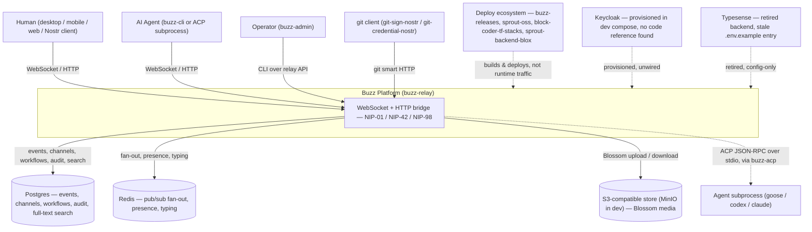

# Buzz Platform — System Context

The system-context view of Buzz: the platform's boundary, every actor and external
system that directly touches it, and how each relates to it. This node stays at
context level on purpose — it does not describe `buzz-relay`'s internal
decomposition (event pipeline, subscription registry, crate dependency graph).
For that, see [`ARCHITECTURE.md`](../../../../ARCHITECTURE.md), which every claim
below cites and which a future `architecture/containers/*` corpus node should
draw from once one exists.

## What "the Buzz platform" is

Buzz is a self-hosted, Apache-2.0 Rust monorepo team-communication platform built
on the Nostr protocol. `buzz-relay` is the single source of truth: every chat
message, reaction, workflow step, canvas update, and huddle event is a
cryptographically signed Nostr event, and every read and write from every client
flows through the relay — there is no peer-to-peer event exchange, gossip, or
replication between clients.

A Buzz **community** is the tenant-visible workspace selected by the request
host. The self-hosted default is one host, one relay process, one implicit
community; a hosted operator can serve many communities behind many domains from
one shared deployment, but the client-facing rule is the same either way: the URL
is authoritative for the workspace.

## Actors and external systems

| Actor / system | Relationship to Buzz |
|---|---|
| **Human** | Connects as a Nostr client — the desktop app, the mobile app, the web client, or any other NIP-42-compatible client — over the relay's WebSocket (NIP-42) or HTTP bridge (NIP-98). |
| **AI agent** | Two distinct paths: `buzz-cli` speaks the relay's REST/WebSocket surface directly under the agent's own Nostr keypair; `buzz-acp` bridges relay `@mention` events to an external agent subprocess (goose, codex, claude) over ACP JSON-RPC on stdio — the subprocess itself is never a Nostr client. |
| **Operator** | Manages relay membership via `buzz-admin` (ships inside the relay's own Docker image), out-of-band from the Nostr protocol clients use. |
| **git client** | A developer's ordinary `git` tooling is a client of the relay's git-smart-HTTP endpoints, optionally signing objects and authenticating with a Nostr keypair via `git-sign-nostr` / `git-credential-nostr` instead of a GitHub-issued credential. |
| **Postgres** | Primary event store (events, channels, tokens, workflows, audit) and the full-text search backend (generated `tsvector` + GIN index) — no separate search service. |
| **Redis** | Cross-node pub/sub fan-out, presence, and typing indicators. |
| **S3-compatible object store** (MinIO in local dev) | Media storage behind the Blossom protocol upload/download endpoints. |
| **Agent subprocess runtime** (goose / codex / claude, spawned by `buzz-acp`) | Receives batched `@mention` prompts over ACP JSON-RPC and returns tool-call output; does not connect to the relay itself. |
| **Deploy/build ecosystem** (`buzz-releases`, `sprout-oss`, `block-coder-tf-stacks`, `sprout-backend-blox`) | Builds, containerizes, and deploys this source; acts on Buzz from outside at build/deploy time, not part of the runtime system boundary. |

## Context diagram

Dashed edges mark relationships that are provisioned or referenced but not a
confirmed part of runtime behavior — see *Verified gaps* below.

## Verified gaps

Two entries in local configuration name systems that current source does not
confirm as live, and both are worth flagging rather than silently omitting or
silently including:

- **Keycloak** is provisioned in `docker-compose.yml`'s local development stack
  (image `quay.io/keycloak/keycloak:26.0`, port 8180) alongside Postgres, Redis,
  and MinIO. No Rust source under `crates/` references Keycloak by name. It may
  be scaffolding for planned SSO/identity work, or a leftover from an earlier
  design — this node does not resolve which, only that today it has no confirmed
  runtime relationship to the platform.
- **Typesense** is not a live external system despite `.env.example` still
  carrying a "Typesense (search)" section (`TYPESENSE_API_KEY`,
  `TYPESENSE_URL`). `buzz-relay`'s own source says the Typesense-backed
  `index_event` worker is gone, replaced by Postgres FTS populating the
  searchable column on write. The `.env.example` entries are stale and should
  not be read as describing a system Buzz currently talks to.

## This checkout's own relationship to what it documents

This corpus lives in the `launchpad-26/buzz` fork, whose own governing
instructions are explicit that the cohort operates and deploys Buzz rather than
developing it. This node documents the system being operated — Buzz's own
architecture, as built in `block/buzz` and inherited by this fork — not the
fork's deployment tooling, which is a separate concern the cohort's own
`launchpad/` tree owns.

## Scope and omissions

**This document covers** the system boundary of the Buzz platform: every actor
and external system with a direct relationship to it, and what that relationship
is, at context level.

**It does not cover, and these are gaps rather than silence:**

| Not covered here | Owned by |
|---|---|
| `buzz-relay`'s internal container/component decomposition (event pipeline, subscription registry, crate dependency hierarchy) | `ARCHITECTURE.md`, and a future `architecture/containers/*` corpus node |
| Whether Keycloak is planned, abandoned, or dead configuration | Unresolved — named as a verified gap above, not decided here |
| The full desktop/mobile/web feature surface each client actor exposes | Each client's own future corpus nodes |
| Deployment/CI/CD detail for the four ecosystem repos named above | Each repo's own documentation; `AGENTS.md`'s Ecosystem section is the entry point |

**Expected but not verified when this node was written:**

- **Whether any client beyond the desktop, mobile, and web apps actually
  connects to a Buzz relay in practice.** NIP-42 makes any compliant Nostr
  client capable of it in principle; no third-party client was observed
  connecting.
- **Whether Keycloak's provisioning in `docker-compose.yml` predates or
  postdates the crates that would consume it**, and therefore whether it is
  forward scaffolding or a stale leftover. `git log` on `docker-compose.yml`
  was not run for this node; the claim above is limited to "provisioned,
  unreferenced by source," not a claim about intent or timeline.
- **Whether every AI agent runtime `buzz-acp` can spawn is limited to
  goose/codex/claude**, or whether that list in `ARCHITECTURE.md` is
  illustrative rather than exhaustive; `buzz-acp`'s own subprocess-spawning code
  was not read for this node.
