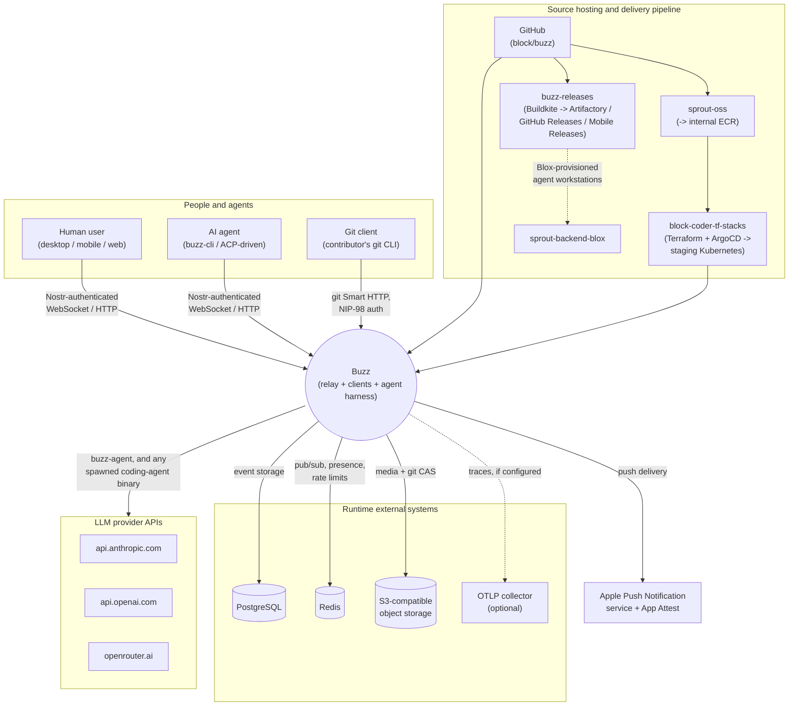

# Architecture context: external services

This node is a system-context view: it draws the boundary around Buzz as one
system, names every actor and external system that crosses that boundary, and
states the relationship in each direction. It intentionally stays above the
container/component level -- which crate or module implements a relationship
is cited as evidence, not documented here as an architecture decision. For
implementation detail, follow the citations into the crates and configuration
named below.

## System boundary

**Inside the boundary** (treated as one system, "Buzz," for this node): the
`buzz-relay` WebSocket/HTTP server and every crate that runs inside its
process or is invoked as part of serving it (event storage, auth, pub/sub,
search, media, git hosting, workflow execution); the desktop, mobile and web
clients; `buzz-cli`; and the ACP agent-harness surface (`buzz-acp`,
`buzz-agent`, `buzz-dev-mcp`, `buzz-persona`). This matches the Observability
current-state doc's own boundary statement for the relay process: "PostgreSQL,
Redis, object storage, peer relays, and any external telemetry system are
separate runtimes... Collection, storage, querying, dashboards, and deployment
are likewise outside the relay runtime" (`launchpad/docs/Observability/current-state/relay.md`).
This node generalizes that same boundary to the whole system, not just the
relay process.

**Outside the boundary**: every system named below -- data stores Buzz reads
and writes but does not implement; identity/attestation and push-delivery
services operated by a third party; LLM provider APIs; the source-hosting and
delivery pipeline that builds, signs and ships Buzz; and any human or AI actor
that connects to Buzz as a client rather than running inside it.

## Actors and external systems

| Actor / system | Relationship to Buzz | Category |
|---|---|---|
| Human user (desktop / mobile / web client) | Connects over WebSocket/HTTP as a Nostr-authenticated client; sends and receives events, uploads media, browses git repos | Person |
| AI agent (via `buzz-cli` or the ACP harness) | Connects the same way a human client does, plus operates through the ACP harness's spawned-subprocess surface | Person/system (agent) |
| PostgreSQL | Buzz's persistent event store and data-access layer | Data store |
| Redis | Pub/sub fan-out, presence, typing indicators, shared rate-limit counters | Data store |
| S3-compatible object storage | Blossom media storage and git content-addressable storage | Data store |
| Keycloak (local dev only) | OAuth-scope test fixture for local development; no runtime dependency in the auth path itself | Dev-only fixture |
| OTLP telemetry collector | Optional destination for exported traces; a no-op when unconfigured | Observability (optional) |
| LLM provider APIs (`api.anthropic.com`, `api.openai.com`, `openrouter.ai`) | Called directly by `buzz-agent`, and indirectly by whichever AI coding-agent binary the ACP harness spawns (e.g. goose, claude-code, codex-acp) | AI provider |
| Apple Push Notification service + App Attest | Last-hop push delivery to the mobile app, and device attestation, via `buzz-push-gateway` | Platform service |
| Git client (contributor's local `git`, git-credential-nostr) | Clones/pushes against repositories the relay hosts itself over git Smart HTTP | Person/tool |
| GitHub (`block/buzz`) | Hosts the OSS source this fork tracks; issues, PRs, and this fork's own CI run here | Source hosting / CI |
| squareup/buzz-releases (Buildkite) -> Artifactory, GitHub Releases, Mobile Releases | Builds and publishes Block-signed desktop + mobile releases | Delivery pipeline |
| squareup/sprout-oss -> internal ECR | Builds and pushes the relay's Docker image | Delivery pipeline |
| squareup/block-coder-tf-stacks -> ArgoCD -> staging Kubernetes | Terraform + ArgoCD deployment of the relay image | Delivery pipeline |
| squareup/sprout-backend-blox | Connects desktop-launched agent workstations to the relay | Delivery pipeline |

## Context diagram

## Runtime dependencies

**Data and messaging.** PostgreSQL and Redis are provisioned locally by
`docker-compose.yml` and configured through `.env.example`'s `DATABASE_URL` /
`PGHOST` family and `REDIS_URL`, respectively; both are required for the
relay to serve traffic. S3-compatible object storage (MinIO locally) backs
both Blossom media and the git content-addressable-storage layer, configured
through the `BUZZ_S3_*` variables and `crates/buzz-media/src/config.rs`'s
addressing-style handling (path-style for the bundled MinIO, virtual-style
for providers such as Railway Storage Buckets).

**Identity.** The relay's own auth paths (NIP-42, NIP-98) have no runtime
dependency on an external identity provider -- see
`crates/buzz-auth/src/lib.rs`'s explicit "no IdP runtime dependency" note.
`docker-compose.yml`'s `keycloak` service is a local OAuth-scope test
fixture only; no application source path in this repository was found to
reference it, and `scripts/dev-setup.sh` prints it as "local OAuth testing."

**Stale configuration, noted rather than silently corrected.**
`.env.example` still documents `TYPESENSE_API_KEY` / `TYPESENSE_URL` and a
default port, but the Typesense-backed search worker has been removed --
`crates/buzz-relay/src/handlers/event.rs` records that "the old Typesense
`index_event` worker and its `search_index_tx` mpsc are gone," search is now
Postgres full-text search (`buzz-search`), and `docker-compose.yml`
provisions no `typesense` service. Typesense is not a current external
dependency of this system.

**Observability export.** An OTLP-compatible collector is optional: the
relay's OpenTelemetry layer only activates when
`OTEL_EXPORTER_OTLP_ENDPOINT` is set, independently of the always-on stdout
JSON log layer and the Prometheus metrics endpoint (`launchpad/docs/Observability/current-state/relay.md`).

**AI / LLM providers.** Two different components reach these, at different
layers, and the distinction matters for this context view. `buzz-agent`
(the minimal ACP-compliant agent shipped in this repo) makes outbound HTTPS
calls directly to `api.anthropic.com` and `api.openai.com` (allowlisted by
exact host or verified subdomain in `crates/buzz-agent/src/config.rs`), and
`crates/buzz-core/src/agent_turn_metric.rs` separately documents
`openrouter.ai` as a third registered pricing authority. The ACP harness
(`buzz-acp`) itself does not call any LLM vendor API -- it spawns a
configured agent binary (goose, claude-code, codex-acp, or `buzz-agent`) as
a local subprocess and speaks the Agent Client Protocol to it over stdio;
whichever binary is spawned may make its own LLM provider calls outside
Buzz's process boundary.

**Mobile push.** `buzz-push-gateway` is a capability-gated last hop (NIP-PL)
that delivers push notifications to Apple Push Notification service over
`api.push.apple.com` / `api.sandbox.push.apple.com`, authenticated with an
APNs signing key, and uses Apple App Attest for device attestation
(`crates/buzz-push-gateway/src/{lib,apns,config}.rs`).

**Git hosting.** The relay hosts git repositories itself over the git Smart
HTTP protocol (`crates/buzz-relay/src/api/git/transport.rs`), authenticated
by NIP-98. The external actor at this boundary is a git client -- a
contributor's local `git` CLI, or `git-credential-nostr` acting on its
behalf -- not a third-party git hosting service.

## Delivery pipeline (a separate lifecycle context)

This is a different boundary than the runtime one above: it is what builds,
signs and ships Buzz, not what the running system talks to. It is included
here because the DoD for this node asks for every directly relevant actor,
and because a reader mapping "external services" purely to runtime traffic
would otherwise miss it. GitHub hosts `block/buzz`, the OSS source this fork
tracks, plus this fork's own issues/PRs/CI. Three internal Block pipelines
consume it: `squareup/buzz-releases` (Buildkite) builds Block-signed
desktop and iOS builds and publishes them to Artifactory, GitHub Releases
and Mobile Releases; `squareup/sprout-oss` builds the relay's Docker image
and pushes it to internal ECR; `squareup/block-coder-tf-stacks` applies
Terraform and ArgoCD to deploy that image to the staging Kubernetes cluster.
`squareup/sprout-backend-blox` is a fourth, connecting desktop-launched
agent workstations to the relay. All four are named and diagrammed in this
repo's own `AGENTS.md` Ecosystem section, which is this node's citation for
that whole cluster of relationships.

## Scope and omissions

**This node covers** the system/person/external-system boundary around
Buzz, names each directly relevant actor and external system found in this
repository's source and configuration, and states the relationship each one
has to Buzz. It does not descend into how any one relationship is
implemented -- follow the citations for that.

**Deliberately excluded, and why:**

- **`buzz-relay-mesh`** (inter-relay QUIC mesh) is not listed as an
  external system. Reading its own module doc, this crate connects runtime
  instances *of the same Buzz deployment* to each other for horizontal
  scale-out -- an iroh endpoint per pod, gossiped membership, a
  Redis-fenced ownership arbiter -- and is mesh-free entirely when
  `BUZZ_MESH=off` or no peers exist. That makes it internal/container-level
  (same system, multiple runtime instances), which the DoD for this node
  says to stay above. This is a judgment call this issue's own DoD leaves
  open, not something settled elsewhere in the repository; a future
  container-level node covering `buzz-relay`'s internal topology is where
  the mesh belongs.
- **`buzz-voice`** was checked and excluded: its `PocketTts` primitives load
  a bundled, on-device model ("April Pocket") rather than calling a network
  service, so it names no external system.
- **No relay-to-independent-relay federation was found.** The
  Observability doc's "peer relays" phrase, quoted above, was checked
  against the source and traces to `buzz-relay-mesh` (same-deployment
  peers), not to federation with third-party Nostr relay operators. No
  evidence of the latter was found in this repository; this node does not
  claim it exists, and does not claim it does not exist beyond what was
  checked.

**Verified against this revision, but expected to drift:** the crate
inventory in this repository's own `AGENTS.md` predates several crates
present in the current tree -- `buzz-relay-mesh`, `buzz-push-gateway`,
`buzz-backend-kubernetes`, `buzz-conformance`, `buzz-datastore-tracing`, and
`buzz-deletion` were all found under `crates/` but are absent from that
table (confirmed via directory listing at the recorded revision, not via
that table). This node's actor/system list was built from direct source
inspection for that reason, not from the crate table alone, but the crate
table itself is a documented gap this node does not fix.

**Expected but not verified when this node was written:**

- Whether Keycloak, Typesense, or any other locally-provisioned
  `docker-compose.yml` service is referenced by the private deployment
  configuration in `squareup/block-coder-tf-stacks` -- that repository is
  outside this checkout and was not read. The claims above are scoped to
  what this repository's own source and configuration show.
- Whether any TURN/STUN or other WebRTC-adjacent external service backs
  relay-hosted huddle audio. No such reference was found in
  `crates/buzz-relay/src`, but huddle audio transport internals were not
  traced end-to-end for this node.
- No `relationships` front-matter edges are declared. No sibling corpus
  node in the `architecture` category was confirmed merged at the time of
  writing, and a `relationships[].target` naming an id no loaded node
  carries is a hard validation error per `node.schema.json`.
