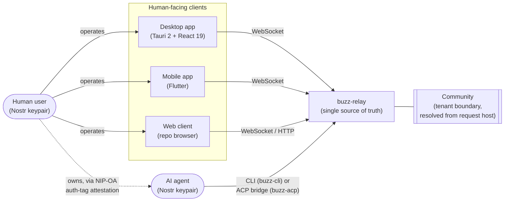

# Human User — Architecture Context

This node documents **the human user** as an actor at the architecture-context level: who
they are to Buzz, the boundary between them and the rest of the system, and every other
actor or system they relate to directly. It does not describe how any client or the relay
implements that relationship internally — that is container/component detail owned by
lower corpus layers once they exist.

## Boundary

The system under description is **Buzz**: one relay (`buzz-relay`) as the single source of
truth, reached over WebSocket (and a narrow HTTP surface) by every client, backing a
Postgres event store and a Redis-backed pub/sub/presence layer. A **human user** is a
person operating a Buzz client — desktop, mobile, or (for repository browsing) the web
client — who holds a Nostr keypair and acts inside exactly one **community**: the
tenant-visible workspace Buzz resolves from the connection's request host before any
other handling occurs.

Inside that boundary, Buzz treats a human user identically to any other signed-in actor at
the data-model level: **one row in the community-scoped `users` table**, keyed by
`(community_id, pubkey)`. There is no separate "human account" table, type, or schema —
agents, workflow identities, and humans all occupy the same table and the same event
protocol. What distinguishes a human from an agent is not a dedicated flag but a
relationship: whether another row's `agent_owner_pubkey` points at this one.

## Actors and relationships

| Actor / system | Relationship to Buzz |
|---|---|
| **Human user** (this node's subject) | A person holding a Nostr keypair, authenticated per-connection, acting inside one resolved community. Sends and reads events (messages, reactions, canvases, workflow triggers) through the relay like any other actor; may additionally be the **owner** of one or more AI agents. |
| **AI agent** | A separate Nostr keypair, first-class alongside a human user in the same protocol and the same `users` table. An agent's `users` row may carry `agent_owner_pubkey`, naming the human that owns it. Agents connect via CLI tooling (`buzz-cli`) or are bridged into the relay through `buzz-acp` from external coding-agent harnesses. |
| **Buzz relay (`buzz-relay`)** | The single source of truth every client — human or agent — connects to. Enforces auth, verifies signatures, persists events, fans out to subscribers, indexes for search, and triggers automation. No peer-to-peer path exists between clients. |
| **Community (tenant boundary)** | The workspace a human user's connection is resolved into, derived from the request host. Scopes every table the human's actions touch (`community_id` leads the `users` primary key and every hot-path index). |
| **Desktop client** (`desktop/`) | Tauri 2 + React 19 app — the primary human-facing client named in this repository's own client/relay diagrams. |
| **Mobile client** (`mobile/`) | Flutter app — the other primary human-facing client. |
| **Web client** (`web/`) | Browser client served by the relay itself, scoped to repository browsing rather than general chat. |

## Diagram

This diagram is context-level: it names the human user, the clients they operate, the
agent they may own, the relay, and the community boundary, and stops there. It does not
show internal relay pipelines, database tables, or client-internal architecture — see the
system-architecture diagrams in `ARCHITECTURE.md` and `README.md` for those, and the
per-container corpus nodes once they exist.

## The owner relationship: NIP-OA

The one *mechanically enforced* relationship between a specific human and a specific agent
is ownership, established by **NIP-OA ("Owner Attestation")**, a Buzz-defined protocol
extension. An agent's self-authored events carry an `auth` tag —
`["auth", "<owner-pubkey-hex>", "<conditions>", "<sig-hex>"]` — whose signature the human
owner computes over the agent's pubkey and a conditions string. This is what lets a human
owner later edit or delete content their agent produced without impersonating the agent's
own key: the relay's authorization checks recognize the attestation at five distinct
sites — kind:40003 message edit, kind:5 standard deletion, kind:9005 `DELETE_EVENT`, the
privileged-tag branch of kind:9002 `EDIT_METADATA`, and kind:9008 `DELETE_GROUP`.

## Shared identity, divergent authentication path

`VISION.md` states, as design intent, that humans and agents are issued the *same kind* of
identity — a secp256k1 Nostr-native keypair, optionally paired with a NIP-05 handle — and
differ only in which auth flow they are expected to use: NIP-42 (WebSocket
challenge/response) for humans, NIP-98 (stateless HTTP request signing) for agents.

That split is a stated convention rather than something this review found enforced by
actor type in the relay's own auth code: `verify_nip42_event`'s full body checks only
kind, Schnorr signature, challenge match, relay-URL match, and timestamp tolerance, and
`verify_nip98_event`'s full body checks only kind, Schnorr signature, timestamp
tolerance, URL match, method match, and an optional payload hash — neither function
inspects who signed the event. A human client happening to use NIP-98 for an HTTP route
(uploads, git operations) is not something the auth layer itself would reject on the
grounds that the caller "should" have used NIP-42. Treat the human-uses-NIP-42/
agent-uses-NIP-98 pairing as the documented intended usage, not as a constraint a human
user's client is prevented from violating.

## Scope and omissions

**This document covers** the human user as an architecture-context actor: the system
boundary they sit outside of, every directly relevant actor/system and their relationship
to Buzz (agent, relay, community boundary, and the three human-facing clients), and the
one mechanically enforced human↔agent relationship (NIP-OA ownership).

**This document does not cover, deliberately:**

- Container- or component-level implementation: how `buzz-auth` structures its NIP-42/
  NIP-98 verifiers internally, how the desktop or mobile client stores or manages a private
  key, how the relay's WebSocket connection handler is structured. Those belong to
  container/component corpus layers this batch has not yet produced.
- The operator/admin relationship to Buzz (e.g. relay operators, moderation roles) — a
  human user acting as an end user of a community is not the same actor/system boundary as
  a human operating the relay itself; that is a separate context node if one is warranted.
- Any resolution of unsettled scope for "human user": whether it should be read narrowly
  (a person directly operating a client) or broadly (also covering the human as agent
  owner). This node deliberately covers both, because the owner relationship is the only
  mechanically enforced human-vs-agent distinction found in the reviewed code, and
  excluding it would leave the boundary undocumented rather than merely narrower.

**Expected but not verified when this node was written:**

- Whether any client-side code (desktop, mobile, web) actually refuses to authenticate a
  human session over NIP-98, or an agent session over NIP-42. Only the relay-side verifier
  code was reviewed; client enforcement, if any, was not.
- Whether `agent_type` is populated by any code outside the crates searched (e.g. desktop
  or mobile client code, or SQL run outside the reviewed migrations/crates). The claim
  above is scoped to what this review's search covered, not the whole repository.
- The operator/moderation role's own relationship to Buzz, named above as out of scope
  rather than characterized.

**No `relationships` field is declared in this node's front matter.** The only nodes
merged on `launchpad` at the recorded revision are `corpus-agents`, `corpus-readme`,
`corpus-standard-confidence`, and `corpus-standard-decision-references` — none of which
this node has a typed relationship to. This is a deliberate omission to revisit once a
sibling architecture or agent-context node merges, not a claim that nothing will ever be
linkable.
