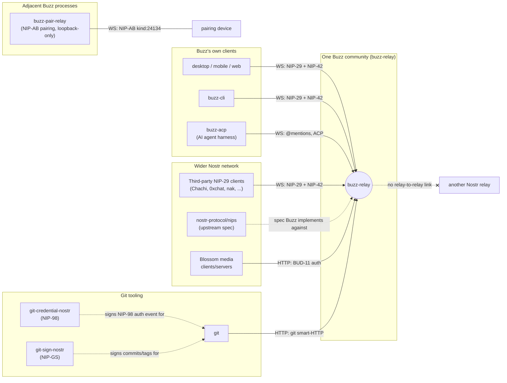

# Context: Buzz and the Nostr Network

What sits outside `buzz-relay`'s own process boundary and talks to it, and what Buzz does
and does not do at the level of the wider Nostr network. This is a System Context node
(C4 level 1): it names actors and their relationship to Buzz. It does not describe what
happens inside the relay once a connection is open — that is `ARCHITECTURE.md`'s job — and
it does not restate per-NIP wire detail — that is `NOSTR.md` and `docs/nips/`'s job. Links
below point at those instead of duplicating them.

## The system boundary

**The system being described is one Buzz community**: a single `buzz-relay` deployment
(today, one process or a horizontally-scaled set of processes sharing one Postgres and one
Redis, coordinated as a single logical relay) reachable at one host/domain. That relay is
the single source of truth for the community — every read and write flows through it.
Buzz **does not federate at the relay level**: there is no peer-to-peer event exchange, no
gossip between relays, and no replication with any other Nostr relay. Everything this node
calls "the Nostr network" from Buzz's point of view is therefore interoperability that
happens at the *client* layer — a client that also knows how to talk to other relays — not
at the relay layer.

In multi-community deployments the community boundary is the request host, resolved before
any AUTH/EVENT/REQ/REST/media/git/search/workflow handling: an unknown host fails closed,
and a client-supplied auth stamp cannot override the host-derived community. That host
boundary, not any Nostr-protocol construct, is what separates one Buzz community from
another.

## Actors and their relationship to Buzz

| Actor | What it is | Relationship to Buzz |
|---|---|---|
| **Third-party Nostr clients** (e.g. Chachi, 0xchat, `nak`) | Independent NIP-29-capable Nostr clients, not built by this project | Connect directly to `buzz-relay` over WebSocket using standard NIP-29 (groups) and NIP-42 (auth). They see Buzz as an ordinary NIP-29 relay; Buzz-custom kinds (e.g. rich content/edits) are on the wire but render as nothing meaningful in a client that doesn't know them. |
| **Buzz's own clients** (desktop, mobile, web, `buzz-cli`) | First-party clients built in this repository | Speak the identical NIP-01/NIP-29/NIP-42 wire protocol to the same relay as third-party clients — there is no private back channel. They differ from third-party clients only in that they understand the Buzz-custom kinds too. |
| **AI agents** | Any agent speaking ACP (goose, codex, claude code, …), run through `buzz-acp` | The harness listens for @mentions on the relay over WebSocket and drives the agent; the agent's identity in Buzz is a Nostr keypair like any human user's, registered as a relay member via `buzz-admin`. To the relay, an agent is just another authenticated pubkey. |
| **Device-pairing peers** | A second device (e.g. mobile) pairing itself to an existing identity | Talk NIP-AB pairing events (kind:24134) to `buzz-pair-relay`, a separate, ephemeral, loopback-only sidecar process with no persistence and no auth of its own — not to `buzz-relay` directly. |
| **Git clients** (plain `git`, via `git-credential-nostr` and optionally `git-sign-nostr`) | Standard git tooling extended with Nostr-based credential and signing helpers | `git-credential-nostr` signs NIP-98 HTTP auth events so git can push/pull over Buzz's git smart-HTTP surface without a password; `git-sign-nostr` optionally signs commits/tags with the same Nostr key (NIP-GS) using git's pluggable signing-program interface. Both terminate at `buzz-relay`'s merged git and git-policy routers, a distinct HTTP surface from the Nostr WebSocket/bridge routes even though it is the same process. |
| **Blossom media clients/servers** | Any client or server implementing the Blossom blob-storage convention | Buzz's own media upload/download endpoints authenticate Blossom kind:24242 events per BUD-11, so Buzz participates in the Blossom protocol as a server, independently of the NIP-29 chat surface. |
| **`nostr-protocol/nips` (upstream)** | The community specification repository for standard NIPs | The reference Buzz implements against for NIP-01, NIP-29, NIP-42 and the other NIPs it supports. Buzz's own protocol extensions (git signing, agent owner attestation, workspace profile, and others) are written up as draft NIPs under `docs/nips/` rather than folded silently into the wire format. |

## Diagram

The crossed-out edge to "another Nostr relay" is deliberate: it records the negative claim
in the evidence ledger above, not an omission. `buzz-pair-relay` is drawn as adjacent to,
not inside, the `buzz-relay` community box because it is a separate process with its own
auth-free, unpersisted trust model.

## Scope and omissions

**This node covers** the actors and external systems that directly connect to or
interoperate with a Buzz community over the Nostr protocol, HTTP, or an adjacent sidecar
protocol, and the boundary of what "the Nostr network" means for Buzz (client-layer
interoperability, not relay federation).

**It does not cover, and these are owned elsewhere:**

| Not covered here | Owned by |
|---|---|
| Internal relay components — `buzz-db`, `buzz-auth`, `buzz-pubsub`, `buzz-search`, `buzz-audit`, `buzz-workflow` and how `buzz-relay` orchestrates them | `ARCHITECTURE.md` |
| Per-kind wire detail, tag shapes, auth flows for each supported NIP | `NOSTR.md` and `docs/nips/` |
| The event-kind registry itself | `crates/buzz-core/src/kind.rs` |
| Multi-community host routing internals beyond the boundary statement above | `ARCHITECTURE.md` |
| Speculative future actors (e.g. peer-to-peer compute sharing across communities) | `VISION_MESH.md` — not part of this node because it is not yet built |

**Expected but not verified when this node was written:**

- **Live interop with a specific third-party client was not re-run for this node.** `NOSTR.md`
  records `nak` and `BuzzTestClient` as verified in-repo, and Chachi/0xchat as "not verified
  in-repo (anecdotal / expected)" — this node repeats that distinction rather than
  independently re-testing either client.
- **Whether any other crate outside the six greped in the INFERENCE entry above opens an
  outbound Nostr WebSocket connection was checked by name pattern (`connect_async` /
  `tokio_tungstenite::connect`) across `crates/*/src`, not by a full data-flow audit** — a
  differently-named HTTP or WebSocket client library, if one exists elsewhere in the tree,
  would not have matched that search.
