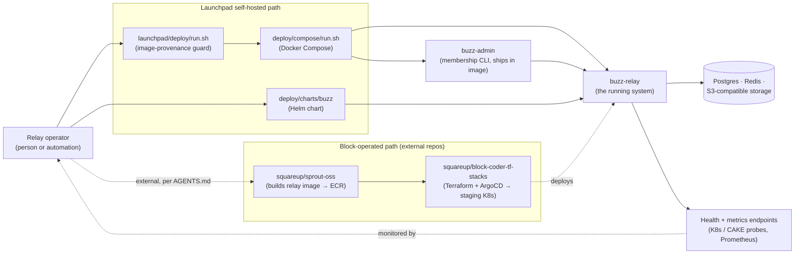

# Relay operator — architecture context

## Boundary

**The relay operator** is the role — human or automation — responsible for provisioning,
configuring, deploying, upgrading, backing up, and administering a running instance of
`buzz-relay` and the stateful services it depends on. This node describes that role's
boundary: what it touches directly and what falls to a different actor.

**In scope for this role:** choosing and pinning a relay image; supplying the relay's
required secrets and configuration; starting, stopping, upgrading and monitoring the
relay process; managing relay membership; backing up relay-adjacent state.

**Out of scope for this role**, and owned by other actors this corpus documents
separately: writing or reviewing relay code (a developer's relationship to Buzz);
interacting with channels as a member or building on the agent surface (separate
context nodes); and the internal implementation of the tools the operator invokes
— `buzz-admin`'s command handling, the relay's own request routing, or the Compose
files' and Helm chart's internal templating are container/component-level detail this
context node deliberately does not descend into.

The role is not itself a single named entity in this repository. What this
repository's own evidence supports is two concrete instantiations of it — see
*Two operator paths this repository documents* below — named honestly as two
because no single canonical "the relay operator" artifact unifies them here.

## Actors and systems directly relevant to this role

| Actor / system | Relationship to Buzz |
|---|---|
| **buzz-relay** | The system being operated: the WebSocket + REST relay server. The operator's every other listed touchpoint exists to configure, run, monitor or administer this one process and the state it owns. |
| **buzz-admin** | The operator's CLI for relay membership: `add-member`, `remove-member`, `list-members`, `generate-key`, `reconcile-channels`. Shipped inside the relay's own Docker image at `/usr/local/bin/buzz-admin`, so it travels with every deployed relay rather than being installed separately. |
| **`deploy/compose/run.sh`** | Upstream's canonical Docker Compose operator interface — `start`/`stop`/`restart`/`pull`/`upgrade`/`logs`/`status`/`config`/`backup-hint`, plus membership subcommands that shell into `buzz-admin` inside the running container. Refuses to run against a missing or placeholder-filled `.env`. |
| **`launchpad/deploy/run.sh`** | This fork's preflight guard in front of the canonical runner: validates Docker/Compose tooling, forbids the upstream `ghcr.io/block/buzz` image, and requires an immutable `ghcr.io/launchpad-26/buzz` digest or full-SHA tag before delegating unchanged to `deploy/compose/run.sh`. Exists because a clean checkout previously had no signal it was running someone else's build. |
| **`deploy/charts/buzz` (Helm chart)** | A second deployment surface, for Kubernetes rather than a single VPS: a Production profile pointing at externally managed Postgres/Redis/S3 with `secrets.existingSecret`, and a Quickstart profile that bundles Postgres/Redis/MinIO in-cluster for evaluation only. Documents ArgoCD and Flux as its GitOps consumers. |
| **Postgres, Redis, S3-compatible object storage** | Stateful dependencies the operator provisions and backs up, whichever deployment path is used — the event store, pub/sub and presence backing, and Blossom media plus git object storage respectively. |
| **Health and metrics surface** | `/_liveness`, `/_readiness`, `/_status`, `/_mesh` on a dedicated health-only listener (`BUZZ_HEALTH_PORT`, default 8080 — the port a code comment notes Block's internal CAKE platform probes), a combined `/health` on the main app port, and a Prometheus `/metrics` exporter on `BUZZ_METRICS_PORT` (default 9102). The operator's monitoring stack, not the relay's own logic, is what consumes these. |
| **Configuration surface** | Environment variables the operator sets before starting the relay — `BUZZ_IMAGE`, `RELAY_OWNER_PUBKEY`, `BUZZ_RELAY_PRIVATE_KEY`, `BUZZ_BIND_ADDR`, `RELAY_URL`, `BUZZ_AUTO_MIGRATE`, `BUZZ_HEALTH_PORT`, `BUZZ_METRICS_PORT`, and the database/Redis/S3 credentials — via `deploy/compose/.env` or the Helm chart's values. |
| **squareup/sprout-oss** | Builds the relay's Docker image from this source and pushes it to Block's internal ECR — the upstream half of Block's own operated pipeline. Not present in this checkout; named per this repository's own contributor guide. |
| **squareup/block-coder-tf-stacks** | Terraform plus ArgoCD deploying the relay (via a Helm chart) to Block's staging Kubernetes cluster — the downstream half of Block's own operated pipeline. Not present in this checkout; named per this repository's own contributor guide. |

## Two operator paths this repository documents

1. **Launchpad-fork self-hosted operator.** `launchpad/deploy/run.sh` (guard) →
   `deploy/compose/run.sh` (canonical Compose runner) → `buzz-admin` (membership) →
   `buzz-relay` container, backed by Postgres/Redis/S3 the operator provisions via
   `deploy/compose/.env`. Fully present and inspectable in this checkout.
2. **Block-operated staging/production path.** `squareup/sprout-oss` builds the image →
   `squareup/block-coder-tf-stacks` applies Terraform and an ArgoCD-managed Helm release
   to a staging Kubernetes cluster. This repository names this path in its own
   contributor guide and ships the Helm chart (`deploy/charts/buzz`) that a GitOps
   pipeline like this one would consume, but the pipeline repository itself is external
   and outside this checkout's evidence.

Both are the same role — the actor who takes a built relay image and keeps a running
instance healthy — instantiated by two different toolchains this repository's own
evidence names.

## Context diagram

## Scope and omissions

**This node covers** the relay operator role's boundary, the actors and systems it
directly touches, and the two operator paths this repository's own evidence supports.

**It does not cover, and these are gaps rather than silence:**

| Not covered here | Owned by |
|---|---|
| Internal implementation of `buzz-admin`'s subcommands | a future container/component-level node |
| `buzz-relay`'s internal request routing, module structure, or security model | `ARCHITECTURE.md` today; a future container/component-level corpus node |
| The Compose files' and Helm chart's internal templating and values contracts | a future component-level node, and `deploy/charts/buzz/README.md` today |
| The developer, agent, and channel-member roles' relationship to Buzz | separate context-level corpus nodes (sibling issues to this one) |
| Whether `squareup/sprout-oss` and `squareup/block-coder-tf-stacks` behave as this repository's own `AGENTS.md` describes | not verifiable from this checkout — those repositories are external and not imported here |

**Expected but not verified when this node was written:**

- **The bootstrap script `deploy/compose/run.sh` refers to** ("or run the bootstrap
  script once it lands") does not exist at the recorded revision — operators currently
  fill `deploy/compose/.env`'s `CHANGE_ME` placeholders by hand.
- **Whether Block's staging deployment actually uses `deploy/charts/buzz` as shipped
  here**, versus a fork or an equivalent manifest maintained inside
  `squareup/block-coder-tf-stacks`. This repository's own `AGENTS.md` says
  `block-coder-tf-stacks` deploys "via a Helm chart" but that repository is not present
  in this checkout to confirm which chart.
- **Whether the relay's `/health` route on the main app port and the dedicated
  `/_liveness`/`/_readiness` health-listener routes are both actively used by any
  current deployment**, or whether one is legacy. Both exist in code; which probe a
  given deployment path (Compose healthcheck vs. Kubernetes probes) actually calls was
  not traced further, since that is deployment-manifest detail below this node's
  context-level scope.
