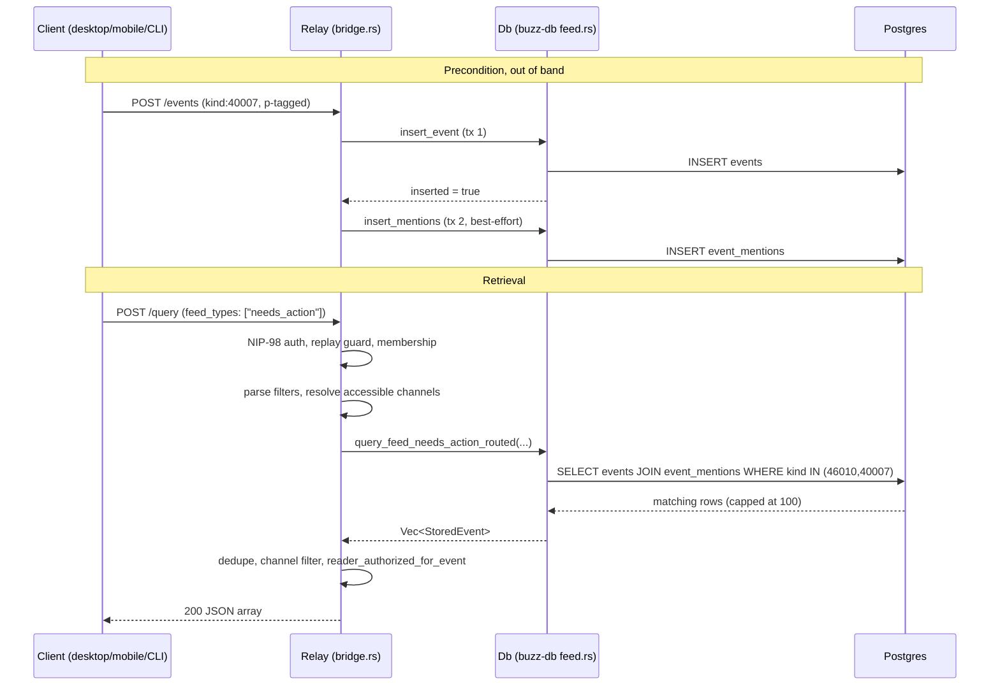

# Needs-action feed retrieval: flow

How an already-accepted, already-stored event tagged to a user as requiring
their action -- a workflow approval request (kind 46010) or a stream reminder
(kind 40007) -- becomes visible to that user through the `needs_action` feed
type on the relay's `POST /query` HTTP bridge.

This node documents the **retrieval flow only**: the path from an accepted
event, through its `event_mentions` index entry, to its appearance in a
`feed_types: ["needs_action"]` response. It does not restate the shared
NIP-98/`POST /query` bridge mechanics (`architecture-flows-http-event-submission`
is canonical for that) or the workflow engine's trigger/execution model
(`architecture-flows-workflow-execution` is canonical for that, including the
finding this node depends on below). Link to those; do not duplicate their
content here.

## Trigger, preconditions, termination

**Trigger.** A client sends `POST /query` with a Nostr filter carrying a
custom `feed_types` array that includes `"needs_action"` (or `"mentions"` /
`"activity"` alongside it). The extension field is read directly from the raw
JSON body because `nostr::Filter`'s typed parse silently drops it -- the
handler two-pass-parses the body for exactly this reason.

**Preconditions.**
- The caller authenticates the request with NIP-98 (a signed Nostr event bound
  to this exact URL, method and body), passes replay-guard and
  relay-membership checks, and is not blocked by any p-gated/engram/author-only
  kind restriction on the filter overall.
- At least one qualifying event already exists: a `kind:46010` or `kind:40007`
  event, durably stored, `p`-tagged with the caller's own pubkey, and indexed
  into `event_mentions` for that pubkey. As of this revision, `kind:46010` is
  never emitted by any code path (see *Failure, abort, and rollback behavior*
  below), so in practice this precondition is currently only ever satisfied by
  a `kind:40007` reminder.
- The event is either community-global (`channel_id IS NULL`) or lives in a
  channel the caller currently has access to -- an empty accessible-channel
  list means "global only," never "every channel."

**Termination / outcome.** The request terminates in exactly one of: (a) a 200
response with a JSON array of zero or more matching events, deduplicated,
capped at the lesser of the caller's requested limit and 100; (b) a 400 for a
malformed filter or too many explicit channels; (c) a 403 for a caller who
fails relay-membership enforcement; or (d) a 500 if the channel-access lookup
or the `needs_action` query itself errors. None of these outcomes marks an
item as "done" or "resolved" anywhere server-side -- this flow is read-only
retrieval; there is no dismiss/complete mutation in the code path this node
traced, so an item continues to satisfy the query on every subsequent call
until its own `since` cursor moves past it or its source event is deleted.

## Ordered interactions and data/state movement

1. **Precondition (out of band).** A client publishes a `kind:40007`
   (`KIND_STREAM_REMINDER`) event to a channel, `p`-tagged with the target
   user, through the ordinary channel-message ingest path (`Scope::
   MessagesWrite`, `requires_h_channel_scope`) -- no reminder-specific
   validation exists for this kind. `Db::insert_event` inserts the event in
   its own transaction, then -- only on a genuinely new insert, and in a
   **separate** transaction -- calls `insert_mentions`, which extracts every
   `p`-tagged pubkey and writes one `event_mentions` row per tenant/event/
   pubkey. A failure in that second call is only `tracing::warn!`-logged; the
   event itself is already durably stored either way.
2. **Client request.** The user's client (desktop, mobile, or the `buzz` CLI's
   `cmd_get_feed`) sends `POST /query` with a filter shaped
   `{"#p": [my_pubkey], "feed_types": ["needs_action", ...], "since": ..., "limit": ...}`,
   NIP-98-signed for that exact URL/method/body.
3. **Authentication and admission.** `query_events_authed` runs
   `enforce_http_admission`, `check_nip98_replay`, and
   `enforce_relay_membership` (with NIP-OA agent-owner delegation fallback) in
   that order, before touching the request body's filters.
4. **Filter parse and authorization.** The raw JSON is parsed a second time
   (typed) into `nostr::Filter`s; p-gated, engram, and author-only kind
   restrictions are checked against the caller's own pubkey.
5. **Accessible-channel resolution.** `get_accessible_channel_ids_cached`
   resolves the caller's channel membership, and
   `repair_requested_channel_access` reconciles it against any channel the
   filter explicitly names.
6. **Feed dispatch.** For each filter carrying `feed_types`, the handler
   iterates the requested types (deduplicated, `agent_activity` canonicalized
   to `activity`), and for `"needs_action"` calls
   `Db::query_feed_needs_action_routed`, which -- for the always-taken
   `Bounded` routing arm -- tries a replica read first and silently re-runs on
   the writer pool on any replica error.
7. **SQL execution.** `query_needs_action`/`build_needs_action_query` issues
   one `SELECT` joining `events e` to `event_mentions m` on
   `(community_id, event_id)`, filtered to `m.pubkey_hex = <caller>`,
   `e.kind IN (46010, 40007)`, `e.deleted_at IS NULL`, the accessible-channel
   predicate, an optional `since` floor, ordered by `event_created_at DESC`,
   capped at `min(requested_limit, 100)`.
8. **Post-filtering and response.** Each row is deduplicated by event id,
   dropped if outside the accessible-channel set, and passed through
   `reader_authorized_for_event` (a no-op for these two kinds, see evidence
   ledger) before being serialized into the response array.

## Diagram

## Trust boundary and authentication crossings

- **Client -> relay (`POST /query`).** NIP-98: a signed Nostr event bound to
  the exact URL, method and body, replay-guarded by event id, shared verbatim
  with `POST /events` (see `architecture-flows-http-event-submission`).
- **Relay-membership boundary.** `enforce_relay_membership` fails closed
  (HTTP 403 `relay_membership_required`) unless the caller is a direct member,
  the relay is open (`require_relay_membership = false`), or the caller's
  NIP-OA owner is a member -- checked before any filter is parsed.
- **Tenant (community) boundary.** Both the `events` and `event_mentions`
  sides of the join are independently bound to `community_id`, and a test
  (`query_needs_action_is_scoped_across_communities`) exists specifically to
  prove a community-B item cannot leak into community A's results.
- **Channel boundary.** An event in a channel the caller cannot currently
  access is excluded twice over -- once in the SQL's own visible-channel
  predicate, once again in the handler's post-fetch
  `event_in_accessible_channel` check.
- **Defense-in-depth, not an active gate here.** `reader_authorized_for_event`
  is called on every returned event, but it only imposes a real check for
  `KIND_DM_VISIBILITY` and `KIND_AGENT_TURN_METRIC`; for kinds 46010 and 40007
  it always returns `true`. Nothing about this flow's actual data protection
  currently depends on that function.

## Failure, abort, and rollback behavior

- **Mention-indexing is best-effort, not transactional with storage.**
  `insert_mentions` runs in a transaction separate from, and after, the event
  insert's own commit. If it fails, the failure is only logged
  (`tracing::warn!`); the source event remains durably stored but never
  becomes discoverable through `query_needs_action` (or `query_mentions`).
  There is no retry or reconciliation path for this gap in the code traced for
  this node.
- **The approval half of this flow currently produces no data.** The workflow
  engine's `RequestApproval` step suspends execution and returns a token, but
  its own source comment marks emitting `kind:46010` and persisting an
  approval record as unimplemented (`TODO (WF-08)`) -- independently verified
  and already documented by `architecture-flows-workflow-execution`. No code
  path in this repository constructs a `kind:46010` event, so the `needs_action`
  query's approval arm is reachable but permanently empty until WF-08 lands.
- **Malformed or oversized requests fail before any feed dispatch.** An
  unparseable filter body, or a filter naming more explicit channels than the
  configured limit, is rejected 400 before `feed_types` is ever read.
- **A channel-access lookup error, or a `query_needs_action` SQL error, is a
  500** (`internal_error`), not a partial or best-effort response -- the
  handler does not degrade to returning only the feed types that succeeded.
- **Replica-read failure degrades to the writer, not to an error.** If the
  replica-routed read errors, the handler logs a warning, records the routing
  outcome, and transparently re-runs the identical query on the writer pool;
  the caller never observes the replica failure as long as the writer
  succeeds.
- **Representative verification.** `needs_action_query_includes_approval_and_reminder_kinds`
  and `needs_action_kinds_do_not_overlap_with_activity_kinds` assert the kind
  set itself; `needs_action_query_is_tenant_scoped_and_joins_mentions_by_composite_key`
  asserts the generated SQL's join and tenant predicates directly against the
  query builder's output; `query_needs_action_is_scoped_across_communities` is
  an integration-style test proving the cross-tenant isolation claim above
  end to end against a real pool.

## Scope and omissions

**This node covers** the retrieval path from an already-stored, already
`p`-tagged `kind:46010`/`kind:40007` event to its appearance in a
`feed_types: ["needs_action"]` response on `POST /query`: the SQL shape, the
HTTP bridge dispatch and its authentication/authorization checks, the
replica-routing behavior, and the failure modes traced above.

**It does not cover, and these are gaps rather than silence:**

| Not covered here | Owned by |
|---|---|
| The shared NIP-98/`POST /query` bridge authentication mechanics in general | `architecture-flows-http-event-submission` |
| The workflow engine's own trigger/execution model, and the full account of why `kind:46010` is never emitted | `architecture-flows-workflow-execution` |
| The general contract of `event_mentions`/mention indexing as its own subject, independent of this one flow's use of it | not yet documented in this corpus |
| Client-side (desktop/mobile) rendering, notification, or "seen" state for needs-action items | UI/component territory, not this flow's concern |
| The unrelated `kind:30300` (`KIND_EVENT_REMINDER`, NIP-ER) reminder mechanism, which shares the word "reminder" but is a distinct, parameterized-replaceable kind with its own `not_before`/`expiration` schedule validation | out of scope; not to be confused with `kind:40007` |
| The `mentions` and `activity` feed types, beyond what is needed to show `needs_action` is dispatched alongside them in the same handler | a sibling flow node's territory, if drafted later |

**Expected but not verified when this node was written:**
- **No live end-to-end exercise of a `kind:40007` reminder actually appearing
  in a `needs_action` response was run against a live relay for this node.**
  Every claim above is grounded in reading the SQL builders, the handler, and
  their existing unit/integration tests, not in an ad hoc manual reproduction.
- **Whether any client (desktop, mobile) currently sends `feed_types:
  ["needs_action"]` in practice was not checked** -- this node verifies the
  relay- and CLI-side mechanism exists and is wired, not that a shipped
  client UI actually calls it today.
- **Whether `kind:46010`'s `KIND_WORKFLOW_APPROVAL_GRANTED` (46011) /
  `KIND_WORKFLOW_APPROVAL_DENIED` (46012) counterparts, or the unrelated
  `KIND_APPROVAL_GRANT`/`KIND_APPROVAL_DENY` (46030/46031) pair, interact with
  this flow was not investigated** -- reading `executor.rs` confirmed 46010
  itself is never emitted, which was sufficient to ground this node's claims,
  but the surrounding approval-decision kinds were not independently traced.
