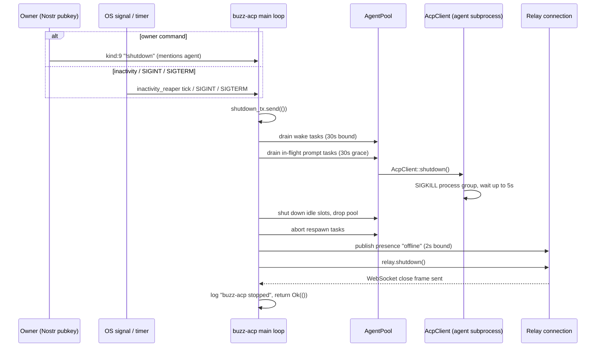

# Agent shutdown: flow

One **shutdown** is the ordered termination, graceful or otherwise, of the agent
subprocess(es) a `buzz-acp` harness owns, together with the harness-level cleanup and
Nostr-visible state change that accompanies it. This node describes that termination end
to end, as implemented in `crates/buzz-acp/src/{lib,acp,pool,relay}.rs`. It sits beside
`architecture-flows-agent-turn` (the per-turn round trip a shutdown must drain) rather than
duplicating it -- this node covers what happens to that turn's agent when the harness
itself is stopping, not the turn's own lifecycle.

## Trigger

A shutdown starts from exactly one of five sources, all of which converge on sending a
value into the same `shutdown_tx` watch channel:

1. **Owner `!shutdown` command.** A kind:9 stream-message event whose trimmed content is
   exactly `!shutdown`, mentioning the agent, from a pubkey equal to the resolved owner.
2. **Configured inactivity bound.** An `inactivity_reaper` timer tick finds the configured
   bound elapsed with no turn or heartbeat in flight (disabled by default; zero means never).
3. **SIGINT (Ctrl-C).** Caught by a dedicated signal-handling task at startup.
4. **SIGTERM (Unix only).** Caught by a second, parallel signal-handling task.
5. **Individual agent-subprocess crash or panic**, which does not by itself stop the
   harness -- it drives a *per-slot* respawn/circuit-breaker decision, described under
   *Failure, abort, and rollback behavior* below, distinct from the whole-harness shutdown
   the first four triggers start.

A message merely containing the text `!shutdown` from a non-owner pubkey is not dropped
and does not trigger shutdown -- it falls through to ordinary prompt handling.

## Preconditions

- For the owner-command trigger, the harness must already have resolved an
  `agent_owner_pubkey` (via NIP-OA attestation or the `--agent-owner` configuration) --
  `is_owner_control_command`'s kind/content/mention check and the separate
  owner-pubkey-equality check are both evaluated against whatever owner value is
  currently cached; a harness with no resolved owner cannot recognize the command as a
  shutdown trigger it is authorized to honor.
- For the inactivity trigger, `config.exit_after_inactivity_secs` must be configured
  non-zero; the check is a no-op (never expires) at its default of zero.
- The five triggers are independent and any one firing is sufficient -- no combination or
  ordering among them is required.

## Ordered interactions and data movement

1. **Trigger fires** by one of the five routes above, each independently sending `()` into
   the shared `shutdown_tx` watch channel.
2. **Re-send the signal** once more inside the shutdown sequence itself, so that an
   in-flight lazy-pool "wake" task (spawned to refill an idle pool) observes it and cancels
   promptly rather than being aborted mid-spawn.
3. **Drain wake tasks**, bounded to a 30-second timeout; on timeout the remaining wake
   tasks are aborted instead, and any pool a wake task finished spawning just before being
   aborted is torn down explicitly.
4. **Drain in-flight prompt tasks**, bounded to a separate 30-second grace period (chosen
   deliberately shorter than `max_turn_duration`, so a slow turn cannot make shutdown hang
   for up to an hour): every agent a completing prompt task returns has `AcpClient::shutdown`
   called on it, reaping its subprocess. On grace-period expiry the remaining prompt tasks
   are aborted, and any results that still arrive afterward are drained and shut down too.
5. **Shut down idle agents** still sitting in unused pool slots, then drop the pool.
6. **Abort in-flight respawn tasks** (mid-backoff-sleep or mid-`spawn_and_init`) so no new
   agent subprocess is spawned after the shutdown sequence has begun; any respawn result
   that already completed just before the abort is drained and shut down too.
7. **Cancel the presence-heartbeat task**, then **publish a presence "offline" event**
   (kind:20001, best-effort, bounded to a 2-second timeout) if presence is enabled.
8. **Abort the relay-observer publisher task.**
9. **Call `relay.shutdown()`**, which sends a `Shutdown` command internally and waits for
   the relay's background WebSocket task to finish closing the connection with a real close
   frame.
10. **Log `"buzz-acp stopped"` and return `Ok(())`**, ending the harness process.

## Diagram

## Outcome

**Success (graceful path).** Every agent subprocess the harness owned has had
`AcpClient::shutdown()` called on it (SIGKILL to its process group, reaped or abandoned
after a bounded 5-second wait); no respawn or wake task remains outstanding; a presence
"offline" event has been published (best-effort) if presence was enabled; the relay
WebSocket connection has been closed with a close frame; and the harness process returns
`Ok(())` after logging `"buzz-acp stopped"`.

**Failure path: an individual agent subprocess crashes or its task panics**, independent
of a whole-harness shutdown. The crash is observed as `AcpError::AgentExited` (stdout EOF)
or, for a panic, recovered through the `JoinSet`. `AgentExited` invalidates every ACP
session tracked for that agent; a panic additionally clears wedged in-flight
channel/heartbeat bookkeeping and emits an `"agent_panic"` observer event. Both then feed
the same circuit breaker: under the crash threshold, the slot is respawned (with
exponential backoff between 1 and 30 seconds); once the circuit opens (3 crashes within 60
seconds), the slot is left empty for 5 minutes before one half-open probe respawn is
allowed. This node does not establish what happens when every slot's circuit is open
simultaneously -- see *Scope and omissions*.

**Failure path: a bounded step inside graceful shutdown times out.** Three of the ten
ordered steps above are individually bounded (wake-task drain at 30s, prompt-task drain at
30s, presence-offline publish at 2s) and a timeout on any of them does not abort the whole
sequence -- it logs a warning and the sequence proceeds to abort/drain whatever remains,
continuing through to `relay.shutdown()` and the final log line regardless.

## Trust boundaries

- **Owner authorization on the shutdown trigger itself.** `is_owner_control_command`
  checks only kind, exact content, and agent mention -- it performs no authorization
  check. The separate, second condition -- the sending pubkey equals the harness's
  resolved `owner_cache` value -- is what actually gates whether the event is honored as
  a shutdown command; a `!shutdown` message from any other pubkey is treated as an
  ordinary chat message, not silently dropped and not honored.
- **The owner-pubkey cache is resolved once per harness process, at startup**, not
  re-verified per respawn or per shutdown attempt. This node makes no claim about
  whether a respawned agent subprocess re-establishes owner trust beyond the ACP
  protocol handshake -- see *Scope and omissions*.
- **The agent-subprocess boundary itself** (a locally spawned process communicating over
  stdio, not a network peer) is not established as a named trust boundary by this node;
  `architecture-flows-agent-turn` already names this same gap for the per-turn flow, and
  it applies identically here.

## Failure, abort, and rollback behavior

- **Individual agent crash or panic never aborts the whole-harness shutdown sequence** --
  the two are independent. A crash mid-shutdown is reaped the same way any other agent is
  during the prompt-task and idle-slot drain steps; a panic recovered via `JoinSet` during
  normal (non-shutdown) operation instead runs `recover_panicked_agent` and the
  circuit-breaker respawn decision described under *Outcome* above.
- **Every bounded step inside the graceful sequence fails open, not closed.** A timed-out
  wake-task drain, prompt-task drain, or presence-offline publish each logs a warning and
  the sequence continues to its next step rather than halting -- there is no rollback of
  steps already completed, and the sequence always reaches `relay.shutdown()` and the
  final log line.
- **Representative verification** (partial -- see *Scope and omissions* for what is not
  covered by any existing test):
  - `crates/buzz-acp/src/lib.rs:1650-1691` (`inactivity_tests`) -- the inactivity-bound
    trigger-decision logic (`inactivity_expired`) in isolation, including that a bound of
    zero disables expiry and an in-flight turn defers it.
  - `crates/buzz-acp/src/lib.rs:5217-5265` (`owner_control_command_requires_kind_content_and_agent_mention`)
    -- `is_owner_control_command`'s kind/content/mention gate, though not the separate
    owner-pubkey-equality check that actually authorizes the shutdown.
  - No test was found exercising `AcpClient::shutdown`'s process-group SIGKILL-and-5-second-wait
    mechanics, nor the whole-harness graceful-shutdown sequence end to end.

## Boundary

This node does not describe:
- **The standing structure of the `buzz-acp` harness or the agent subprocess it spawns** --
  see the architecture node `architecture-containers-agent-runtime` for that.
- **A turn's own lifecycle** -- resolving a session, building a prompt, dispatching
  `session/prompt`, and classifying its `StopReason`/`PromptOutcome` -- see the flow node
  `architecture-flows-agent-turn`. This node only describes what happens to a turn that is
  still in flight when shutdown begins (drained under the 30-second grace period).
- **The interface contract a shutdown command crosses** (the ACP JSON-RPC wire, or the
  relay's kind:9 stream-message surface) in general, durable terms independent of this one
  scenario -- no interface-typed corpus node exists yet to reference for either surface, so
  the gap is named here rather than a node guessed at.
- **The wire contract of kind:9 (stream message) or kind:20001 (presence update)** as
  Nostr event kinds in their own right -- no event-kind-typed corpus node exists yet to
  reference for either.
- **How the harness starts up or spawns its initial agent pool** -- only how it stops.

## Relationships

- `references` → `architecture-containers-agent-runtime`: the container whose subprocess
  this node's every step acts on.
- `references` → `architecture-flows-agent-turn`: the sibling flow whose in-flight
  instances this shutdown sequence drains, and whose `AgentExited`/panic outcome
  vocabulary this node's failure-path section reuses rather than re-deriving.

## Scope and omissions

**This node covers** what triggers a `buzz-acp` harness shutdown (owner command,
inactivity, SIGINT, SIGTERM), the harness's fixed ten-step graceful-shutdown sequence, the
per-agent SIGKILL-and-bounded-wait kill mechanics, the Nostr-visible state change
(presence "offline", relay WebSocket close), and how an individual agent crash or panic is
distinguished in effect (session invalidation, circuit breaker) from a whole-harness
shutdown.

**It does not cover, and these are gaps rather than silence:**

| Not covered here | Owned by |
|---|---|
| The standing structure of the harness and agent-subprocess containers | `architecture-containers-agent-runtime` |
| A turn's own request/response lifecycle | `architecture-flows-agent-turn` |
| The ACP wire protocol's own contract | Not yet a corpus node (interface-typed, unassigned) |
| Nostr kind:9 and kind:20001's own wire contracts | Not yet corpus nodes (event-kind-typed, unassigned) |
| How the harness starts up and spawns its initial pool | Not yet a corpus node |

**Expected but not verified when this node was written:**

- **What happens when every agent slot's circuit breaker is simultaneously open** (all
  agents dead, none mid-respawn) was referenced from log-message text found while reading
  the circuit-breaker code (`"all agents dead — exiting"`), but the exact code path and
  conditions for a whole-harness exit triggered purely by every slot being dead were not
  independently traced and confirmed line-by-line, so no citation for that specific
  behavior is included above.
- **Whether the whole-harness graceful-shutdown sequence has any dedicated end-to-end
  test** was checked by reading the crate's test modules named around shutdown/inactivity
  behavior; none was found that exercises the ten-step sequence itself (as opposed to its
  individual trigger-decision predicates), and none was found asserting on
  `AcpClient::shutdown`'s SIGKILL/process-group/5-second-wait mechanics directly.
- **Whether a new agent-subprocess respawn after a crash re-establishes any owner
  authorization beyond the ACP protocol handshake** (for example, re-verifying a NIP-OA
  attestation) was not established; the owner-pubkey cache used to authorize `!shutdown`
  is resolved once per harness process at startup, not per subprocess respawn, but this
  node makes no claim about respawn-time re-authentication because that behavior was not
  directly traced for this node's own subject.
