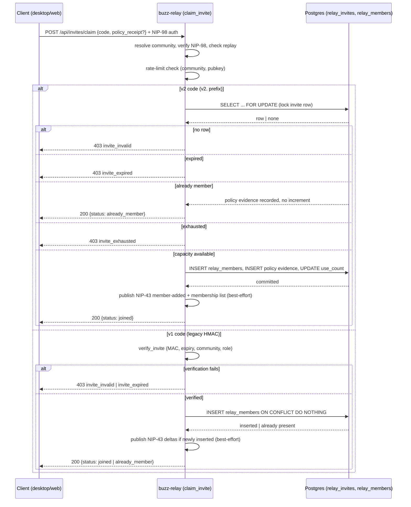

# Invite redemption: flow

A user (or the agent acting on their behalf) holds an invite code minted for one
community and wants to become a member of it. The trigger is a client — the
desktop app's onboarding flow or the browser `web` client's invite page — POSTing
that code to `POST /api/invites/claim` on the target relay, over a request the
client has signed with NIP-98 HTTP auth. The actors are the client (desktop or
web), the relay's `claim_invite` handler, and the `relay_invites` /
`relay_members` / `join_policy_acceptances` tables in Postgres. The flow
terminates in exactly one of: the caller becomes (or already is) a relay member,
or the claim is rejected for a specific, code-shaped reason.

## Sequence

1. The client builds the claim request — `{ code, policy_receipt? }` — and signs
   it with NIP-98 HTTP auth (desktop: `desktop/src/shared/api/invites.ts`; web:
   NIP-07 extension via `web/src/features/invite/invite-api.ts:22`).
2. `claim_invite` resolves the target community from the request's `Host` header
   and requires valid, non-replayed NIP-98 auth over the exact URL and body; a
   community that does not resolve, or auth that fails or replays, is rejected
   before any invite-code logic runs. (`crates/buzz-relay/src/api/invites.rs:230-260`)
3. The handler checks a rate limiter keyed by `(community, claimer_pubkey)` and
   rejects with HTTP 429 if the caller has claimed too many times too recently,
   independent of whether the code presented is valid. (`crates/buzz-relay/src/api/invites.rs:364-369`)
4. The handler parses the JSON body and routes by the code's literal prefix: a
   `v2.`-prefixed code takes the database-backed path (step 5); any other shape
   takes the legacy v1 HMAC path (step 6). (`crates/buzz-relay/src/api/invites.rs:377-383`)
5. **v2 path.** The code is shape-validated, then (if a join policy is
   configured) its receipt is verified, then it is hashed and
   `buzz_db::store::relay_invite::claim_relay_invite` runs one Postgres
   transaction: lock the invite row `FOR UPDATE`; no matching row →
   `Invalid`; `expires_at` passed → `Expired`; caller already a member →
   `AlreadyMember` (join-policy evidence still recorded, `use_count` untouched);
   `use_count >= max_uses` → `Exhausted`; otherwise insert the `relay_members`
   row, record join-policy evidence, and increment `use_count`, all in one commit.
   (`crates/buzz-relay/src/api/invites.rs:381-410`; `crates/buzz-db/src/store/relay_invite.rs:200-380`)
6. **v1 path (legacy).** `invite_token::verify_invite` constant-time-verifies the
   code's HMAC MAC, then checks expiry, community match, and that the granted
   role is `member`, in that order, before any database access.
   (`crates/buzz-relay/src/invite_token.rs:156-184`)
7. If the relay has a join policy configured, both paths require a
   `policy_receipt` bound to the same code string and reject with
   `join_policy_required` if it is missing or fails verification against the
   configured policy version — checked at line 387-394 on the v2 path, before
   the invite table is even touched, and at line 467-474 on the v1 path, after
   the code itself verifies.
   (`crates/buzz-relay/src/api/invites.rs:387-394, 467-474`)
8. On the v1 path only, a successful verification is handed to
   `claim_relay_membership`, which inserts the `relay_members` row if one does
   not already exist and reports whether the insert happened.
   (`crates/buzz-relay/src/api/invites.rs:476-489`)
9. On an actual new join (v1 insert, or v2 `Joined`), the handler publishes a
   NIP-43 member-added delta and a refreshed NIP-43 membership list,
   best-effort — a publish failure is logged and does not fail the claim.
   (`crates/buzz-relay/src/api/invites.rs:419-427` for v2,
   `crates/buzz-relay/src/api/invites.rs:491-502` for v1)
10. The handler returns one JSON body: `{ status, community_id, host, role }` on
    success (`status` is `joined` or `already_member`), or an error body with a
    specific `error` code (`invite_invalid`, `invite_expired`,
    `invite_exhausted`, `join_policy_required`) and the matching HTTP status on
    rejection.

## Diagram

## Outcome

**Success (`joined`).** The caller has a new `relay_members` row (role `member`,
`added_by = 'invite'`); on the v2 path the invite's `use_count` is incremented
inside the same commit; join-policy acceptance evidence exists if a policy was
configured; a NIP-43 member-added delta and refreshed membership list have been
published best-effort. (`crates/buzz-db/src/store/relay_invite.rs:312-380`)

**Success (`already_member`).** No new membership row is created and, on the v2
path, `use_count` is left unchanged; join-policy evidence is still recorded if a
policy is configured and the caller had not previously accepted it. No NIP-43
publish occurs — the caller was already visible in the membership list.
(`crates/buzz-relay/src/api/invites.rs:435-441` for the v2 response,
`crates/buzz-relay/src/api/invites.rs:505-510` for the shared v1 response;
`crates/buzz-db/src/store/relay_invite.rs:270-295, 341-354`)

**Failure: invalid code (`invite_invalid`, 403).** No invite row matches (v2:
`crates/buzz-db/src/store/relay_invite.rs:233-238`, surfaced at
`crates/buzz-relay/src/api/invites.rs:449-451`), the v2 code fails shape
validation (`crates/buzz-relay/src/api/invites.rs:381-383`), or MAC/shape
verification fails on the v1 code. No database write occurs. The v1 path
deliberately collapses every non-expiry failure to this one response so the
endpoint cannot be used to distinguish *why* a code failed.
(`crates/buzz-relay/src/api/invites.rs:456-465`)

**Failure: expired (`invite_expired`, 403).** Checked before the membership
check on the v2 path specifically so an expired invite cannot mint fresh
join-policy evidence even for an existing member; no write occurs on either
path. (`crates/buzz-db/src/store/relay_invite.rs:245-258`)

**Failure: exhausted (`invite_exhausted`, 403, v2 only).** `use_count` has
already reached `max_uses`; the transaction rolls back with no write. The v1
HMAC format carries no use-count concept, so this outcome does not exist on that
path. (`crates/buzz-db/src/store/relay_invite.rs:297-310`)

**Failure: join policy required (`join_policy_required`, 403).** The relay has a
configured join policy and the request's `policy_receipt` is absent or does not
verify; no invite-table write occurs on this rejection.
(`crates/buzz-relay/src/api/invites.rs:387-394, 467-474`)

**Failure: rate limited (429).** The per-`(community, pubkey)` limiter has
tripped; the request is rejected before the body is even parsed, so no invite
state changes. (`crates/buzz-relay/src/api/invites.rs:364-369`)

**Failure: authentication (401/403, pre-flow).** A missing/invalid/replayed
NIP-98 signature, or a `Host` header that resolves to no configured community,
is rejected by `authenticate()` before any invite-specific logic runs.
(`crates/buzz-relay/src/api/invites.rs:230-260`)

## Boundary

This node does not describe:

- **The standing structure of the relay, its Postgres store, or the desktop/web
  clients** — see `architecture-containers-relay`,
  `architecture-containers-postgres`, `architecture-containers-desktop`, and
  `architecture-containers-web` for what those containers are and how they are
  built. This node narrates only what moves between them during one redemption.
- **What "invites" as a capability lets a user or agent do**, at the
  product-stakeholder level (minting, sharing, revoking, and redeeming an
  invite as one coherent feature) — that is a separate `capabilities`-typed
  node's territory (tracked as issue #762), not yet drafted.
- **The invite-token data entity** — its stored shape, encoding, and the
  distinction between the v1 stateless HMAC token and the v2 opaque
  database-backed code as *data*, independent of the redemption flow that
  consumes it — that is a separate node's territory (tracked as issue #761),
  not yet drafted.
- **Invite expiry as its own concept** — the `expires_at` field's semantics,
  minting-time TTL bounds (`MIN_INVITE_TTL_SECS`, `DEFAULT_INVITE_TTL_SECS`,
  `MAX_INVITE_TTL_SECS`), and expiry as a standing property of an invite — that
  is a separate node's territory (tracked as issue #759), not yet drafted. This
  node cites expiry only as one branch this flow's own outcome can take.
- **Invite minting** (`mint_invite`) or join-policy administration
  (`accept_policy`, `mint_policy_acceptance`) as their own flows — this node
  narrates redemption only, and treats a `policy_receipt` as an input already
  in the caller's possession by the time redemption starts.
- **The general, durable contract of the `/api/invites/*` HTTP surface** —
  what operations exist, independent of this one scenario — is an
  `interfaces-events`-typed node's territory, not yet drafted.

## Relationships

- references: `architecture-containers-relay` — the relay container that hosts
  `claim_invite` and executes the redemption transaction.
- references: `architecture-containers-postgres` — the datastore holding
  `relay_invites`, `relay_members`, and `join_policy_acceptances`, the tables
  this flow reads and writes.
- references: `architecture-containers-desktop` — one of the two client
  actors that trigger this flow (onboarding).
- references: `architecture-containers-web` — the other client actor that
  triggers this flow (browser invite page, NIP-07 signed).

No `capabilities`-, `interfaces-events`-, or sibling `capabilities-invites-*`-typed
node exists yet in `origin/launchpad`'s corpus tree at the recorded revision
(confirmed directly: a repo-wide search of `launchpad/docs/corpus` for `^id:
capabilities-invites-` or `^id: capabilities-invite` returns nothing), so no
relationship targets the invite capability, invite-token, or invite-expiry nodes
described in *Boundary* above — those edges belong on this node (or on theirs)
once one of them merges.

## Scope and omissions

**This node covers** the invite-redemption HTTP flow end to end: the client
request, NIP-98 authentication and replay/rate-limit gating, the v2
database-backed claim transaction and the legacy v1 HMAC-verified path, the
join-policy-receipt precondition, the NIP-43 best-effort side effects on an
actual new join, and every outcome (success and rejection) each path can
produce, each grounded in the code that produces it.

**It does not cover, and these are gaps rather than silence:**

| Not covered here | Owned by |
|---|---|
| What "invites" as a product capability lets a user/agent do | issue #762 (capability, not yet drafted) |
| The invite-token data entity (v1 vs v2 shape/encoding) | issue #761 (data entity, not yet drafted) |
| Invite expiry as a standing concept and its TTL bounds | issue #759 (concept, not yet drafted) |
| Invite minting and join-policy administration flows | not yet drafted as their own flow nodes |
| The `/api/invites/*` HTTP surface's general, durable contract | an `interfaces-events`-typed node, not yet drafted |
| The relay's, Postgres's, desktop's, and web's own standing structure | `architecture-containers-relay`/`-postgres`/`-desktop`/`-web` |

**Expected but not verified when this node was written:**

- **The `buzz-cli` agent-facing CLI has no invite-redemption subcommand.** A
  repository-wide search for `claim_invite`, `invites/claim`, or a
  redeem/claim-shaped command under `crates/buzz-cli/src/` returned nothing,
  so this flow appears reachable only from the desktop and web clients today —
  this was checked, not assumed, but no design document confirming that
  omission is deliberate was found.
- **The exact HTTP status codes for each JSON `error` code** (`invite_invalid`,
  `invite_expired`, `invite_exhausted`, `join_policy_required`) were read from
  the handler's `api_error(StatusCode::..., ...)` call sites inline in the code
  cited above, not cross-checked against a separate API reference document,
  because no such document exists yet for this endpoint.
- **Whether the v1 HMAC path is still reachable in production**, versus being
  retained only for backward compatibility with already-issued v1 codes, was
  not established from a changelog, decision record, or deprecation notice —
  only from the code itself still implementing and routing to it.
