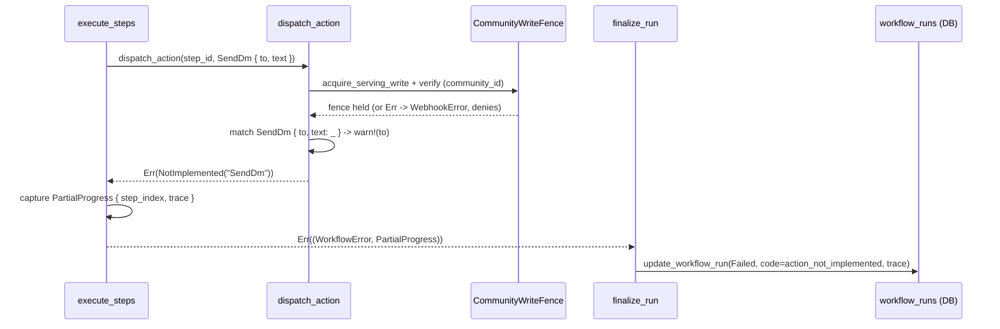

# Send DM action: workflow step

A `send_dm` step is one of seven action types a `buzz-workflow` step can declare
(`ActionDef::SendDm { to, text }`), reachable from any of the engine's five trigger
types once a workflow run advances to a step whose `action: send_dm`. Its
intended purpose — sending a direct message to a user as a workflow side
effect, in parallel with the already-implemented `send_message` (post to a
channel) action — is not realized in code today: **every `send_dm` step fails
its run**, unconditionally, the moment it is dispatched. This node documents
the step's actual current behavior — its preconditions, the trust boundary it
crosses before failing, and its failure outcome — not the DM-sending behavior
its name and doc comment describe as intended.

## Trigger and preconditions

A `send_dm` step is reached only after several preconditions already hold for
the containing run, none of them specific to `send_dm` itself:

1. **The workflow definition parses and validates.** `SendDm` requires both
   `to` and `text` as non-optional strings at the schema level, but
   `WorkflowDef::validate()` performs no `send_dm`-specific check — no format
   check on `to` (which may be a raw pubkey hex string or a template
   placeholder like `{{trigger.author}}`), and no requirement that `to` be
   non-empty after template resolution (`crates/buzz-workflow/src/schema.rs:109-115,171-278`).
2. **The step is not classified as requiring elevated authority.**
   `WorkflowDef::requires_elevated_authority()` matches only
   `ActionDef::CallWebhook`; a definition whose only action is `send_dm` does
   not force the owner/admin role gate that a `call_webhook`-containing
   definition does (`crates/buzz-workflow/src/schema.rs:157-169`).
3. **SEC-006's fail-closed pre-run authority gate passes.** Before a run is
   created at all, `check_owner_authority` rechecks that the workflow's owner
   is *currently* an active member of the workflow's channel — any lookup
   failure or removed-owner condition skips the trigger outright. Because
   `send_dm` is not elevated (point 2), an ordinary `member` role is
   sufficient; only a `call_webhook`-containing definition would additionally
   require `owner`/`admin` (`crates/buzz-workflow/src/lib.rs:135-171,387-420,1018-1035`).
4. **The step's own `if:` condition (if any) evaluates true**, and template
   resolution of `to` and `text` against the trigger context and prior step
   outputs succeeds — both handled identically to every other action type,
   upstream of the action-specific dispatch this node covers.
5. **A concurrency permit is available** on the engine's run semaphore;
   otherwise the run fails closed with `WorkflowError::CapacityExceeded`
   before any step, `send_dm` included, is dispatched.

## Ordered interactions

Once the preconditions above hold and execution reaches a `send_dm` step:

1. `execute_steps` calls `dispatch_action(step_id, &ActionDef::SendDm { to, text }, ...)`
   under the step's configured timeout (`crates/buzz-workflow/src/executor.rs:1220-1231`).
2. `dispatch_action` unconditionally acquires and verifies the community's
   durable "serving write" fence — this happens for every action, before the
   per-action `match`, and a storage failure here is treated as a denial, not
   as permission to continue (`crates/buzz-workflow/src/executor.rs:546-562`).
3. The `match` reaches the `SendDm { to, text: _ }` arm: it logs a `warn!`
   naming the recipient (`to`) only — the message `text` is never logged, and
   is never read at all (`text` is bound as `text: _`) — then immediately
   returns `Err(WorkflowError::NotImplemented("SendDm".into()))`. No Nostr
   event is constructed, no `ActionSink` method is invoked, because
   `ActionSink` has no `send_dm` method to call in the first place
   (`crates/buzz-workflow/src/executor.rs:643-647`;
   `crates/buzz-workflow/src/action_sink.rs:48-73`).
4. `execute_steps` catches this as `Err((WorkflowError, PartialProgress))`,
   where `PartialProgress` carries the failing step's index and the trace of
   steps completed/skipped strictly before it — the failing `send_dm` step
   itself is never added to that trace
   (`crates/buzz-workflow/src/executor.rs:1233-1254`;
   `crates/buzz-workflow/src/error.rs:5-15`).
5. `WorkflowEngine::finalize_run` — the single place every execution path
   (event-triggered, manual/webhook trigger, approval resume) maps a result to
   a database update — persists this as `RunStatus::Failed`, with failure code
   `"action_not_implemented"` (`WorkflowError::code()`) and message
   `"action not implemented: SendDm"` (`WorkflowError::NotImplemented`'s
   `Display` impl), storing only the partial trace from before the failure
   (`crates/buzz-workflow/src/lib.rs:213-303`;
   `crates/buzz-workflow/src/error.rs:63-65,70-83,109-112`).

## Diagram

## Outcome

**There is no success path.** Every `send_dm` step dispatch, regardless of
its `to`/`text` values or the preceding steps' results, returns
`Err(WorkflowError::NotImplemented("SendDm"))` from `dispatch_action`
(`crates/buzz-workflow/src/executor.rs:643-647`).

**Failure/outcome state:** the workflow run row transitions to
`RunStatus::Failed`, with `failure.code = "action_not_implemented"` and
`failure.message = "action not implemented: SendDm"`, `step_index` set to the
index of the `send_dm` step, and `execution_trace` holding only the entries
for steps completed or skipped strictly before it
(`crates/buzz-workflow/src/lib.rs:278-303`).

**No rollback of prior steps.** `finalize_run`'s failure branch only updates
the run's own status row; it contains no call that un-publishes or otherwise
compensates for a Nostr event a prior step in the same run already sent via
`ActionSink` (for example, a preceding `send_message` step). If a workflow
runs `send_message` then `send_dm`, the channel message from the first step
stays published even though the run as a whole is recorded as failed
(`crates/buzz-workflow/src/lib.rs:213-303`).

## Authentication / authorization / trust-boundary crossings

The only trust-boundary crossing a `send_dm` step's dispatch actually reaches
today is the durable community "serving write" fence check
(`crates/buzz-workflow/src/executor.rs:546-562`) — a re-validation, immediately
before any external side effect, that the workflow's community has not been
deleted/fenced off since the run started; a storage failure there denies
rather than permits. Upstream of dispatch, the SEC-006 owner-authority gate
(`crates/buzz-workflow/src/lib.rs:135-171`) also applies to the run as a
whole, but treats `send_dm` as an ordinary (non-elevated) action, so it does
not by itself require the workflow owner to hold `owner`/`admin` role — only
active channel membership. No further boundary is crossed for `send_dm`,
because the code returns before reaching any Nostr event construction,
signing, or relay-publish boundary that a working implementation would need
(`ActionSink` has no `send_dm` method to cross into —
`crates/buzz-workflow/src/action_sink.rs:48-73`).

## Boundary

This node does not describe:
- **The workflow engine's overall trigger/execution machinery** (the three
  trigger paths, the run loop, the concurrency semaphore) — see
  `architecture-flows-workflow-execution`, which this node `references`
  rather than restates.
- **What the workflow engine can do as a product-level capability** (e.g.
  "workflows can post messages and send DMs") — that is a capability-shaped
  statement this node does not make; this node narrates one action step's
  actual dispatch behavior.
- **The `send_message` action**, which is implemented and shares the same
  `dispatch_action` entry point and community-fence crossing but actually
  publishes a Nostr event via `ActionSink::send_message`
  (`crates/buzz-workflow/src/executor.rs:567-641`) — a different, working
  code path, not covered here beyond the shared fence check.
- **The eventual wire contract of a real DM-sending implementation** (e.g.
  which Nostr kind or NIP-17 gift-wrap shape WF-07 will use) — that contract
  does not exist in code yet, so this node makes no claim about it beyond the
  `// TODO (WF-07): emit DM event.` marker
  (`crates/buzz-workflow/src/executor.rs:645`).
- **Human-facing instructions for authoring a workflow YAML file** — that is
  procedure/reference territory, not this flow-shaped node's subject.

## Relationships

- `references: architecture-flows-workflow-execution` — the merged node
  documenting the workflow engine's trigger paths and run loop that a
  `send_dm` step's containing run is dispatched from; this node narrates one
  action-dispatch detail within that larger flow rather than restating it.

## Scope and omissions

**This node covers** the preconditions that must hold before a `send_dm`
workflow step is dispatched, the ordered interactions its dispatch actually
performs (community-fence check, then an immediate not-implemented failure),
the trust-boundary crossing it reaches, and its failure/outcome behavior
including the absence of rollback for prior steps' side effects.

**It does not cover, and these are gaps rather than silence:**

| Not covered here | Owned by |
|---|---|
| The workflow engine's overall trigger/execution machinery | `architecture-flows-workflow-execution` |
| The implemented `send_message` action's own dispatch and event-publish behavior | a future sibling node (not yet drafted) |
| What DM-sending will look like once WF-07 lands | not yet in code; a future node once implemented |
| How to author a workflow YAML definition | procedure/reference documentation (not yet drafted) |

**Expected but not verified when this node was written:**
- **Whether a WF-07 implementation is in progress on any branch** was not
  checked beyond the TODO comment and the `NotImplemented` error path in the
  code at the recorded revision; this node describes the shipped behavior at
  that revision only.
- **The two additional `check_owner_authority` call sites outside
  `buzz-workflow` itself** (`crates/buzz-relay/src/api/bridge.rs` and
  `crates/buzz-relay/src/handlers/command_executor.rs`, found via a symbol
  search) were not opened and read for this node — the SEC-006 precondition
  claim above rests only on the event-triggered path in
  `crates/buzz-workflow/src/lib.rs`, which was read directly, not on those
  two additional call sites.
