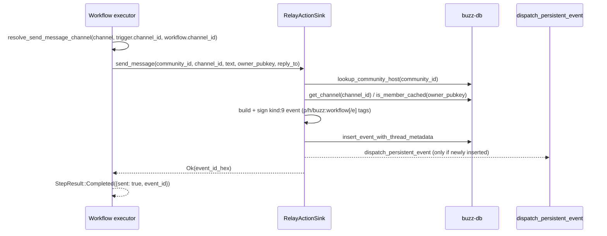

# SendMessage action: flow

The `send_message` workflow action posts a channel message on behalf of a
workflow's owner -- either as a new top-level message or as a threaded reply
to the event that triggered the run -- and is dispatched from within the
shared step loop `architecture-flows-workflow-execution` already documents.
It is the only one of the three message/channel-mutating actions
(`SendMessage`, `SendDm`, `SetChannelTopic`) that is actually implemented
today; the other two immediately fail with `NotImplemented`.

## Trigger, preconditions, termination/outcome

**Trigger.** A running workflow's step loop (`execute_steps`, documented by
`architecture-flows-workflow-execution`) reaches a step whose `action` is
`send_message`, its `if:` condition (if any) evaluated true, and its
templates already resolved.

**Preconditions, checked in order:**

1. **Definition-time (`WorkflowDef::validate`).** `reply_in_thread: true` is
   rejected outright unless the workflow's trigger is `message_posted`,
   `reaction_added`, or `diff_posted` -- a `schedule` or `webhook` trigger has
   no triggering message to reply to, so this is refused before the
   definition can even be saved, not discovered at run time.
2. **Channel resolution (`resolve_send_message_channel`), at dispatch time.**
   A workflow bound to a channel always targets that channel; a step-level
   `channel` override is accepted only if it parses to the *same* UUID and is
   otherwise rejected. An unbound workflow uses a valid explicit override if
   given, else falls back to the triggering event's own channel. An unbound
   workflow with neither an override nor a trigger channel is rejected rather
   than silently posting nowhere.
3. **Reply target, if `reply_in_thread` is set.** The dispatcher requires
   `trigger_ctx.message_id` to be non-empty; schema validation (step 1) is
   what is supposed to guarantee this can only be reached from a
   message-based trigger, so an empty id here is a real fault rather than an
   expected case.
4. **Community write fence.** Immediately before dispatch, the executor
   re-acquires and verifies a durable community write fence and runs the
   entire action match (including this one) inside it, because the engine
   instance can outlive the request that spawned it.
5. **Relay-side (`RelayActionSink::send_message`).** Text must not be empty
   or whitespace-only; the channel must exist and not be archived; the
   workflow owner must be a member of the destination channel unless its
   visibility is `"open"`.

**Termination/outcome.** On success the step returns
`StepResult::Completed({"sent": true, "event_id": <hex>})`, addressable to
later steps as `steps.<id>.output.event_id`. On any precondition failure the
step -- and, because `SendMessage` has no compensating action, the run's
remaining steps -- aborts; see *Failure, abort, rollback* below for the exact
error shapes.

## Ordered interactions and data/state movement

1. `dispatch_action` matches the resolved `ActionDef::SendMessage { text,
   channel, reply_in_thread }` and loads the `workflow_run` then `workflow`
   row, both scoped to `(community_id, run_id)` -- a bare-id lookup could
   otherwise load the wrong row if the same run/workflow UUID exists in
   another community.
2. `resolve_send_message_channel` runs (see preconditions above), producing
   a canonical channel UUID string. The workflow owner's pubkey is hex-encoded
   from the loaded `workflow` row.
3. If `reply_in_thread`, the trigger's `message_id` becomes the reply target;
   otherwise there is none.
4. `engine.action_sink()?.send_message(community_id, &channel_id, text,
   &owner_pubkey_hex, reply_to)` is awaited -- calling into
   `RelayActionSink`, the relay's own implementation of the `ActionSink`
   trait (a direct DB/event-construction path that replaced an earlier HTTP
   loopback which failed with 401 auth errors).
5. `RelayActionSink::send_message`:
   a. Resolves the run's owning community to a host and builds a
      `TenantContext` from it -- the message is posted under *that*
      community, never a request-derived or default tenant.
   b. Validates `text` is not empty/whitespace-only, parses and canonicalizes
      the channel UUID, loads the channel row (`ChannelNotFound` /
      `ChannelArchived` as appropriate), and checks the author is a member
      unless the channel is `"open"`.
   c. Builds tags: `p` (author attribution), `h` (NIP-29 channel scope),
      `buzz:workflow=true` (anti-recursion marker -- see *Trust-boundary
      crossings*); when replying, NIP-10 `root`/`reply` `e` tags resolved
      from the parent's real thread ancestry; and one further `p` tag per
      distinct `@Name` mention in `text` that resolves unambiguously to a
      named member of the destination channel (skipping the author).
   d. Signs a `kind:9` event with the *relay's* keypair (not the owner's),
      persists it via `insert_event_with_thread_metadata`, and, only if the
      row was newly inserted (idempotency guard), fans it out via
      `dispatch_persistent_event` and, for a threaded reply, emits a live
      thread-summary update so open clients refresh reply counts.
6. The event id (hex) is returned up the call chain and recorded as the
   step's `event_id` output.

## Diagram

## Trust-boundary crossings

- **Owner attribution, relay signature.** The emitted event is signed by the
  *relay's* keypair, not the workflow owner's -- the owner is only named via
  the `p` attribution tag. A reader of the channel sees a relay-signed
  message carrying the owner's pubkey as metadata, not a message
  cryptographically signed by the owner.
- **Community confinement.** The destination community is the *run's own*
  owning community, resolved from `community_id` -- never re-derived from any
  inbound request context -- so a workflow running in community B cannot be
  made to post into a different community's channel by this path.
- **Channel-membership check, with an `"open"`-channel exception.** The
  relay-side sink denies the send unless the workflow owner is a member of
  the destination channel, *except* when the channel's own visibility is
  `"open"`, in which case membership is not required.
- **Channel-binding confinement.** A workflow bound to one channel cannot be
  redirected to a different channel by a step-level `channel` override -- a
  mismatch is rejected as an invalid definition, not silently honored or
  silently ignored.
- **Anti-recursion tag, not kind-based.** The emitted `kind:9` event is an
  ordinary message kind, not a reserved workflow-execution kind, so it is
  *not* excluded from re-triggering workflows by kind alone. Exclusion
  instead depends on the relay's post-store handler recognizing **both** that
  the event's pubkey equals the relay's own keypair **and** that it carries a
  `buzz:workflow` tag -- an event that happened to carry that tag from
  another source, signed by the relay keypair, would be treated the same way;
  this document does not trace whether any other relay-signed path could
  produce that combination.
- **No elevated authority required.** Unlike a step containing `call_webhook`
  (which requires owner/admin authority because it can exfiltrate channel
  content externally), a workflow containing only `send_message` steps needs
  only ordinary active-member authority to save and run.

## Failure, abort, rollback behavior

- **Definition-time rejection.** `reply_in_thread: true` on a
  schedule/webhook-triggered workflow is refused at save time
  (`InvalidDefinition`), never reaching a run.
- **Channel-resolution failure.** A mismatched channel override for a bound
  workflow, or no resolvable channel at all for an unbound one, aborts the
  step with `InvalidDefinition` before any network or database call is made
  to post the message.
- **Missing reply target.** `reply_in_thread: true` with an empty
  `trigger_ctx.message_id` aborts with `InvalidDefinition` -- a defensive
  check for a state schema validation is supposed to prevent.
- **Every relay-side failure surfaces as `webhook_failed`.** All six
  `ActionSinkError` variants (`InvalidInput`, `ChannelNotFound`,
  `ChannelArchived`, `EventBuild`, `Database`, `EmptyContent`) are converted
  to `WorkflowError::WebhookError` by one blanket `From` impl, and
  `WorkflowError::code()` maps that variant to the stable string
  `"webhook_failed"` -- the *same* run-level `error_code` an unrelated
  `call_webhook` step's own failure would persist. A reader of a failed run's
  `error_code` alone cannot distinguish a `SendMessage` failure (empty
  content, missing channel, archived channel, non-member author) from a
  `CallWebhook` failure without also reading the row's diagnostic text.
- **No compensation on partial failure.** Consistent with
  `architecture-flows-workflow-execution`'s documented run-wide rule, a
  `SendMessage` step that already published its event before a *later* step
  fails is not undone -- the message stands regardless of the run's eventual
  outcome.
- **Fail-closed action-sink wiring.** If no `ActionSink` was ever registered
  on the engine, dispatch fails with `InvalidDefinition` rather than
  panicking; this path's reachability in the deployed relay (which is
  expected to always wire one at startup) was not traced for this node.
- **No known functional bug found.** Unlike a sibling action this Feature's
  batch separately found to call a non-existent endpoint, `SendMessage`
  reaches the relay through the same direct DB/event-construction path
  (`RelayActionSink`) the REST message-send handler uses, not an HTTP
  loopback -- the `ActionSink` trait's own doc comment states this
  replaced an earlier loopback that failed with 401 errors. No call to a
  missing route or non-existent method was found while reading this path.
- **Representative verification:**
  - `send_message_uses_bound_workflow_channel_by_default`,
    `send_message_rejects_cross_channel_override_for_bound_workflow`,
    `send_message_canonicalizes_valid_explicit_override_for_global_workflow`
    (`crates/buzz-workflow/src/executor.rs`) -- the three channel-resolution
    cases.
  - `validate_accepts_reply_in_thread_on_message_triggers`,
    `validate_rejects_reply_in_thread_on_schedule_trigger`,
    `validate_rejects_reply_in_thread_on_webhook_trigger`
    (`crates/buzz-workflow/src/schema.rs`) -- the `reply_in_thread`
    definition-time precondition.
  - No unit test was found for the fourth channel-resolution case (unbound
    workflow, no override, no trigger channel) reaching its `InvalidDefinition`
    error, nor for `RelayActionSink::send_message`'s own error branches
    (`ChannelNotFound`, `ChannelArchived`, non-member rejection) -- these are
    exercised, if at all, only by higher-level integration coverage this node
    did not locate.

## Boundary

This node does not describe:
- **The encompassing multi-trigger workflow-execution flow** -- trigger
  matching, condition evaluation, template resolution, the concurrency
  semaphore, and the other four action types' own behavior. See
  `architecture-flows-workflow-execution` (this node's `part-of` target).
- **The `SendDm` action** (tracked separately, `launchpad-26/buzz#833`, not
  yet drafted at this revision) -- it is defined in the same `ActionDef` enum
  but always fails as `NotImplemented`; this node only establishes that fact
  in passing, not its own eventual behavior.
- **The wire contract of Nostr `kind:9` itself** as its own event-kind node
  -- no such node is merged at this revision. This node only describes how
  this one action path constructs and emits that kind.
- **The `@Name` mention-resolution algorithm's own edge cases** in full --
  its matching rules (members-only, exact case-insensitive name, ambiguous
  names wake no one) are named above but not exhaustively re-derived; the
  fullest account is the function's own doc comment and unit tests in
  `crates/buzz-relay/src/workflow_sink.rs`.
- **Any capability-level statement of what the workflow engine lets a user or
  agent do** -- no `type: capabilities` node for the workflow engine as a
  whole is merged at this revision to `references` instead.

## Relationships

- `part-of`: `architecture-flows-workflow-execution` -- this node documents
  one action step's own behavior within the larger flow that node already
  covers end to end.
- `implements`: `corpus-template-flow` -- this node's required sections
  (Flow statement, Sequence, Diagram, Outcome, Boundary) follow that merged
  template.

## Scope and omissions

**This node covers** the `send_message` workflow action's own preconditions,
step-by-step dispatch path (executor through `RelayActionSink`), the trust
boundaries it crosses (relay-signed attribution, community confinement,
membership/visibility check, channel-binding confinement, the tag-based
anti-recursion mechanism), and its failure/abort behavior, including the
`webhook_failed` error-code collision documented above.

**It does not cover, and these are gaps rather than silence:**

| Not covered here | Owned by |
|---|---|
| The encompassing multi-trigger workflow-execution flow | `architecture-flows-workflow-execution` |
| The `SendDm` action | `launchpad-26/buzz#833` (not yet drafted) |
| The `kind:9` event-kind's own wire contract | not yet a merged corpus node |
| The workflow engine as a product-level capability | not yet a merged corpus node |
| The front-matter contract itself | `launchpad/docs/corpus/schema/node.schema.json` |
| Creating, updating and retiring a node procedurally | `launchpad/docs/corpus/AGENTS.md` |

**Expected but not verified when this node was written:**

- Whether `RelayActionSink::send_message`'s own error branches
  (`ChannelNotFound`, `ChannelArchived`, the non-member rejection) or the
  fourth `resolve_send_message_channel` case are exercised by any
  integration test was searched for and not found; see *Representative
  verification* above.
- Whether the relay's startup sequence always calls `set_action_sink` before
  any workflow can run (making the `action_sink not initialized` path
  practically unreachable in production) was not traced.
- Whether any relay-signed event path *other than* `RelayActionSink` could
  produce a `buzz:workflow`-tagged event and interact with the
  anti-recursion check in `crates/buzz-relay/src/handlers/event.rs` was not
  exhaustively searched.
- Line numbers cited throughout are structural pins at the recorded revision;
  per `AGENTS.md`, `validate.py` checks that a cited file exists but never
  checks a cited line number against the file's length, so a line citation
  here is a locator, not an independently re-verified guarantee.
