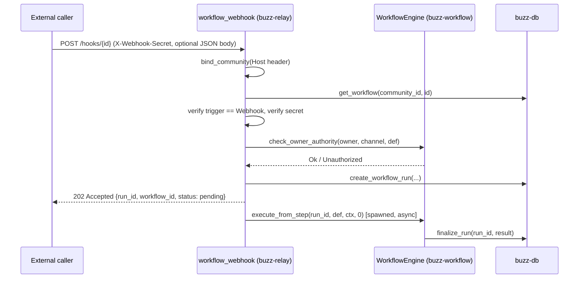

# Webhook trigger

How an external system starts a Buzz workflow run over HTTP, without ever holding a
relay session: a `POST` to `/hooks/{id}`, authenticated by a per-workflow shared
secret rather than a signed Nostr event or a user session. This is the *inbound*
direction only -- an external caller reaching in to fire a workflow. The *outbound*
direction, where a running workflow calls out to an external URL (the `call_webhook`
action), is sibling issue #836's own subject and is not covered here.

**Scope.** This node covers the `POST /hooks/{id}` handler
(`api::bridge::workflow_webhook`) end to end: what it requires before firing a run,
the order it checks those requirements in, where trust boundaries are crossed, and
what happens on every rejection path. It does not re-derive the channel-event or
schedule trigger paths, the shared step executor, or workflow-definition
authoring/validation as a general subject -- `architecture-flows-workflow-execution`
already covers all three trigger paths and the shared executor, and this node
`references` it rather than restating that content.

## Trigger, preconditions, termination

**Trigger.** An HTTP `POST /hooks/{id}` request, where `{id}` is the workflow's UUID.
This is the only channel through which a `TriggerDef::Webhook`-configured workflow
can ever run -- it is never fired by a channel event (see *Ordered interactions*
below) and never by the schedule loop.

**Preconditions, in the order the handler checks them** (every one fails to the
generic response described in *Outcome* below, not to a partial or best-effort run):

1. `{id}` parses as a UUID.
2. The request's `Host` header binds to a known community (`bind_community`) --
   an empty, unmapped, or lookup-failing host is indistinguishable from every other
   failure in this list.
3. A workflow exists under that UUID *in the bound community* -- the same UUID
   existing in a different community's tenant is not a match.
4. The stored definition's trigger is `TriggerDef::Webhook` -- a workflow configured
   for a different trigger type cannot be fired through this door.
5. A per-workflow shared secret is configured, and the caller supplied a matching one
   (`X-Webhook-Secret` header, or `?secret=` query parameter as a fallback).
6. The workflow is `enabled` and its stored `status` is `Active`.
7. The workflow has a bound `channel_id` -- an unbound webhook-triggered workflow has
   no channel to check authority against, and is rejected on that basis alone.
8. The workflow's owner currently holds sufficient authority in that channel
   (`check_owner_authority`, re-checked at fire time, never trusted from save time).

A workflow can only ever reach preconditions 5-8 if it was *saved* with
`TriggerDef::Webhook` in the first place, which is itself gated by
`WorkflowDef::validate()` rejecting a `reply_in_thread: true` step under a trigger
with no triggering message (see *Secret lifecycle* below for the save-time secret
handling this implies).

**Termination / outcome.** Success creates a `workflow_runs` row and returns
`202 Accepted` with `{run_id, workflow_id, status: "pending"}` before the run has
executed a single step -- the HTTP response never reflects the run's eventual
`Completed`/`Failed` state. Every precondition failure above returns a fixed HTTP
status with no run ever created: `400` for a malformed UUID, a missing/invalid JSON
body, or a trigger-type mismatch; `401` for a missing configured secret or a wrong
one; the same generic `404` for an unmapped host, a nonexistent workflow, a
wrong-tenant workflow, a disabled/non-Active workflow, an unbound workflow, or a
denied owner-authority check.

## Ordered interactions and data/state movement

1. Parse `{id}` as a UUID; `400` on failure.
   (`crates/buzz-relay/src/api/bridge.rs:2008-2009`)
2. Bind the request to a community from its `Host` header, before any workflow
   lookup; unmapped/failed bind → generic `404`.
   (`crates/buzz-relay/src/api/bridge.rs:2011-2024`;
   `crates/buzz-relay/src/tenant.rs:71-92`)
3. Look up the workflow scoped to that community; not found → `404`. Parse its stored
   definition; reject with `400` if its trigger is not `Webhook`.
   (`crates/buzz-relay/src/api/bridge.rs:2027-2041`)
4. Extract the stored secret from the definition; compare it (header, then query
   param) against what the caller supplied. No stored secret, or a mismatch → `401`.
   (`crates/buzz-relay/src/api/bridge.rs:2043-2065`;
   `crates/buzz-relay/src/webhook_secret.rs:71-89`)
5. Parse the optional JSON body; `400` on invalid JSON. Copy its top-level fields into
   `TriggerContext.webhook_fields`; set `channel_id` from the workflow's own bound
   channel (never from the request).
   (`crates/buzz-relay/src/api/bridge.rs:2067-2094`)
6. Re-check `enabled`/`Active` status, presence of a bound channel, and current owner
   authority. Any failure → the same generic `404` used for a nonexistent workflow.
   (`crates/buzz-relay/src/api/bridge.rs:2096-2114`;
   `crates/buzz-workflow/src/lib.rs:148-171`, `:1029-1035`)
7. Create the `workflow_runs` row, spawn `execute_from_step` (step 0) asynchronously,
   and return `202 Accepted` with `{run_id, workflow_id, status: "pending"}`
   immediately -- the spawned task's own eventual success or failure is invisible to
   this HTTP response.
   (`crates/buzz-relay/src/api/bridge.rs:2116-2174`)

**Secret lifecycle (save time, a separate request from the steps above).** When an
owner saves a workflow definition (`kind:30620` command) whose trigger is
`TriggerDef::Webhook`: if the workflow had no stored secret yet, one is generated
(`generate_webhook_secret`, a UUIDv4) and returned to the caller once, in that save's
own response; if a secret already exists, it is re-extracted and re-injected
unchanged, and is *not* returned again. The secret is stored inside the definition
JSON under `"_webhook_secret"`.
(`crates/buzz-relay/src/handlers/command_executor.rs:714-733`, `:800-806`;
`crates/buzz-relay/src/webhook_secret.rs:22-28`, `:30-41`, `:43-50`)

## Diagram

## Boundary

This node does not describe:

- The channel-event and schedule trigger paths, or the shared step executor they
  share with the webhook path -- see `architecture-flows-workflow-execution`.
- The outbound `call_webhook` action, where a running workflow reaches an
  operator-supplied external URL -- see sibling issue #836
  (`capabilities/workflows/webhook-action.md`).
- Workflow-definition authoring/validation as its own subject, beyond the two
  webhook-specific preconditions this node states (`reply_in_thread` rejection,
  secret generation on save).
- Whether `webhook_secret::strip_secret` is actually applied anywhere a stored
  definition is returned to a caller -- see *Scope and omissions*.

## Relationships

- `references`: `architecture-flows-workflow-execution` -- the flow node this
  document narrows from; it owns the full three-trigger-path and shared-executor
  narrative this node does not restate.

## Scope and omissions

**This node covers** the `POST /hooks/{id}` webhook trigger end to end: its
preconditions and their order, the data that moves from the HTTP request into the
run's trigger context, the trust boundaries it crosses (tenant binding, shared-secret
authentication, owner authority), its termination outcomes on both the success and
every rejection path, and the webhook-specific secret lifecycle at workflow-save
time.

**It does not cover, and these are gaps rather than silence:**

| Not covered here | Owned by |
|---|---|
| The channel-event and schedule trigger paths; the shared step executor | `architecture-flows-workflow-execution` |
| The outbound `call_webhook` action | issue #836 (`webhook-action`) |
| Workflow definition authoring/validation as a general subject | not yet drafted in this batch |
| Workflow run states and concurrency limits in general | issue #841 (`workflow-run`), issue #838 (`workflow-concurrency`) |

**Expected but not verified when this node was written:**

- **No test in this repository was found that directly exercises `POST /hooks/{id}`.**
  The one webhook-shaped workflow YAML in the test suite is fired through the
  `kind:46020` command door instead, per its own comment -- the handler's behavior
  here rests on reading `bridge.rs` directly, not on a passing integration test
  covering the HTTP door itself.
- **Whether `webhook_secret::strip_secret` is wired into any response path that
  returns a stored workflow definition was not established.** It is defined and
  unit-tested, but no call site was found in `crates/buzz-relay/src` outside its own
  module and tests; whether a raw `_webhook_secret` could currently leak through some
  other endpoint that returns a workflow's definition JSON was not traced.
- **Rate limiting or abuse protection on `/hooks/{id}` was not checked.** This node
  only establishes the authentication and authorization checks the handler performs,
  not whether any request-rate control exists in front of it.
