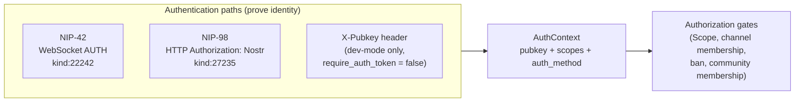

# Authentication

How a party interacting with a Buzz relay -- a human client, a desktop/mobile app, an
agent, or an automated integration -- proves its identity, and what that proof does and
does not grant it. This is the category-level concept node for authentication in Buzz;
it defines the shared shape and states the boundary against the specific mechanisms and
flows that implement it, rather than duplicating their mechanics.

## Definition

**Authentication in Buzz is proof of control over a Nostr keypair, established by a
Schnorr signature over a purpose-built event, with no password, session cookie, JWT, or
external identity provider involved at any point.** A party authenticates by signing an
event of a kind reserved for that purpose (kind:22242 for NIP-42, kind:27235 for
NIP-98) with the private key matching the pubkey it claims, and the relay verifies that
signature -- and a small set of freshness and binding checks alongside it -- before
admitting the connection or request. `buzz-auth`'s own module documentation states this
explicitly as a security invariant: no JWT validation, no token management, no IdP
runtime dependency.

**What authentication proves, and what it does not.** A successful authentication
proves *who signed*, nothing more. It answers "which pubkey is this." It does not by
itself decide whether that pubkey may read a given channel, write to it, or perform an
administrative action -- those are authorization questions, answered separately by
`Scope` grants and by community/channel membership checks that run after
authentication succeeds, not as part of it. Conflating the two is the boundary this
document exists to draw: a valid signature is a necessary condition for access, never
a sufficient one.

**Disambiguation.** "Auth" in this corpus and in the Buzz source tree is used loosely
for both authentication and authorization; this document is about the *authentication*
half only -- proving identity. The `AuthError` enum in `buzz-auth` mixes both kinds of
rejection in one type (`InvalidSignature` is an authentication failure;
`InsufficientScope` and `ChannelAccessDenied` are authorization failures), which is a
useful signal that the codebase itself treats them as one error surface even though
they are conceptually distinct gates.

## Background

Buzz's authentication design deliberately excludes the machinery most web systems
default to: no password store, no session table, no JWT issuance or refresh, no
external identity provider to depend on at runtime. `buzz-auth`'s module documentation
states this as a design invariant, not merely a current limitation. The reasoning
visible in the code is that a Nostr keypair is already the identity primitive every
other part of Buzz depends on (events are signed, pubkeys are the actor identity in
every kind), so authentication reuses that same primitive rather than introducing a
second identity system alongside it.

Two mechanisms exist because the relay has two distinct transports that each need
their own binding of a signature to a request: WebSocket connections are long-lived and
benefit from a challenge (preventing a captured signature from being replayed against a
different session), while individual HTTP requests are naturally per-request and NIP-98
binds the signature to the specific method, URL, and (optionally) body hash instead of
a server-issued challenge. A third path -- a raw `X-Pubkey` header -- exists but is
explicitly gated to development mode only, active exclusively when a community's
`require_auth_token` setting is `false`; it grants broad scopes (`Scope::all_known()`
or `Scope::all_non_admin()`) precisely because there is no real credential to derive
narrower ones from.

A fourth surface, API tokens, exists at the storage layer in `buzz-db` -- hashed,
community-scoped, with owner pubkey, name, granted scopes, optional channel
restriction, and optional expiry -- but at the recorded revision this document could
not confirm a request-time consumer of that table anywhere in `buzz-relay`'s HTTP
handlers (see *Scope and omissions* below for the specific discrepancy found and left
unresolved).

## Use cases

A reader needs this document when:

- **Adding a new HTTP or WebSocket handler** and needing to know which authentication
  state to check, and where authentication ends and authorization begins, before
  writing an access check.
- **Reviewing a diff that touches auth** and needing the shared vocabulary --
  `AuthContext`, `AuthMethod`, `Scope`, the fail-closed convention on database errors
  during ban/allowlist/membership checks -- without re-deriving it from source each
  time.
- **Onboarding to Buzz's security model** and needing the one-paragraph answer to "how
  does Buzz know who I am" before diving into either transport's specific flow.
- **Deciding where a new claim belongs**: whether it is about authentication itself
  (this node and its siblings) or about authorization/access control (a different,
  not-yet-written concept node) -- the *Definition* section above is the boundary to
  check against.

## Comparison

| Mechanism | Transport | Event kind | Freshness binding | Availability |
|---|---|---|---|---|
| NIP-42 | WebSocket | kind:22242 | Relay-issued challenge, +/-60s window | Always, on every WS connection |
| NIP-98 | HTTP | kind:27235 | Signed `created_at` (+/-60s), optionally a body-hash `payload` tag | Always, on the HTTP bridge and Blossom media surfaces |
| X-Pubkey header | HTTP | none (no signature) | none | Dev mode only, gated by `require_auth_token = false` |
| API token | HTTP (intended) | none (opaque hashed token) | Token expiry, not per-request freshness | Storage layer exists (`buzz-db`); no confirmed request-time consumer at the recorded revision |

## Related resources

- **`architecture-flows-websocket-authentication`** (linked via this node's
  `relationships`) -- the full NIP-42 challenge/response round trip: connection admission,
  the challenge, the client's signed response, the ban/allowlist/membership gates, NIP-OA
  delegation, and per-message-type enforcement. Read that node for WebSocket mechanics;
  this node does not repeat them.
- **NIP-98 HTTP Auth** -- not yet a corpus node. `crates/buzz-auth/src/nip98.rs` and
  `crates/buzz-auth/src/nip98_replay.rs` are its implementation; this document names it
  as an expected sibling node rather than describing its mechanics here, per this task's
  own instruction not to fold a second mechanism's detail into the category-level
  document.
- **API tokens** -- not yet a corpus node. `crates/buzz-db/src/api_token.rs` is its
  storage-layer implementation; see *Background* and *Scope and omissions* for the
  specific consumption-path discrepancy this document found and left open rather than
  resolving.
- **Bearer-token presentation of API tokens** -- not yet a corpus node, and, per the
  discrepancy recorded above, not yet confirmed wired into any HTTP handler at the
  recorded revision either. Expected to become its own sibling node once (or if) that
  wiring exists to document.
- **NIP-29 channel membership and moderation** -- not yet a corpus node. The
  relay-membership gate that follows authentication (see the linked flow node's *Trust-
  boundary crossings* section) is part of authorization, not authentication, and is out
  of this node's scope.

## Scope and omissions

**This document covers** what authentication means in Buzz across all its current
mechanisms, the shared result type (`AuthContext`) and shared invariants (no JWT/session/
IdP, fail-closed authorization checks, authentication proves identity but not access),
and the boundary against authorization. It intentionally stays at the category level.

**It does not cover, and these are gaps rather than silence:**

| Not covered here | Owned by |
|---|---|
| NIP-42 WebSocket challenge/response step-by-step mechanics | `architecture-flows-websocket-authentication` (already in the corpus) |
| NIP-98 HTTP Auth verification mechanics (timestamp tolerance, URL normalization, replay protection) | An expected future sibling node (not yet in the corpus) |
| API token lifecycle (minting, rotation, revocation) and its HTTP presentation | An expected future sibling node (not yet in the corpus) -- see the discrepancy below |
| NIP-29 channel membership, moderation, and the ban/allowlist gates that run after authentication | A separate authorization-focused node, not yet in the corpus |
| NIP-OA agent-to-owner delegation as an attestation format | Named but not detailed in the linked flow node; not yet its own corpus node |

**A discrepancy found and deliberately left open, not resolved:**
`crates/buzz-test-client/tests/conformance_multitenant.rs` asserts, in a doc comment
supporting a conformance test row, that API tokens are consumed at
`crates/buzz-relay/src/api/media.rs:638` via an `X-Auth-Token: buzz_*` header. At the
recorded revision that claim does not match the source: the string `X-Auth-Token`
appears nowhere outside that one comment, line 638 in `media.rs` is
`authenticate_media_read` (a Blossom/NIP-98 call, not API-token parsing), and the
`buzz-db` functions that would look up an API token by hash have no callers in
`buzz-relay` or `buzz-cli`. This document does not decide whether the comment is stale,
describes an unlanded follow-on, or was simply inaccurate when written -- per this
corpus's evidence discipline (`AGENTS.md`, `ADR-0029`), a conflict between what a test's
own commentary asserts and what the referenced source actually shows is recorded, not
silently resolved in either direction.

**Expected but not verified when this node was written:**

- **Whether a bearer-token HTTP consumer for API tokens exists anywhere outside
  `crates/`** (for example in `desktop/` or `mobile/` client code, or in infrastructure
  configuration) was not checked; this document's search was scoped to the Rust
  workspace.
- **Whether `type: layers` will still read as the best-fitting enum value once more
  `layers`-typed sibling nodes exist** to compare against -- at the recorded revision
  this is the first node under `launchpad/docs/corpus/layers/`, so there is no sibling
  precedent within that surface to check consistency against, only the cross-surface
  comparison against `architecture` recorded in the evidence ledger above.
