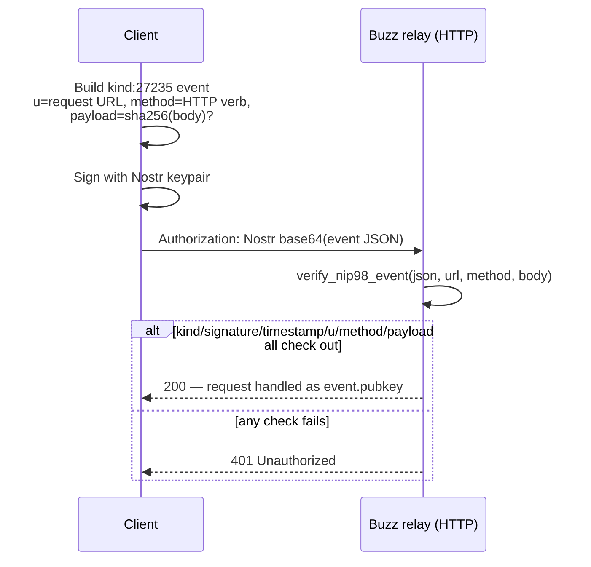

# NIP-98 Authentication

A short reference for how Buzz authenticates plain HTTP requests without a
WebSocket session, using the Nostr NIP-98 HTTP Auth event.

## Definition

**NIP-98 HTTP Auth is the stateless, per-request signed Nostr event (kind
27235, Buzz's `KIND_HTTP_AUTH`) that Buzz's relay verifies to authenticate an
HTTP request.** The client signs a short-lived kind:27235 event carrying the
exact request URL (`u` tag), the HTTP method (`method` tag), and optionally a
SHA-256 hash of the request body (`payload` tag), then sends it as an
`Authorization: Nostr <base64(JSON event)>` header. `verify_nip98_event` in
`crates/buzz-auth/src/nip98.rs` is the one function that performs this
check: it confirms the kind, the Schnorr signature and event-id hash, a
±60-second timestamp window, the `u` and `method` tags against the actual
request, and the optional body-hash tag — returning the signer's public key
on success.

**What it is not.** It is not a session or a cookie: a fresh event must be
signed for (in general) every request, since the `u` tag binds the signature
to one exact URL and the timestamp window is only ±60 seconds. It is not the
mechanism WebSocket connections use — those authenticate with NIP-42
(kind:22242), a separate challenge/response flow documented in the corpus as
`architecture-flows-websocket-authentication`. And it is not the event Buzz's
own Blossom media endpoints check: those verify a structurally similar but
distinct kind:24242 event (`verify_blossom_auth_event_for_verb`), not a
kind:27235 NIP-98 event.

## Use cases

A reader needs this node when they are implementing or reviewing an HTTP
client or server path that authenticates with a signed Nostr event instead
of a WebSocket session:

- **The generic Nostr HTTP bridge** — `POST /events`, `POST /query`,
  `POST /count` — verified by `verify_bridge_auth_with_options` in
  `crates/buzz-relay/src/api/bridge.rs`. In non-production configurations
  where `require_auth_token` is false, an unsigned `X-Pubkey` header may
  substitute for a NIP-98 event.
- **Git smart HTTP** (clone/push through the git credential helper) — also
  verified through `verify_nip98_event`, but with the `method` check and
  event-id replay dedup deliberately relaxed, because the credential
  helper signs one token with `GET` and reuses it for the following `POST`.
  See *Scope and omissions* for what still secures that path.
- **Writing a client that calls either surface** — `crates/buzz-cli/src/client.rs`'s
  `sign_nip98` is a working example of building the `u`/`method`/`payload`
  tags client-side (plus a `nonce` tag the server does not require, used to
  keep otherwise-identical rapid requests from colliding).

## Comparison

| Mechanism | Kind | Transport | Where verified |
|---|---|---|---|
| NIP-98 HTTP Auth (this node) | 27235 | Plain HTTP, one event per request | `crates/buzz-auth/src/nip98.rs` |
| NIP-42 AUTH | 22242 | WebSocket challenge/response, one event per connection | `crates/buzz-relay/src/handlers/auth.rs` (see `architecture-flows-websocket-authentication`) |
| Blossom media auth | 24242 | Plain HTTP (media upload/get) | `crates/buzz-media/src/auth.rs` |
| Dev-mode `X-Pubkey` | n/a — unsigned header | Plain HTTP, only when `require_auth_token` is false | `crates/buzz-relay/src/api/bridge.rs` |

## Replay protection is a separate concern

`verify_nip98_event` itself does not check whether an event id has been seen
before — `crates/buzz-auth/src/nip98_replay.rs` states this directly and
supplies the `Nip98ReplayGuard` trait instead: an atomic, community-scoped
Redis set-if-absent seen-set, marked only *after* verification succeeds, with
a 120-second TTL floor (twice the verifier's ±60s window) and a 3600-second
ceiling. A guard error (e.g. Redis unreachable) must fail closed — the
request is rejected, not admitted. Git routes are the one documented
exception: they do not apply this dedup at all, relying instead on the
timestamp window, URL locking, HTTPS, and the repository's pre-receive hook
(see *Use cases* above).

## Multi-tenant host binding

Under multi-tenant deployment, the `u` tag's URL host is one of the
mechanisms the relay's community-isolation boundary depends on:
`docs/multi-tenant-conformance.md`'s per-surface table records that the
generic HTTP bridge, git hosting, and media all require the NIP-98 (or
Blossom) auth event's URL host to agree with the request's host-derived
community. This is also why `normalize_url` treats `localhost`, `127.0.0.1`
and `::1` as three distinct hosts rather than aliasing them — collapsing them
would let an event signed for one host authenticate a request resolved to a
different community.

## Scope and omissions

**This document covers** the NIP-98 event shape and the mechanics
`verify_nip98_event` checks, the two HTTP surfaces in this repository that
use it (the generic bridge and git smart HTTP) and how each differs, its
relationship to the separate replay-protection layer, and its boundary
against NIP-42 (WebSocket), Blossom's kind:24242 auth, and the unsigned
dev-mode `X-Pubkey` fallback.

**It does not cover, and these are gaps rather than silence:**

| Not covered here | Why |
|---|---|
| The general "bearer token" authentication pattern this event is one instance of | A sibling task (issue #1027) is scoped to that angle; at the time this node was written, `launchpad/docs/corpus/layers/authentication/bearer-token.md` did not yet exist on disk, so no `relationships` edge is added — a future edit should add one once that node merges. |
| The full NIP-42 WebSocket AUTH flow | Owned by the existing `architecture-flows-websocket-authentication` node, linked above via `references` rather than duplicated here. |
| Blossom's kind:24242 auth event in detail | Only contrasted here (see *Comparison*); its own verification rules belong to a node scoped to media/Blossom auth. |
| Rate limiting and admission control applied after authentication (`enforce_http_admission` in `crates/buzz-relay/src/api/bridge.rs`) | A separate concern layered on top of, not part of, NIP-98 verification itself. |

**Expected but not verified when this node was written:**

- Every call site of `sign_nip98`-shaped client code was not enumerated —
  `crates/buzz-cli/src/client.rs` was opened and confirmed as one concrete
  client, but whether `crates/buzz-agent/src/auth.rs`, `crates/buzz-acp/src/relay.rs`,
  or `crates/git-credential-nostr/src/lib.rs` construct NIP-98 events through
  the same or different code paths was not individually checked line by
  line; `git-credential-nostr/src/lib.rs`'s own module comment states it
  signs a kind:27235 event, which is consistent with this node's claims but
  was not traced further.
- Whether any deployment currently runs with `require_auth_token = false`
  (enabling the dev-mode `X-Pubkey` fallback) in a reachable environment was
  not checked; this node only establishes that the code path exists.
