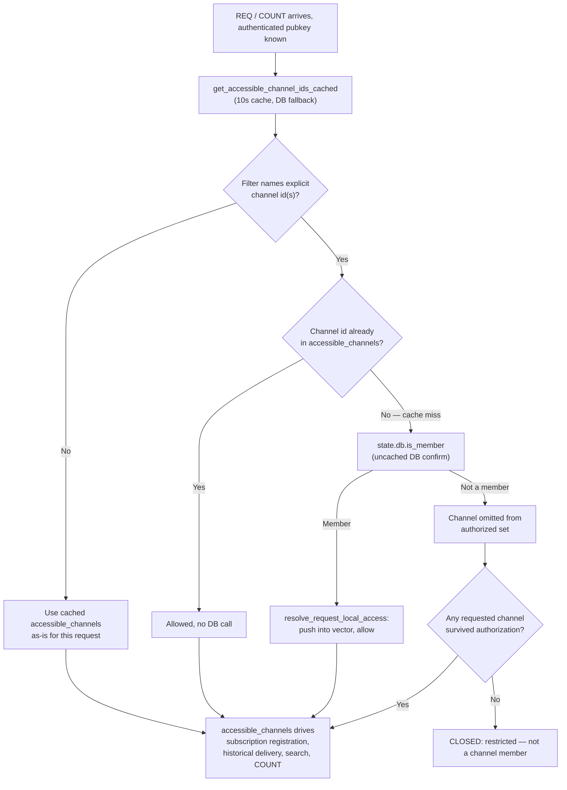

# Channel membership

Channel membership is the authorization fact the relay checks before letting a
pubkey read or write events scoped to a given channel — whether that pubkey has
an active row in `channel_members` for that channel, or the channel is open to
the whole community by visibility alone. This node documents how membership is
stored, computed and enforced; it does not document role-based permissions
(owner/admin escalation), channel creation, or channel *visibility* as a
standalone concept.

## Definition

**Channel membership is the answer to one question: is this pubkey allowed to
see or send events scoped to this channel, right now?** The relay resolves that
question in one of two ways, both grounded in the `channel_members` table
(`community_id`, `channel_id`, `pubkey`, `role`, `joined_at`, `invited_by`,
`removed_at`, `removed_by` — primary key on the first three columns; migrations/
0001_initial_schema.sql:132-145):

- **Private channels** require a literal, active row: `is_member` returns true
  only when a `channel_members` row exists for that exact
  `(community_id, channel_id, pubkey)` with `removed_at IS NULL`, joined to a
  non-deleted channel (crates/buzz-db/src/channel.rs:643-661).
- **Open channels** need no such row for a member of the community: the
  relay's `get_accessible_channel_ids` query unions the explicit-row set above
  with every non-deleted, `open`-visibility channel in the community
  (crates/buzz-db/src/channel.rs:754-782). Community membership itself, not a
  per-channel row, is what grants access.

**What this is not.** Membership is not the same thing as *role* — a member row
carries a `role` (`member`, `admin`, `owner`, ...), and role governs
*escalated* actions (granting elevated roles, demoting an owner, removing
another member) rather than whether the pubkey can see the channel at all;
`add_member`'s and `remove_member`'s role-escalation guards
(crates/buzz-db/src/channel.rs:382-539, 560-640) are a related but separate
concept, out of scope here. Membership is also not the same thing as the
`#p`-tag "p-gate" that guards certain event kinds independent of any channel
(crates/buzz-relay/src/handlers/req.rs:1182-1237) — see *Scope and omissions*.

## How the relay enforces it

`buzz-auth`'s `ChannelAccessChecker` trait (`accessible_channel_ids`,
`can_access`) formalizes the same check as a tenant-scoped interface:
`check_read_access` and `check_write_access` both require a scope
(`MessagesRead`/`MessagesWrite`) **and** passing membership before allowing an
operation, and the trait's own doc comment states every implementation MUST
scope by `ctx.community()` — otherwise, because `channels`' primary key is
`(community_id, id)`, an unscoped membership query becomes a cross-community
existence oracle (crates/buzz-auth/src/access.rs:1-101).

On a multi-pod relay, `AppState.get_accessible_channel_ids_cached` wraps the DB
query in a 10-second cache (crates/buzz-relay/src/state.rs:1231-1249). A
request that explicitly names a channel not already in that cached vector does
not simply trust the cache's absence as a denial: `handle_req` confirms
against the database directly and, on a positive result,
`resolve_request_local_access` pushes the channel into the request-local
vector so every downstream consumer of that one request (subscription
registration, historical delivery, NIP-50 search scoping, COUNT) sees the
repaired, not the stale, answer (crates/buzz-relay/src/handlers/req.rs:108-187,
526-545). If no requested channel survives authorization, the subscription is
closed with `restricted: not a channel member` rather than registered with
nothing it can ever deliver (crates/buzz-relay/src/handlers/req.rs:189-209).

## How membership is published: kind:39002

The relay publishes its own view of channel membership as a signed, relay-keypair
Nostr event: `KIND_NIP29_GROUP_MEMBERS = 39002`
(crates/buzz-core/src/kind.rs:420-426), one of the NIP-29 group-state kinds
`AGENTS.md`/`CLAUDE.md` describes as carrying a channel's id in a `d` tag rather
than an `h` tag (CLAUDE.md). `emit_group_discovery_events` builds this event's
tags via `group_members_tags`: a `d` tag set to the channel UUID, then one `p`
tag per active member (any role) in the form `["p", pubkey_hex, "", role]`
(crates/buzz-relay/src/handlers/side_effects.rs:1040-1059, 1134-1165). The
sibling `KIND_NIP29_GROUP_ADMINS` (39001) event is built from the same roster
filtered to owner/admin roles only — 39001 and 39002 are two views over one
`channel_members` table, not two independent membership stores
(crates/buzz-relay/src/handlers/side_effects.rs:1134-1165). Crucially, the
kind:39002 event itself is stored **channel-scoped** (`channel_id = Some(...)`),
so the same access control that gates the channel's own messages gates its
member-roster snapshot: a private channel's roster is visible only to that
channel's own members (crates/buzz-relay/src/handlers/side_effects.rs:1052-1059).

## Use cases

- **An agent or client deciding what a REQ subscription will actually return**
  needs to know that an `#h`-scoped filter for a channel it does not belong to
  will not silently return nothing forever — it is refused outright
  (`restricted: not a channel member`), while a filter mixing an authorized and
  an unauthorized channel id returns only the authorized one's events.
- **A developer debugging "why did my just-added member not see the channel
  immediately"** needs to know the 10-second accessible-channels cache exists
  and that an explicit-channel request repairs itself request-locally rather
  than waiting out the TTL — but only for requests that name the channel
  explicitly, not for a bare community-wide subscription.
- **A developer reasoning about open vs. private channels** needs to know an
  open channel's accessibility is structural (derived from `channels.visibility`)
  rather than backed by one `channel_members` row per community member, which
  is why `get_accessible_channel_ids`'s query shape (a `UNION`, not a single
  table scan) is the right place to look, not `channel_members` alone.
- **A client author resolving a channel's member list for display** needs to
  know kind:39002 is a relay-signed, channel-scoped snapshot rebuilt from
  `channel_members` on every membership change, not a client-maintained cache
  independent of the relay's own authorization state.

## Comparison: open vs. private channel membership resolution

| | Open channel | Private channel |
|---|---|---|
| Needs an explicit `channel_members` row to read/write? | No — visibility alone grants access to any community member | Yes — `is_member` requires an active row |
| Path in `get_accessible_channel_ids` | The `visibility = 'open'` half of the `UNION` | The `channel_members` half of the `UNION` |
| Who can add a member | Any active member may self-join; only an existing owner/admin may grant an elevated role | Requires an inviter who is an active member (or the channel's own creator, bootstrap-only) |
| kind:39002 still published? | Yes — the roster still reflects whoever has an active `channel_members` row (e.g. anyone who has ever explicitly joined), even though visibility alone would already grant them access | Yes — this is the only way a private roster becomes visible, and only to existing members |

## Related resources

Channel membership is one instance of the corpus's community-boundary
principle applied one level down, inside a single community: see the
`references` relationship below rather than a duplicated explanation of why a
security boundary exists at all.

## Scope and omissions

**This document covers** what a `channel_members` row means, how open-channel
access differs structurally from private-channel access, how the relay
resolves and caches "is this pubkey allowed to touch this channel" for REQ/COUNT
authorization, and how that same roster is published as kind:39002.

**It does not cover:**

- **Role-based authorization** (what an `owner` vs. `admin` vs. `member` role
  permits beyond bare channel access — grant/demote rules, last-owner
  protection mechanics as a topic in their own right). `add_member` and
  `remove_member`'s role-escalation logic was read as evidence for *this*
  node's membership-lifecycle claims, but a full treatment of role semantics
  is a separate concept and, per this corpus's one-node-one-idea rule, belongs
  in its own node if one is later commissioned.
- **Channel creation and visibility as a standalone concept** (why a channel
  is created `open` vs. `private`, and whether that choice can later change).
- **DM-channel membership peculiarities** — `channel_type == "dm"` channels are
  visible in `emit_group_discovery_events`'s kind:39000 handling (participant
  pubkeys embedded directly) but that special-casing was not investigated
  beyond noting its existence.
- **The `#p`-tag p-gate** (`p_gated_filters_authorized`) — a related but
  independent authorization mechanism for certain event kinds, not a channel
  membership check; named here only to draw the boundary, not explained.

**Expected but not independently verified when this node was written:** the
cross-pod cache-invalidation path that `state.rs`'s own doc comments describe
for the 10-second `accessible_channels` cache (i.e., what actively invalidates
the cache on other pods when a membership change happens, versus merely
waiting out the TTL) was read as a comment, not traced through a running
multi-pod deployment or its invalidation-publishing code path.

## Relationships
