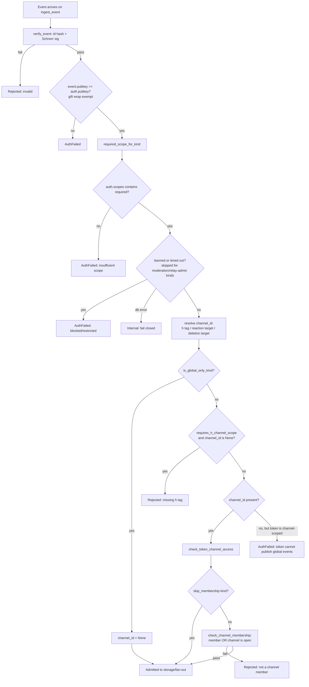

# Event authorization

How the relay decides, at the moment a signed Nostr event reaches its shared
ingest seam, whether the pubkey that authenticated the connection is
permitted to publish *this specific event* -- as opposed to merely having
proven which key it holds.

## Definition

**Event authorization** is the sequence of checks the relay's write path
(`ingest_event` / `ingest_event_inner` in
`crates/buzz-relay/src/handlers/ingest.rs`) applies to an already-verified,
already-authenticated event before it is stored or fanned out, to decide
*whether this write is allowed* rather than merely *who sent it*. It answers
three separable questions for one event, not one:

1. **Category** -- does the authenticated connection hold the permission
   scope this event's *kind* requires? (`required_scope_for_kind` +
   `auth.scopes()`.)
2. **Place** -- if the kind is channel-scoped, is the connection allowed to
   write into *this* channel? (token-level channel restriction via
   `check_token_channel_access`, then community membership or open-channel
   fallback via `check_channel_membership`.)
3. **Standing** -- has the community's moderation state (a ban, or an active
   timeout) revoked this pubkey's standing to write at all, independent of
   scope or channel? (the `moderation_restriction_state` re-check.)

All three must pass; each is a distinct rejection reason with its own error
message, and none substitutes for another. A connection with every scope it
needs is still refused if it is banned; a connection in good standing with
the right scope is still refused if the event's channel is neither one it
is a member of nor open.

**What this is not.** Event authorization presupposes two things this node
does not itself cover, each already the property of a different corpus
node once merged: that the event's `id` and `sig` are cryptographically
valid for the `pubkey` in its own envelope (`verify_event`, the
*signed-events* principle -- an integrity/identity check, not a permission
check), and that `event.pubkey` matches the identity `auth.pubkey()`
already authenticated for the connection, with NIP-59 gift wraps as the one
deliberate exception (an unrelated ephemeral signing key by design). Both
run, and both must pass, *before* any of the three authorization questions
above are even asked.

## How the checks are ordered

This is the actual order the code runs the checks in, not an idealized
model: the ban/timeout re-check runs *before* channel resolution, and the
token-channel and community-membership checks both run only once a
`channel_id` (or its deliberate absence) has been settled.

## Background

**Why a ban/timeout re-check exists on the write path at all**, given that
NIP-42 authentication is itself where a ban would normally be enforced: an
already-authenticated WebSocket connection never re-authenticates for the
lifetime of the socket. If the live moderation fan-out that would otherwise
disconnect a newly-banned member is missed (a fire-and-forget publish, a
slow subscriber, a reconnect race), that member's still-open socket would
otherwise keep writing indefinitely. The code comment in `ingest.rs`
describes this re-check as the durable backstop for exactly that gap.
Moderation-command kinds and relay-admin kinds are carved out of this
specific re-check only, and only because each enforces the same durable ban
inside its own handler -- the carve-out exists so a timed-out community
admin retains the one capability needed to lift their own timeout.

**Why scope and channel membership are two separate gates rather than one.**
Scope answers a category-level question ("can this connection write
messages at all, anywhere") that is meaningful even for a connection with
no channel restriction at all (`auth.channel_ids()` is `None` for most
connections and always `None` over HTTP). Channel membership answers a
place-level question that only exists once a concrete channel has been
resolved. Collapsing them would either force every scope to be
channel-specific (losing the global/user-owned kind category entirely) or
force channel membership to be expressible as a scope (losing per-channel
precision). Keeping them separate is also why a channel-scoped token is
independently blocked from publishing any kind that resolves to no channel
at all -- the token-channel check alone cannot express "this token may
never post a global event," so `ingest_event_inner` states that rule
directly.

## Use cases

- **A developer adding a new event kind** needs to decide, and encode, three
  independent answers for it: which `Scope` it requires
  (`required_scope_for_kind`), whether it is channel-scoped or global-only
  (`requires_h_channel_scope` / `is_global_only_kind` -- the disjointness
  test in `ingest.rs`'s own test suite exists to catch a kind accidentally
  landing in both or neither), and whether its own handler needs to bypass
  the generic membership gate because it enforces authorization itself
  (the `skip_membership` list).
- **An operator investigating "why was this write rejected"** needs to know
  which of the three questions (category / place / standing) produced the
  rejection, because each has a distinct, differently-actionable message:
  an insufficient-scope rejection means the token/connection was issued the
  wrong permissions; a not-a-channel-member rejection means the actor needs
  an invite or the channel needs to be opened; a banned/timed-out rejection
  means moderation state is the blocker, not permissions at all.
- **A reviewer checking a PR that touches ingest.rs** needs to confirm a new
  or moved check still runs in the right relative order -- in particular,
  that nothing bypasses the ban/timeout backstop for a kind that is not
  moderation-command or relay-admin, and that a new channel-scoped kind is
  added to `requires_h_channel_scope` rather than left to fall through
  silently with `channel_id = None`.

## Scope and omissions

**This node covers** the relay's ingest-time authorization sequence for a
client-submitted event: per-kind scope requirements, the token-level and
community-level channel-access gates, and the durable ban/timeout write-block
backstop, as implemented in `crates/buzz-relay/src/handlers/ingest.rs` and
`crates/buzz-auth/src/scope.rs`. It states, but does not itself define, the
two preconditions (signature validity and pubkey/principal identity match)
that already have to hold before any of these checks run.

**It does not cover, and these are gaps rather than silence:**

| Not covered here | Why |
|---|---|
| How NIP-42 or NIP-98 authentication establishes `auth.pubkey()` and `auth.scopes()` in the first place | A separate concern (authentication, not authorization) with its own source in `buzz-auth/src/nip42.rs` and `nip98.rs`, not opened for this node |
| `buzz-auth::access::ChannelAccessChecker` / `check_read_access` / `check_write_access` | Confirmed by grep to have no caller in `crates/` outside `buzz-auth` itself -- it is not part of the event-authorization path this node documents, and is named here rather than folded in as a second concept |
| Per-kind command-handler-local authorization (e.g. capability/role checks inside `handle_command`, `validate_edit_ownership`, `handle_relay_admin_event`, `handle_moderation_command`) for the kinds that skip or exit the generic gates early | Each is its own, kind-specific authorization surface; documenting them is a separate node per kind-family, not this one |
| Read-path authorization (subscription filters, `messages read` scope enforcement, fan-out visibility gating) | A distinct question ("what can this pubkey see") from this node's "what can this pubkey write" |
| The exact NIP-29 role/capability model behind `AdminChannels` / `AdminUsers` scopes | Not traced in the sources opened for this node |

**Expected but not verified when this node was written:** whether every
event kind currently defined in `buzz-core/src/kind.rs` is reachable
through exactly one of `required_scope_for_kind`'s match arms, `is_global_
only_kind`, and `requires_h_channel_scope` (the disjointness test found
covers the second pair only, not a three-way exhaustiveness check against
the full kind registry) was not independently re-verified against
`kind.rs` for this node -- the claims above rest on reading `ingest.rs`'s
own match arms and test suite, not on cross-checking every kind constant
individually.
