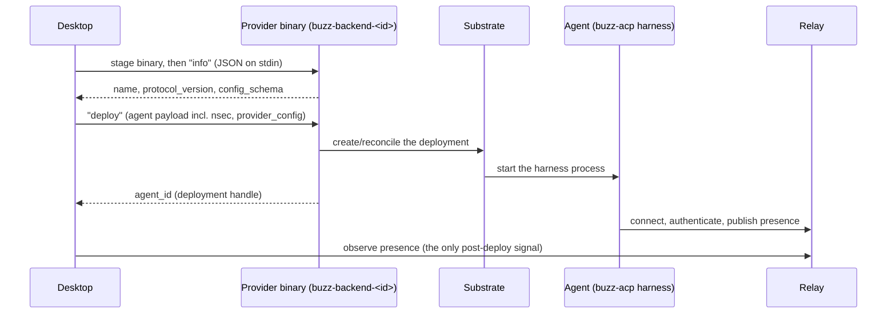

# Concept: Backend provider

A **backend provider** is a small, discoverable executable — `buzz-backend-<id>`
— that gives Buzz Desktop a way to deploy a managed agent onto a compute
substrate other than the local machine, without the desktop having to know
anything about that substrate.

## Definition

A backend provider is any executable on the desktop's discovery path named
`buzz-backend-<id>` that speaks a small JSON request/response protocol on its
stdin/stdout: given an `info` request it describes itself and its
configuration schema, and given a `deploy` request (carrying the agent's
identity and configuration, including its private key) it stands the agent up
on whatever substrate it manages and returns a handle for that deployment.
Concretely, an agent record's `backend` field is a two-variant discriminator —
`Local` or `Provider { id, config }` — and choosing `Provider` is what makes
an agent "remote": the desktop delegates to the named provider binary rather
than spawning the agent harness itself.

**Boundary — what this is not.** "Provider" is genuinely overloaded in this
codebase, and the two meanings are easy to conflate because they live on the
same record. `ManagedAgentRecord.provider` is the agent's **LLM inference
provider** (e.g. an Anthropic- or OpenAI-compatible model endpoint) — a
completely different axis from `ManagedAgentRecord.backend`'s `Provider { id,
config }`, which names a **compute/deployment** provider. The collision is
not hypothetical: `buzz-backend-kubernetes`, itself a backend provider, reads
the *other* provider field (`agent.provider`, the LLM one) purely to refuse
deploying an agent configured for Buzz's shared-compute "relay-mesh" LLM
provider, since relay-mesh already runs on the relay's own compute and
deploying it into a pod would create a second, contending consumer of the
same agent identity. A backend provider is also not the substrate itself: the
protocol's own system model is explicit that the substrate (a Kubernetes
cluster, for the one shipped binding) is opaque to the desktop, and the
desktop never talks to it directly — only the provider binary does.

## How a deploy flows

Two things this diagram makes visible: the provider is invoked twice, on the
same staged copy of itself, before the private key ever leaves the desktop;
and after `deploy` returns, the desktop's only channel back to the agent is
the relay, not the provider or the substrate.

## Background

**Why a plugin binary instead of a substrate SDK per backend.** The protocol
is intentionally the desktop's *door* to substrates, not a registry of
substrate integrations baked into the desktop itself: `buzz-backend-<id>` is
a zero-registration contract — any executable with the right name on `PATH`
participates — which is the same shape kubectl plugins and Docker CLI
plugins use. This keeps substrate-specific code (Kubernetes RBAC, namespace
choice, pod shape) out of the desktop binary entirely; the desktop's own
responsibility is the generic parts: discovery, the two-operation contract,
output caps, and secret handling.

**The trust boundary is stated, not hidden.** A backend provider is handed
the agent's private key by design — that is its job, since it must construct
the agent's identity on the substrate — and the specification is explicit
that malicious-provider containment is out of scope: the protocol *bounds*
the desktop's exposure (discovery only resolves binaries it will not
execute during discovery itself, output is capped and secret-redacted,
`provider_config` is validated against ever carrying a secret-shaped key,
and the UI surfaces an explicit trust decision) but cannot make a dishonest
provider safe.

**No management channel, by design (M1).** Once `deploy` succeeds, the
desktop deliberately keeps no persistent session to the remote agent or its
substrate: status comes from the agent's own relay presence, stopping it is a
relay message, and reconfiguring it is a future re-deploy. This is a stated
design axiom, not an oversight — it keeps the provider protocol's surface
small (no status query, no exec, no log fetch, no kill), at the cost of a
bounded staleness window on presence.

**A stale defect entry, corrected here.** The specification document
(`docs/remote-agents.md`) is pinned to a specific commit and lists, among its
"Known Defects," that the deploy path did not check a provider's declared
protocol version before sending it the agent's private key. At the revision
this node was checked against, that gate already exists in code — it was
added in a later commit that also shipped the Kubernetes provider — so the
defect entry is documentation drift rather than a description of the
protocol's current behavior. This node reports the drift rather than quietly
repeating the stale claim or silently "fixing" the spec's own text, which is
someone else's document to maintain.

## Use cases

- **Deciding whether an agent needs a backend provider at all.** Most agents
  run locally (`backend: Local`) and never touch this concept. It matters
  once an agent needs to run somewhere the desktop machine cannot guarantee —
  continuously, on shared infrastructure, or isolated from the desktop user's
  own session — at which point `backend: Provider { id, config }` is the
  record field that expresses that choice.
- **Writing or reviewing a new backend provider.** Anyone implementing a
  second `buzz-backend-<id>` binary (a systemd/SSH deployer is named
  elsewhere in the specification as a live example) needs this concept to
  know which obligations bind at which layer — the agent/harness contract
  binds every launcher, the provider/deployer contract binds only
  provider-managed ones — before diving into a specific substrate's binding
  policy.
- **Debugging "my remote agent looks stuck."** Because the desktop has no
  management channel to a deployed agent, the presence-only status model
  (and its bounded staleness window) is the first thing to reach for, rather
  than expecting the desktop to be able to query the substrate directly.
- **Auditing what a backend provider can do.** Understanding that a provider
  receives the agent's private key by design — and that containment of a
  dishonest provider is explicitly not this protocol's job — is the
  prerequisite for evaluating whether to trust a given provider binary at
  all.

## Comparison: `Local` vs. `Provider`

| | `Local` | `Provider { id, config }` |
|---|---|---|
| Where the harness runs | Spawned directly by the desktop, on the desktop's own machine | Deployed by the named `buzz-backend-<id>` binary onto its own substrate |
| Desktop's post-start channel | Direct process handle | None — relay presence only (M1) |
| Configuration edits | Re-resolved on every spawn | Take effect only on the deployment's next fresh generation (the running instance is a strict no-op) |
| Secrets exposure | Stay on the desktop's machine | Handed to the provider binary, then to whatever the provider constructs on the substrate |
| Who implements substrate specifics | Not applicable | The provider binary and its substrate-specific binding policy |

## Related resources

The full wire protocol, the five stated invariants, and the Kubernetes
binding's own reconciliation rules are `docs/remote-agents.md`'s to own — this
node does not restate them. `architecture-containers-agent-runtime` is the
corpus node for the agent-runtime container this concept deploys (`buzz-acp`,
`buzz-agent`, `buzz-dev-mcp`, `sprig`); a `references` relationship links to
it because that node already names `buzz-backend-kubernetes` as one of the
container's directly connected systems, and a reader arriving at either node
benefits from the other.

## Scope and omissions

**This node covers** what a backend provider is, the two-field name collision
with LLM providers, the shape of a deploy at a concept level, why the
protocol is a discoverable plugin binary rather than a built-in substrate
integration, the stated trust boundary and no-management-channel design
axiom, and the `Local`/`Provider` comparison.

**It does not cover, and these are gaps rather than silence:**

| Not covered here | Owned by |
|---|---|
| The full wire protocol (payload fields, `launch` data, environment precedence) | `docs/remote-agents.md` |
| The five stated invariants (I1-I5) in full, and their enforcement mechanisms | `docs/remote-agents.md` |
| The Kubernetes binding's reconciliation state machine, GC, and fingerprinting | `docs/remote-agents.md` §The Kubernetes Binding; `crates/buzz-backend-kubernetes/src/` |
| The agent-runtime container this concept deploys, in full | `architecture-containers-agent-runtime` |
| Whether the LLM-provider concept (`ManagedAgentRecord.provider`, model/provider selection) needs its own corpus node | Not filed as of this writing; a candidate follow-up, not folded in here per the atomicity standard |
| A fix to `docs/remote-agents.md`'s stale Known Defect 5 entry | Not filed as of this writing; this node reports the drift, it does not correct the other document |

**Expected but not verified when this node was written:**

- **Whether any backend provider besides `buzz-backend-kubernetes` currently
  exists or ships in this repository.** `docs/remote-agents.md` names a
  systemd/SSH deployer as "the live example" of a second binding but this
  node did not locate or inspect that code — it may live outside this
  repository or not yet be merged.
- **Whether the desktop's own onboarding UI text (if any) states the trust
  warning `docs/remote-agents.md` requires before a user configures a
  provider.** This node cites the specification's requirement, not a
  verification that the UI implements it.
