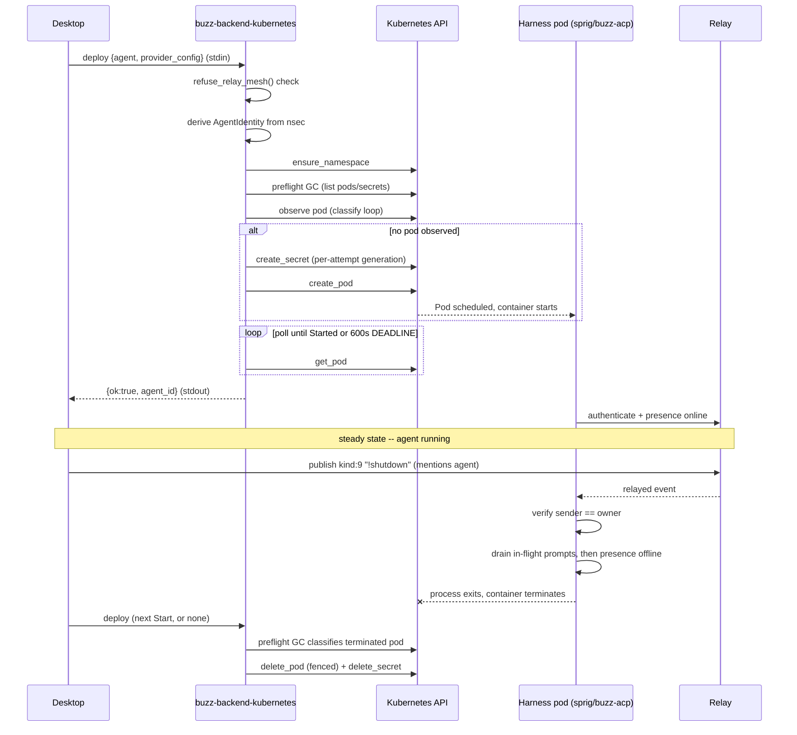

# Compute-provider lifecycle: flow

## A note on `type`

This node carries `type: layers`, not `type: architecture` — a deliberate,
disclosed choice, not the `flow.md` template's own worked-skeleton default.
That default (`type: architecture`) is precedent specifically from the
`architecture/flows/*` family (12 nodes narrating flows across the C4 static
model this repository's `architecture/` corpus subtree already documents).
This task's target path is `layers/compute/lifecycle.md`, and parent Feature
`#611`'s own stated Outcome is "cross-cutting compute, telemetry,
configuration and runtime-lifecycle behavior" — the `layers` surface, not a
C4 diagram family. Per `standards/taxonomy.md`'s *Choosing a value* step 2
("pick the enum member whose plain-English name most concretely names the
node's primary subject... not where the node currently happens to live"),
`layers` is that concrete name here. Per that same standard's step 5, `type`
may be revised later without touching this node's permanent `id`.

## Flow statement

This node narrates one scenario: how a *remote* managed agent's compute —
today, exactly one Kubernetes Pod, the only compute-provider binding shipped
in this OSS repository (`crates/buzz-backend-kubernetes`) — is created,
started, stopped and eventually torn down. The trigger is a user action in
Buzz Desktop (pressing Start on an agent whose `BackendKind` is
`Provider { id, config }` rather than `Local`) that invokes the
`buzz-backend-kubernetes` binary with a `deploy` request over stdin.
Precondition: the desktop has already staged and digest-verified the
provider binary and negotiated a matching `protocol_version` via a prior
`info` call (`docs/remote-agents.md:305-465` narrates that negotiation in
general terms; not re-narrated here, since it precedes this scenario's own
trigger). The actors are Buzz Desktop, the `buzz-backend-kubernetes` process,
the Kubernetes API server, and the deployed Pod (running the `sprig`
multicall binary as `buzz-acp`, the harness). Termination is either a running
agent (steady state, until a later Stop) or an in-band error string returned
to the desktop with no partial substrate cleanup performed synchronously.

## Sequence

1. Desktop invokes `buzz-backend-kubernetes` with `{"op":"deploy", "agent": {...}, "provider_config": {...}}` on stdin (`crates/buzz-backend-kubernetes/src/wire.rs:11-26`).
2. `respond()` parses the raw JSON and refuses the request in-band if `agent.provider == "relay-mesh"` (shared compute has no pod to deploy), checked against the untyped wire value specifically because the typed `AgentPayload` does not carry `provider` at all (`crates/buzz-backend-kubernetes/src/main.rs:62-113`).
3. `deploy_agent` parses `provider_config` into a `ProviderConfig`, then derives the agent's Nostr identity from `private_key_nsec` — **before any cluster contact**, so a malformed key is a refusal rather than a failed connection (`crates/buzz-backend-kubernetes/src/main.rs:116-120`).
4. The per-operation environment is built (`env::build_env`) and a Kubernetes client connects using ambient `kubeconfig` resolution, with no credential ever read from `provider_config` (`crates/buzz-backend-kubernetes/src/main.rs:124-134`).
5. `reconcile::deploy` ensures the target namespace exists, then runs a preflight garbage-collection pass over any residue from a previous life of this agent, before computing the desired create-intent `Fingerprint` (`crates/buzz-backend-kubernetes/src/reconcile.rs:359-362`).
6. The state machine loop begins: observe the current pod (if any), verify its identity/ownership, and call the pure function `classify()` against that observation and the desired fingerprint (`crates/buzz-backend-kubernetes/src/classify.rs:108-166`).
7. First deploy (no matching pod observed): `classify` returns `Action::Create`. The reconciler mints a fresh per-attempt generation, builds and creates the Secret first, then builds and creates the Pod referencing that exact Secret name, then sleeps one `POLL_INTERVAL` (2s) and re-enters the loop (`crates/buzz-backend-kubernetes/src/reconcile.rs:446-480`).
8. Each subsequent iteration re-observes and re-classifies: `Startup::Started` yields `Action::NoOp` (success, loop exits); `NeverStartedRecoverable` yields `Action::Observe` (keep polling); a non-self-healing pull failure yields `Action::Report` (fail immediately without spending the deadline); a terminated or provably-broken pod yields a fenced `Action::Delete` followed by `AwaitDisappearance` then re-entry (the normal restart path) (`crates/buzz-backend-kubernetes/src/classify.rs:83-166`, `crates/buzz-backend-kubernetes/src/reconcile.rs:386-444`).
9. The loop terminates on `Action::NoOp` (success — the harness container reports `state.running`), on an in-band `Err` (pull failure, one-attempt-per-call exhaustion, or `DEADLINE` expiry at 600s), or is never reached at all if `ensure_namespace` fails first, e.g. an RBAC denial, which fails the call before any Secret is written (`crates/buzz-backend-kubernetes/src/reconcile.rs:353-386`, `crates/buzz-backend-kubernetes/src/reconcile.rs:1511`).
10. On success, `Response::deployed(agent_id)` is written to stdout and the desktop stores/uses `agent_id`; the harness process inside the pod is now running and, once it authenticates over the relay, becomes reachable there — that authentication itself is a separate, already-documented flow this node does not re-narrate (see *Boundary*).
11. Stop (a separate trigger, not part of the deploy call above): the desktop publishes a `kind:9` event with content `!shutdown` mentioning the agent. The harness matches it via `is_owner_control_command`, confirms the sender against its cached owner, and sends on an internal `shutdown_tx` watch channel rather than exiting inline (`crates/buzz-acp/src/lib.rs:2737-2760`).
12. The harness's surrounding `select!` loop observes the shutdown signal, drains in-flight prompts under a timeout, then best-effort publishes relay presence `offline` (2s timeout, only if presence is enabled) before the process exits; SIGTERM is wired to the same channel, as is expiry of the `--exit-after-inactivity` / `BUZZ_ACP_EXIT_AFTER_INACTIVITY` bound, whose value the Kubernetes binding feeds from its own `inactivity_seconds` config field (schema default 7200s) (`crates/buzz-acp/src/lib.rs:2328`, `crates/buzz-acp/src/lib.rs:3444-3529`, `crates/buzz-acp/src/config.rs:478-480`, `crates/buzz-backend-kubernetes/src/env.rs:282`).
13. Destroy is not a synchronous provider operation — there is no `undeploy` op in the wire protocol (`crates/buzz-backend-kubernetes/src/wire.rs:23-26`). Once the harness process exits, its container reaches a terminal phase, and the *next* `deploy` call's preflight step (step 5 above) classifies that pod as `Startup::Terminated` and fences a delete for the pod and its Secret together, or — if no further deploy is ever made — an orphaned Secret is collected once it is at least 1200 seconds old (`ORPHAN_SECRET_MIN_AGE_SECS`, twice the 600s deploy deadline), gated on the apiserver's own clock (`crates/buzz-backend-kubernetes/src/gc.rs:18-27`, `crates/buzz-backend-kubernetes/src/gc.rs:51`).

## Diagram

## Outcome

**Success.** The harness container reaches `state.running`; `classify()`
returns `Action::NoOp`; `deploy_agent` returns `Ok(agent_id)`; the provider
process writes `{"ok": true, "agent_id": ...}` to stdout and exits 0
(`crates/buzz-backend-kubernetes/src/wire.rs:108-112,142-147`). The pod is
now the agent's live compute; relay presence becomes the sole
externally-visible liveness signal from that point on (`docs/remote-agents.md:69-73`
frames this as a deliberate design constraint: the desktop holds no
management channel to the remote process).

**Failure paths, each in-band and non-silent:**
- **Deadline exceeded** (600s): the call returns an `Err` string naming the
  latest observed condition; nothing is deleted (`crates/buzz-backend-kubernetes/src/reconcile.rs:376-383`,
  test `deadline_expiry_reports_the_condition_and_cleans_up_nothing` at
  `crates/buzz-backend-kubernetes/src/reconcile.rs:1494`).
- **One-attempt-per-call exhaustion**: a pod this call created and that then
  needed replacing is reported immediately, not retried, with an explicit
  "press Start to try again" message (`crates/buzz-backend-kubernetes/src/reconcile.rs:406-428`).
- **Non-self-healing pull failure** (unauthorized, unknown manifest, arch
  mismatch): reported immediately rather than spent against the deadline
  (`crates/buzz-backend-kubernetes/src/classify.rs:28-38,150-166`).
- **Namespace RBAC denial**: fails before any Secret is written, with the
  literal remediation command in the error (test
  `namespace_denial_fails_before_writing_any_secret` at
  `crates/buzz-backend-kubernetes/src/reconcile.rs:1511`).
- **GC failure during preflight**: logged and swallowed — does not fail the
  surrounding deploy call (test `a_gc_failure_does_not_fail_the_deploy` at
  `crates/buzz-backend-kubernetes/src/reconcile.rs:1534`).
- **Create-race loss** (`CreateOutcome::AlreadyExists`): the losing attempt
  adopts the winning pod's id and deletes only its own now-unreferenced
  Secret, never the winner's objects (test
  `create_loser_adopts_the_winner_and_drops_only_its_own_secret` at
  `crates/buzz-backend-kubernetes/src/reconcile.rs:1389`).
- **Delete precondition failure** (object changed since the observation that
  authorized the delete): the action is discarded and the loop re-classifies
  rather than retrying with a fresher fence (test
  `precondition_failure_reclassifies_instead_of_retrying` at
  `crates/buzz-backend-kubernetes/src/reconcile.rs:893`).

**No rollback of already-existing objects.** No failure path in this flow
deletes a pod or Secret that a *previous* successful deploy created and that
is still live; the guarantees above bound what *this* call's own attempt may
touch, never a prior generation's running pod (`crates/buzz-backend-kubernetes/src/classify.rs:125-131`).

## Boundary

This node does not describe:
- **`layers/lifecycle/*`** — process-level startup/shutdown of the Buzz
  *relay* process itself. That is a sibling corpus surface (per parent
  Feature `#611`'s dispatch context); this node's "lifecycle" is a running
  agent's *compute*, never the relay.
- **The harness's own inner ACP-subprocess lifecycle** —
  `crates/buzz-acp`'s spawning and reaping of the ACP-compliant agent process
  (goose/claude/codex/etc.) it hosts *inside* an already-running pod is a
  narrower, different lifecycle from the one this node narrates, even though
  both surfaced under a "spawn"/"shutdown" search of the codebase.
- **The provider wire protocol's general, durable contract** — the `info`
  and `deploy` operation shapes, independent of this one scenario, are an
  `interfaces-events`-surface subject; no such node exists yet on
  `origin/launchpad` to `references`. This node narrates the protocol's use
  in one path through it, per `flow.md`'s own boundary rule against
  restating an interface's general contract.
- **What runs inside the pod** (the `sprig` multicall binary, `buzz-acp`,
  `buzz-agent`) — that is `architecture-containers-agent-runtime`'s subject
  (see *Relationships*); this node covers only how that container comes to
  exist, run, and eventually stop existing.
- **The websocket-authentication handshake** the harness performs against
  the relay once its pod is running — already covered by the existing
  `architecture/flows/websocket-authentication.md` node (not linked here
  because this node's own evidence ledger did not re-verify that node's
  content at this revision; naming it is not a substitute for a checked
  `references` edge).
- **`sprout-backend-blox`**, a second compute-provider binding named in this
  repository's own `CLAUDE.md` ecosystem table — it lives in a separate,
  closed repository, so nothing about its lifecycle behavior can be verified
  or documented from here.
- **Whether `docs/remote-agents.md`'s Known Defect 6 (pinned intentional-exit
  exit-code-0 contract) or Known Defect 7 (a single shared shutdown-tail
  budget with a reserved finalization slice) are still open** at this node's
  checked revision — see *Scope and omissions*.

## Relationships

- `references`: `architecture-containers-agent-runtime` — the container
  composition (`sprig`/`buzz-acp`/`buzz-agent`) that this flow's pod runs;
  supporting context, no ownership or currency dependency implied.

No other merged or drafted node on `origin/launchpad` at the checked
revision was found to be a valid `relationships` target for this scenario
(`git ls-tree -r --name-only origin/launchpad -- launchpad/docs/corpus`,
re-checked before drafting): no `layers/*` sibling exists yet (this is the
first node in that surface), and no `interfaces-events` node documents the
provider wire protocol in general terms.

## Scope and omissions

**This node covers** the create/start/stop/destroy lifecycle of a remote
managed agent's compute, as implemented by the only compute-provider binding
shipped in this repository (`buzz-backend-kubernetes`): the deploy state
machine's pure classification function and its I/O-performing reconciler
loop, the ordering and atomicity of Secret-then-Pod creation, the
compare-and-delete fencing that guards every destructive action, the
preflight and orphan-Secret garbage collection that stands in for a
synchronous destroy operation, the identity-before-cluster-contact ordering,
the relay-mesh refusal, and how Stop (an owner `!shutdown` message or an
inactivity timeout) and eventual substrate teardown compose through the
harness's graceful-shutdown path rather than through any provider-side
"stop" or "destroy" call.

**It does not cover, and these are gaps rather than silence:**

| Not covered here | Owned by |
|---|---|
| Process-level relay startup/shutdown | `layers/lifecycle/*` (sibling Feature area) |
| The ACP-subprocess lifecycle inside a running pod | Not yet a corpus node; `crates/buzz-acp`'s own spawn/shutdown of its hosted ACP agent |
| The provider wire protocol's general contract (info/deploy shapes independent of this scenario) | Not yet a corpus node (an `interfaces-events`-surface subject) |
| The container composition running inside the pod | `architecture-containers-agent-runtime` |
| The relay websocket-authentication handshake the harness performs once running | `architecture/flows/websocket-authentication.md` (not linked as a `relationships` edge — see *Boundary*) |
| The Blox workstation compute-provider binding | `sprout-backend-blox`, a separate closed repository |
| The desktop-side provider discovery, staging, digest-check and `protocol_version` negotiation that precedes this scenario's trigger | Not independently re-verified for this node beyond `docs/remote-agents.md`'s own narration (§Provider Protocol) |

**Expected but not verified when this node was written:**
- **Whether `docs/remote-agents.md`'s Known Defect 6 (a tested,
  pinned intentional-exit-implies-exit-code-0 contract) and Known Defect 7
  (a single shared shutdown-tail deadline with a reserved finalization
  slice) are still open at this node's checked revision
  (`338b4d0cf2dd76cc43964bb717ce9f0a94a9c7a5`), later than the spec's own
  `28ae6cd21` pin.** A targeted grep found scattered `process::exit(1)`
  failure paths in `crates/buzz-acp` but no evidence either way of a
  positive, tested clean-exit-code guarantee or a shared shutdown budget;
  this is left as an open gap rather than resolved either way.
- **`desktop/src-tauri/src/managed_agents/env_vars.rs`'s current
  `RESERVED_ENV_KEYS` membership** was not directly opened to confirm
  `BUZZ_ACP_EXIT_AFTER_INACTIVITY` and `BUZZ_ACP_NO_PRESENCE` are both
  reserved (unoverridable by user env), though `docs/remote-agents.md:959-967`
  states both MUST be.
- **No cluster-integration test suite** (`envtest`/`kind` against a real
  apiserver) was found under `crates/buzz-backend-kubernetes/tests/` at this
  revision — only unit tests against a hand-rolled fake `Substrate`
  (`crates/buzz-backend-kubernetes/src/reconcile.rs`, `classify.rs`, `gc.rs`)
  and wire-protocol golden fixtures
  (`crates/buzz-backend-kubernetes/tests/wire_fixtures.rs`) exist; the fake
  drives the actual shipped `deploy()` function, but no test in this
  repository exercises the binding against a real Kubernetes control plane.
- **The desktop-side staging/digest/`protocol_version`-negotiation code
  path** (`desktop/src-tauri/src/managed_agents/backend.rs`) was located but
  not opened line-by-line for this node; its existence and role are taken
  from `docs/remote-agents.md`'s own narration (§Provider Protocol,
  §Discovery) rather than independently re-verified against the current
  source, so the *Flow statement*'s precondition description of it is
  narrower than a fully re-verified claim would support.
