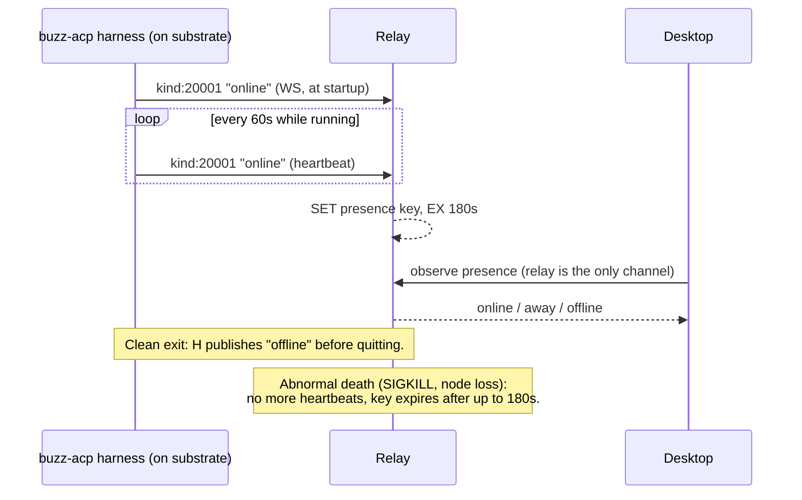

# Compute liveness

A running Buzz agent's compute instance is only ever known to be alive through
one channel: the relay presence event its own harness publishes. This node
defines that mechanism, the invariant behind it, and the boundary between it
and every other thing in this codebase that also happens to be called
"liveness."

## Definition

**Compute liveness** is the answer to one question — *is this specific
agent's running process still alive, right now* — and in Buzz that answer
comes exclusively from **relay presence**: a self-signed, ephemeral
`kind:20001` event (`online`/`away`/`offline`) that the `buzz-acp` harness
itself publishes over its relay WebSocket connection, once at startup, on a
60-second heartbeat while it runs, and best-effort as `offline` on its
shutdown path. The relay stores the most recent value with a 180-second TTL
(`PRESENCE_TTL_SECS`) and expires it if the harness stops publishing. This is
`docs/remote-agents.md`'s invariant **(I3) Presence is the status**, and its
defining consequence is architectural, not incidental: the desktop-to-provider
protocol carries **no substrate status query** at all (design axiom **M1**,
"No management channel") — a provider's wire contract has exactly two
operations, `info` and `deploy`, and nothing else. Whether an agent deployed
via a Kubernetes pod, ran as a hand-launched process, or runs as shared
compute inside the relay itself, the same presence mechanism is what answers
"is it alive" — the spec states this binds *every launcher*, not only
provider-managed ones.

**What compute liveness is not:**

- **Not the deployment bookkeeping axis.** A managed-agent record's
  `deployed`/`not_deployed` state (derived from a stored `backend_agent_id`)
  records whether a `deploy` call was made and accepted. It says nothing
  about whether the resulting process is still running a minute later — the
  spec calls this axis "bookkeeping, not liveness" in the same sentence it
  defines I3.
- **Not a substrate health check.** The desktop never asks Kubernetes (or any
  other substrate) directly whether an agent's pod or process is alive. That
  would require a management channel M1 deliberately does not provide.
- **Not the relay's own process health.** The relay exposes its own
  `/_liveness` and `/_readiness` HTTP probes, wired into its Kubernetes
  deployment's `livenessProbe`/`readinessProbe`. That answers "is the relay
  process itself alive and connected to Postgres/Redis" — a Kubernetes
  container health check for Buzz's own infrastructure, with no code path
  shared with agent presence. Both mechanisms are reasonably called
  "liveness"; they answer different questions about different processes at
  different layers. See *Scope and omissions* for how this boundary is drawn
  against the sibling document that most plausibly covers the relay's own
  probes.
- **Not deploy-startup classification.** Whether a just-deployed pod's
  container has reached a running state (as opposed to still pulling an
  image, or provably broken) is a separate, prior question the Kubernetes
  binding's deploy state machine answers before I3 becomes the operative
  signal at all.

## Visual aid

## Background

The 180-second bound is deliberate, not arbitrary: `docs/remote-agents.md`
frames it as "the accepted cost of M1" — trading a persistent management
channel (more moving parts, more failure modes, a second source of truth
about a remote process) for a bounded window in which presence can be wrong
after an abnormal death. The number itself is 3× the harness's 60-second
heartbeat interval, chosen so a single missed heartbeat does not flap
presence, and the spec attributes the earlier 90-second value's move to 180
seconds to keeping that same three-heartbeat margin after the desktop's own
heartbeat interval separately moved to 60 seconds. The presence-suppression
env var, `BUZZ_ACP_NO_PRESENCE`, is reserved (the desktop refuses to let user
config override it) specifically because disabling it on a remote deploy
would convert a bounded "wrong for at most 180s" into an unbounded "wrong
forever," since presence is the *only* signal remotely — locally the same
knob is comparatively harmless because the process and desktop UI are still
directly visible.

## Use cases

- **Implementing a new backend provider binding** (a new
  `buzz-backend-<id>` executable): understanding why the wire protocol never
  needs a status or health operation, and that shipping a provider that tries
  to add one is solving a problem the architecture already answers elsewhere.
- **Debugging an agent that the desktop shows as online/offline
  unexpectedly**: knowing the answer comes from a Redis-backed, 180-second-TTL
  presence key rather than any live check of the substrate narrows where to
  look — the harness's heartbeat loop and its connection to the relay, not
  Kubernetes pod status.
- **Reading desktop agent-status code**: recognizing the `deployed` vs.
  `offline`-derived-`stopped` pattern (see evidence ledger) as the concrete
  expression of I3's bookkeeping-vs-liveness distinction, rather than two
  redundant ways of saying the same thing.
- **Reasoning about worst-case detection delay**: after an abnormal death
  (node eviction, OOM, SIGKILL), the desktop can show a live-looking agent
  for up to 180 seconds — a number that matters for on-call expectations and
  for any automation that reacts to an agent going offline.

## Scope and omissions

**This document covers** the definition of compute liveness for a Buzz agent
instance — relay presence via `kind:20001`, the 60-second heartbeat and
180-second TTL staleness bound, the design axiom (M1) that makes presence the
*only* signal, and the boundary between this mechanism and the other things
in this codebase also called "liveness."

**It does not cover, and these are gaps rather than silence:**

| Not covered here | Owned by |
|---|---|
| The general provider protocol shape — discovery, `info`/`deploy` operations, payload schema, security obligations | #1041, `layers/compute/backend-provider.md` |
| The Kubernetes binding's realization of deploy, observe, and GC (Pod shape, Secrets, fencing, reconciliation) | #1042, `layers/compute/kubernetes-provider.md` |
| Start/stop/reap lifecycle policy: owner `!shutdown`, auto-stop/inactivity self-termination (I5), restart-policy-follows-intent | #1043, `layers/compute/lifecycle.md` |
| Local (non-remote, non-provider) agent compute specifics | #1045, `layers/compute/local-agent-compute.md` |
| Shared/mesh compute (relay-mesh agents, the `RELAY_MESH_PROVIDER` refusal in the Kubernetes binding) | #1046, `layers/compute/mesh-compute.md` |
| Process/service-level liveness of Buzz's own infrastructure containers — the relay's `/_liveness`/`/_readiness` HTTP probes and their Kubernetes wiring | #1138, `layers/observability/liveness.md` (scope not yet drafted at this node's recorded revision — see the evidence ledger entry naming this as this node's own reasoned placement) |
| The deploy state machine's startup classification (did a deploy reach `Started`) | touched only to distinguish it from liveness (evidence ledger); otherwise #1042's territory |

**No relationships to the sibling compute- or observability-layer nodes
above.** Checked before deciding that rather than assuming it: at the
recorded revision, `origin/launchpad`'s `launchpad/docs/corpus` tree carries
no `layers/` directory at all, so none of #1041/#1042/#1043/#1045/#1046/#1138
exist as mergeable targets. One relationship is declared instead, to a node
that does exist and whose subject is the actual enforcing mechanism:
`architecture-containers-agent-runtime` describes `buzz-acp`, the harness
that publishes the presence heartbeat this concept depends on.

**Expected but not verified when this node was written:**

- Whether issue `#3783` — cited by `docs/remote-agents.md` as the change
  that raised `PRESENCE_TTL_SECS` from 90s to 180s — is a
  `launchpad-26/buzz` issue or an upstream `block/buzz` issue was not
  independently checked. The claim above is recorded as what the spec
  document states, not as independently confirmed issue history.
- `#1138`'s actual scope was not established beyond its file path and open
  status. The boundary drawn against it here (the relay's `/_liveness`
  probes) is this node's own placement, to be revisited once #1138 lands.
- Whether the mesh/shared-compute substrate (#1046, an agent running "on the
  relay's own compute" per the `RELAY_MESH_PROVIDER` refusal comment)
  publishes presence identically to the Kubernetes and local paths, or has
  its own presence particulars, was not verified here — only that
  `docs/remote-agents.md`'s Launchers section states the presence-publishing
  contract binds every launcher at its lowest layer. #1046's own node should
  confirm or refine that for its specific substrate.
- The `fanout_and_presence_do_not_cross_communities` integration test
  confirms presence is published and queryable end-to-end, but it was not
  read in full and its assertions are about multi-tenant isolation, not
  about the 60s/180s timing values themselves; no test exercising the TTL
  expiry behavior directly was located during this node's authoring.
