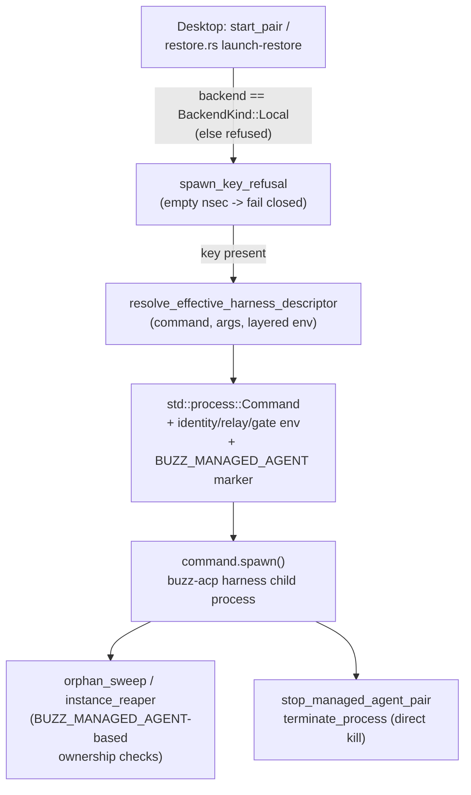

# Concept: Local agent compute

Buzz Desktop can run an AI agent's harness process on the very same machine
the desktop app itself runs on. This document names and scopes that
mechanism — **local agent compute** — as distinct from the sibling
mechanisms that run an agent's harness somewhere else. It documents the
concept as it exists in the codebase today; the deeper provider protocol
that governs the remote alternative is `docs/remote-agents.md`'s own subject,
not restated here.

## Definition

**Local agent compute is the mode in which Buzz Desktop itself launches,
configures, and supervises a managed agent's `buzz-acp` harness process as a
native OS subprocess on the desktop's own machine**, using
`std::process::Command` directly rather than delegating to an external
provider binary. It is one of exactly two values a managed agent record's
`backend` field (`BackendKind`) can take — `Local` (the default) or
`Provider { id, config }` — and the two are mutually exclusive per agent
record: an agent is either run locally by the desktop process, or deployed
to a remote substrate through a `buzz-backend-<id>` provider binary, never
both at once for the same record.

What the term does **not** mean: it is not a claim about where the *desktop
app* runs (the desktop is always local to the human operating it); it is a
claim about where the *agent's harness process* runs, relative to the
desktop that manages it.

## How it works

The desktop-side entry point is `spawn_agent_child`
(`desktop/src-tauri/src/managed_agents/runtime.rs`). It first calls
`spawn_key_refusal` to fail closed if the agent's private key is
unavailable, then resolves the effective harness command, arguments, and
fully-layered environment through `resolve_effective_harness_descriptor`,
builds a `std::process::Command` for the resolved ACP harness binary, sets
the layered environment on it (identity, relay URL, respond-to gate,
model/provider, team instructions, then user-supplied env last so it can win
where it is not reserved), stamps `BUZZ_MANAGED_AGENT` and
`BUZZ_MANAGED_AGENT_START_NONCE`, and calls `command.spawn()`. The result is
tracked by the desktop's own runtime-process table for the lifetime of the
app.

Only agents whose `backend` is `BackendKind::Local` pass through this path
at all: `start_pair` (the Tauri command backing manual start/stop) refuses
any record whose backend is not `Local`, and launch-restore on app start
filters its candidate set the same way. A `Provider`-backend record is never
handled by `spawn_agent_child`, `orphan_sweep`, `instance_reaper`, or
`stop_managed_agent_pair` — those are local-compute-only machinery.

## Use cases

- **The default managed-agent experience.** Every managed agent record
  defaults to `BackendKind::Local`; a developer or operator creating an
  agent in Buzz Desktop is using local agent compute unless they explicitly
  configure a provider.
- **Understanding why a config edit applies immediately.** A user who edits
  a local agent's model, prompt, or harness command sees it take effect on
  the agent's *next spawn* — because `spawn_agent_child` re-resolves the
  full effective config every time it runs. This is the property
  `docs/remote-agents.md` calls out by contrast when describing why a live
  remote deploy is a no-op instead.
- **Diagnosing why a local agent process is missing or duplicated.**
  `orphan_sweep`/`instance_reaper`'s `BUZZ_MANAGED_AGENT`-marker logic is
  the mechanism that decides whether an on-disk PID/receipt still names a
  real, desktop-owned process — relevant when triaging "an agent shows
  stopped but a process is still running" or the reverse.
- **Understanding the security boundary of per-agent env overrides.** A
  developer configuring per-agent or per-persona environment variables needs
  to know that `RESERVED_ENV_KEYS` blocks identity, relay, and
  code-execution-surface keys regardless — the same reserved-key strip
  documented here also protects the local spawn path, not only the remote
  one.

## Comparison: local vs. remote (provider) compute

| Aspect | Local agent compute | Remote/provider compute (`docs/remote-agents.md`) |
|---|---|---|
| Launcher | Buzz Desktop itself, via `std::process::Command` | A `buzz-backend-<id>` provider binary, invoked by Desktop |
| Management channel | Desktop holds a direct OS process handle | None after deploy (invariant M1) — relay presence only |
| Stop | Desktop calls `terminate_process` directly | Desktop publishes a relay `!shutdown` message |
| Config edits | Re-resolved on every spawn (immediate on restart) | No-op against a live instance until it next exits |
| Auto-restart on app launch | Yes, for `start_on_app_launch` records (`restore.rs`) | No — desktop-side launch-restore filters to `Local` only |
| Orphan/liveness detection | `BUZZ_MANAGED_AGENT` env-marker scan of local processes | Relay presence events (kind:20001), bounded to ~180s staleness |
| Identity fail-closed enforcement | `spawn_key_refusal` before any side effect | `build_deploy_payload`'s equivalent refusal (per `docs/remote-agents.md`'s I1) |

This table is scoped to what a reader of *this* node needs to place local
compute against its sibling; the remote side's full protocol (five
invariants, provider discovery, the deploy state machine) is
`docs/remote-agents.md`'s own subject and #1046's document, not restated
here beyond what this comparison needs.

## Scope and omissions

**This node covers** the definition of local agent compute, the concrete
desktop-side mechanism that implements it (`spawn_agent_child` and the
functions that gate access to it), the local-only process-supervision
machinery (`orphan_sweep`, `instance_reaper`, direct `terminate_process`
stop), and how it differs from remote/provider compute at the level a reader
needs to tell the two apart.

**It does not cover, and these are gaps rather than silence:**

| Not covered here | Owned by |
|---|---|
| The provider protocol (discovery, `info`/`deploy` operations, payload schema, the five invariants) | #1046 (remote-agent-compute), `docs/remote-agents.md` |
| The generic backend-provider contract from the provider-author's side | #1041 (backend-provider) |
| The Kubernetes binding of that protocol (`buzz-backend-kubernetes`) | #1042 (kubernetes-provider) |
| The `sprig` multicall runtime that both a local spawn's resolved harness binary and the Kubernetes provider's container image can be | #1049 (sprig-runtime) |
| The `buzz-acp` harness's own internal behavior once spawned (ACP protocol, agent pool, presence publication) — unchanged by whether the launch was local or remote | `architecture-containers-agent-runtime` (existing corpus node, linked below) |
| The desktop app's full architecture beyond the local-spawn slice of `managed_agents/` | `architecture-containers-desktop` (existing corpus node, linked below) |
| The full env-var layering precedence order (baked defaults, runtime metadata, definition, global, persona, agent) in detail | `desktop/src-tauri/src/managed_agents/agent_env.rs`, `env_vars.rs` — read for this node's spawn-time claims but not exhaustively catalogued here |

**Expected but not verified when this node was written:**

- **Whether every desktop UI surface that creates a managed agent defaults
  the `backend` field to `Local` explicitly, versus relying on
  `BackendKind`'s `#[default]` derive.** The Rust-side default was verified
  directly; the frontend code paths that construct new agent records were
  not read for this node.
- **The exact precedence and interaction of the six-layer env resolution**
  (`resolve_effective_harness_descriptor`) beyond confirming that user env is
  written last among the layers this node cites — a full walk of
  `agent_env.rs`'s layering order was not performed here, since
  `docs/remote-agents.md` already documents it in depth for the shared
  resolver both paths use.
- **Whether any launcher other than Buzz Desktop currently spawns a local
  Buzz agent in practice** (`docs/remote-agents.md`'s "one launcher among
  many" framing is a protocol-level claim, not a claim that a second
  launcher exists in this repository today) — no second local launcher was
  found or looked for beyond Desktop's own `managed_agents/` module.
