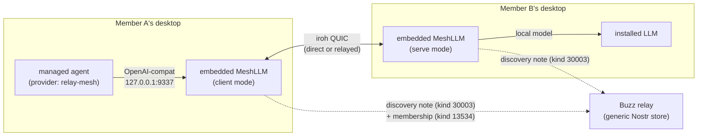

# Mesh compute

Mesh compute is Buzz's peer-to-peer shared LLM inference capability: a member's
desktop app can share this machine's local LLM inference with other members of
the same Buzz community, and any member's managed agents can, in turn, consume
that shared capacity as an LLM provider — all without a hosted inference
service. It is built on the external MeshLLM SDK
(`github.com/Mesh-LLM/mesh-llm`), embedded in the desktop app behind an
optional Cargo feature, and coordinated using Buzz's own relay purely as a
generic Nostr event store.

**Disambiguation.** "Mesh" names two unrelated subsystems in this codebase.
This node is about MeshLLM-based shared LLM compute only. It is **not** about
`crates/buzz-relay-mesh`, the inter-relay QUIC mesh that clusters relay pods
for horizontal scaling — that is a server-side transport concern with no
connection to LLM inference, gated by a separate `BUZZ_MESH` relay
environment seam. See *Boundaries and non-goals* below.

## How it fits together

- **Sharing (serve mode).** A member turns on "Share this machine" in
  Settings → Compute. The desktop app starts an embedded MeshLLM node that
  serves a locally installed model over an OpenAI-compatible ingress on
  `127.0.0.1:9337`, and begins publishing a client-signed discovery note
  advertising its MeshLLM owner identity and iroh endpoint.
- **Consuming (client mode).** A member's agent selects the `relay-mesh`
  provider ("Buzz shared compute"). Buzz translates that selection into an
  OpenAI-compatible transport pointed at the same local `127.0.0.1:9337`
  ingress; MeshLLM itself routes the request over its peer-to-peer transport
  to whichever member is actually serving.
- **One slot, two roles.** A machine runs at most one mesh runtime at a time,
  and that single slot can be in serve mode or client mode — never both.
  Turning sharing on while consuming a peer's compute replaces the client
  runtime with a serve runtime.
- **Coordination via the relay, not a mesh-aware relay.** The discovery note
  is an ordinary NIP-51 bookmark-set event (kind 30003) with a reserved
  `d`-tag, deliberately chosen so any Buzz relay accepts and stores it through
  its existing generic path — the relay needs no mesh-specific handler at
  all.
- **Admission is Buzz's, transport and inference are MeshLLM's.** Whether a
  status note's signer is trusted to join the admission allowlist is decided
  from Buzz's own NIP-43 community membership roster (kind 13534), not from
  anything MeshLLM controls. Once admitted, actual transport (direct QUIC or
  MeshLLM's own encrypted iroh relays) and model routing are entirely
  MeshLLM's responsibility.
- **Model resolution.** Selecting the virtual `auto`/`mesh` model lets
  MeshLLM's router pick a target per request: a Mixture-of-Agents committee
  when two or more workers are reachable for that model, or a single served
  model when only one is available. A model named explicitly is passed
  through unchanged.

## Use cases

- **A community wants agent LLM inference without paying for or configuring a
  hosted provider.** Any member with spare local compute (and an installed
  model) can share it; other members' agents default to it without per-agent
  API keys.
- **An agent should always have *some* working LLM backend.** Setting "Buzz
  shared compute" with model "Default (auto)" as the agent-defaults provider
  means an agent with no pinned provider/model inherits it and resolves to a
  usable target whenever any member is sharing.
- **A developer needs to verify the real desktop → agent → LLM path.** The
  project's own local verification runbook exercises exactly this: share
  compute, set it as the agent default, start the built-in Fizz agent, and
  confirm a live channel reply — proving the harness, provider inheritance,
  and inference are all wired together, not just that a model is serving.

## Boundaries and non-goals

- **Not the inter-relay mesh.** `crates/buzz-relay-mesh` (the relay-clustering
  QUIC mesh behind `BUZZ_MESH`) is a different subsystem entirely — no shared
  code, no shared trust model, no connection to LLM inference. A reader
  looking for how relay pods discover and dial each other wants that crate,
  not this node.
  Constrained by the same `mesh_boot.rs` module boundary, that subsystem is
  its own candidate corpus node and is not documented here (see *Expected but
  not verified*).
- **Not a compute-provider (process placement) document.** This node
  describes mesh compute strictly as an *LLM provider* an already-running
  agent calls for inference. It does not describe where an agent's own
  runtime process executes — that is the sibling compute-provider
  documents' territory (#1041 backend-provider, #1042 kubernetes-provider,
  #1045 local-agent-compute, #1048 remote-agent-compute). None of those exist
  on `origin/launchpad` at this node's recorded revision, so this node
  carries no relationship to them; a future task may add one once they
  merge.
- **Local-only, by design and by enforcement.** A `relay-mesh`-provider agent
  can only be created with a `Local` backend — `normalize_relay_mesh` rejects
  any other backend outright — because the transport resolves to a loopback
  address that only exists on the machine actually running the mesh client.
  This is documented upstream as forced, not chosen. A reader who needs
  remote or containerized agent compute wants #1048 or #1042, not this
  concept.
- **Not the model catalog, download, or hardware-sizing UX.** The desktop
  feature also includes model catalog browsing, download progress, and
  hardware-based model suggestions (`desktop/src/features/mesh-compute/`).
  Those are implementation detail of the sharing UI, not part of the mesh
  compute *concept* itself, and are not catalogued here.

## Scope and omissions

**This document covers** what mesh compute is, how sharing (serve) and
consuming (client) roles work, how admission and routing are decided, how a
managed agent consumes it as the `relay-mesh` LLM provider, and its boundary
against the unrelated inter-relay mesh and against the process-placement
compute-provider documents.

**It does not cover, and these are gaps rather than silence:**

| Not covered here | Owned by |
|---|---|
| The inter-relay QUIC clustering mesh (`crates/buzz-relay-mesh`, `BUZZ_MESH`) | Not yet filed as its own corpus task at this node's recorded revision — see *Expected but not verified* |
| Where an agent's own runtime process executes (backend/kubernetes/local/remote providers) | #1041, #1042, #1045, #1048 |
| The full MeshLLM SDK's own internal design (routing, Mixture-of-Agents gateway internals, native runtime installation) | Upstream `github.com/Mesh-LLM/mesh-llm`, not this repository |
| Desktop model-catalog, download-progress and hardware-suggestion UX detail | `desktop/src/features/mesh-compute/` implementation itself |
| Full security-boundary detail (signature schemes, relay allowlist mechanics) beyond what is needed to place the concept | `docs/buzz-shared-compute-dev.md` §Security boundary |

**Expected but not verified when this node was written:**

- **No relationship was added to a node for `crates/buzz-relay-mesh`.** No
  such node exists on `origin/launchpad` yet. Whether one should be filed as
  a follow-up task is noted below as a candidate, not decided here.
- **The MeshLLM SDK version referenced by the project's own runbook
  (`docs/buzz-shared-compute-dev.md`, which narrates behavior "post-v0.72.2"
  and of "MeshLLM v0.73.1") was not reconciled against the current pinned tag
  `v0.75.1` in `Cargo.toml` beyond confirming both are compatible ("post-"
  language does not contradict a later pin). Whether the runbook's narrated
  behavior still holds unchanged at `v0.75.1` was not independently verified
  against MeshLLM's own changelog.
- **No live mesh session was exercised while authoring this node.** All
  claims above are read from source and from the project's own runbook and
  reference documents, not observed by running `just mesh=1 dev` end to end.
