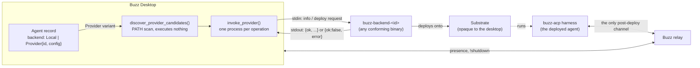

# Provider model

The **provider model** is the general contract Buzz Desktop uses to hand a managed
agent's execution to a substrate other than the desktop's own machine, without the
desktop needing to know anything about that substrate beyond one thing: an
executable on `PATH` named `buzz-backend-<id>` that speaks a fixed two-operation
JSON protocol. This document describes that contract in the abstract -- what every
conforming provider binary and the desktop must do, and what is deliberately left
for each binding to decide -- not any one provider's implementation.

## Definition

A **provider**, in Buzz's vocabulary, is an executable named `buzz-backend-<id>`
that the desktop discovers on `PATH` (plus its own executable's parent directory
and `~/.local/bin`) and invokes as a subprocess, one process per operation, to
deploy an agent onto a substrate the desktop never talks to directly
(`docs/remote-agents.md`, Abstract; `desktop/src-tauri/src/managed_agents/backend.rs:586-638`).
The **provider model** is the contract that makes this work regardless of which
substrate a given provider targets:

- **Discovery is passive and unprivileged.** The desktop scans for
  `buzz-backend-<id>` files and validates the trailing id against
  `^[a-z0-9][a-z0-9_-]*$`; it executes nothing during discovery
  (`backend.rs:586-638`, `640-677`).
- **The wire shape is exactly two operations.** `info` (returns the provider's
  name, version, `protocol_version`, description and a JSON Schema describing its
  configuration) and `deploy` (takes the agent payload plus that configuration,
  returns an opaque `agent_id`). Every exchange is one JSON object written to the
  child's stdin, one JSON object read back from its stdout, over one process per
  call (`docs/remote-agents.md` §Provider Protocol; `backend.rs:13-65`, `509-533`).
- **The protocol is versioned and the gate fails closed.** The desktop rejects a
  provider whose declared `protocol_version` it does not understand, and rejects
  a provider that declares none at all -- there is no population of pre-versioning
  providers to grandfather in (`backend.rs:11,13-65`).
- **The secret-bearing call is gated behind an identity check on the exact bytes
  that will run.** Before a `deploy` call -- which carries the agent's private
  key -- the desktop copies the resolved binary into a private, non-writable
  staging file, invokes `info` on that staged copy, checks its protocol version,
  and only then invokes `deploy` on the *same* staged copy. This closes a
  check-then-exec race where a binary could be swapped between being probed and
  being trusted with a key (`backend.rs:433-533`, exercised by
  `backend_tests.rs:146-192` and `:275-301`).
- **Persisted configuration cannot carry secrets.** `provider_config` -- the
  object a provider's own `config_schema` renders into the UI's settings form --
  is restricted to a small, flat, scalar-only object, and any field whose name
  looks like a secret is rejected outright (`backend.rs:536-566`).
- **The record-level switch is binary.** An agent's `backend` field is either
  `Local` (no provider involved at all) or `Provider { id, config }`
  (`desktop/src-tauri/src/managed_agents/types.rs:6-13`).

What is deliberately *not* fixed by this contract is what a given provider does
once `deploy` returns success: which substrate it targets, what its
`config_schema` asks the user for, and how it maps the agent payload onto that
substrate's own objects. `crates/buzz-backend-kubernetes` is one such binding --
built explicitly against this same wire contract
(`crates/buzz-backend-kubernetes/src/main.rs:1-9`, `wire.rs:1-30`) -- and is
evidence the model is genuinely substrate-agnostic rather than a Kubernetes
interface described as if general: a second, independently buildable binary can
conform to it without sharing any Kubernetes-specific code with the desktop.

## How the pieces fit together

After a successful `deploy`, the desktop holds **no** channel to the provider or
the substrate at all -- everything it subsequently learns about that agent (is it
alive? has it stopped?) comes from the relay, never from re-invoking the provider
(`docs/remote-agents.md`, design axiom M1). This is why the diagram draws the
desktop-to-substrate edge only through the provider binary at deploy time, and a
separate, independent desktop-to-relay edge for everything after.

## Use cases

A reader needs this concept before working on, or reasoning about, any of the
following:

- **Adding or debugging a new compute binding.** Anyone building a new
  `buzz-backend-<id>` binary (a systemd/SSH deployer, a different cloud
  substrate) needs to know which parts of the contract are fixed by the desktop
  (the wire shape, the discovery rule, the protocol-version gate) versus which
  parts are theirs to design (their `config_schema`, how they map the payload
  onto their substrate, how they observe their own substrate's readiness).
- **Reviewing a change to the desktop's provider-invocation code
  (`backend.rs`, `commands/agent_providers.rs`,
  `commands/agents/provider_deploy.rs`).** Understanding why binary resolution
  always re-validates against `discover_provider_candidates()` rather than
  trusting a cached path, and why `deploy` stages an immutable copy before
  sending secrets, requires understanding the trust boundary this model draws
  around an arbitrary, untrusted executable.
- **Explaining why remote agent status looks the way it does in the UI.**
  Because the provider model's wire protocol has no status, exec or log-fetch
  operation (§Definition), a reader troubleshooting "why doesn't the desktop
  just ask the provider if the agent is still running" needs to understand that
  the model was deliberately built without that channel -- the answer lives in
  relay presence, a different subsystem entirely.
- **Distinguishing a provider-model question from a specific-binding question.**
  "Why did `deploy` time out" is a binding question (Kubernetes scheduling, a
  systemd unit failing to start); "why did the desktop refuse to even attempt
  the call" is usually a provider-model question (protocol version mismatch,
  `provider_config` validation, discovery not finding the binary). Knowing
  which layer a symptom belongs to narrows where to look.

## Comparison

| | `Local` | `Provider { id, config }` |
|---|---|---|
| Discovery | none -- the harness is spawned directly by the desktop | `buzz-backend-<id>` resolved via `discover_provider_candidates()` |
| Wire protocol | none -- direct process spawn, in-process control | `info`/`deploy` JSON-over-stdio, one process per call |
| Desktop's post-start channel | direct process handle (can signal, observe exit) | none -- relay presence only (M1) |
| Where lifecycle knobs are resolved | desktop, applied directly to the spawned process | desktop resolves them into the `launch` block of the `deploy` payload; the provider applies them mechanically |
| Concept boundary | out of scope here -- `local-agent-compute.md` (#1045) | in scope here for the *model*; a specific binding (e.g. `kubernetes-provider.md`, #1042) is out of scope here |

`Local` is included in this table only to make the boundary of the provider model
visible by contrast -- it is not itself an instance of the model. See
*Scope and omissions* for where its own mechanics are documented.

## Scope and omissions

**This document covers** the provider model as an abstract contract: what a
provider binary is, how the desktop discovers and invokes one, the fixed shape of
the `info`/`deploy` wire protocol, the identity/staging gate that precedes a
secret-bearing `deploy` call, the `provider_config` validation rules, the
`Local`/`Provider` record-level discriminator, and the boundary between what this
contract fixes and what an individual binding supplies.

**It does not cover, and these are gaps rather than silence:**

| Not covered here | Owned by |
|---|---|
| The desktop-side provider machinery in implementation depth (staging, redaction, discovery caching, the Tauri command surface) as its own subject | `backend-provider.md` (#1041, unmerged) |
| The Kubernetes binding: pod shape, reconciliation state machine, GC, the create-intent fingerprint, Secret scheme | `kubernetes-provider.md` (#1042, unmerged) |
| Deploy state-machine mechanics, reconciliation ordering, and the five stated invariants (I1-I5) in depth | `lifecycle.md` (#1043) / `liveness.md` (#1044), both unmerged, and `docs/remote-agents.md` directly |
| Local agent spawn and its own lifecycle | `local-agent-compute.md` (#1045, unmerged) |
| Mesh/shared-compute agents, which the spec states are explicitly non-deployable through this model (`RELAY_MESH_PROVIDER` refusal) | `mesh-compute.md` (#1046, unmerged) |
| The remote agent as observed and managed once deployed (presence, stop, delete) | `remote-agent-compute.md` (#1048, unmerged) |

**No `relationships` in this node's front matter.** At the recorded revision,
`git ls-tree -r --name-only origin/launchpad -- launchpad/docs/corpus` carries no
`layers/compute/*` path at all: the five sibling documents this node is scoped
against are open, unmerged draft PRs from the same batch run, not nodes present on
`origin/launchpad`. A `relationships[].target` naming any of their ids would be a
hard validation error today. The first of them to merge is the moment to add the
edge back.

**Expected but not verified when this node was written:**

- **Whether every current or future `buzz-backend-<id>` binary in the repository
  actually conforms to this contract was checked for exactly one binding**
  (`buzz-backend-kubernetes`) as existence proof that the contract is
  substrate-agnostic. `docs/remote-agents.md` mentions a systemd/SSH deployer
  from PR #3449 as "the live example" of a second, differently-shaped binding,
  but that PR's source was not opened for this node -- its existence is reported
  as the spec text states it, not independently verified against a second
  binary's code.
- **Whether the Kubernetes binding still passes its own test suite at this
  node's recorded revision** was not re-run here; the claim that it conforms to
  the wire contract rests on reading its `wire.rs`/`main.rs` source, not on
  executing its tests.
- **The exact upper bound on a `!shutdown` graceful-stop tail**, discussed in
  `docs/remote-agents.md`'s Stop and Delete section as an open defect (Known
  Defect 7, no single derivable bound), is noted here only to support the claim
  that Stop is not a provider-model operation -- its own resolution is out of
  scope for this node and unverified beyond what the spec text already states.
