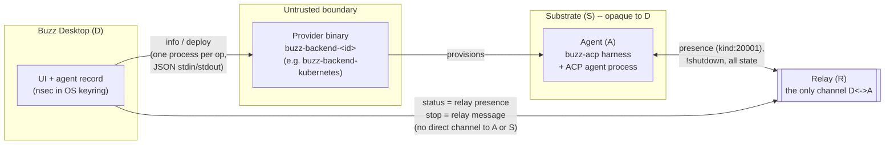

# Remote agent compute

Remote agent compute is the umbrella concept, not a description of any one binding: it
names the general capability for a Buzz-managed AI agent's harness process to run away
from Buzz Desktop's own machine -- on a Kubernetes pod, and (in active but unmerged
development) over SSH to a systemd unit, or on any future substrate a conforming
provider targets -- while the desktop keeps only a thin, revocable relationship to it.
This node is the corpus's single canonical entry point for that idea; it defines the
concept, states the invariants every binding shares, and explicitly declines to
re-describe any one binding's own mechanics.

## Definition

**Remote agent compute** is the design under which a Buzz-managed agent's `buzz-acp`
harness process runs on a compute substrate other than the machine running Buzz
Desktop, reached through a small, untrusted, zero-registration **provider binary**
(named `buzz-backend-<id>`) that Desktop discovers on its `PATH` and invokes as one
process per operation, and governed by a **deliberate absence of a persistent
management channel** from Desktop to the running agent: once deployed, Desktop's only
window onto the agent is the same Nostr relay every other Buzz client uses.

Three things this definition deliberately keeps separate, because each is easy to
collapse into the others:

- **The protocol is not the binding.** `docs/remote-agents.md` specifies a provider
  protocol (discovery, two JSON operations -- `info` and `deploy` -- and a
  reconciliation loop), a remote lifecycle model (five invariants every binding must
  honor), and, as one instance of both, the Kubernetes binding realized by the
  `buzz-backend-kubernetes` crate in this repository. This node documents the first
  two; the Kubernetes binding's own pod shape, image pinning, Secret lifecycle and
  garbage collection belong to a separate, binding-specific corpus node (see
  *Boundaries and non-goals*).
- **"Remote" is a substrate distinction, not a trust distinction.** The specification's
  own scoping note states the desktop is "one launcher among many": what makes a
  process a live Buzz agent is a keypair, a NIP-OA auth tag and a relay URL handed as
  environment to the harness, and *any* mechanism that can set that environment and
  `exec` the harness -- a bash script, a systemd unit, a CI job, or a provider binary --
  is a conforming launcher. The Kubernetes and (in-progress) SSH bindings are two
  concrete instances of "remote"; a hand-launched process on a machine other than
  Desktop's is a third, conforming today with no code change.
- **No management channel is the design constraint everything else follows from.**
  After a successful deploy, Desktop holds no exec, log-fetch, status-query or kill
  capability against the remote process. Status is relay presence; stop is a relay
  message; reconfiguration is a future re-deploy. The specification's own closing line
  states the consequence directly: "the relay was the management plane all along, and
  the desktop was only ever one of its doors."

## Visual aid

The diagram shows the shape every binding shares: Desktop never speaks to the
substrate or the agent directly. The provider is invoked once per operation and then
exits; everything that happens on the substrate afterward is invisible to Desktop
except through the relay.

## Background

The document that defines this concept, `docs/remote-agents.md`, states its own
governing complexity budget: "the complexity budget is spent in this document, not in
the code" -- each of the five invariants is enforced by one small, boring mechanism (a
refusal at payload construction, a key-shape validator, an ephemeral event the agent
already publishes, a name-plus-annotation compare, a timer firing an existing shutdown
channel) rather than by heavier machinery such as Leases, controllers or a genuine
management channel. Where a richer guarantee would have required that machinery, the
specification either found a name-and-timestamp argument that made it unnecessary, or
dropped the property and said so explicitly in its Non-Goals. This is presented as a
deliberate design stance, not an accident of scope: no management channel is treated as
the one property expensive enough, and central enough, that it is worth stating as a
formal design axiom (M1) rather than an implementation detail.

The reason "no management channel" is survivable at all is that the relay was already
the source of truth for everything else in Buzz -- messages, presence, reactions,
memory. Remote agent compute does not introduce a second source of truth for a remote
agent's state; it reuses the one the whole platform already depends on, at the cost of
a bounded staleness window (I3's 180-second presence bound) rather than the
instantaneous view a direct management channel would have provided.

## Use cases

- **Deciding where a managed agent's harness process should live.** An operator or
  power user choosing between "run this agent as a local Desktop-managed subprocess"
  and "run this agent on a substrate away from my machine" needs this concept to
  understand what changes (no direct control channel, presence-only status, a trust
  decision about the provider binary) and what does not (the ACP harness's
  conversational behavior is unchanged by where it runs).
- **Writing or evaluating a new provider binding.** Anyone building a `buzz-backend-<id>`
  executable for a substrate the Kubernetes binding does not cover -- the in-progress
  SSH/systemd binding is the live example -- needs the invariants and the three-layer
  conformance split (agent/harness, provider/deployer, binding policy) stated here
  before descending into any one substrate's mechanics.
- **Reasoning about the security boundary a provider crosses.** Because a provider
  binary is handed the agent's private key by design, understanding this concept is a
  prerequisite to understanding why the protocol's guarantees are about bounding
  Desktop's exposure to a hostile provider, not about making a hostile provider safe --
  a distinction the specification states as an explicit non-goal rather than an
  oversight.
- **Diagnosing "why does the agent's status look wrong."** Because status is derived
  exclusively from relay presence with a bounded staleness window, an operator seeing a
  stale-online remote agent needs this concept -- not the Kubernetes binding's pod
  internals -- to understand that the window is a known, bounded cost of the
  no-management-channel design, not a bug specific to one substrate.

## Comparison

At the recorded revision, exactly one binding of this protocol is merged into this
repository (Kubernetes, `buzz-backend-kubernetes`), so there is no comparison to draw
between shipped alternatives yet. One further binding is visible in active but
unmerged development (`buzz-backend-ssh`, block/buzz#3449) as a second conforming
instance of the same protocol on a different substrate. This section is deliberately
left without a comparison table rather than forcing one against an unmerged pull
request's design, which could drift or be abandoned before landing.

## Related resources

See `relationships` in this node's front matter for the corpus nodes this concept sits
beside:

- `architecture-context-ai-agent` -- the system-context view of the AI Agent actor,
  including the "one launcher among many" framing this node also draws on.
- `architecture-containers-agent-runtime` -- the container-level view of the agent
  runtime (`buzz-acp`, `buzz-agent`, `buzz-dev-mcp`, `sprig`), which names the
  remote-agent provider protocol as explicitly out of its own scope and assigns it to
  the same primary source this node documents.
- `architecture-deployment-kubernetes` -- the relay's own Kubernetes deployment
  topology, which explicitly and independently excludes `buzz-backend-kubernetes` /
  remote agent compute as "a distinct compute-provisioning concern," drawing the same
  boundary line from the other side.

The Kubernetes binding's own canonical document (a separate, not-yet-merged corpus
node, tracked as issue #1042) is deliberately not linked here as a `relationships`
target -- see *Boundaries and non-goals*.

## Boundaries and non-goals

**This node covers** the umbrella concept of remote agent compute: what "remote" means
in this specification, why the design forgoes a management channel, the five
invariants (I1-I5) that bind across any binding, and the three-layer conformance split
(agent/harness contract, provider/deployer contract, binding policy) that states which
obligations apply to which kind of launcher.

**It deliberately does not cover, and a reader looking for these should go
elsewhere:**

| Not covered here | Owned by |
|---|---|
| The Kubernetes binding's own mechanics: cluster auth, namespace/image handling, the pod shape, the entrypoint and launch ABI, Secret lifecycle and garbage collection, `provider_config`'s v1 field set | `docs/remote-agents.md`'s own "The Kubernetes Binding" section directly, and the not-yet-merged corpus node for issue #1042 (`layers/compute/kubernetes-provider.md`) once it lands -- not linked here today because its `id` does not exist on `origin/launchpad` yet (see the ledger's `git_ls_tree` entry) |
| The full wire contract for `info` and `deploy` (payload field lists, the pre-secret negotiation gate, the deploy state machine's per-row reconciliation rules) | `docs/remote-agents.md`'s "Provider Protocol" and "Deploy State Machine" sections directly; a candidate for its own procedure- or interface-shaped corpus node, not filed as of this writing |
| The ACP harness's conversational behavior itself (what an agent does with a prompt once it receives one) | `architecture-containers-agent-runtime`, governed unchanged by where the harness runs, per the specification's own Non-Goals |
| Malicious-provider containment and substrate security (Kubernetes RBAC, namespace isolation, secret-at-rest encryption) | Explicitly out of scope for the specification itself, per its own Non-Goals section; not a gap this node is positioned to close |
| The Auto-Stop inactivity mechanism's exact env-var contract and the harness-side Known Defects (the unimplemented reaper, the unpinned clean-exit contract, the shutdown-tail overrun) | `docs/remote-agents.md`'s "Auto-Stop" and "Known Defects" sections directly -- these are implementation-status claims that will change quickly and are exactly the kind of volatile detail this node's own corpus (per `standards/atomicity.md`'s boundary-case guidance on a stable concept versus a volatile detail) should not restate |

**Why the Kubernetes binding is named here at all, without being described.** A reader
arriving at "remote agent compute" needs to know at least one binding exists and is
shipped, or the concept reads as entirely hypothetical. This node names
`buzz-backend-kubernetes` and cites where its crate lives, and stops there -- every
claim about *how* it works is deferred to its own canonical node.

## Scope and omissions

**Expected but not verified when this node was written:**

- **The full wire-level `deploy` payload schema and the three-tier environment
  precedence rules (`launch.policy_env` / `launch.env` / authoritative tier) were read
  in the primary source but are not restated here**, deliberately -- they are
  provider-protocol mechanics, not the umbrella concept, and a future
  interface-shaped corpus node for the protocol itself is the more natural home for
  them than either this node or the Kubernetes-specific one.
- **Whether the in-progress SSH/systemd binding (block/buzz#3449) will land with the
  same invariants this node describes, or whether review changes them, is unverified**
  -- it is cited here only as TEAM_KNOWLEDGE corroborating that the protocol is
  designed for more than one substrate, not as a FACT about a shipped capability.
- **The eight items `docs/remote-agents.md` itself lists under "Known Defects at
  `28ae6cd21`"** (for example, that the deploy path does not yet check
  `protocol_version` before sending secrets, and that the inactivity reaper does not
  yet exist in the harness) were read but are not enumerated in this node's body; they
  describe implementation status at one commit and are the kind of volatile detail this
  concept-level node avoids restating, per the boundary this node draws against a
  "stable concept versus volatile detail" split.
- **No corpus node yet exists for the provider protocol's own wire contract** (as
  distinct from this umbrella concept and from the Kubernetes binding). Whether that
  becomes its own node, or is folded into a future interfaces-events-typed node, was
  not decided while writing this one, per this task's own instruction not to resolve a
  second concept discovered mid-draft -- named here as a candidate follow-up rather
  than filed.
