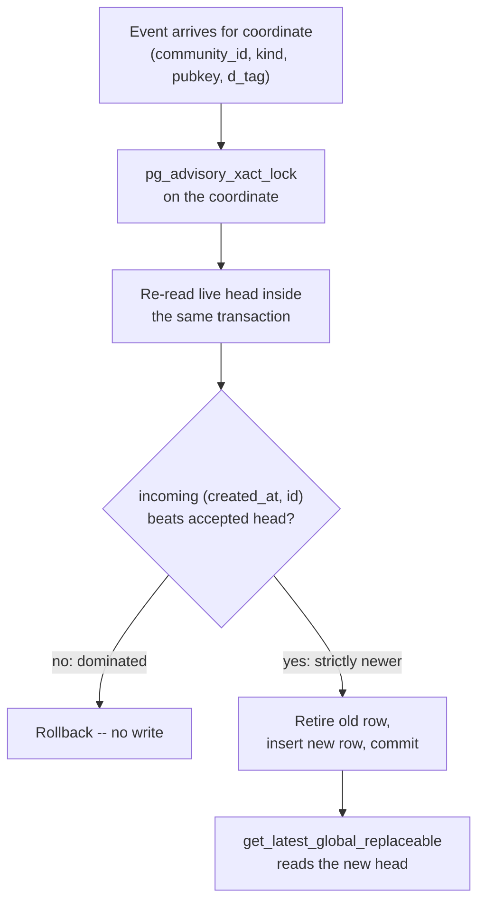

# The data layer's consistency model

## Definition

Buzz's data-layer **consistency model** is the specific set of guarantees the
relay's Postgres-backed event store makes about two, and only two, questions:
which write wins when two writes target the same addressable resource at
nearly the same time, and how stale a read is allowed to be. It says nothing
about ordering *across* different resources, and nothing about ordering across
different signers' independent writes to resources they do not share — Nostr
itself does not fix that order, and this model does not invent one on top of
it (see *Boundary and non-goals* below).

This model exists entirely downstream of one already-established fact: the
relay is the sole authority for Buzz application state, and every read and
write passes through it
([`architecture-principles-relay-is-source-of-truth`](../../architecture/principles/relay-is-source-of-truth.md)).
What follows here is *how* that single authority resolves a conflict and
*how* a reader is allowed to observe state that is not perfectly current —
questions that node does not itself answer.

## Visual aid

The tiebreak in the diamond is: greatest `created_at` wins; on an exact tie,
lowest event id wins (NIP-01/NIP-16 canonical ordering). This is the same
comparison on both the write path (`replace_parameterized_event`) and the
read path (`get_latest_global_replaceable`), so a reader that resolves an
addressable coordinate never sees a head the write path itself would have
rejected.

## Background

**Write-path resolution.** For NIP-33 parameterized-replaceable events (kind
30000–39999), `replace_parameterized_event` treats `(kind, pubkey, d_tag)` as
the identity of a single logical resource. It acquires a Postgres advisory
transaction lock scoped to that exact coordinate before touching any row, so
every concurrent writer targeting the same coordinate is serialized onto one
commit order rather than racing on ordinary row locks. Inside that lock it
re-reads the current live head and rejects the incoming event outright — no
row written, transaction rolled back — whenever the incoming event does not
strictly beat the accepted head under the created-at-then-lowest-id rule. A
few coordinate families (NIP-RS read-state markers, Buzz-mesh member-status
heartbeats) additionally hard-delete the superseded row and keep a compact
watermark, because only the live head has product value there; most NIP-33
kinds instead soft-delete and keep history.

**The same rule, reimplemented independently.** `buzz-core`'s engram
(agent-memory) subsystem does not call into `buzz-db`'s replacement logic at
all — it is a separate crate with its own pure `select_head` function — but
it resolves conflicting writes to the same memory slug with the identical
created-at-then-lowest-id comparison, citing NIP-01 in its own doc comment.
Its `monotonic_created_at` helper additionally guarantees that a *new* local
write is timestamped at `max(now, prior_head_created_at + 1)`, so a
same-process write to a coordinate it already holds the head for can never
tie or regress against itself. Two independent implementations converging on
the same tiebreak is a signal that the rule is the actual Nostr-level
contract (NIP-01/NIP-16), not an accident of one crate's SQL.

**No cross-signer ordering.** The tiebreak above resolves *one* coordinate.
It says nothing about the relative order of writes to *different*
coordinates, or about writes from different signers more generally.
`soft_delete_by_coordinate`'s own doc comment states this directly: a
same-coordinate replacement racing a NIP-09 deletion can resolve either way
depending on which the writer's transaction observes first, and "Nostr never
fixes the order of concurrent writes from different signers, and even
same-signer ordering is advisory." Both outcomes are valid Nostr orderings;
the function does not treat either as a correctness failure.

**Read-path freshness.** Reads do not all go to the single writer connection.
`replica_fence.rs` implements a proof that lets a read replica serve a
keyset-cursor page only when every row the page could contain is provably
present on it — combining a commit-time floor guard (a deferred trigger that
aborts a transaction inserting a channel-bearing row too far in the past to
be provable) with an ordered heartbeat handshake that produces a
monotonically-increasing token a reader session can observe and compare
against. Every failure mode named in the module — a probe error, masked
`pg_stat_activity` visibility, a missing heartbeat row, an epoch mismatch
(a restore/re-seed), or a reader whose observed token is older than
everything retained — routes the request back to the single writer rather
than serving a page that might be missing rows. This is the same fail-closed
discipline
[`architecture-principles-fail-closed-boundaries`](../../architecture/principles/fail-closed-boundaries.md)
documents for host binding and auth elsewhere in the relay, applied here to
read freshness specifically.

**Derived-state consistency.** Thread reply counters (`reply_count`,
`descendant_count`) are not computed by re-scanning replies on read. They are
incremented inside the *same* Postgres transaction that inserts the
triggering reply's `thread_metadata` row (`insert_thread_metadata`), so a
transaction that commits the reply also commits the counter change — there
is no window where the reply is visible but the counter has not yet caught
up, and no separate asynchronous recomputation job to fall behind.

## Use cases

- **Explaining a `buzz` CLI write conflict.** `buzz-cli`'s documented exit
  code 5 ("write conflict, NIP-33 LWW") is the agent-facing surface of the
  dominated-write rejection above: an agent's write to an addressable
  coordinate can be accepted-shaped but write nothing, and this model is what
  explains *why* — the coordinate already had a head at or after the
  attempted write's `created_at`.
- **Reasoning about a stale-looking read.** A page fetched through the relay
  can, transparently, have been served by a read replica. Understanding this
  model is what explains why that page is guaranteed *not* to be missing
  rows the fence has not proven present, rather than assuming every read
  necessarily reflects the absolute latest commit on the writer.
- **Deciding whether a race is a bug.** Two clients racing a delete against a
  replacement for the same coordinate can observe either outcome. Without
  this model, that looks like nondeterministic data corruption; with it, it
  is a documented, valid Nostr ordering that the code deliberately does not
  gate on.

## Related resources

See the `relationships` in this node's front matter for the two directly
connected corpus nodes (write authority; fail-closed discipline). The
primary source files behind every claim above are cited inline in the
evidence ledger rather than restated here, per this corpus's linking
standard.

## Boundary and non-goals

**This node does not cover, and these are gaps rather than silence:**

| Not covered here | Why |
|---|---|
| Redis pub/sub fan-out delivery guarantees (`buzz-pubsub`) | A different subsystem with its own delivery semantics; not inspected for this task. Realtime fan-out is not part of the durable-state consistency guarantees this node documents — a client that missed a pub/sub message still resolves correct state on its next `REQ`/read. |
| `buzz-relay-mesh`'s inter-pod gossip | Out of scope by the same reasoning `architecture-principles-relay-is-source-of-truth` already gives: the mesh's own module documentation states membership is only a hint and grants no ownership, so it is not a second source of truth this node needs to reconcile against. |
| `buzz-search`'s full-text index consistency with `events` | Not inspected for this task. Whether the search index is kept in sync transactionally or asynchronously is unknown here and is named as a gap below, not assumed either way. |
| A global total order across coordinates or across signers | Explicitly not part of this model — see *No cross-signer ordering* above. This is a boundary the model states, not an omission of coverage. |

**Expected but not verified when this node was written:**

- **Whether `buzz-search`'s indexing path is synchronous with the same
  transaction that writes `events`, or an asynchronous follower**, was not
  checked. If it is asynchronous, a search result could lag a direct-read
  result by an unbounded amount with no fence protecting it the way replica
  reads are protected; this is a real question the model above does not
  answer.
- **Whether any consistency guarantee changes under a multi-relay or
  multi-community deployment beyond what `architecture-principles-relay-is-source-of-truth`
  already discloses about `buzz-relay-mesh`** was not independently
  re-verified here; this node relies on that node's own disclosure rather
  than re-deriving it.
- **No load or chaos test was run against `replica_fence.rs`'s failure modes
  for this node.** The fail-closed behavior is read from the module's own
  doc comments and its unit tests' names and assertions, not exercised live
  against a real Aurora reader endpoint as part of authoring this document.
