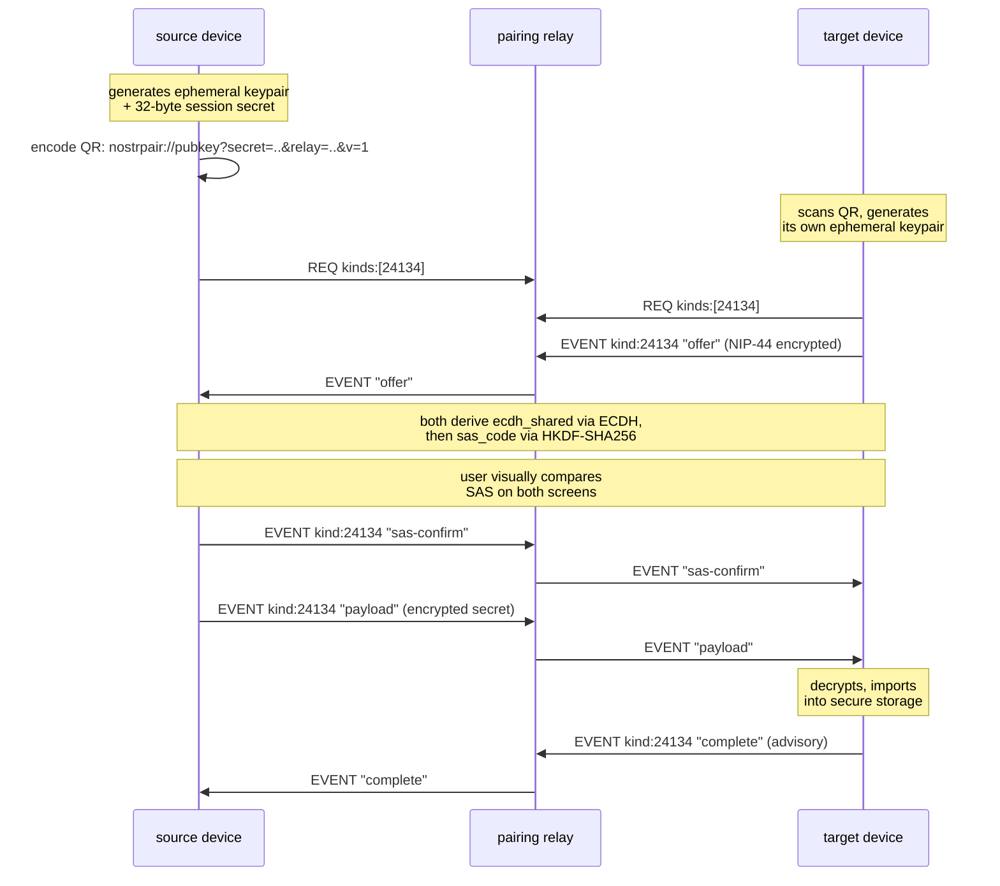

# Device pairing

Device pairing is how a Buzz identity gets onto a second device without ever
putting the raw secret on a wire the community relay — or anyone watching
it — can read. It is Buzz's implementation of NIP-AB, a draft Nostr protocol
for moving a secret between two devices over an untrusted relay.

## Definition

**Device pairing is the identity-layer mechanism that transfers a secret —
an `nsec` private key or a NIP-46 remote-signer session — from a device that
already holds it (the *source*) to a new device (the *target*), over an
ordinary Nostr relay, using a QR-code-initiated, end-to-end encrypted
handshake with a user-verified Short Authentication String (SAS).**

It is scoped to one live session between two devices already in the user's
possession. It is **not**:

- **The private key or keypair itself.** What is being transferred, and how
  it is stored once it arrives, are the identity-layer subjects `keypair`,
  `private-key` and `public-key` name (sibling tasks, unmerged at this node's
  recorded revision) — device pairing moves the secret, it does not define
  it.
- **Identity recovery.** NIP-AB assumes the secret is present and live on
  the source device at the moment of pairing. Recovering a secret that has
  been lost or is not currently accessible on any device is a different
  problem, owned by the `identity-recovery` node.
- **NIP-46 remote signing.** NIP-AB's own Motivation section draws this line
  itself: NIP-46 solves *ongoing delegation* — the key stays on one device
  and signs remotely, requiring that device online for every operation — while
  NIP-AB solves *one-time transfer* — the key (or a NIP-46 session bootstrap)
  moves, and the two devices then operate independently. The protocols are
  complementary: one of NIP-AB's own payload types (`bunker`/`connect`) exists
  specifically to bootstrap a NIP-46 session instead of moving raw key
  material.

## Protocol shape

Every event on the wire is `kind:24134`, NIP-44-v2-encrypted, and signed by a
throwaway ephemeral keypair discarded at the end of the session — the relay
sees only ciphertext addressed to a public key with no link to any real
identity.

## Background

NIP-AB exists because the alternatives it names in its own Motivation
section are each deficient for the one-time-transfer case: pasting a raw
`nsec` is insecure and unauthenticated in transit; NIP-46 remote signing
requires the signer device online for every operation rather than
transferring the key; a NIP-06 mnemonic is manual, error-prone, and not
universally supported by clients. NIP-AB's SAS step exists specifically to
give the user an out-of-band check against a relay-in-the-middle
substituting its own ephemeral public key for the real peer's.

The spec is versioned (currently only version `1` is defined: secp256k1
ECDH, HKDF-SHA256 key derivation, a 6-digit SAS, and NIP-44 v2 encryption),
and both the QR URI's `v` parameter and the `offer` message's `version`
field carry that version so a future algorithm change does not silently
break an older implementation.

## Where the pairing relay lives

A pairing session needs *some* relay that both ephemeral keypairs can reach,
but that relay does not have to be — and by design should not need to
be — the community's own `buzz-relay`. Buzz ships two ways a `kind:24134`
event can be routed:

1. **`buzz-pair-relay`**, a dedicated, ephemeral, loopback-only sidecar with
   no persistence, no auth and no history of its own, purpose-built for this
   traffic. A community relay can advertise its address to clients via the
   NIP-11 `pairing_relay_url` field, itself sourced from the
   `BUZZ_PAIRING_RELAY_URL` environment variable — so a client discovers the
   dedicated pairing endpoint rather than assuming a fixed address.
2. **`buzz-relay` itself**, whose event handler has explicit support for
   channel-less ephemeral events — `kind:24134` is named directly in its own
   code comment as an example — fanned out through a global Redis pub/sub
   key rather than a per-channel one.

Which of the two a given deployment actually uses is a topology decision,
not a protocol one; `architecture-deployment-multi-relay` covers that
decision in depth and this node does not repeat it.

## Use cases

- **Adding a second device to an already-provisioned identity** — the
  ordinary case: a user with the desktop app installed scans a QR code with
  their phone to bring the same identity onto mobile, without the `nsec`
  ever crossing the community relay in the clear.
- **Bootstrapping a NIP-46 remote-signer session** instead of moving raw key
  material, via the `bunker` or `connect` payload types — the target ends up
  with a signing relationship to the source rather than a copy of the key.
- **Interop testing and NIP-spec verification** — `buzz-pairing-cli`'s
  `source`/`target`/`test-vectors` subcommands exercise the full protocol
  end-to-end against a live relay and print every derived value against the
  spec's own fixed test keys, independent of the desktop or mobile clients.

## Client implementations

Both Buzz clients that hold identities implement NIP-AB against the same
`buzz-core` pairing module rather than each reimplementing the protocol:

- **Desktop** — `commands/pairing.rs` implements both roles: sending an
  identity (source) and recovering one (target). Deeper desktop detail is
  `architecture-containers-desktop`'s to cover, not restated here.
- **Mobile** — a dedicated `pairing/` feature directory (QR scan, pairing
  socket, pairing page) implements the same protocol as its own client.
  `architecture-containers-mobile` documents the mobile pairing surface in
  depth and is linked from this node's front matter rather than repeated.

## Non-goals and limitations

NIP-AB states its own boundary explicitly, and this node inherits it rather
than restating a softer version:

- **No ongoing security.** Once transferred, the secret's security is
  entirely the receiving device's problem from then on.
- **No key revocation.** There is no mechanism to invalidate a completed
  pairing after the fact.
- **No multi-device coordination.** Pairing N devices takes N separate
  sessions; there is no group or fan-out primitive.
- **No relay confidentiality.** The relay — whichever of the two above is in
  use — still observes pairing timing and frequency, even though it cannot
  read the payload.
- **No post-quantum security.** The ECDH exchange and NIP-44 encryption
  layer share the same limitation any secp256k1-based protocol has today.
- **A physical-presence assumption.** SAS verification depends on the user
  comparing two physical screens; it does not defend against an attacker
  with simultaneous physical access to both.
- **A single-use, time-boxed session.** The QR code exposes the session
  secret for up to 120 seconds, and the protocol is not designed for
  repeated or automated transfers.

## Scope and omissions

**This node covers** what device pairing is, the six-step NIP-AB protocol
shape, the two relay paths a `kind:24134` event can take, the `buzz-core`
crypto/session/QR modules that implement it, the desktop, mobile and CLI
client entry points, and the protocol's own stated non-goals.

**It does not cover, and these are gaps rather than silence:**

| Not covered here | Owned by |
|---|---|
| The private key / keypair concept being transferred | `keypair`, `private-key`, `public-key` (#1111, #1112, #1113 — unmerged at this node's recorded revision) |
| Recovering a secret that is lost or inaccessible on every device | `identity-recovery` (#1109 — unmerged) |
| Full desktop and mobile UI walkthroughs of the pairing flow | `architecture-containers-desktop`, `architecture-containers-mobile` |
| Which relay path (dedicated sidecar vs. `buzz-relay`'s own ephemeral routing) a given deployment topology chooses, and why | `architecture-deployment-multi-relay` |
| `buzz-pair-relay`'s specific hardening tightenings (rate windows, per-connection session caps, dedup TTLs) as implementation detail | Not yet filed as its own corpus task at this revision |
| The NIP-46 protocol itself, beyond NIP-AB's own `bunker`/`connect` bootstrap payload types | Not covered by any corpus node at this revision |

**No `relationships` edge to a sibling `layers/identity` node.** Checked
before deciding that rather than assumed: at this node's recorded revision
`origin/launchpad`'s corpus tree carries no `layers/` directory at all, so
none of `keypair`, `private-key`, `public-key` or `identity-recovery` has an
`id` yet for a `relationships[].target` to name. The boundary against each
is stated in prose above instead, per `standards/linking.md`'s guidance for
a real connection that does not yet resolve — the first of those siblings to
land is the moment to add the edge.

**Expected but not verified when this node was written:**

- **Which relay path — `buzz-pair-relay` or `buzz-relay`'s own ephemeral
  routing — any actual deployed community configures** was not checked
  against a live `BUZZ_PAIRING_RELAY_URL` setting; both paths are confirmed
  to exist in code, not which one a given community runs.
- **The Tamarin formal model referenced by the spec (`NIP-AB.spthy`)** was
  named in the spec's own text but not opened or run in this pass; this node
  makes no claim about what it proves.
- **Whether `buzz-pairing-cli` and the desktop/mobile clients stay
  byte-for-byte interoperable over time** was not independently verified
  beyond both implementing against the same `buzz-core` pairing module —
  sharing the module is evidence toward interoperability, not proof of it.
