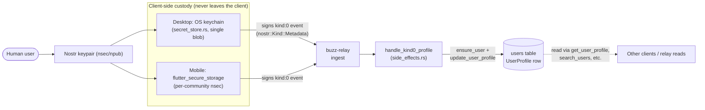

# Human Identity

A human user's identity in Buzz is a Nostr keypair, represented to the rest of the
system through a **kind:0 (NIP-01) profile-metadata event** that the relay syncs
into a community-scoped `users` row, with the **private key itself held only by
the client** — never by the relay.

## Definition

Concretely, a human identity has two parts, and this node's job is to describe both
without duplicating the node that already covers the human user as an architecture-
level actor (`architecture-context-human-user`, linked below).

**1. The public side: pubkey + kind:0 profile metadata, synced by the relay.**
`buzz-core` declares kind 0 as `KIND_PROFILE` (NIP-01: "User profile metadata").
When a client publishes a kind:0 event, `buzz-relay`'s `handle_kind0_profile` side
effect parses its JSON content and syncs four fields — `display_name` (or `name`),
`picture`/`image` as `avatar_url`, `about`, and a NIP-05 `nip05` handle — onto the
signer's row in the community-scoped `users` table (`UserProfile`: `pubkey`,
`display_name`, `avatar_url`, `about`, `nip05_handle`). Kind:0 is treated as
**absolute state**, not a patch: a field missing from the JSON clears the
corresponding column, because the sync path only ever passes `Some` values through
to the database write. A `nip05` value is additionally validated and canonicalized
against the community's own bound host — `alice@tenant-a.example` is only accepted
on `tenant-a.example`'s community, never on another tenant — and a value that fails
validation, or collides with another user's NIP-05 uniqueness constraint, is
silently dropped rather than causing the event itself to be rejected (the event was
already persisted by the time the side effect runs).

There is **no separate "human" row type**. The same `users` table, the same
`UserProfile` shape, and the same kind:0 sync path serve agent identities too — the
schema's own primary key is `(community_id, pubkey)`, and a human is simply a row
whose `agent_owner_pubkey` is null, meaning it is not itself owned by another
identity.

**2. The private side: the keypair, held only by the client.** A human's identity
is only as trustworthy as the private key that can sign as that pubkey, and that
key never reaches the relay or the `users` table. The desktop app stores it in the
OS keychain — `secret_store.rs` describes its purpose plainly as "OS keyring
access for desktop nsec private keys," keeping every secret as a single JSON blob
under one keychain entry so the OS prompts the user once per process rather than
once per key. The mobile app stores it with `flutter_secure_storage`, keyed per
community on a `Community.nsec` field (with a legacy single-community `buzz_nsec`
migration path). Reading one's own profile (`get_profile`) does not even consult
the `users` table — it queries the relay directly for the latest kind:0 event
signed by the caller's own pubkey; updating it (`update_profile`) does a
read-merge-write of that same JSON and re-signs a fresh kind:0 event with the
locally-held key.

## Diagram

The private key never crosses the right-hand boundary of the diagram: only the
*signed event* leaves the client, and only the *parsed profile fields* the event
carries end up in the `users` table.

## Use cases

A reader reaches for this node when they need to:

- **Understand how a display name, avatar, bio, or NIP-05 handle gets from a client
  into the rest of the system.** The path is always: client builds/merges kind:0
  JSON → signs and publishes it → relay's `handle_kind0_profile` parses and syncs
  it into `UserProfile` on the `users` row.
- **Reason about why a profile field silently reverted or disappeared.** Because
  kind:0 is absolute state, republishing an older cached copy of the JSON (missing
  a field a newer client version added) clears that field, and an off-domain or
  contested NIP-05 handle is dropped rather than rejected.
- **Trace where a human's private key material actually lives.** Never in
  `buzz-db`, never in the `users` table, never transmitted to `buzz-relay` — only
  in the desktop OS keychain or the mobile app's `flutter_secure_storage`, and only
  a signature (or a freshly signed kind:0 event) ever leaves the client.
- **Distinguish "identity" from "actor" or "boundary."** This node describes the
  representation mechanics; it does not restate who a human user is as a system
  actor or where the human/agent/relay/community boundary sits — that belongs to
  `architecture-context-human-user`, linked below.

## Comparison

| Concept | What it is | Where it lives |
|---|---|---|
| **kind:0 event** | The Nostr wire event a client publishes to declare/update profile metadata | Published by the client, ingested by `buzz-relay`; `KIND_PROFILE = 0` in `crates/buzz-core/src/kind.rs` |
| **`UserProfile` / `users` row** | The synced, queryable *result* of the latest kind:0 event — not itself a signed event | `crates/buzz-db/src/store/user.rs`; `migrations/0001_initial_schema.sql`'s `users` table |
| **Keypair custody** | The private key material proving control of the pubkey; never synced to the relay | Desktop: `desktop/src-tauri/src/secret_store.rs` (OS keychain); Mobile: `mobile/lib/shared/community/community_storage.dart` (`flutter_secure_storage`) |
| **Human user (architecture-context actor)** | The person as a system actor: their boundary, their relationship to agents, clients, the relay, and the community | `architecture-context-human-user` (linked below) — not restated here |

## Related resources

See the `references` relationship in this node's front matter, pointing at
`architecture-context-human-user` — the node documenting the human user as an
architecture-context actor, the client/relay boundary they sit inside, and their
relationship to agents, the relay, and the community. This node instead documents
the mechanics of how that actor's identity is represented and kept current: kind:0
profile sync plus client-side keypair custody.

## Scope and omissions

**This document covers** how a human user's identity is represented at the data
level (kind:0 profile-metadata events, synced into the community-scoped `users`
table via `UserProfile`) and how the private key backing that identity is
custodied client-side (desktop OS keychain, mobile secure storage) rather than by
the relay.

**This document does not cover, deliberately:**

- The human user as an architecture-context actor — their system boundary and
  relationship to agents, clients, the relay, and the community. That is
  `architecture-context-human-user`'s subject, linked above rather than restated.
- The generic "actor" naming convention (the authenticated pubkey performing a
  request, independent of whether it is human- or agent-owned). That concept does
  not yet have a node merged on `origin/launchpad` to link to at this node's
  recorded revision, so it is named here only as a boundary, not linked.
- Agent identity specifically (how an agent's `users` row and `agent_owner_pubkey`
  relationship work) — a related but separate node's subject once it exists.
- Authentication mechanics (NIP-42 for humans, NIP-98 for agents) — a separate
  concern from how identity is *represented*, already covered at the
  architecture-context level by `architecture-context-human-user`.
- Any detail of desktop's keyring backend selection beyond what its own module doc
  states (macOS legacy `keyring` crate vs. Windows/Linux `keyring` crate vs. the
  one-time Data Protection Keychain migration path) — implementation detail for a
  future container/component-level corpus node, not this one.

**Expected but not verified when this node was written:**

- Whether any code path other than `handle_kind0_profile` also writes to
  `UserProfile` fields (e.g. an admin/moderation tool, a migration script, or a
  workflow action) was not searched for beyond the one call site cited above and
  `workflow_sink.rs`'s own `update_user_profile` call for agent profiles, which
  this node does not describe in detail.
- Whether the mobile app's `flutter_secure_storage` configuration enables any
  platform-specific hardware-backed storage (e.g. Android Keystore, iOS Secure
  Enclave) versus its default backend was not inspected — only that the package is
  used and that it is where `nsec` is stored.
- Whether a human user can ever hold more than one active keypair/identity
  simultaneously within one community was not investigated; the `users` table's
  primary key (`community_id`, `pubkey`) suggests one row per keypair per
  community, but whether product UX ever presents multiple simultaneously was out
  of scope for this review.
