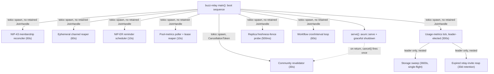

# Background workers

A **background worker** is a task spawned once at process start, independent of any
inbound connection or request/response cycle, that runs for the life of the process on
its own timer to keep durable state converged, reclaim expired or orphaned resources, or
fire time-based triggers. Reconciliation loops, GC/reap sweepers, and scheduled/cron jobs
are all instances of this one shape: no caller is waiting on their result, and their
correctness is judged by what state looks like *eventually*, not by any single
invocation's return value.

**What this is not.** A function whose name contains "reconcile" or "gc" is not
automatically an instance of this concept. `crates/buzz-backend-kubernetes/src/gc.rs` and
`reconcile.rs` run entirely inside one `deploy()` call, bounded by a 600-second operation
deadline — they reconcile *one* deploy attempt against cluster state and return, the same
shape as a retry loop inside a single request, not a standing timer. Similarly,
`buzz-relay`'s `BUZZ_RECONCILE_CHANNELS` dev/CI task retries at most 24 times over about
two minutes and then stops for good — a bounded startup fixup, not a worker that runs for
the process's life. Both are real code, both use reconciliation-shaped language, and
neither is what this node describes.

## Visual aid

## Use cases

**A developer adding a new periodic task** needs this shape before reaching for their
own: pick an interval and env var following the existing naming convention
(`BUZZ_*_INTERVAL_SECS`), decide honestly whether the task needs cross-pod coordination
(none, a Postgres advisory-lock leader as the usage-metrics tick uses, or a
claim-column compare-and-swap as the reminder scheduler uses), and decide whether the
task must observe a stop signal — `run_periodic_until_cancelled` is the one reusable
helper for that, and every other worker cited here shows what happens by default when a
task does not use it: nothing stops it early, and it is simply dropped when the runtime
shuts down.

**An operator tuning relay behavior** needs to know which interval env vars exist and
what a worker actually does on each tick before changing its cadence — for example,
lowering `BUZZ_STORAGE_SWEEP_INTERVAL_SECS` costs S3 `ListBucket` calls at the sweep's
own bounded rate, while lowering `BUZZ_POOL_METRICS_INTERVAL_SECS` also changes how
often expired deletion-serving leases are reaped, since that reap rides inside the same
tick.

**A reviewer of a new background task** needs to check, deliberately, whether the task
should be cancellable at shutdown and whether it needs cross-pod dedup — both are easy
to omit silently, as most of the workers cited here in fact do, and neither omission
fails any test on its own.

## Comparison

| Worker | Cadence | Cross-pod coordination | Cancellation-aware |
|---|---|---|---|
| NIP-43 membership reconciler | 60s (`BUZZ_NIP43_RECONCILE_INTERVAL_SECS`) | None — every pod reconciles independently | No |
| Ephemeral channel reaper | 60s (`BUZZ_REAPER_INTERVAL_SECS`) | `archived_at IS NULL` SQL guard (idempotent, not locked) | No |
| NIP-ER reminder scheduler | 10s (`SPROUT_REMINDER_SCHEDULER_INTERVAL_SECS`) | Claim-before-publish stamp, per-reminder | No |
| Community revalidator | 30s (`BUZZ_COMMUNITY_REVALIDATE_INTERVAL_SECS`) | None — each pod revalidates its own local sockets | Yes — `CancellationToken` via `run_periodic_until_cancelled` |
| Pool-metrics poller + lease reaper | 10s (`BUZZ_POOL_METRICS_INTERVAL_SECS`) | None | No |
| Usage-metrics tick | 300s (`BUZZ_USAGE_METRICS_INTERVAL_SECS`), jittered first tick | Postgres advisory lock (one leader pod) | No |
| Storage sweep (nested in usage tick) | 3600s (`BUZZ_STORAGE_SWEEP_INTERVAL_SECS`), single-flight | Runs only on the usage-metrics leader | No |
| Relay-invite reap (nested in usage tick) | Every leader tick, 30-day retention cutoff | Runs only on the usage-metrics leader | No |
| Replica freshness-fence probe | 500ms fixed (`PROBE_INTERVAL`, not env-configurable) | None — every pod probes its own writer connection | No |
| Workflow cron/interval loop | 60s fixed, not env-configurable | Durable per-fire claim row (all pods compute the same `scheduled_for`) | No |

## Background

Fire-and-forget `tokio::spawn` with no retained `JoinHandle` is the dominant shape in
this codebase, not an oversight isolated to one task — nine of the ten workers compared
above share it. The one exception, the community revalidator, does not achieve its
cancellation by holding the handle either: it uses a shared `CancellationToken` the task
checks against itself inside its own loop. This is a genuine architectural asymmetry —
most background workers here have no way to be told to stop, and are simply dropped
along with the rest of the process when the tokio runtime shuts down — rather than a
documented, decided trade-off; nothing in the cited code states this is intentional.
Whether it should stay that way is exactly the kind of question `layers/lifecycle/`'s
sibling nodes on graceful shutdown and cancellation exist to answer, not this one.

## Relationships

- **references**: `architecture-containers-relay` — the container almost every worker
  cited above is spawned from and runs inside.
- **references**: `architecture-flows-workflow-execution` — the canonical, detailed
  narration of the workflow cron/interval trigger path this node cites only briefly, to
  avoid duplicating its content.

## Scope and omissions

**This node covers** what makes a spawned task a background worker in this codebase (an
independent, process-lifetime timer loop with no caller awaiting its result), ten
concrete instances of that shape across `buzz-relay`, `buzz-db`, and `buzz-workflow`,
their cadence and cross-pod coordination strategy, and the two code shapes that use
reconciliation-shaped naming but are not instances of this concept.

**It does not cover, and these are gaps rather than silence:**

| Not covered here | Owned by |
|---|---|
| How any of these workers is stopped or drained at process shutdown, and the buzz-relay/buzz-acp graceful-shutdown sequence in general | `layers/lifecycle/graceful-shutdown.md` (#1118, unmerged as of this writing) |
| `CancellationToken` mechanics and cooperative-cancellation patterns in general, beyond naming that the community revalidator uses one | `layers/lifecycle/cancellation.md` (#1116, unmerged as of this writing) |
| The general concurrent-execution model (task scheduling, synchronization primitives) beyond what these specific workers happen to use | `layers/lifecycle/concurrency.md` (#1117, unmerged as of this writing) |
| Resource-cleanup semantics in general, beyond the specific GC/reap behavior narrated per-worker above | `layers/lifecycle/resource-cleanup.md` (#1119, unmerged as of this writing) |
| Process boot ordering and what must succeed before these workers are even spawned | `layers/lifecycle/startup.md` (#1120, unmerged as of this writing) |
| `buzz-acp`'s presence-heartbeat and agent-pool-wake background tasks | Not yet owned by any corpus node at the recorded revision |
| The workflow cron/interval trigger path's own detailed behavior (per-pod deterministic scheduling, durable claim rows, missed-fire non-replay) | `architecture-flows-workflow-execution` |
| Whether the fire-and-forget/no-cancellation pattern found across nine of the ten cited workers is an accepted trade-off or an unaddressed gap | Not decided by any source found while authoring this node — named as an open architectural asymmetry above, not resolved |

**Expected but not verified when this node was written:**

- **Whether any automated test exercises a full tick of each cited worker end-to-end**
  was not established. Names and line ranges were confirmed by reading the source
  directly; the corresponding test suites (if any) for the NIP-43 reconciler, ephemeral
  reaper, and reminder scheduler were not opened.
- **Whether `buzz-workflow`'s cron loop or any of the `buzz-relay` workers is ever
  aborted early in a test harness (e.g. via `JoinHandle::abort` in an integration test)**
  was not checked — this node's claim that no *production* code path retains a
  `JoinHandle` does not rule out a test-only one.
- **The sibling nodes this table names as "unmerged as of this writing" may have merged
  by the time this node is read.** Their content was read directly from their own task
  worktrees to confirm the `type: layers` precedent and to avoid duplicating their
  scope, but their `relationships` targets could not be added here because `AGENTS.md`
  requires a target to exist on the branch being merged into, and none of them did at
  authoring time.
