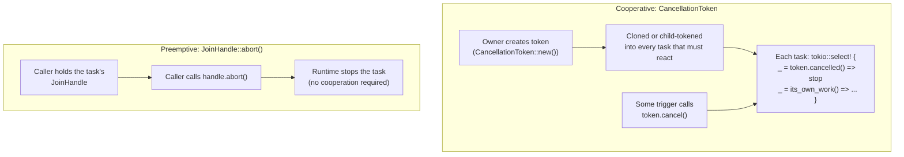

# Cancellation

## A note on `type`

`node.schema.json`'s `type` enum lists thirteen closed values, and `layers` is one of
them, described only as naming "the corpus surface this node documents," with no
further elaboration distinguishing it from its neighbors. `launchpad/docs/corpus/
templates/flow.md`'s own worked skeleton defaults an instance of that template to
`type: architecture`, reasoning that a flow node is a fourth member of the C4 model's
diagram family. This node departs from that default and uses `type: layers` instead,
for the same reason sibling tasks in this batch (`#1118`, `#1120`) each independently
disclosed in their own bodies: this node's parent, Feature `#611`, organizes its entire
task set under a `layers/lifecycle/` directory taxonomy — a cross-cutting
technical-behavior grouping (lifecycle, concurrency, cancellation, background work,
resource cleanup, startup) distinct from the structural C4 architecture family the
`architecture/` subtree already houses. Neither sibling's branch is merged to
`origin/launchpad` at this node's checked revision, so their reasoning was read
directly from their own worktrees as precedent, not cited as an authoritative merged
source, and is restated here independently rather than copied. Per
`standards/taxonomy.md` step 5, `type` may be revised later without touching this
node's permanent `id`.

Unlike `#1118` and `#1120` — each narrating one ordered, real sequence
(`layers/lifecycle/graceful-shutdown.md`, `layers/lifecycle/startup.md`) and so built
against `templates/flow.md`'s Sequence/Diagram/Outcome shape — this node's subject is
a mechanism used identically across several unrelated contexts, not one sequence. Its
own issue (`#1116`)'s definition of done asks for a one-sentence definition,
boundaries/non-goals, links to related concepts, and examples used only to clarify —
`templates/concept.md`'s Definition/Use cases/Relationships/Scope-and-omissions shape,
which this node follows instead.

## Definition

**Cancellation** is the mechanism Buzz's own code uses to stop in-flight asynchronous
work before it would otherwise complete on its own — closing a WebSocket connection
mid-session, killing a shell command a caller no longer wants, or tearing down a
huddle-audio owner lease — rather than waiting for that work to finish or fail
naturally. Two distinct primitives implement it, and telling them apart matters more
than either one alone:

- **Cooperative cancellation**, via `tokio_util::sync::CancellationToken`: a shared
  signal a task must itself observe, typically by racing `token.cancelled()` against
  its own work inside a `tokio::select!`. A task that never checks the token is never
  stopped by it.
- **Preemptive cancellation**, via `tokio::task::JoinHandle::abort()`: the runtime
  stops the task on the caller's behalf, whether or not that task's own code checks
  anything. `docs.rs`'s reference documentation states plainly that awaiting an
  aborted task "most likely will fail with a cancelled `JoinError`" — the task does
  not get a vote.

Every cancellation site this node examined uses one or the other of exactly these two
primitives; no third cancellation mechanism was found in the code paths cited below.

## Visual aid



Both shapes appear together at one real call site (`crates/buzz-dev-mcp/src/shell.rs`,
see *Use cases*): a `CancellationToken` is raced against the command's own timeout,
and whichever fires first leads to `JoinHandle::abort()` calls on the two reader
tasks that were never going to check any token themselves.

## Use cases

**Per-WebSocket-connection cancellation (`crates/buzz-relay/src/connection.rs`).**
`ConnectionState` carries one `CancellationToken` (`cancel`), documented in its own
comment as the "Token used to signal graceful shutdown of this connection's tasks,"
created once per connection and cloned or child-tokened into every task the
connection spawns (`connection.rs:79-80,132`). Three genuinely different things
trigger it on the same field:

1. **Sustained backpressure.** `ConnectionState::send` cancels its own connection
   directly once a slow client's outbound buffer has stayed full for `grace_limit`
   consecutive sends, protecting server memory from an unbounded queue
   (`connection.rs:95-118`).
2. **A locally-owned deadline.** A dedicated auth-timeout task races
   `tokio::time::sleep(AUTH_TIMEOUT)` against `auth_timeout_cancel.cancelled()`; if the
   sleep wins and the connection is still unauthenticated (NIP-42), the task cancels
   itself (`connection.rs:251-272`).
3. **Orderly local exit.** Once `recv_loop` returns on its own (EOF, protocol error, or
   a client-initiated close), `handle_active_connection` explicitly calls
   `cancel.cancel()` before awaiting its sibling tasks' join handles — the reverse
   direction from the two triggers above: a task finishing normally proactively
   cancels the others, rather than one of them cancelling in reaction to a bad
   condition (`connection.rs:274-286`).

The same call site also demonstrates the token-hierarchy distinction: `send_cancel`
is a *child* token (`cancel.child_token()`, `connection.rs:233`), while
`heartbeat_cancel` and `auth_timeout_cancel` are plain *clones*
(`connection.rs:244,252`). Per `docs.rs`, cancelling a child does not cancel its
parent, while cancelling the parent still cancels every child — a one-way
propagation a plain clone does not have (a clone *is* the same token, so cancelling
it cancels every other clone too).

This same per-connection token is also what process-wide graceful shutdown uses as
one of its own triggers: `state.rs`'s `drain_all()` and `drain_all_jittered()` both
call `entry.cancel.cancel()` on every registered connection while queueing that
connection's restart-close frame (`state.rs:418-431,465`). This node documents the
token and its per-connection triggers; the shutdown sequence that also happens to
call it is `layers/lifecycle/graceful-shutdown.md`'s own subject (see *Scope and
omissions*), not re-narrated here.

**Per-MCP-request cancellation (`crates/buzz-dev-mcp/src/shell.rs`).** The `shell`
tool handler forwards `context.ct` — a `CancellationToken` field on
`rmcp::service::RequestContext<RoleServer>`, the `rmcp` MCP SDK's own per-request
context — into `shell::run` as its own `ct: CancellationToken` parameter
(`lib.rs:44-50`, `shell.rs:130-134`). `shell::run` races that token against the
command's own timeout in one `tokio::select!`:

```rust
tokio::select! {
    biased;
    _ = ct.cancelled() => { /* kill_group.kill_immediate(); reap; abort readers */ }
    r = tokio::time::timeout(timeout_dur, child.wait()) => { /* graceful kill on timeout */ }
}
```

(`shell.rs:218-274`, structure paraphrased for brevity — see the cited lines for the
exact code.) Both branches call `stdout_handle.abort()` and `stderr_handle.abort()`
on the two spawned reader tasks (`shell.rs:235-236,280-295`) — `JoinHandle::abort()`,
the preemptive primitive from the *Definition* section, used here because the reader
tasks themselves hold no `CancellationToken` and have no other way to be told to
stop reading from pipes that may still be open. This is the one call site this node
found where both primitives appear together, driven by two different trigger
origins (an external MCP cancellation vs. a self-imposed timeout) that converge on
structurally parallel, but not identical, cleanup.

**Per-huddle-owner-lease cancellation (`crates/buzz-relay/src/audio/join.rs`), cited
as a third, differently-shaped example rather than narrated in depth.**
`HuddleOwnerEntry` carries three separate tokens on one lease — `lost` ("cancelled by
the renewer on fenced loss"), `draining` ("cancelled by drain so peers close with
`Goodbye(Draining)`"), and `cancel` ("cancelled by release on room-empty ... and by
drain after the drain signal") — each answering a different question about *why* the
lease is ending, rather than one token overloaded for three meanings
(`join.rs:588-605`). This node cites the pattern (multiple independently-named
tokens on one unit of work) without narrating the room's full lifecycle, which risks
duplicating `#1119` (resource cleanup)'s subject; see *Scope and omissions*.

## Comparison

| | `CancellationToken` (cooperative) | `JoinHandle::abort()` (preemptive) |
|---|---|---|
| Who must act | The task itself, at an await point (`token.cancelled()` or `token.is_cancelled()`) | The runtime, on the caller's behalf — the task does nothing |
| A task that never checks it | Runs to completion, unaffected | Still stopped |
| Shareable across many tasks | Yes — clone or `child_token()` into as many tasks as needed | No — one `JoinHandle` per spawned task, one caller |
| Hierarchical | Yes — `child_token()` gives one-way parent-to-child propagation | No such concept |
| Seen in this node's examples | `connection.rs`'s per-connection token; `shell.rs`'s per-request token; `join.rs`'s per-lease tokens | `shell.rs`'s two reader tasks, which hold no token of their own |

Both primitives commonly appear side by side, as `shell.rs` shows: a
`CancellationToken` carries the *signal* that cancellation was requested, while
`abort()` is reached for when the thing that needs to stop (a task reading from a
pipe) was never given a token to check in the first place.

## Relationships

- `references`: `architecture-containers-relay` — the container `connection.rs` and
  `audio/join.rs`'s cancellation examples run inside.
- `references`: `architecture-containers-agent-runtime` — the container
  `buzz-dev-mcp` (the `shell.rs` example) is one of the three crates composing.

## Scope and omissions

**This node covers** `tokio_util::sync::CancellationToken` and
`tokio::task::JoinHandle::abort()` as Buzz's two task/request-cancellation
primitives, their cooperative-versus-preemptive distinction, the token-hierarchy
distinction between `.clone()` and `.child_token()`, and three worked examples of
where and why they are actually triggered in this codebase: per-connection
cancellation (backpressure, auth timeout, orderly exit), per-MCP-request
cancellation (an external client cancellation racing a self-imposed timeout), and
per-huddle-lease cancellation (multiple independently-named tokens on one unit of
work).

**It does not cover, and these are gaps rather than silence:**

| Not covered here | Owned by |
|---|---|
| Process-wide graceful shutdown sequencing — even though `drain_all()`/`drain_all_jittered()` call the exact per-connection token this node documents | `#1118` (`layers/lifecycle/graceful-shutdown.md`) |
| Background-worker start/stop lifecycle in general | `#1115` (`layers/lifecycle/background-workers.md`) |
| General concurrency coordination — semaphores, locks, task pools, ordering between concurrent tasks that are not being cancelled | `#1117` (`layers/lifecycle/concurrency.md`) |
| Resource cleanup and Drop-based teardown, including `shell.rs`'s own `KillGroup` last-resort drop-guard | `#1119` (`layers/lifecycle/resource-cleanup.md`) |
| Process startup | `#1120` (`layers/lifecycle/startup.md`) |
| The full huddle-audio owner-lease lifecycle (acquire, renew, release, fenced hand-off) beyond the one cited token structure | Not yet a corpus node |
| `rmcp`'s own internal implementation of `RequestContext.ct` and exactly what client message populates it | Not established by this node (see the INFERENCE entry in the evidence ledger); not yet a corpus node either |

**Expected but not verified when this node was written:**

- **`rmcp`'s source was not opened.** This repository's local dependency cache did not
  contain a vendored copy at the checked revision, so the claim that `RequestContext.ct`
  reflects an MCP `notifications/cancelled` message rests on the Model Context
  Protocol's well-known public contract, not on code this node's author read directly —
  marked `INFERENCE` in the evidence ledger accordingly, not `FACT`.
- **Whether any other subsystem uses a third cancellation mechanism** (a custom
  `AtomicBool` flag checked manually, for instance, distinct from both primitives named
  here) **was not exhaustively searched for.** The three examples in *Use cases* were
  found via a targeted `grep` for `CancellationToken` across `crates/`; a channel-based
  or flag-based cancellation idiom elsewhere in the codebase would not have surfaced
  from that search.
- **Whether `HuddleOwnerRegistry`'s `is_draining()` `AtomicBool` (`join.rs:585,625-627`)
  is itself a fourth cancellation-adjacent primitive, or purely a read-only gate distinct
  from the three `CancellationToken`s on the same struct, was not resolved here** — it
  is named in the *Use cases* citation range but not analyzed on its own terms, since
  doing so risks the same resource-cleanup/lifecycle overlap named above.
