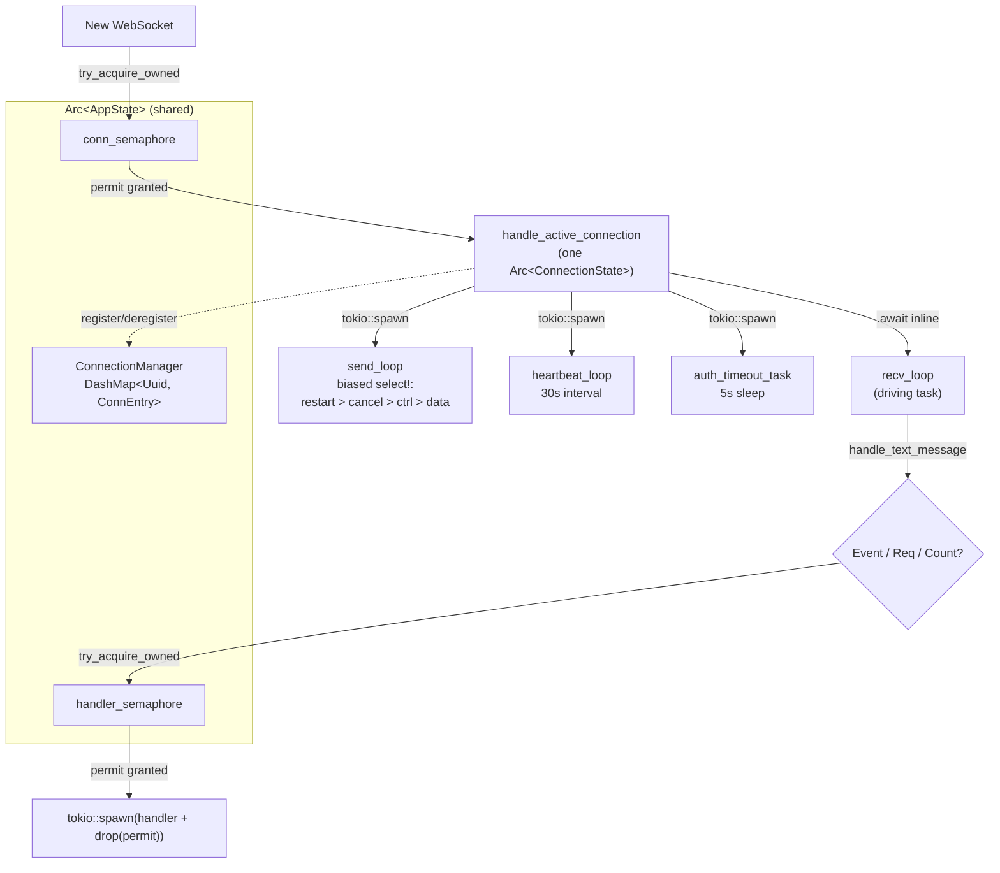

# Concurrency

## A note on `type`

`node.schema.json`'s `type` enum lists thirteen closed values, and `layers` is one of them,
described (both in the schema and in `schema/README.md`'s prose table) only as naming "the
corpus surface a node documents." This node uses `type: layers` because its parent, Feature
`#611`, organizes its entire task set under a `layers/lifecycle/` directory taxonomy — a
cross-cutting technical-behavior grouping (lifecycle, concurrency, cancellation, background
work, resource cleanup, startup) distinct from the structural C4 `architecture/` family this
corpus already houses. Sibling tasks `#1118` (graceful-shutdown) and `#1120` (startup) already
reasoned to the same conclusion for the same parent Feature; this node's own evidence ledger
restates that reasoning independently rather than quoting their text verbatim, since neither
sibling's branch is merged to `origin/launchpad` at this node's recorded revision.

## Definition

**Concurrency**, in `buzz-relay`, is the practice of running many independent units of work —
one WebSocket connection's read/write/heartbeat loops, one client message's handler, one
background worker — as separate `tokio` tasks inside a single OS process, all sharing access to
common state (an `Arc<AppState>`, a connection registry, a database pool) through primitives
chosen for *how* that access happens rather than one lock protecting everything uniformly.
`buzz-relay`'s own `ConnectionState` doc comment states this discipline explicitly: `RwLock`
for state that is "read-heavy after initial auth," `Mutex` for state that is "write-heavy during
REQ/CLOSE," and no lock at all for values that are merely `Clone + Send` and need no
coordination (`crates/buzz-relay/src/connection.rs:56-59`). Concurrency here is not a single
mechanism — it is this repeated choice, made independently at each point shared state exists,
among locks (`Mutex`, `RwLock`), sharded concurrent maps (`DashMap`), bounded channels
(`mpsc`, `watch`), and admission-control counters (`Semaphore`).

**What this is not.** Concurrency is not parallelism guaranteed by extra CPU cores — `tokio`'s
multi-threaded runtime may or may not run two tasks on two cores simultaneously, and this node
makes no claim either way; it is not the same idea as *cancellation* (issue `#1116`'s subject:
how a task is asked to stop and unwinds), and it is not the same idea as *graceful shutdown*
(issue `#1118`'s subject: the process-wide sequence that stops admitting work and drains what
is in flight). Concurrency is the standing, steady-state shape of many tasks and shared state
coexisting; cancellation and shutdown are both *events* that act on that shape, not the shape
itself. See *Boundary* below for exactly where each sibling concept's territory begins.

## Diagram

## Use cases

An agent or developer needs this concept before touching `crates/buzz-relay/src/connection.rs`
or `state.rs` for several concrete reasons:

- **Adding a new per-connection field.** Without knowing the read-heavy/write-heavy/no-lock
  discipline already in use (`connection.rs:56-59`), a new field is likely to default to the
  wrong primitive — for example, wrapping something read on every message in a `Mutex` when an
  `RwLock` (or no lock at all, if it is `Clone + Send`) already fits the codebase's own pattern.
- **Adding a new bounded resource.** `AppState`'s four semaphores (`conn_semaphore`,
  `handler_semaphore`, `git_semaphore`, `media_upload_semaphore`, `state.rs:655-665`) are the
  established shape for "cap how many X can run concurrently" — a new bounded resource should be
  recognized as fitting this same shape rather than reinvented as a counter guarded by a `Mutex`.
- **Debugging connection-registry contention.** `ConnectionManager`'s choice of `DashMap` over a
  single `Mutex<HashMap>` (`state.rs:236-252`) is specifically about avoiding one process-wide
  lock across every connection's register/lookup/remove — a developer investigating a
  contention or throughput issue in the registry needs to know this is deliberate, not an
  oversight to "fix" by wrapping it in a coarser lock.
- **Reasoning about message ordering and priority.** The biased `tokio::select!` in
  `send_loop_inner` (`connection.rs:346-397`) encodes a specific priority order (restart close >
  cancellation > control frames > data frames) as *code structure*, not configuration — anyone
  reordering or adding a branch to that `select!` needs to understand why the existing order
  exists before changing it.

## Comparison

| Primitive | Used for | Representative site |
|---|---|---|
| `tokio::sync::Semaphore` | Bounding how many concurrent units of one kind of work are in flight (connections, spawned message handlers, git subprocess ops, media transcoding) | `state.rs:655-665`; acquired at `connection.rs:159`, `571`, `599`, `621` |
| `tokio::sync::RwLock` | Per-connection state that is read far more often than written (`auth_state`) | `connection.rs:70`, doc comment at `56-59` |
| `tokio::sync::Mutex` | Per-connection state that is written frequently relative to reads (`subscriptions`) | `connection.rs:32`, `180` |
| `std::sync::RwLock` (synchronous, not `tokio::sync`) | A value read/written with no `.await` inside the critical section (`ConnEntry::authenticated_pubkey`) | `state.rs:109` |
| `DashMap` | A concurrently-accessed map where many independent keys are registered/looked up/removed without one global lock (`ConnectionManager`'s connection registry) | `state.rs:236-252` |
| `mpsc::channel` (bounded) | Point-to-point delivery from many producers into one consuming loop, with backpressure from the bound itself (per-connection send/control channels; the audit worker's input queue) | `connection.rs:169-177`; `state.rs:796-800` |
| `watch::channel` | Broadcasting the latest value of something to every current and future subscriber (per-connection disconnect reason) | `state.rs:69`, `77-78` |
| No lock at all | Values that are `Clone + Send` and need no coordination (`send_tx`, `ctrl_tx`, `cancel`) | `connection.rs:59`, doc comment |

Each row exists because the corresponding access pattern is genuinely different — this table is
not an exhaustive catalogue of every concurrency primitive `tokio` or the wider Rust ecosystem
offers, only the ones this node found actually in use in the code it cites.

## Boundary

This node does not describe:
- **Cancellation** — how a task observes a `CancellationToken` firing and unwinds cleanly. Every
  code excerpt above that mentions `cancel`/`CancellationToken` is cited only to show where
  concurrent tasks coordinate, not to explain cancellation's own semantics; that is issue
  `#1116`'s subject.
- **Graceful shutdown** — the process-wide sequence (SIGTERM → grace period → drain → hard
  timeout) that stops admitting new work and drains what is already running. This node's
  per-connection task fan-out and its semaphores are *acted upon* by that sequence, but the
  sequence itself is issue `#1118`'s subject, already documented in that sibling's own
  `layers/lifecycle/graceful-shutdown.md` node (not linked here as a `relationships` edge, since
  that node is not yet present on `origin/launchpad` at this node's recorded revision).
- **Background-worker startup ordering** — which of `buzz-relay`'s roughly dozen `tokio::spawn`
  calls made before the listener opens must run before which other, and why. This node cites
  `tokio::spawn` only as a mechanism (a task starts running concurrently with its caller); the
  specific inventory and ordering of startup-time background tasks is issue `#1115`'s subject.
- **`buzz-acp`'s own concurrency shape.** The agent harness has its own concurrent structures
  (`AgentPool`, `JoinSet`-driven task draining) that this node's evidence ledger does not survey
  — see *Scope and omissions* below.
- **What a capability lets a user or agent do**, or the general durable contract of the
  WebSocket protocol surface — this node narrates only the concurrency *mechanism*, not the
  product-level behavior built on top of it.

**The tell, either way:** a claim about *how many tasks exist and how they share state* belongs
here; a claim about *what happens when one is asked to stop*, *what happens when the whole
process is asked to stop*, or *what work gets started at boot* belongs to one of the three
siblings named above.

## Relationships

- `references`: `architecture-containers-relay` — the container this concept's evidence (every
  cited excerpt is from `crates/buzz-relay/`) is drawn from; supporting context, no ownership or
  currency dependency implied.

No `layers/lifecycle/*` sibling node (`#1115`, `#1116`, `#1118`, `#1119`, `#1120`) is linked here:
none is present on `origin/launchpad` at this node's recorded revision (confirmed with
`git ls-tree -r --name-only origin/launchpad -- launchpad/docs/corpus`), so none is a valid
`relationships` target per `AGENTS.md` step 9's rule that a target must exist on the branch being
merged into. Each is instead named as a prose boundary callout above.

## Scope and omissions

**This node covers** `buzz-relay`'s per-connection concurrency model as a single, deeply-cited
worked example: connection admission via `Semaphore`, the four-task fan-out per connection
(`send_loop`, `heartbeat_loop`, `auth_timeout_task`, and the driving `recv_loop`), per-message
handler concurrency gated by a second `Semaphore`, the `DashMap`-based connection registry, and
the access-pattern-driven choice among `RwLock`/`Mutex`/no-lock/channels documented in
`ConnectionState`'s own doc comment.

**It does not cover, and these are gaps rather than silence:**

| Not covered here | Owned by |
|---|---|
| Cancellation semantics (`CancellationToken`, how a task unwinds on cancel) | `#1116` |
| The graceful-shutdown sequence (SIGTERM, grace period, drain, hard timeout) | `#1118` (`layers/lifecycle/graceful-shutdown.md`, not yet merged) |
| Background-worker inventory and startup ordering | `#1115` |
| `buzz-acp`'s own concurrency shape (`AgentPool`, `JoinSet`-based draining) | Not surveyed by this node; not yet a corpus node |
| The standing container structure of `buzz-relay` itself | `architecture-containers-relay` |
| The general WebSocket protocol contract (as opposed to the concurrency mechanism serving it) | `architecture/flows/websocket-connection.md` (not linked here — not re-verified at this node's recorded revision) |

**Expected but not verified when this node was written:**

- **Whether every concurrency primitive in `buzz-relay` was surveyed, versus only the
  `connection.rs`/`state.rs` sample this node cites, was not established.** Other files in
  `crates/buzz-relay/src/` (for example `mesh_boot.rs`, referenced only in passing by sibling
  `#1118`'s own evidence) may contain further primitives this node does not cite.
- **Whether `tokio`'s runtime actually schedules any two of the tasks this node names onto
  separate OS threads at any given moment was not measured** — this node describes the code's
  concurrency structure (independent tasks, shared state, chosen coordination primitives), not
  a runtime trace of actual parallel execution.
- **The relative performance of `DashMap`'s sharded-lock design versus a single `Mutex<HashMap>`
  for `ConnectionManager`'s actual production connection counts was not benchmarked by this
  node's author** — the code comment's own stated rationale (avoiding one global lock) is cited
  as the design intent, not as a measured performance claim.
