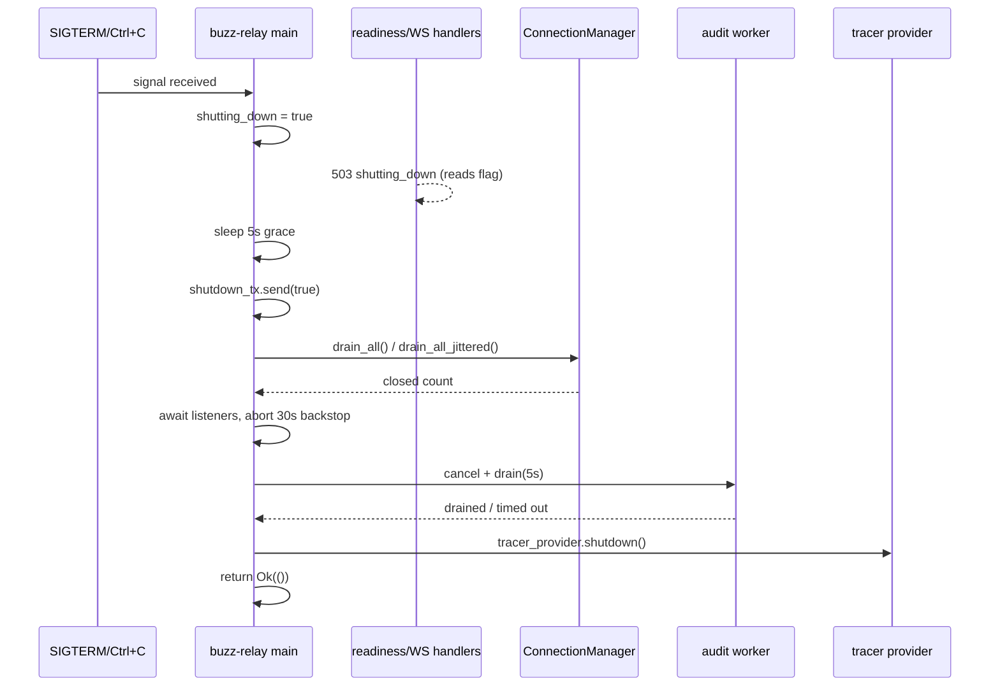
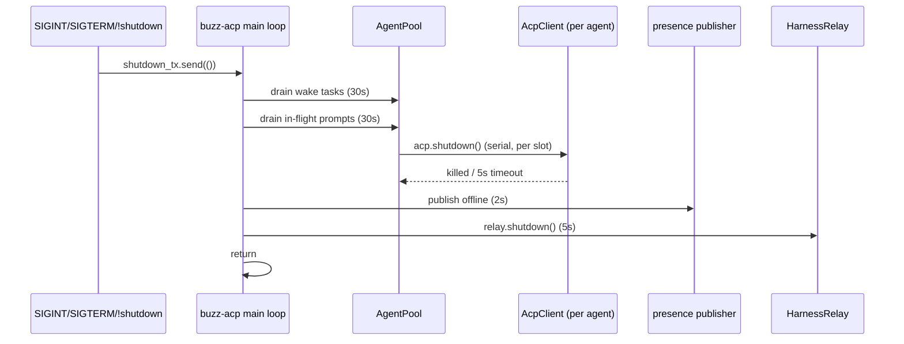

# Graceful shutdown: flow

## A note on `type`

`node.schema.json`'s `type` enum lists thirteen closed values, and `layers` is one of
them, described (both in the schema and in `schema/README.md`'s prose table) only as
naming "the corpus surface a node documents" — with no further elaboration
distinguishing it from its neighbors. `launchpad/docs/corpus/templates/flow.md`'s own
worked skeleton defaults an instance of this template to `type: architecture`,
reasoning that a flow node is a fourth member of the C4 model's diagram family. This
node departs from that default and uses `type: layers` instead, because this node's
parent, Feature #611, organizes its entire task set under a `layers/lifecycle/`
directory taxonomy — a cross-cutting technical-behavior grouping (lifecycle,
concurrency, cancellation, background work, resource cleanup, startup) distinct from
the structural C4 architecture family the `architecture/` subtree already houses. A
sibling task in this same batch run, #1043, made the identical departure for the same
Feature; its own branch is not present on `origin/launchpad` and could not be read from
this worktree, so this section restates the reasoning independently rather than
quoting #1043's text, and marks the choice `INFERENCE` (confidence 0.7) rather than
`FACT` accordingly. Everything else about this node — required sections, evidence
expectations, the Mermaid `sequenceDiagram` form — follows `flow.md` unchanged; only
the `type` value differs from its worked skeleton.

## Flow statement

Buzz runs two long-running processes that must exit cleanly rather than dropping
in-flight work: `buzz-relay` (the WebSocket/HTTP server, `architecture-containers-relay`)
and the `buzz-acp` agent harness (`architecture-containers-agent-runtime`). Both are
triggered the same conceptual way — an external signal (SIGTERM/SIGINT) or, for
`buzz-acp`, an owner-authored `!shutdown` command over the relay — and both follow the
same shape: stop admitting new work, drain what is already in flight under a bounded
timeout, flush anything durable, then exit. This node narrates both sequences as one
"graceful shutdown" idea because they are the same lifecycle pattern applied to Buzz's
two server-shaped processes, not two unrelated behaviors; it does not narrate the
desktop or mobile client apps' own teardown, which is out of scope (see *Boundary*).

## Sequence

### buzz-relay

1. `shutdown_signal()` waits on Ctrl+C or, on Unix, SIGTERM — whichever fires first.
   (`crates/buzz-relay/src/main.rs:1407-1422`)
2. The spawned shutdown task stores `true` into `state.shutting_down` (an
   `AtomicBool`) and logs. (`crates/buzz-relay/src/main.rs:1295-1298`)
3. From this moment, `readiness_handler` returns 503 `{"status":"shutting_down"}`
   before any dependency check, and the WebSocket-upgrade handler independently
   refuses a successful upgrade with 503 `"relay restarting"` — a second check that
   exists because readiness alone only stops Kubernetes routing new traffic, not an
   upgrade already mid-flight. (`crates/buzz-relay/src/router.rs:374-384`,
   `crates/buzz-relay/src/router.rs:325-333`)
4. The task sleeps a fixed 5-second grace period, then sends `true` on the
   `shutdown_tx` watch channel every listener's `with_graceful_shutdown` future
   subscribes to. (`crates/buzz-relay/src/main.rs:1299-1302`)
5. Both the TCP and (if configured) Unix-domain-socket `axum::serve` listeners stop
   accepting new connections/requests the moment the watch fires; each still
   finishes serving requests already accepted. (`crates/buzz-relay/src/main.rs:1354-1372`,
   `crates/buzz-relay/src/main.rs:1389-1397`)
6. Immediately after sending the watch signal, a 30-second (`GRACEFUL_DRAIN_TIMEOUT`)
   backstop task is spawned that force-exits the process (`std::process::exit(1)`) if
   it fires before the sequence below completes.
   (`crates/buzz-relay/src/main.rs:1246`, `crates/buzz-relay/src/main.rs:1306-1311`)
7. Every live WebSocket connection is drained: `drain_all()` (synchronous close, the
   default) or `drain_all_jittered(jitter_ms)` (delayed close spread across
   `[1, jitter_ms]` ms, with a `RESTART_CLOSE_ACK_TIMEOUT` of 5s per connection) when
   `BUZZ_DRAIN_JITTER_MS` is configured non-zero.
   (`crates/buzz-relay/src/main.rs:1312-1320`, `crates/buzz-relay/src/state.rs:418-431`,
   `crates/buzz-relay/src/state.rs:465-507`)
8. Once every listener's `axum::serve` future has returned, the caller awaits the
   shutdown task's join handle and aborts the 30s backstop.
   (`crates/buzz-relay/src/main.rs:1375-1404`)
9. `main()` cancels `state.community_revalidator_cancel`, then calls
   `audit_shutdown.drain(Duration::from_secs(5))`, which cancels the audit worker's
   token and awaits its task bounded by 5 seconds; the worker itself closes its
   receiver on cancellation and drains every already-buffered entry before exiting.
   (`crates/buzz-relay/src/main.rs:1101-1109`, `crates/buzz-relay/src/state.rs:1325-1337`,
   `crates/buzz-relay/src/state.rs:800-832`)
10. Finally, if telemetry is enabled, the OTEL tracer provider's `shutdown()` flushes
    buffered spans (errors are logged, not fatal), and `main()` returns `Ok(())`.
    (`crates/buzz-relay/src/main.rs:1111-1118`)
11. If the optional inter-relay mesh (`BUZZ_MESH`) is enabled, a separate watcher on
    the same `shutting_down` flag gossips `draining=true` to peers and drains
    locally-owned huddle sessions — an additional reaction to step 2's flag, not a
    separate trigger. (`crates/buzz-relay/src/mesh_boot.rs:479-494`)

### buzz-acp

1. A `shutdown_tx` watch channel is fed by three independent sources: a SIGINT
   listener, a SIGTERM listener (Unix only), and — inside the main event loop — a
   relay-published kind:9 event whose content is exactly `"!shutdown"` and mentions
   this agent. The third source is an authorization crossing, not a bare content
   match: the event's `pubkey` is compared against the harness's cached owner
   pubkey, and the command is silently treated as an ordinary chat message (not a
   shutdown trigger) when the sender is not the owner. All three sources converge
   on the same downstream path once accepted.
   (`crates/buzz-acp/src/lib.rs:2314-2332`, `crates/buzz-acp/src/lib.rs:2737-2760`)
2. Wake-task drain: the same watch is re-sent (so an in-flight
   `initialize_agent_pool` observes it and reaps its own partially-spawned agents),
   then the harness waits up to 30s for every pool-wake task to finish, aborting the
   remainder if the timeout expires; any awakened pool whose result already arrived
   is reaped via `shutdown_agent_pool()`. (`crates/buzz-acp/src/lib.rs:3420-3442`)
3. In-flight-prompt drain: a second, independent 30-second grace period during which
   a loop drains the agent pool's `JoinSet` and result channel, explicitly calling
   `agent.acp.shutdown().await` on each checked-out agent as it is reaped rather than
   relying on `Drop`; remaining tasks are aborted if the grace expires.
   (`crates/buzz-acp/src/lib.rs:3444-3479`)
4. Serial reap: any results that arrived between drain and abort, every idle agent
   still sitting in a pool slot, and (after aborting in-flight respawn tasks) any
   already-completed respawn results — each one calls `agent.acp.shutdown().await`
   in turn, with no aggregate timeout wrapping this sequence as a whole.
   (`crates/buzz-acp/src/lib.rs:3480-3511`)
5. Each `AcpClient::shutdown()` call in steps 3-4 kills the agent's process group (or
   falls back to killing just the child), then waits up to 5 seconds for the child to
   exit before abandoning it — a per-agent bound, not a shared one.
   (`crates/buzz-acp/src/acp.rs:422-444`)
6. Presence heartbeat is cancelled, then (if enabled) `"offline"` presence is
   published under a 2-second timeout; none of publish-error, timeout, or success is
   treated as fatal to the sequence. (`crates/buzz-acp/src/lib.rs:3513-3530`)
7. `relay.shutdown()` sends a `Shutdown` command to the relay's background task and
   waits up to 5 seconds for it to finish before aborting it, so the relay connection
   closes with a WebSocket close frame rather than being dropped.
   (`crates/buzz-acp/src/lib.rs:3536-3538`, `crates/buzz-acp/src/relay.rs:958-974`)

## Diagram

### buzz-relay

### buzz-acp

## Outcome

**buzz-relay, success path.** Once `main()` returns `Ok(())`, every listener has
stopped accepting new work, every WebSocket connection has been sent a `1012 Service
Restart` close frame (or cancelled), the audit worker has flushed its buffer, and OTEL
spans have been flushed — the process then exits normally.
(`crates/buzz-relay/src/main.rs:1101-1118`)

**buzz-relay, failure/backstop path.** If the 30-second `GRACEFUL_DRAIN_TIMEOUT`
backstop fires before listener/connection drain completes, the process force-exits via
`std::process::exit(1)` immediately, skipping the audit drain and OTEL flush that would
otherwise run after `serve()` returns. Independently, if the audit worker does not
drain within its own 5-second timeout, `AuditShutdownHandle::drain` logs an error and
returns anyway — the process continues its teardown rather than blocking further.
(`crates/buzz-relay/src/main.rs:1306-1311`, `crates/buzz-relay/src/state.rs:1332-1335`)

**buzz-acp, success path.** All pool-wake tasks and in-flight prompts drain within
their 30-second windows, every agent is reaped via a bounded `AcpClient::shutdown()`,
presence is published `offline`, and the relay connection closes gracefully before the
process exits. (`crates/buzz-acp/src/lib.rs:3420-3538`)

**buzz-acp, degraded/unbounded path (Known Defect 7).** Each individual segment above
is independently bounded (30s, 30s, 5s per agent, 2s, 5s), but no code establishes a
shared deadline across the whole tail. `docs/remote-agents.md` documents this as a
requirement not yet met — "the harness MUST bound its total shutdown tail ... under one
shared deadline" with a reserved finalization slice (currently 2s + 5s = 7s) for
presence and relay close — and gives worst-case arithmetic of roughly 87 seconds at the
desktop's default agent parallelism (10) and roughly 197 seconds at the harness's
configured cap (32), both exceeding a 60-second Kubernetes grace period.
(`docs/remote-agents.md:893-917`)

## Boundary

This node does not describe:
- The standing structure of `buzz-relay` or the `buzz-acp`-based agent runtime as
  containers — see `architecture-containers-relay` and
  `architecture-containers-agent-runtime` for what each process is and how it is
  deployed; this node narrates only their shutdown behavior.
- What a capability lets a user or agent do — no capability-typed corpus node exists
  yet for either process to reference.
- The general, durable contract of the WebSocket protocol surface or the relay REST
  API that `buzz-acp` calls — only the specific shutdown-time behavior of each is
  narrated here.
- Fixing the buzz-acp shutdown-tail bound (Known Defect 7). This node documents the
  gap as it exists in code today and quotes the requirement `docs/remote-agents.md`
  states for it; implementing that bound is separately-owned work, per issue #1118's
  own "Out of scope: Changing runtime product behavior unless a separately linked
  implementation issue owns that change."
- The desktop and mobile client apps' own process teardown, or any provider-specific
  Kubernetes Pod termination mechanics (`terminationGracePeriodSeconds`, `preStop`
  hooks) beyond the one budget-arithmetic citation above.

## Relationships

- references: `architecture-containers-relay` — the container this flow's first actor
  (buzz-relay) is built from.
- references: `architecture-containers-agent-runtime` — the container this flow's
  second actor (the buzz-acp harness) is built from.

## Scope and omissions

**This node covers** the ordered, code-cited shutdown sequence of Buzz's two
long-running processes — `buzz-relay` (SIGTERM/SIGINT-triggered) and the `buzz-acp`
agent harness (SIGINT/SIGTERM/owner `!shutdown`-triggered) — from trigger through
drain to exit, on both the success path and the bounded/degraded paths each process
exposes, including `buzz-acp`'s documented but unimplemented shutdown-tail-budget
requirement (Known Defect 7).

**It does not cover, and these are gaps rather than silence:**

| Not covered here | Owned by |
|---|---|
| The standing structure of `buzz-relay` and the agent runtime as containers | `architecture-containers-relay`, `architecture-containers-agent-runtime` |
| Fixing buzz-acp's unbounded shutdown tail (Known Defect 7) | a separately-linked implementation issue, not #1118 |
| Sibling `layers/lifecycle/*` concerns — background workers, cancellation, concurrency, resource cleanup, startup | #1115, #1116, #1117, #1119, #1120 (drafted in this same batch, unmerged as of this writing) |
| Desktop/mobile client teardown and Kubernetes-provider-specific termination mechanics | not yet owned by any corpus node |

**Expected but not verified when this node was written:**
- **The exact commit `docs/remote-agents.md` cites for buzz-acp's shutdown code
  (`28ae6cd21`) was not checked against this node's own recorded revision.** Line
  numbers in this node's own evidence ledger were read directly from
  `crates/buzz-acp/src/lib.rs` at commit `338b4d0cf2dd76cc43964bb717ce9f0a94a9c7a5` and
  differ from the line numbers `docs/remote-agents.md` cites for the same code at its
  own, earlier commit — this node's line citations are current as of its own
  provenance entry, not as of `docs/remote-agents.md`'s.
- **Whether any automated test exercises `buzz-relay`'s shutdown wiring end-to-end was
  not established as absent by this node's author independently** — `main.rs`'s own
  `TODO(coverage)` comment above the shutdown task states plainly that the wiring has
  no automated test today, and this node repeats that claim from the comment rather
  than re-deriving it. (`crates/buzz-relay/src/main.rs:1268-1294`)
- **Whether `buzz-acp`'s `shutdown_drain_is_paced_and_lossless` test (`lib.rs:6886`)
  covers the full multi-segment sequence narrated here, or only one segment of it, was
  not read in full** — the test's existence was found by name search, not by reading
  its body against this node's Sequence section step by step.
- **The relationship between this node's `type: layers` choice and issue #1043's own
  drafted reasoning could not be cross-checked**, because #1043's branch is not present
  on `origin/launchpad` and was not readable from this worktree; the *A note on `type`*
  section above is independently reasoned toward the same conclusion, not a
  verification of #1043's actual text.
