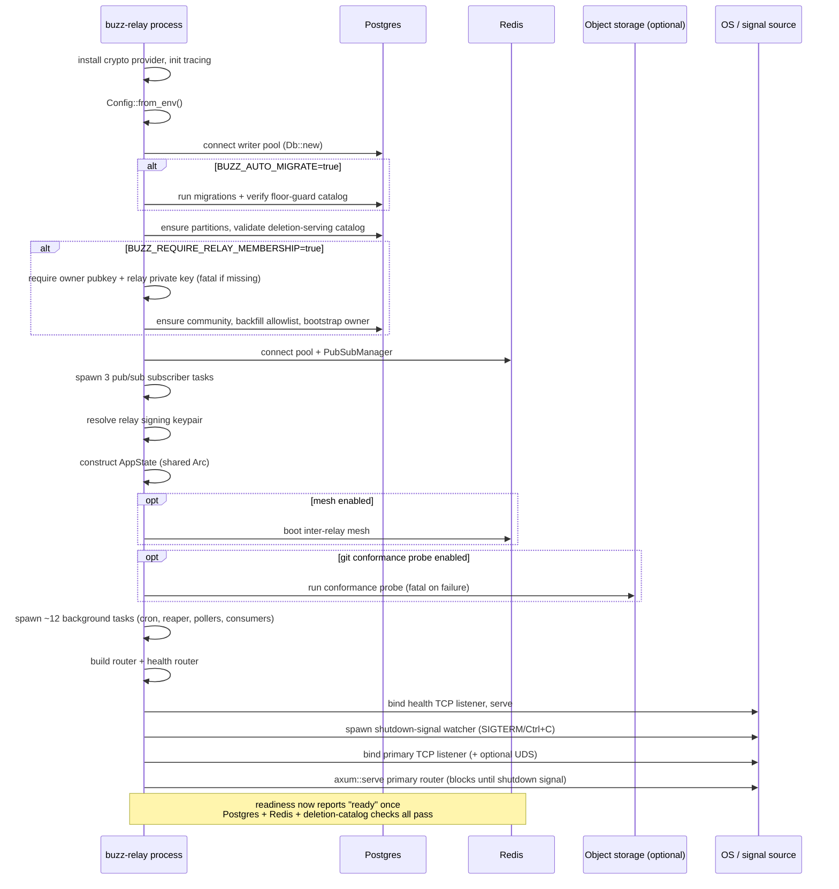

# buzz-relay startup: flow

## A note on `type`

This node carries `type: layers`, not `type: architecture` — a deliberate,
disclosed choice, not the `flow.md` template's own worked-skeleton default.
That default (`type: architecture`) is precedent specifically from the
`architecture/flows/*` family (12 nodes narrating flows across the C4 static
model this repository's `architecture/` corpus subtree already documents).
This task's target path is `layers/lifecycle/startup.md`, and parent Feature
`#611`'s own stated Outcome is "cross-cutting compute, telemetry,
configuration and runtime-lifecycle behavior" — the `layers` surface, not a
C4 diagram family. Per `standards/taxonomy.md`'s *Choosing a value* step 2
("pick the enum member whose plain-English name most concretely names the
node's primary subject... not where the node currently happens to live"),
`layers` is that concrete name here. This mirrors the same reasoning sibling
task #1043 (`layers/compute/lifecycle.md`) already applied and disclosed in
its own body. Per `standards/taxonomy.md` step 5, `type` may be revised later
without touching this node's permanent `id`.

## Flow statement

This node narrates one scenario: the `buzz-relay` process's own startup, from
process entry (`async fn main()`) to the point its readiness probe can first
report `ready`. The trigger is process launch — a container start, a local
`just relay`, or a process manager restart. Preconditions: a reachable
Postgres instance at `DATABASE_URL`, a reachable Redis instance at
`REDIS_URL` (or `rediss://` with TLS), and, if `BUZZ_REQUIRE_RELAY_MEMBERSHIP`
is set, a configured `RELAY_OWNER_PUBKEY` and `BUZZ_RELAY_PRIVATE_KEY`. The
actors are the `buzz-relay` process itself, Postgres, Redis, and — only when
optional features are enabled — an S3/MinIO-compatible object store (git
conformance probe) and peer relay processes (inter-relay mesh). Termination
of this flow is either a fully bound, request-serving process whose
readiness probe reflects live Postgres/Redis/deletion-catalog health, or a
fatal early exit on one of several fail-fast checks named in *Outcome* below.

## Sequence

1. Install the `rustls` `ring` crypto provider — required before any TLS
   connection (`rediss://`, `wss://`, or TLS media storage) is attempted
   later in startup (`crates/buzz-relay/src/main.rs:92-94`).
2. Initialize a JSON-structured `tracing` subscriber; attach an OpenTelemetry
   layer only if OTLP tracer construction succeeds (`crates/buzz-relay/src/main.rs:103-133`).
3. Load configuration (`Config::from_env()`). An invalid config is logged and
   returned as an `Err`, ending the process before any connection is
   attempted (`crates/buzz-relay/src/main.rs:142-154`).
4. Install the Prometheus metrics exporter (`crates/buzz-relay/src/main.rs:156-164`).
5. Connect to Postgres (`Db::new`) — the writer pool synchronously, and, if
   `read_database_url` is configured, a lazy read-replica pool that dials
   nothing until first use (`crates/buzz-relay/src/main.rs:166-186`).
6. If `BUZZ_AUTO_MIGRATE` is truthy, run database migrations
   (`db.migrate()` → `sqlx::migrate!("../../migrations")`, the repository-root
   `migrations/` directory) and re-verify the replica-fence floor-guard
   trigger catalog; otherwise skip migrations and log that they were skipped
   (`crates/buzz-relay/src/main.rs:188-198`, `crates/buzz-db/src/runtime/migration.rs:15,27-34`).
7. Ensure future table partitions exist, validate the deletion-serving-fence
   catalog (fatal on failure), then spawn the replica freshness-fence probe
   — deliberately after the migration decision, so an un-migrated relay can
   never open the fence over an unenforced floor guard
   (`crates/buzz-relay/src/main.rs:200-228`).
8. If `BUZZ_REQUIRE_RELAY_MEMBERSHIP` is set, fail fast unless both
   `RELAY_OWNER_PUBKEY` and `BUZZ_RELAY_PRIVATE_KEY` are configured — before
   any database mutation is attempted (`crates/buzz-relay/src/main.rs:230-252`).
9. Seed the deployment's own community (`ensure_configured_community`, host
   derived the same way request routing resolves a host), then backfill
   `pubkey_allowlist` entries into `relay_members`, then bootstrap the
   configured owner into the owner role — in that order, so enabling
   membership enforcement never locks out an already-allowlisted user
   (`crates/buzz-relay/src/main.rs:254-345`).
10. Backfill `d_tag` for any pre-existing NIP-33 parameterized-replaceable
    events (idempotent no-op once fully populated)
    (`crates/buzz-relay/src/main.rs:347-353`).
11. Optionally connect a dedicated audit-log Postgres pool if
    `BUZZ_AUDIT_ENABLED` (`crates/buzz-relay/src/main.rs:355-367`).
12. Create the Redis connection pool and `PubSubManager`, then spawn three
    background subscriber tasks (multi-node event fan-out, cross-pod cache
    invalidation, cross-pod connection control)
    (`crates/buzz-relay/src/main.rs:369-399`).
13. Construct `AuthService`, the search service (Postgres FTS, preferring
    the read replica when configured), and the `WorkflowEngine`
    (`crates/buzz-relay/src/main.rs:401-423`).
14. Resolve the relay's own signing keypair by strict precedence: configured
    private key, else a hardcoded dev keypair only if
    `BUZZ_REQUIRE_AUTH_TOKEN=false`, else panic
    (`crates/buzz-relay/src/main.rs:425-446`).
15. Validate and connect media storage (`crates/buzz-relay/src/main.rs:448-454`).
16. Construct `AppState::new` from every service built so far. From this
    point on, one shared `Arc<AppState>` backs every remaining startup step
    and every request handler (`crates/buzz-relay/src/main.rs:456-468`).
17. Optionally boot the inter-relay mesh (no-op if its kill switch is off;
    fatal on misconfiguration if the switch is on)
    (`crates/buzz-relay/src/main.rs:470-497`).
18. Optionally run the git object-storage conformance probe against the
    configured S3/MinIO backend (default-on; fatal on failure unless
    explicitly disabled) (`crates/buzz-relay/src/main.rs:499-535`).
19. If membership enforcement is on, reconcile NIP-43 membership snapshots
    once synchronously (warning-only on failure), then spawn a periodic
    reconciliation loop (`crates/buzz-relay/src/main.rs:537-577`).
20. Spawn roughly a dozen background tasks without awaiting any of them: the
    workflow cron loop, the ephemeral-channel reaper, the optional NIP-PL
    push matcher/worker, the NIP-ER reminder scheduler, the multi-node
    fan-out consumer, the cache-invalidation consumer, the community
    revalidator, the connection-control consumer, a pool-metrics poller, and
    a jittered usage-metrics poller (`crates/buzz-relay/src/main.rs:626-1099`).
21. Build the application router and health router
    (`crates/buzz-relay/src/main.rs:973-974`), then enter `serve()`: bind the
    health-probe TCP listener and spawn its `axum::serve` task first
    (`crates/buzz-relay/src/main.rs:1255-1261`).
22. Spawn the shutdown-signal watcher (SIGTERM on Unix, Ctrl+C otherwise) —
    it now runs concurrently with the remaining binds, waiting on the
    signal (`crates/buzz-relay/src/main.rs:1295-1328`, `main.rs:1407-1422`).
23. Bind the primary application TCP listener at `config.bind_addr`, and, on
    Unix, an optional Unix-domain-socket listener if `BUZZ_UDS_PATH` is set
    (`crates/buzz-relay/src/main.rs:1330-1362`).
24. Serve the primary router (and UDS router, if bound) via
    `axum::serve(...).with_graceful_shutdown(...)`, each subscribed to the
    same `watch` channel the shutdown-signal task will later send `true` on
    — this call blocks `main()` until that shutdown signal arrives, and is
    the handoff point to the graceful-shutdown sequence a sibling node
    (`#1118`) covers (`crates/buzz-relay/src/main.rs:1263-1267,1364-1398`).

## Diagram

## Outcome

**Success.** `main()`'s call to `serve()`'s `axum::serve(...)` blocks,
meaning the process is now accepting connections on its health listener, its
primary TCP listener, and (on Unix, if configured) its UDS listener. The
process is not fully "up" in the operational sense the moment a socket
binds, though: the readiness handler independently re-checks Postgres,
Redis, and the deletion-serving catalog on every request with a 2-second
timeout, and only returns `200 {"status":"ready"}` when all three currently
succeed (`crates/buzz-relay/src/router.rs:374-414`). The liveness handler,
by contrast, returns `200` unconditionally once reachable
(`crates/buzz-relay/src/router.rs:370-372`) — the two probes answer different
questions ("is the process alive" vs. "can it currently serve").

**Failure paths, each an early, fatal exit before the listener opens
(fail-fast, no partial-listening state):**
- **Invalid configuration** (`Config::from_env()` returns `Err`) — exits
  before any connection is attempted (`main.rs:142-154`).
- **Postgres connection failure** (`Db::new` `Err`) — exits before
  migrations or any further step (`main.rs:174-177`).
- **Migration failure** (only reachable when `BUZZ_AUTO_MIGRATE=true`) —
  exits with the migration error (`main.rs:188-198`).
- **Deletion-serving-fence catalog validation failure** — exits
  (`main.rs:204-207`).
- **Membership enforcement misconfigured**: `BUZZ_REQUIRE_RELAY_MEMBERSHIP=true`
  with a missing/invalid `RELAY_OWNER_PUBKEY` or missing
  `BUZZ_RELAY_PRIVATE_KEY` — exits before any DB mutation, by explicit
  design (`main.rs:230-252`).
- **Deployment-community host unresolvable, with membership required** —
  exits (`main.rs:268-273`); the same failure with membership *not*
  required is logged and treated as non-fatal, skipping backfill/bootstrap
  (`main.rs:274-278`).
- **Allowlist backfill or owner-bootstrap failure, with membership
  required** — exits; the same failures with membership not required are
  logged and non-fatal (`main.rs:307-319`, `329-344`).
- **Redis pool creation or `PubSubManager::new` failure** — exits
  (`main.rs:373,379`).
- **No configured relay private key with `BUZZ_REQUIRE_AUTH_TOKEN=true`** —
  panics (`main.rs:442-445`).
- **Invalid media configuration, or media storage init failure** — exits
  (`main.rs:450-453`).
- **Inter-relay mesh misconfigured, only if the mesh's own kill switch is
  on** — exits (`main.rs:475-482`); with the switch off, this step is a
  complete no-op.
- **Git object-storage conformance probe failure, only if the probe is
  enabled (its own default)** — exits (`main.rs:524-528`).
- **TCP or UDS listener bind failure** — exits, in `serve()`
  (`main.rs:1255-1257,1330-1332,1349-1350`).

None of these failure paths perform partial cleanup of already-opened
resources (pools, spawned background tasks) — the process simply exits, and
the OS reclaims sockets and connections. This is consistent with a
fail-fast, restart-oriented process model rather than an in-process rollback
model.

## Boundary

This node does not describe:
- **The compute-provider lifecycle** that creates, starts, and destroys the
  *substrate* (a Kubernetes Pod, today) a remote managed agent's compute
  runs on — a different flow entirely, already claimed by sibling task
  `#1043` (`layers/compute/lifecycle.md`, not yet merged at the checked
  revision).
- **The graceful-shutdown sequence** this node's *Sequence* step 24 hands
  off to (the `shutdown_tx` watch channel, the 5-second grace, the 30-second
  hard-drain timeout, jittered connection close) — sibling task `#1118`'s
  subject, not re-narrated here beyond naming the handoff point.
- **Buzz Desktop's own process boot** (`desktop/src-tauri/src/main.rs`) — a
  genuinely different flow: different trigger (a human launching the
  desktop app, not a deployment starting a server process), different
  actors (WebKitGTK/Tauri, not Postgres/Redis/the relay's background
  tasks), no shared code path with `buzz-relay`'s `main()`.
- **The per-connection WebSocket authentication handshake** (NIP-42) a
  client performs against an already-running relay — already covered by
  the existing `architecture/flows/websocket-authentication.md` node (not
  linked here as a `relationships` edge, since this node's own evidence
  ledger did not re-verify that node's content at this revision).
- **The inter-relay mesh's own internal wire protocol**, and **the git
  object-storage conformance probe's own algorithm** — both are optional
  steps this node names as steps 17-18, but neither's internal mechanics
  are documented here; no corpus node yet exists for either.
- **The standing container structure of `buzz-relay` itself** (what crates
  it composes, what it orchestrates) — that is
  `architecture-containers-relay`'s subject (see *Relationships*); this
  node covers only how that container comes to be running and serving.

## Relationships

- `references`: `architecture-containers-relay` — the container this
  flow's steps run inside; supporting context, no ownership or currency
  dependency implied.

No other merged node on `origin/launchpad` at the checked revision was
found to be a valid `relationships` target for this scenario (`git ls-tree
-r --name-only origin/launchpad -- launchpad/docs/corpus`, re-checked before
drafting): no `layers/*` sibling exists yet on `origin/launchpad` (this is
the first node in that surface there — `layers/compute/lifecycle.md`
exists only on the unmerged `origin/task/611-batch-1a-compute` branch), and
no `interfaces-events` node documents the NIP-43/NIP-33 wire behavior this
node's sequence touches.

## Scope and omissions

**This node covers** `buzz-relay`'s own process startup sequence, from
`async fn main()`'s first line through the point its primary listener is
serving and its readiness probe's contract is defined: configuration
loading, Postgres and Redis connection, the conditional migration decision
and its ordering relative to the replica-fence probe, the NIP-43
membership fail-fast checks and community/allowlist/owner bootstrap
ordering, the relay signing-keypair resolution precedence, the optional
mesh and git-conformance-probe gates, the roughly dozen background tasks
spawned before the listener opens, the listener-bind order (health, then
shutdown-signal watcher, then primary/UDS), and the liveness/readiness
probe contract that defines when startup is functionally "done."

**It does not cover, and these are gaps rather than silence:**

| Not covered here | Owned by |
|---|---|
| The compute-provider deploy/start/stop/destroy lifecycle | `#1043` (`layers/compute/lifecycle.md`, not yet merged) |
| The graceful-shutdown sequence this node's Sequence hands off to | `#1118` (sibling `layers/lifecycle/*` task) |
| Buzz Desktop's own process boot sequence | Not yet a corpus node |
| The per-connection WebSocket authentication handshake | `architecture/flows/websocket-authentication.md` (not linked as a `relationships` edge — see *Boundary*) |
| The inter-relay mesh's own internal wire protocol | Not yet a corpus node |
| The git object-storage conformance probe's own algorithm | Not yet a corpus node |
| The standing container structure `buzz-relay` composes | `architecture-containers-relay` |
| Background-worker startup ordering/dependencies in general (beyond the specific ordering facts cited above) | `#1115` (sibling `layers/lifecycle/*` task, `background-workers`) |

**Expected but not verified when this node was written:**
- **No test in this repository was found that directly drives `buzz-relay`'s
  `async fn main()` end-to-end and asserts on its startup ordering.** The
  function is exercised only indirectly, by integration and e2e tests that
  connect to an already-running relay process started out-of-band (for
  example via `just relay`). A targeted search of
  `crates/buzz-test-client/tests/` found no test that starts the relay
  binary itself and asserts on readiness transitions.
- **Whether the relative spawn order of the roughly dozen background tasks
  in step 20 is load-bearing beyond the two dependencies this node does
  cite** (the workflow cron loop must be spawned after its action sink is
  wired; the deployment-community bootstrap must precede allowlist backfill
  and owner bootstrap) **was not exhaustively checked.** Each task was read
  individually; whether any other pair has an undocumented ordering
  dependency is an open question this node does not resolve.
- **Whether `BUZZ_RECONCILE_CHANNELS`'s dev/CI-only reconciliation path
  (`main.rs:579-624`) is ever enabled in a real deployment** was not
  independently verified beyond the surrounding code comment stating it is
  a dev/CI pattern; this node omits it from the numbered *Sequence* on that
  basis rather than asserting it never runs in production.
