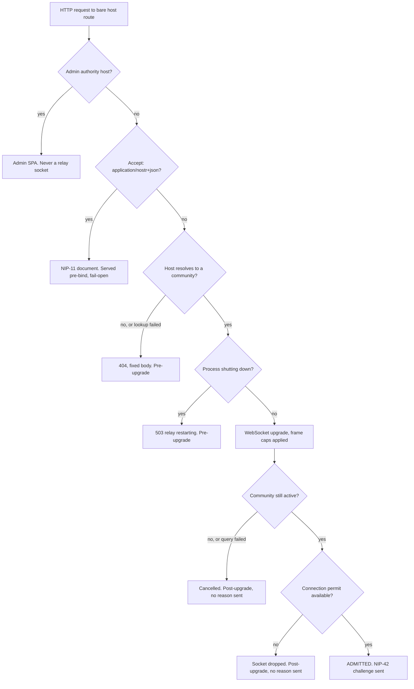

# Connection admission

**Connection admission is the set of decisions the relay makes about whether to let a
new socket exist at all — every one of them taken before the client's identity is
known.** This node explains admission as an idea: what kind of decision it is, what
information it is allowed to use, and how it is deliberately separated from the
authentication that follows it.

## Definition

A connection is *admitted* when the relay has agreed to hold a socket open for a
caller it cannot yet identify. Admission answers one question — **may this socket
exist?** — using only what the transport itself supplies: the request's `Host` header,
the deployment's current lifecycle state, and the process's remaining connection
budget. It never uses a client-asserted identity, because at admission time there
isn't one.

**What admission is not.** Three neighbouring ideas are routinely collapsed into it,
and this node means none of them:

- **Not authentication.** Whether the caller *is* who they claim is NIP-42's job, and
  it happens strictly afterwards — the AUTH challenge is generated only once the
  socket already holds a connection permit. An admitted connection is an anonymous
  one. See `architecture-flows-websocket-authentication`.
- **Not authorization.** Whether an authenticated pubkey may read a channel, publish
  an event, or moderate is decided per operation, long after admission closed.
- **Not rate limiting.** The relay has a module named `admission.rs`, and it is not
  about connection admission at all: it holds `check_principal`, a per-(tenant,
  pubkey) rate-limit helper, and `ws_admission_budget`, which widens a per-second
  limit into a five-second burst window. Those govern how much traffic an
  *already-admitted, already-authenticated* principal may send. **The name collides;
  the concepts do not.** If you are reading `crates/buzz-relay/src/admission.rs`
  looking for the connection door, you are in the wrong file — the decisions this node
  describes live in `router.rs`, `tenant.rs`, `state.rs` and `connection.rs`.

**And not the connection lifecycle.** The ordered narrative of what happens to a
connection from upgrade through authentication to teardown is owned by
`architecture-flows-websocket-connection`. This node isolates one slice of it — the
admission decisions — and says what makes them a coherent category rather than
retelling the sequence.

## How admission is shaped

Three properties hold across every branch above, and they are what make admission one
idea rather than six unrelated checks.

**It is ordered so that the tenant is bound before a frame is read.** Host resolution
is the first decision that can reject, and it runs before the upgrade — the relay's
own comment gives the reason as ensuring no frame is ever read on an unbound
connection. Everything downstream can therefore assume a resolved
`TenantContext` exists. The principle behind that ordering is
`architecture-principles-host-selects-community`; this node depends on it rather than
restating it.

**Every branch fails closed.** There is no default tenant, no fallback community, and
no "allow on error" path. A host that maps to nothing and a database that cannot be
reached produce the *same* rejection; an inactive-community check that errors is
treated exactly as an inactive community. See
`architecture-principles-fail-closed-boundaries`.

**Rejections are deliberately uninformative.** The unmapped-host rejection is a fixed
404 body that never echoes the host, so that a caller cannot use the door to enumerate
which communities a deployment serves. The 404 is not shared with the NIP-11 branch,
which is answered *before* binding and stays fail-open precisely so the metadata
document cannot leak which hosts are mapped either.

## Why admission looks like this

The two gates that are easiest to mistake for accidents both have recorded reasons in
the code.

The **shutdown refusal** exists because Kubernetes readiness is not sufficient: a
readiness probe returning 503 stops new routing, but direct dials and upgrades already
in flight still arrive during the pre-drain grace window. Refusing them at the door is
what turns a pod restart into a normal dial failure the client retries elsewhere,
rather than a socket accepted onto a dying process.

The **connection budget** is a plain counting semaphore sized once at startup from
`BUZZ_MAX_CONNECTIONS`. It is a process-wide resource ceiling, not a fairness
mechanism: it does not know about tenants, pubkeys or source addresses, so it protects
the relay from exhaustion but distributes nothing. The trait documentation in
`buzz-auth` describes a per-IP fence intended to sit at the network edge for exactly
that fairness role — and, at this revision, nothing calls it. `layers-data-redis-ttl-policy`
already records that gap in detail; it is named here because it explains why the
budget is the only quantity admission counts.

## Use cases

Understanding admission as a separate stage is what lets you answer questions that
otherwise get answered wrongly:

- **Diagnosing a client that "connects and then nothing happens".** Admission and
  authentication fail differently. A rejected *admission* yields an HTTP status before
  the upgrade or a socket that closes with no protocol traffic at all; a failed *auth*
  yields an established socket that received an `AUTH` challenge. Which of the two you
  saw tells you whether to look at host mapping and capacity or at signing and
  membership.
- **Interpreting a 404 from a relay you believe exists.** On this door a 404 means the
  `Host` header resolved to no community — not that the path is wrong. Adding a
  community row, or fixing the host the client sends, is the fix; retrying is not.
- **Sizing a deployment.** `BUZZ_MAX_CONNECTIONS` is one number covering two kinds of
  socket. A huddle-heavy community consumes the same budget the protocol sockets draw
  on, so capacity planning cannot treat them separately.
- **Writing a new WebSocket surface on the relay.** The comparison below is the
  checklist of decisions a new door must make, and the place where the existing two
  disagree is exactly where a new one is likely to get it wrong.

## Comparison: the two doors

Both WebSocket entry points enforce admission, and they enforce it differently. This
table is included to make the concept concrete, not to catalogue either handler.

| | Nostr relay socket (`/`) | Huddle audio socket (`/huddle/{id}/audio`) |
|---|---|---|
| Host binding | Before upgrade, generic 404 | Before upgrade, same generic 404 |
| Shutdown refusal | 503 `relay restarting` | **No shutdown check** |
| Connection permit | Taken **after** upgrade | Taken **before** upgrade |
| Refusal when budget is exhausted | Socket dropped, no close reason | HTTP 503 with a reason |
| Community-active recheck | Yes, post-upgrade | Not on this path |

The row that matters conceptually is the permit: the same semaphore, consulted on
opposite sides of the upgrade, produces a diagnosable HTTP response on one door and a
silent disconnect on the other. This node records the asymmetry as observed behaviour
and does not rule on whether it is intended.

## Scope and omissions

**What this node does not cover, and who owns it:**

| Not covered here | Owned by |
|---|---|
| The ordered connection lifecycle, task set-up and teardown | `architecture-flows-websocket-connection` |
| NIP-42 challenge/response, ban, allowlist and membership gates | `architecture-flows-websocket-authentication` |
| The relay crate's overall structure | `implementation-crates-buzz-relay` |
| Rate-limit mechanics, windows and Redis keying | `implementation-crates-buzz-auth`, `layers-data-redis-ttl-policy` |
| What `BUZZ_MAX_CONNECTIONS` and its siblings mean as configuration | `layers-configuration-relay-configuration` |
| Huddle audio's own protocol and session handling | `capabilities-huddles-audio-relay` |
| The WebSocket contract clients are tested against | `verification-contracts-websocket` |
| The admin-authority host concept — `is_admin_host` compares the raw `Host` header for exact equality with the configured admin host, without the normalization `bind_community` applies | Not yet filed as its own task at this revision |

**Expected to verify and could not:**

- **No test exercises connection-budget exhaustion on either door.** A repository
  search for `conn_semaphore` and for the `Connection limit reached` log line finds
  only the two production call sites and the state construction — no test drives the
  semaphore to zero, so neither the relay door's silent drop nor the audio door's 503
  is covered by an executable assertion.
- **No test was found for the `shutting_down` *upgrade* refusal.** Tests asserting a
  `relay restarting` close reason do exist, but they cover the drain path that closes
  *already-established* connections in `state.rs` and `connection.rs` — not the 503
  returned to a new upgrade attempt. `shutting_down` appears in `router.rs` only at
  the two production reads (the upgrade refusal and the readiness probe), with no test
  module exercising either.
- **The strongest admission test is opt-in.** `unmapped_host_fails_closed_generically`
  asserts both the fail-closed status and the generic body, but it is `#[ignore]`d and
  needs a live relay serving two hosts, so it does not run in an ordinary test pass.
  The empty-host and lookup-error fences *are* covered by ordinary unit tests in
  `tenant.rs`.
- **Neither `BUZZ_MAX_CONNECTIONS` nor `BUZZ_MAX_FRAME_BYTES` appears in
  `.env.example`.** Both were read from `config.rs`, where the defaults are 10,000 and
  512 KiB; an operator working from the environment template alone would not learn
  either knob exists.
- **No accepted decision record was found for the admission ordering.** The reasons
  quoted above come from comments in `router.rs` and `tenant.rs`, which are
  authoritative for current behaviour but are not a decision record; whether the
  two-door asymmetry was ever decided rather than accreted could not be established
  from the repository.
