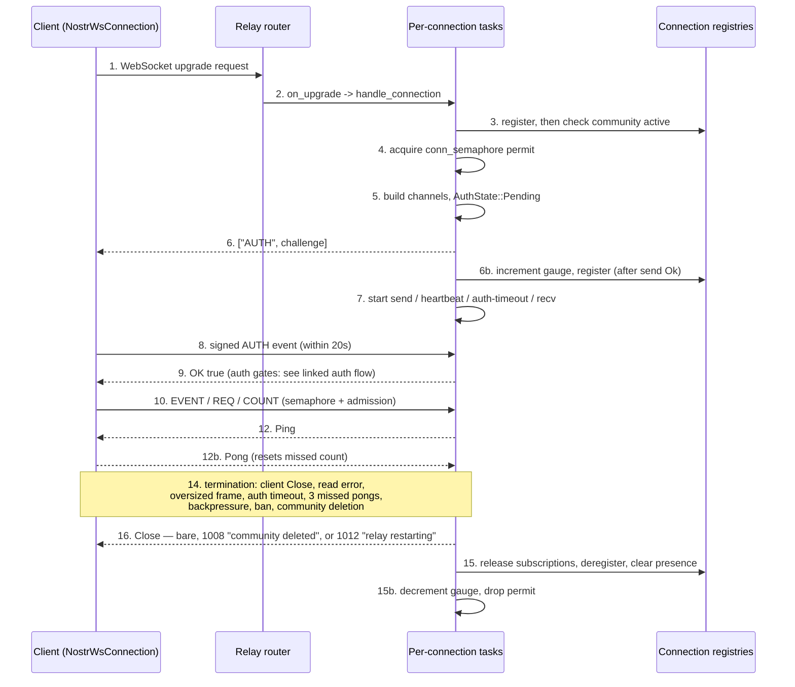

# Connection lifecycle: flow

## A note on `type`

`node.schema.json`'s `type` enum names the corpus *surface* a node documents, not
the prose form its body takes; it has no `flow` member.
`launchpad/docs/corpus/templates/flow.md`'s worked skeleton defaults a flow
instance to `type: architecture`, reasoning from the C4 diagram family. This node
departs from that default and uses `type: layers`, because its surface is the
networking layer: all 78 corpus nodes merged under
`launchpad/docs/corpus/layers/` carry `type: layers`, flow-shaped ones included
(`layers-lifecycle-graceful-shutdown` is itself a flow node with that value).
Everything else here follows `flow.md` unchanged.

## Flow statement

One WebSocket connection between a Nostr client and `buzz-relay`, from the moment
the client opens the socket to the moment the relay's writer emits the final Close
frame and releases the connection's resources. The actors are the **client**
(`buzz-ws-client`'s `NostrWsConnection`, the in-repo reference implementation), the
relay's **HTTP router**, the relay's **per-connection task set**, and the relay's
**connection registries**. The trigger is a client-initiated WebSocket upgrade
request to the relay's bare host route. The flow terminates when the shared
`CancellationToken` fires or the receive loop breaks — those converge — and ends
with the connection deregistered, its subscriptions released, and its semaphore
permit returned.

This node narrates the lifecycle as a two-sided sequence. The relay-internal
admission preconditions, the NIP-42 authorization gates and the trust boundaries
they draw are **not** restated here — `architecture-flows-websocket-connection`
and `architecture-flows-websocket-authentication` own them, and this node links
rather than duplicates. See *Boundary*.

## Sequence

**Open**

1. The client parses the relay URL and calls `connect_async`; `connect_authenticated`
   is that call followed immediately by `authenticate`.
   (`crates/buzz-ws-client/src/connection.rs`)
2. The relay's bare host route resolves the request host to a community with
   `tenant::bind_community`, refuses the upgrade with 503 if `state.shutting_down`
   is set, and otherwise hands the upgraded socket to `handle_connection`. The
   detail of those preconditions is `architecture-flows-websocket-connection`'s.
   (`crates/buzz-relay/src/router.rs`)
3. `handle_connection` allocates a connection UUID and a `CancellationToken`, then
   `run_registered_community_connection` registers the connection in the community
   registry *before* awaiting `is_community_active`; anything other than `Ok(true)`
   cancels and returns without the connection ever running.
   (`crates/buzz-relay/src/connection.rs`, `crates/buzz-relay/src/state.rs`)
4. `handle_active_connection` takes an owned permit from `state.conn_semaphore`.
   Failure returns before any channel or state exists. The permit is held in a
   binding dropped as the function's final statement, so its scope is exactly the
   connection's serving lifetime — the RAII shape `layers-lifecycle-resource-cleanup`
   describes generally. (`crates/buzz-relay/src/connection.rs`)

**Establish**

5. Three outbound channels are created with deliberately different capacities: a
   data channel sized from `config.send_buffer_size`, a control channel of capacity
   8 for Pong and Close, and a restart channel of capacity 1 that carries a flush
   acknowledgement. `ConnectionState` is built with `auth_state` at
   `AuthState::Pending { challenge }`. (`crates/buzz-relay/src/connection.rs`)
6. The relay's first outbound frame is `["AUTH", <challenge>]`, formatted by
   `RelayMessage::auth_challenge`. **State movement worth noting:** the
   `buzz_ws_connections_active` gauge is incremented and the connection registered
   with `ConnectionManager` only *after* that send returns `Ok`, so a client that
   disconnects before delivery leaks neither a gauge count nor a registry entry.
   (`crates/buzz-relay/src/connection.rs`, `crates/buzz-relay/src/protocol.rs`)
7. Four tasks now share one `CancellationToken` (the pattern
   `layers-lifecycle-cancellation` documents): `send_loop`; `heartbeat_loop`, on a
   30-second interval, cancelling after three consecutive missed Pongs; a one-shot
   `AUTH_TIMEOUT` task of 5 seconds that cancels unless `auth_state` is
   `Authenticated` when it fires; and `recv_loop`, which runs on the calling task
   rather than being spawned. (`crates/buzz-relay/src/connection.rs`)

**Authenticate**

8. The client waits up to `AUTH_CHALLENGE_TIMEOUT_SECS` (20) for the challenge,
   rejecting one longer than 1024 bytes and buffering any non-AUTH relay message
   that arrives while it waits; it then sends the signed AUTH event and waits up to
   `AUTH_OK_TIMEOUT_SECS` (20) for the `OK` bearing that event id, returning
   `WsClientError::AuthFailed` if the `OK` is not accepted.
   (`crates/buzz-ws-client/src/connection.rs`)
9. Relay-side, the AUTH frame reaches `handle_text_message`, which parses it,
   runs `enforce_ws_admission`, and dispatches `ClientMessage::Auth` **inline** on
   the receive task. What `handle_auth` then verifies, and the three authorization
   gates it runs after signature verification, are
   `architecture-flows-websocket-authentication`'s subject, not this node's.
   (`crates/buzz-relay/src/connection.rs`)

**Serve**

10. For every subsequent frame, `handle_text_message` parses and dispatches: AUTH
    and CLOSE run inline; EVENT, REQ and COUNT each try to take a
    `handler_semaphore` permit — replying with a rate-limited `NOTICE` or `CLOSED`
    and dropping the message if none is free — before running on a spawned,
    span-instrumented task. (`crates/buzz-relay/src/connection.rs`)
11. `enforce_ws_admission` returns `true` immediately for anything that is not
    EVENT, REQ or COUNT, and also for those three while the connection is not yet
    `Authenticated`; its per-principal sliding-window budgets therefore apply only
    to an authenticated connection's data-plane traffic.
    (`crates/buzz-relay/src/connection.rs`)
12. Keepalive runs beside the message protocol: an inbound Pong resets the
    missed-pong counter; an inbound Ping is answered on the priority control
    channel, and a control channel too full to accept that Pong is treated as
    terminal. (`crates/buzz-relay/src/connection.rs`)
13. Outbound backpressure is counted rather than buffered without bound:
    `ConnectionState::send` resets the shared counter on every successful
    `try_send` and increments it when the data channel is full; at the configured
    `grace_limit` it increments `buzz_ws_backpressure_disconnects_total` and
    cancels the connection. (`crates/buzz-relay/src/connection.rs`)

**Terminate**

14. `recv_loop` breaks on a client Close frame, a stream end, a read error, an
    oversized text or binary frame (after a `NOTICE` naming the size and the
    limit), or a control channel too full for a Pong. Independently, the shared
    token may be cancelled by the auth timeout, three missed Pongs, sustained
    backpressure, a ban disconnect or a community deletion. Both routes converge on
    the same exit. (`crates/buzz-relay/src/connection.rs`)
15. `handle_active_connection` then cancels the token, awaits the send, heartbeat
    and auth-timeout tasks, removes the connection's subscriptions from
    `sub_registry` — releasing the global or per-channel pubsub topic behind each —
    deregisters from `ConnectionManager`, clears presence for an authenticated
    pubkey **only** when no sibling connection for that pubkey remains in the
    community, decrements the active-connections gauge, and drops the semaphore
    permit. (`crates/buzz-relay/src/connection.rs`)
16. `send_loop` decides the shape of the final frame. Its biased restart branch
    sends close code `RESTART` (1012) with reason `"relay restarting"` and reports
    the flush result back over the `RestartClose` oneshot. Its cancellation branch
    first drains any control frames still queued — so a ban's `OK false` reason
    frame is delivered *ahead of* the close — then sends either a bare
    `Close(None)` or, when a disconnect reason is recorded, the `POLICY` (1008)
    close with reason `"community deleted"`.
    (`crates/buzz-relay/src/connection.rs`, `crates/buzz-relay/src/state.rs`)
17. The 1012 path is driven from `ConnectionManager::drain_all_jittered`, which
    sets a sticky draining flag, delays each close by an independent random offset,
    and waits up to `RESTART_CLOSE_ACK_TIMEOUT` (5 seconds) for the writer's
    acknowledgement before falling back to bare cancellation. The shutdown sequence
    that calls it is `layers-lifecycle-graceful-shutdown`'s subject.
    (`crates/buzz-relay/src/state.rs`)
18. Client-side, every receive path (`recv_one`, `wait_for_auth_challenge`,
    `wait_for_ok`) maps an inbound Close to `WsClientError::ConnectionClosed` and
    answers an inbound Ping with a Pong itself. The only client-initiated
    termination is `disconnect()`, which consumes the connection and sends
    `close(None)`. (`crates/buzz-ws-client/src/connection.rs`)

## Diagram

## Outcome

**Success.** The client holds an authenticated `NostrWsConnection` and the relay
holds a `ConnectionState` at `AuthState::Authenticated`, registered with
`ConnectionManager` and the community registry, holding one `conn_semaphore`
permit, with four tasks live around one token
(`crates/buzz-relay/src/connection.rs`). After a clean close, the relay's
per-connection state is fully released — subscriptions removed and their pubsub
topics released, registry entry gone, presence cleared if no sibling connection
remains, gauge decremented, permit dropped — and the client's connection value has
either been consumed by `disconnect()` or has surfaced
`WsClientError::ConnectionClosed` to its caller
(`crates/buzz-relay/src/connection.rs`, `crates/buzz-ws-client/src/connection.rs`).

**Failure paths that exist in the code**, each ending in one of the two release
shapes above:

| Trigger | Relay outcome | Client outcome |
|---|---|---|
| Community inactive at registration | Cancelled before the connection runs; no challenge, no permit taken (`crates/buzz-relay/src/connection.rs`, `crates/buzz-relay/src/state.rs`) | Socket closes with no AUTH ever seen; `wait_for_auth_challenge` returns `ConnectionClosed` (`crates/buzz-ws-client/src/connection.rs`) |
| `conn_semaphore` exhausted | Returns before any state exists; nothing to clean up (`crates/buzz-relay/src/connection.rs`) | As above (`crates/buzz-ws-client/src/connection.rs`) |
| Client gone before the challenge lands | Returns without incrementing the gauge or registering (`crates/buzz-relay/src/connection.rs`) | n/a |
| No successful AUTH within 5s | `AUTH_TIMEOUT` task cancels; full cleanup runs (`crates/buzz-relay/src/connection.rs`) | Pending `wait_for_ok` sees the Close and returns `ConnectionClosed` (`crates/buzz-ws-client/src/connection.rs`) |
| Relay `OK` says not accepted | Connection stays open at `AuthState::Failed` until the auth timeout (`crates/buzz-relay/src/connection.rs`) | `authenticate` returns `WsClientError::AuthFailed` (`crates/buzz-ws-client/src/connection.rs`) |
| Client never sends AUTH and the relay never sends one | n/a | `NoAuthChallenge` after 20s (`crates/buzz-ws-client/src/connection.rs`) |
| Three missed Pongs | `heartbeat_loop` cancels; full cleanup (`crates/buzz-relay/src/connection.rs`) | `ConnectionClosed` on the next receive (`crates/buzz-ws-client/src/connection.rs`) |
| Oversized frame | `NOTICE` naming size and limit, then `recv_loop` breaks (`crates/buzz-relay/src/connection.rs`) | `ConnectionClosed` (`crates/buzz-ws-client/src/connection.rs`) |
| Sustained backpressure to `grace_limit` | Backpressure-disconnect counter incremented, token cancelled (`crates/buzz-relay/src/connection.rs`) | `ConnectionClosed` (`crates/buzz-ws-client/src/connection.rs`) |
| Community deleted mid-connection | `POLICY` (1008) close, reason `"community deleted"` (`crates/buzz-relay/src/connection.rs`, `crates/buzz-relay/src/state.rs`) | `ConnectionClosed` (`crates/buzz-ws-client/src/connection.rs`) |
| Relay draining for restart | `RESTART` (1012) close, reason `"relay restarting"`, flush acknowledged or 5s fallback to cancellation (`crates/buzz-relay/src/state.rs`) | `ConnectionClosed`; no automatic reconnect in this client (`crates/buzz-ws-client/src/connection.rs`) |

**There is no partial state to roll back.** Every failure above ends either with
the connection never having been established (nothing registered, no permit taken)
or with the single cleanup path in `handle_active_connection` running to
completion, because both the receive-loop break and the token cancellation converge
on the same exit (`crates/buzz-relay/src/connection.rs`).

**Representative verification.** `crates/buzz-test-client/tests/e2e_relay.rs`
exercises this lifecycle against a live relay:
`test_connect_and_authenticate` (open to authenticated),
`test_unauthenticated_rejected` and `test_auth_event_kind_rejected` (rejection),
`test_close_subscription_stops_delivery` (teardown inside an established
connection). `crates/buzz-relay/src/connection.rs`'s own unit tests cover
`send_loop`'s three terminating frame shapes, including that a queued ban reason
frame is delivered ahead of the Close.

## Boundary

This node does not describe:

- **The relay's standing structure.** What `buzz-relay` *is* as a container, and
  what `buzz-ws-client` *is* as a crate, belong to
  `architecture-containers-relay`, `implementation-crates-buzz-relay` and
  `implementation-crates-buzz-ws-client`.
- **The relay-internal connection flow as an architecture subject.**
  `architecture-flows-websocket-connection` is merged and canonical for the
  relay-side preconditions (host binding, shutdown 503, community-active check,
  connection budget), the trust-boundary analysis, and the relay's own failure
  table. **What this node adds and that one does not carry:** the client half of
  the lifecycle (`buzz-ws-client`'s timeouts, buffering and terminal errors) and
  the three distinct close-frame shapes, including the 1012 restart close. Where
  the two overlap, that node is the canonical statement and this one defers to it.
  If the corpus later decides the two should not coexist, that is a `supersedes`
  decision for a human, not one made here.
- **The NIP-42 handshake's verification and authorization gates.** Signature
  verification, the ban / allowlist / membership gates and the NIP-OA owner
  cascade are `architecture-flows-websocket-authentication`'s.
- **The NIP-01 message semantics** of EVENT, REQ, COUNT and CLOSE — subscription
  matching, filter evaluation, fan-out. This node says only *when* those handlers
  are dispatched, never what they do.
- **The relay's shutdown sequence.** `layers-lifecycle-graceful-shutdown` owns the
  signal handling, grace period, drain and backstop; this node covers only the
  close frame a single connection sees as a result.
- **Cancellation and RAII as general patterns.** `layers-lifecycle-cancellation`
  and `layers-lifecycle-resource-cleanup` own those; this node cites them where the
  connection uses them.
- **Other connection kinds.** The huddle-audio WebSocket handler and the git
  smart-HTTP transport are separate flows with their own preconditions.
- **Cluster-wide disconnect.** `disconnect_pubkey_clusterwide` and
  `disconnect_community_clusterwide` reach connections on other relay pods and are
  a mesh subject, not this one.

## Relationships

- `references` `architecture-flows-websocket-connection` — the canonical
  relay-internal statement this node defers to on every overlapping claim.
- `references` `architecture-flows-websocket-authentication` — the AUTH step's
  verification and gates.
- `references` `implementation-crates-buzz-relay` and
  `implementation-crates-buzz-ws-client` — the two crates that are this flow's
  actors.
- `references` `layers-lifecycle-graceful-shutdown` — the sequence that produces
  the 1012 close a connection sees.
- `references` `layers-lifecycle-cancellation` and
  `layers-lifecycle-resource-cleanup` — the two patterns the connection's
  termination and release are built from.
- `references` `verification-contracts-websocket` — the WebSocket-surface
  verification contract this lifecycle is tested against.

No `depends-on`, `implements` or `part-of` edge is declared: this node makes no
currency claim on any target and is not a constituent section of one. No sibling
node from Feature #609 is targeted — none is merged on `origin/launchpad`, and an
edge to an unmerged id is a hard validation error in CI even when it resolves
locally.

## Scope and omissions

**This node covers** one relay WebSocket connection's life as an ordered two-actor
sequence: the client's connect-and-authenticate path with its own timeouts and
terminal errors, the relay's establish-serve-terminate path, the state movement at
each step (gauge, registries, semaphore permit, subscriptions, presence), the
convergence of every termination route on a single cleanup path, and the three
distinct close-frame shapes the relay emits.

**It does not cover, and these are gaps rather than silence:**

| Not covered here | Owned by |
|---|---|
| Relay-side admission preconditions and trust boundaries | `architecture-flows-websocket-connection` |
| NIP-42 verification and the authorization gates | `architecture-flows-websocket-authentication` |
| Relay and client as standing structures | `implementation-crates-buzz-relay`, `implementation-crates-buzz-ws-client`, `architecture-containers-relay` |
| The shutdown sequence that triggers the 1012 drain | `layers-lifecycle-graceful-shutdown` |
| Cancellation and RAII release as general patterns | `layers-lifecycle-cancellation`, `layers-lifecycle-resource-cleanup` |
| Connection admission decisions in detail | `launchpad-26/buzz#1121` (`layers/networking/connection-admission.md`, unwritten) |
| Connection limits and their numeric defaults | `launchpad-26/buzz#1123` (`layers/networking/connection-limits.md`, unwritten) |
| Heartbeat as a subject in its own right | `launchpad-26/buzz#1125` (`layers/networking/heartbeat.md`, unwritten) |
| Host-to-community routing | `launchpad-26/buzz#1126` (`layers/networking/host-routing.md`, unwritten) |
| Slow-client handling and backpressure policy | `launchpad-26/buzz#1132` (`layers/networking/slow-client-handling.md`, unwritten) |
| The WebSocket transport surface itself | `launchpad-26/buzz#1134` (`layers/networking/websocket.md`, unwritten) |
| Cluster-wide disconnect across relay pods | `launchpad-26/buzz#1129` (`layers/networking/relay-mesh.md`, unwritten) |

**Expected but not verified when this node was written:**

- **No test was found that exercises a full connection lifecycle to a 1012 restart
  close from a client's point of view.** `crates/buzz-relay/src/state.rs` has unit
  tests for the drain and acknowledgement machinery and
  `crates/buzz-relay/src/connection.rs` has unit tests for `send_loop`'s frame
  shapes, but no E2E test in `crates/buzz-test-client/tests/e2e_relay.rs` was found
  connecting, triggering a drain, and asserting the close code a real client
  receives. The 1012 claims here rest on unit tests and source, not on an
  end-to-end exercise.
- **The client half is documented from `buzz-ws-client` only.** The desktop
  (TypeScript) and mobile (Dart) clients were not read, so nothing here should be
  taken as describing their timeouts, buffering or reconnect behaviour. Whether
  they match `NostrWsConnection` is unknown.
- **Nothing was executed.** No relay was started and no connection was opened while
  writing this node; every claim is a reading of source and test code at the
  recorded revision, not an observation of running behaviour.
- **The absence of client reconnect logic is recorded as `INFERENCE`, not
  `FACT`.** A search of the crate found no reconnect or retry path and every
  terminal condition surfaces as an `Err`, but proving a behaviour is *absent*
  across a crate is reasoning from what was read, not a source that states it.
