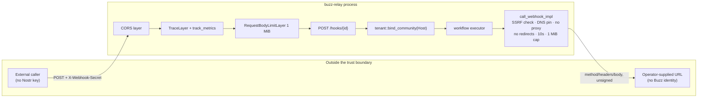

# External webhooks

## Definition

**An external webhook is an HTTP request that crosses Buzz's network boundary
between the relay and a party that holds no Nostr key** — inbound at
`POST /hooks/{id}`, where an outside caller fires a workflow run with a shared
secret, and outbound from `call_webhook`, where a running workflow reaches a
URL the workflow's author supplied.

That is the whole of the term as this node uses it. "External" is doing real
work in the definition: the two directions above are the only Buzz network
paths where the peer is neither a Nostr client presenting a signed event nor an
operator presenting a NIP-98 header. Three things that also travel over HTTP are
**not** external webhooks and must not be confused with them:

- **Git policy hooks** (`git_policy_router`) — the relay's own pre-receive
  callback, a server-internal loopback, not an outside party.
- **The Nostr-over-HTTP bridge** (`POST /events`, `/query`, `/count`) — HTTP as
  a transport for signed Nostr events, authenticated exactly as the WebSocket is.
- **The GIF metadata proxy** (`api::gifs`) — outbound HTTP the relay makes on its
  own behalf to a fixed third-party service, not on a workflow's behalf and not
  to an operator-supplied address.

**This node's subject is the network surface**: where the traffic enters and
leaves, what middleware it passes through, what identity the transport does and
does not establish, and what the network layer guarantees about delivery. It is
not the handler's control flow and not the action's execution semantics — see
*Boundary* below for who owns those.

## Visual aid

## Background

Buzz is Nostr-first: the product contract puts new operations on the WebSocket
as event kinds and reserves HTTP for the few things that genuinely need an
HTTP-only surface — see `architecture-principles-nostr-first`. Webhooks are one
of those few, and for a reason specific to the network layer rather than to
workflows: the peer on the other end is a system that will never hold a Nostr
key. A CI runner, a monitoring alert, or a third-party SaaS callback cannot sign
an event, so it cannot use the relay's normal door at all. The `/hooks/{id}`
route exists because there is no way to express "an anonymous outside system
starts something here" inside a protocol where every message is signed.

The consequence follows directly, and it is what makes this a networking-layer
concept rather than a workflow one: for these two paths only, Buzz gives up the
origin authentication and message integrity that a signed Nostr event provides
everywhere else, and substitutes a shared secret in one direction and nothing at
all in the other.

## Network properties of the two directions

The two directions are **not** symmetric, and the asymmetry is the practical
thing to remember. Each row names the property; the mechanism behind it belongs
to the node named in *Boundary*.

| Property | Inbound (`POST /hooks/{id}`) | Outbound (`call_webhook`) |
|---|---|---|
| Peer identity | Bearer shared secret, header or query | None — the relay sends no credential of its own |
| Message integrity | None — no signature, no timestamp, no nonce | None — the request is unsigned |
| Replay protection | None | Not applicable |
| Community binding | `Host` header, fail-closed, before any lookup | Inherited from the run's community |
| Address restriction | Whatever the deployment's ingress permits | Private/reserved addresses rejected, DNS pinned |
| Request size cap | 1 MiB, by tower layer, before the handler | None on the request; 1 MiB on the *response* |
| Timeout | Governed by the deployment's ingress, not by relay code | 10 s per call, inside a step timeout |
| Request-rate control | **None** | None |
| Delivery guarantee | 202 Accepted before the run executes | Fire-once; no retry, backoff or queue |
| Proxies / redirects | Whatever sits in front of the relay | System proxy disabled, redirects disabled |

Two rows deserve to be read twice.

**Request-rate control is absent inbound.** The handler was read end to end and
performs no admission or rate check; the route inherits none from `build_router`.
This is not because the relay lacks the mechanism — Blossom uploads, invite
claims, the GIF proxy and WebSocket admission all rate-limit per community. An
attacker who learns one workflow's secret can therefore fire that workflow as
fast as the network allows, with each request creating a `workflow_runs` row and
spawning an executor task. The sibling node
`capabilities-workflows-webhook-trigger` left this as an explicit unverified
gap; this node closes it as a finding, and does not propose a fix — no decision
record authorising one was found.

**Delivery is guaranteed in neither direction.** Inbound returns `202 Accepted`
before a single step runs, so a `2xx` tells the caller the run was *created*,
never that it succeeded. Outbound has no retry loop, no backoff and no delivery
queue: a call that fails has failed, and the workflow's own failure handling is
all there is. Anything an integration builds on top of these two paths has to
supply its own idempotency and its own retries.

## The middleware stack the route sits under

`/hooks/{id}` is registered on the relay's `api_router` and therefore inherits
that router's 1 MiB `RequestBodyLimitLayer`, which rejects an oversized body
before the handler runs. Three further layers are applied once over the merged
router and cover this route along with every other:

- **`track_metrics`** — the route's traffic appears in the relay's HTTP metrics.
- **`TraceLayer`** — the span records the HTTP method and OTel kind. It does not
  record the request path, so a `?secret=` query parameter is not captured *by
  this layer*; that says nothing about what a reverse proxy in front of the relay
  records.
- **CORS** — permissive when `cors_origins` is unconfigured; origin-restricted
  when configured; and, notably, a bare non-permissive layer if the variable is
  set but nothing in it parses, with an error logged rather than a silent
  fallback to permissive.

The CORS default is worth an operator's attention. Webhooks are a server-to-server
surface, so CORS is not the control protecting them — but on a default-configured
deployment it also is not blocking a browser page on an arbitrary origin from
issuing the request. The shared secret is the only barrier, which is the reason
the credential's handling matters more here than the origin policy does.

## Where the community boundary is drawn

The webhook route preserves the same host-derived community boundary as the rest
of the HTTP surface: `tenant::bind_community` resolves the request's `Host`
header to a community before any tenant-scoped lookup, and there is deliberately
no path that yields a default or fallback tenant. The same workflow UUID existing
in another community is not reachable through this host.

This is one instance of the invariant `architecture-principles-host-selects-community`
owns, not a webhook-specific rule, and it has a visible consequence for anyone
publishing a webhook URL: the URL's authority *is* the community selector. The
desktop client makes that concrete — it composes the URL it shows an owner from
the configured relay URL with `ws`/`wss` swapped for `http`/`https` and the
authority left intact. Point the same path at a different host and it addresses a
different community, or none.

## Use cases

Understanding external webhooks as a network surface, rather than as a workflow
feature, is what you need when:

- **Operating a relay.** The inbound route has no rate limit of its own, so any
  request-rate control has to come from the ingress in front of it. The inbound
  timeout is likewise the ingress's, not the relay's.
- **Terminating TLS at a proxy.** The `?secret=` fallback puts a live credential
  in the request line. A proxy that logs request paths logs the secret. The
  header form exists precisely to avoid this, and the two forms are not
  interchangeable from a credential-handling point of view.
- **Building an integration against `/hooks/{id}`.** A `202` means created, not
  succeeded; there is no replay protection, so the caller owns idempotency; and
  a request body over 1 MiB is rejected by a tower layer, not by the handler, so
  the rejection will not look like a workflow error.
- **Reviewing a change that touches either path.** The properties in the table
  above are what a reviewer should check has not silently regressed — most of
  them are absences, and an absence is easy to preserve by accident and easy to
  lose the same way.

## Boundary

This node owns the **network surface**. It does not own, and deliberately does
not restate:

| Not covered here | Owned by |
|---|---|
| `POST /hooks/{id}`'s ordered preconditions, per-status rejection map, and the save-time secret lifecycle | `capabilities-workflows-webhook-trigger` |
| `call_webhook`'s elevated-authority gate, SSRF check mechanics, community write fence, and its two stable failure codes | `capabilities-workflows-webhook-action` |
| The host-selects-community invariant itself, as a principle | `architecture-principles-host-selects-community` |
| The relay's full inbound route table | `architecture-containers-relay` |
| `buzz-relay`'s module inventory and crate-level structure | `implementation-crates-buzz-relay` |
| Why HTTP is a narrow, reserved surface in a Nostr-first system | `architecture-principles-nostr-first` |
| The `POST /events` host-binding test obligation | `verification-contracts-http` |

The division is a question, not a directory: *"what does the network do to this
request?"* is here; *"what does the handler decide, and in what order?"* is the
trigger node; *"what does the action do once it runs?"* is the action node.

## Scope and omissions

**This node covers** the two directions of external webhook traffic as a network
surface: where each enters or leaves, the middleware and body limit the inbound
route inherits, the CORS posture over it, the host-derived community binding as a
networking property, the asymmetry between the two directions' identity and
integrity guarantees, and what the network layer does *not* guarantee — rate,
replay, delivery, or retry.

**It does not cover, and these are gaps rather than silence:**

| Not covered here | Owned by |
|---|---|
| Handler control flow and action execution semantics | the two nodes named in *Boundary* |
| Git policy hooks, the Nostr-over-HTTP bridge, push notifications, the GIF proxy | not covered by any node this author located; each is its own subject |
| TLS termination, ingress configuration, and any rate limiting applied outside the relay process | deployment configuration, not established by any corpus node found at this revision |
| Whether the absent inbound rate limit should be added, and to what value | no decision record found; not this node's to settle |

**Expected but not verified when this node was written:**

- **No test exercising `POST /hooks/{id}` over the wire was found.** Searching
  the crates for the literal path returned only `router.rs`, the trigger enum's
  doc comment in `crates/buzz-workflow/src/schema.rs`, and a doc comment in
  `crates/buzz-test-client/tests/conformance_multitenant.rs` that lists the route
  while proving something else. Every inbound claim here rests on reading the
  router and the handler, not on a passing test. The already-merged trigger node
  reached the same conclusion independently at an earlier revision.
- **The CORS consequence was reasoned, not demonstrated.** That a permissive
  default leaves a cross-origin `POST` to `/hooks/{id}` unblocked by CORS follows
  from the layer's placement over the merged router, but no test or manual
  request confirming it was run, which is why that claim is an `INFERENCE` at 0.6
  rather than a `FACT`.
- **Ingress-side behaviour was not established at all.** Request timeouts,
  connection limits, TLS termination and any proxy-level rate limiting live
  outside this repository's relay code. This node states what the relay process
  does and is silent on what a deployment puts in front of it — that silence is a
  real gap for an operator, not a completed boundary.
- **Git history explains none of this.** The only commit in this checkout
  introducing `/hooks/{id}` into `router.rs` is a repository-wide rename, and the
  recent history of `bridge.rs` carries no message about the route's protection
  posture. The checkout is shallow, so an explanatory commit may exist upstream
  and simply not be present here — the absence of rationale is a limit of what
  was searchable, not proof that none was ever written.
- **Whether any operator-facing documentation states a stronger inbound
  protection posture than the code implements was not checked.** Only the code
  was read.
