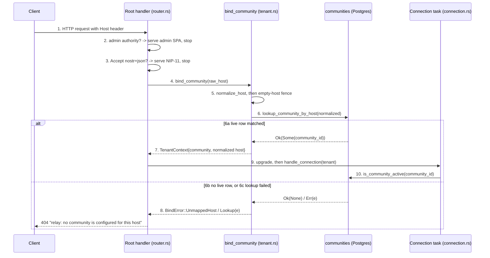

# Host routing: resolving a request's Host header to a community

## Flow statement

**Trigger.** An HTTP request reaches the relay's root route — a WebSocket
upgrade attempt, a NIP-11 probe, or a plain browser GET — carrying (or
omitting) a `Host` header.

**Actors.** The client; the relay's root handler `nip11_or_ws_handler`
(`crates/buzz-relay/src/router.rs`); the host-binding seam `bind_community`
(`crates/buzz-relay/src/tenant.rs`); the shared normalization rule
`normalize_host` (`crates/buzz-core/src/tenant.rs`); the `communities` host map
in Postgres, reached through `lookup_community_by_host`
(`crates/buzz-db/src/store/community.rs`); and, on success, the per-connection
task `handle_connection` (`crates/buzz-relay/src/connection.rs`).

**What it accomplishes.** It turns one client-supplied string into a
server-trusted `TenantContext` — a `CommunityId` the server read out of its own
database, plus the normalized host it was resolved from — or it terminates the
request with a single generic rejection. This node narrates that sequence. It
does not argue for it: the invariant that the host and only the host may select
the community belongs to
[`architecture-principles-host-selects-community`](../../architecture/principles/host-selects-community.md)
and
[`architecture-principles-community-is-security-boundary`](../../architecture/principles/community-is-security-boundary.md),
and is linked here rather than restated.

**Preconditions.** The deployment has at least one row in `communities` whose
`host` column holds the normalized authority clients will present. If an admin
authority is configured, it is a distinct host from any community host —
otherwise step 2 below claims the request first. The relay process is running
and its database pool is reachable; an unreachable pool does not degrade this
flow, it terminates it (step 6c).

**Termination.** Either a `TenantContext` is in hand and the request proceeds
under it, or the request ends at the door with `404` and a fixed body. There is
no third outcome and no default community.

## Sequence

1. **The handler reads the raw host.** `nip11_or_ws_handler` takes
   `header::HOST` from the request's header map, converts it to a string, and
   substitutes `""` when the header is absent or not valid UTF-8. A missing
   `Host` is therefore not a distinct error at this point — it is an empty raw
   host that continues down the same path.
   (`crates/buzz-relay/src/router.rs`)

2. **Admin authority short-circuits before any binding.** If the deployment
   carries an admin configuration and the raw `Host` string equals
   `config.host` exactly, the request is served the admin SPA and this flow
   ends here — it never reaches `bind_community`. The comparison is an exact
   string equality against a value the configuration parser has already
   lowercased and structurally validated as a bare authority, so the admin
   check applies a *different* rule from the community normalization in step 4.
   (`crates/buzz-relay/src/router.rs`, `crates/buzz-relay/src/api/admin/auth.rs`,
   `crates/buzz-relay/src/config.rs`)

3. **NIP-11 is answered before binding, on purpose.** A request whose `Accept`
   header contains `application/nostr+json` is served the relay-information
   document and this flow ends here too. The handler's own comment records the
   reason: an unmapped host still receives the document with host-scoped fields
   simply absent, so the document cannot be used to enumerate which hosts a
   deployment has mapped.
   (`crates/buzz-relay/src/router.rs`, `crates/buzz-relay/src/nip11.rs`)

4. **`bind_community` normalizes the raw host.** `normalize_host` trims
   surrounding whitespace, ASCII-lowercases, strips a port suffix only when it
   is exactly `:443` or `:80` — leaving a non-default port as a legitimate
   distinct selector, and leaving a bracketed IPv6 literal's internal colons
   alone — and strips a single trailing FQDN-root dot. This is the one rule
   applied on both sides of the map: `communities.host` is stored already
   normalized.
   (`crates/buzz-relay/src/tenant.rs`, `crates/buzz-core/src/tenant.rs`)

5. **The empty-host fence fires before the lookup.** If the normalized host is
   empty, `bind_community` returns `BindError::UnmappedHost` immediately,
   without consulting the resolver. This is deliberate rather than incidental:
   the schema does not forbid a `communities` row with `host = ''`, so without
   this guard a request that supplied no `Host` at all would bind to a
   misconfigured empty-host row. The variant is reused rather than a distinct
   `EmptyHost` added, so the eventual rejection is byte-identical to any other.
   (`crates/buzz-relay/src/tenant.rs`)

6. **The resolver queries the `communities` host map.** For a live relay the
   `HostResolver` is `buzz_db::Db`, which calls `lookup_community_by_host`:

   ```sql
   SELECT id, host FROM communities
   WHERE lower(host) = lower($1)
     AND archived_at IS NULL
     AND deleted_at IS NULL
     AND deletion_state = 'active'
   ```

   Three outcomes leave this step, and the rest of the flow branches on which:

   - **6a — `Ok(Some(community))`.** A live row matched.
   - **6b — `Ok(None)`.** The lookup succeeded and matched nothing. Note that
     this covers two operationally distinct situations with one result: no row
     was ever created for that host, *and* a row exists but is archived,
     soft-deleted, or not in `deletion_state = 'active'`.
   - **6c — `Err(e)`.** The lookup could not be performed at all — for example
     the database is unreachable.

   (`crates/buzz-relay/src/tenant.rs`, `crates/buzz-db/src/store/community.rs`)

7. **On 6a, the `TenantContext` is minted from server-trusted values.**
   `TenantContext::resolved` is called with the `CommunityId` read out of the
   database row and the **normalized** host — not the raw header. From here the
   host the rest of the request sees is the canonical form the community was
   resolved from, which is what makes downstream NIP-05 labelling and the
   NIP-98 `u`-host check agree with the binding.
   (`crates/buzz-relay/src/tenant.rs`, `crates/buzz-core/src/tenant.rs`)

8. **On 6b or 6c, `bind_community` returns a `BindError`** —
   `UnmappedHost` or `Lookup(e)` respectively — and the handler collapses both
   into one response. See *Outcome*.
   (`crates/buzz-relay/src/tenant.rs`, `crates/buzz-relay/src/router.rs`)

9. **The bound context is carried into the upgrade, not after it.** The root
   handler calls `bind_community` *before* `WebSocketUpgrade::from_request`,
   then moves the `TenantContext` into `handle_connection`. No frame is ever
   read on a connection that has not bound.
   (`crates/buzz-relay/src/router.rs`)

10. **The connection is scoped by the bound community from its first moment.**
    `handle_connection` reads `tenant.community()`, registers the socket in a
    per-community connection registry, and gates the registration on
    `is_community_active` for that same id.
    (`crates/buzz-relay/src/connection.rs`)

### Where the trust boundary is crossed

Steps 1 and 4 handle **client-controlled input**: the raw `Host` header is
whatever the caller sent. Step 6 is the crossing. The only thing taken from the
client is a *lookup key*; the `CommunityId` that comes back is read out of the
relay's own `communities` table, and `TenantContext` has no constructor that
parses a community from request data. Everything after step 7 operates on
server-derived identity. The unique index on `lower(host)` is the durable
backstop: even a writer that skipped normalization cannot create two rows for
case-variant forms of one host.
(`crates/buzz-core/src/tenant.rs`, `migrations/0001_initial_schema.sql`)

## Diagram



## Outcome

**Success (6a).** The request holds a `TenantContext` carrying a `CommunityId`
read from the database and the normalized host. The WebSocket connection is
registered in that community's connection registry, gated on the community
still being active, and every scoped operation for the life of the connection
names that community. The client observes an ordinary WebSocket upgrade.
(`crates/buzz-relay/src/router.rs`, `crates/buzz-relay/src/connection.rs`)

**Rejection — unmapped host (6b).** HTTP `404` with the fixed body
`"relay: no community is configured for this host"`. No community is bound; no
frame is read. The response does not echo the requested host.
(`crates/buzz-relay/src/router.rs`)

**Rejection — archived or deleting community (6b, same response).** A host
whose `communities` row exists but fails the `archived_at IS NULL AND
deleted_at IS NULL AND deletion_state = 'active'` predicate produces the same
`Ok(None)` and therefore the same 404. From the client's side this is
indistinguishable from a host that was never mapped, which is the intended
shape — but it is worth naming for an operator debugging a host that "used to
work". (`crates/buzz-db/src/store/community.rs`)

**Rejection — lookup failure (6c).** A database error produces
`BindError::Lookup(e)`, which the root handler collapses into the *same* 404
and the *same* body as an unmapped host. The handler's comment states the
reason: an unauthenticated caller must not be able to distinguish "wrong host"
from "our database is down" and use the difference to probe the deployment.
This is fail-closed, not degraded service — there is no fallback tenant.
(`crates/buzz-relay/src/router.rs`, `crates/buzz-relay/src/tenant.rs`)

**Rejection — empty or whitespace-only host (step 5).** Returned as
`UnmappedHost` before any lookup, so the response is byte-identical to the
above. `bind_community`'s own unit tests assert this against a resolver
deliberately configured *with* an empty-host mapping, for both `""` and a
whitespace-only string. (`crates/buzz-relay/src/tenant.rs`)

**Linked verification.** The repository's executable obligation for the
rejection path is `unmapped_host_fails_closed_generically` in
`crates/buzz-test-client/tests/conformance_multitenant.rs`. It asserts that an
unmapped host returns 404 while a mapped host does not — the *difference* being
the evidence that the unmapped host bound to no tenant — that the rejection
does not echo the requested host authority in its body, and that a WebSocket
upgrade to an unmapped host is rejected at the HTTP door rather than after
upgrade. **That suite was not run for this node.** Every test in it carries
`#[ignore]` and its module header states it requires a live relay with two real
host mappings, selected with `--ignored`. What this node establishes is the
presence and shape of those assertions, read from source.

## Boundary

This node narrates one runtime sequence. It does **not** cover:

- **The principle that the host is the sole community selector.** That is
  `architecture-principles-host-selects-community`'s subject, and the security
  reading of it is `architecture-principles-community-is-security-boundary`'s.
  Those two nodes own the *invariant* — that `req.community =
  resolve_host(connection.host)`, that no client signal may override it, and why
  that makes multi-tenancy meaningful. This node owns the *ordered runtime
  path* that implements it, and links rather than restates. If this node and
  either principle node disagree, the principle nodes state the rule and this
  one has drifted.
- **The standing structure of the relay container or its crates.** See
  `architecture-containers-relay`, `implementation-crates-buzz-relay`,
  `implementation-crates-buzz-core` and `implementation-crates-buzz-db`.
- **The WebSocket connection lifecycle after binding** — the NIP-42 challenge,
  the auth-timeout task, the send/heartbeat/receive loops, ban and membership
  gates. `architecture-flows-websocket-connection` narrates that flow and names
  host binding as one of its preconditions; this node is the expansion of that
  one line, and stops where that node starts.
- **What a community lets a user do**, or how one is created — see the
  `capabilities/communities/*` nodes.
- **The general contract of any interface crossed** — the WebSocket protocol
  surface, the REST bridge's route shapes, or the NIP-11 document's fields.
  This node names them only as the doors host binding sits in front of.
- **The wire contract of any Nostr event kind.** No event kind participates in
  this flow; binding completes before the first frame is read.
- **Operator instructions.** This is what the system does, not a runbook for
  mapping a host to a community.

Node-specific exclusions: `bind_deployment_community` — the host-less
server-internal variant used by the git Smart-HTTP transport, the pre-receive
hook callback, the workflow execution sink and startup — is named here because
it feeds the *same* `bind_community` call, but its own trigger and call sites
are a separate subject. So is the admin-host surface (`BUZZ_ADMIN_HOST`, the
admin SPA, the NIP-98 `u`-host check), which appears above only as the
short-circuit preceding step 4. So is `normalize_host` considered as a standalone
contract with its own rule set and test matrix.

## Relationships

- `references` `architecture-principles-host-selects-community` — the invariant
  this sequence implements.
- `references` `architecture-principles-community-is-security-boundary` — why
  the sequence must fail closed.
- `references` `architecture-flows-websocket-connection` — the flow that begins
  where this one ends; it treats host binding as a precondition.
- `references` `architecture-deployment-multi-community` — the deployment shape
  in which one relay process serves several hosts, which is what makes this
  resolution step load-bearing.
- `references` `implementation-crates-buzz-relay` — home of the root handler and
  the binding seam.
- `references` `implementation-crates-buzz-core` — home of `normalize_host`,
  `TenantContext` and `CommunityId`.
- `references` `implementation-crates-buzz-db` — home of the `communities`
  lookup.
- `references` `verification-formal-multi-tenant-relay` — the formal
  multi-tenant model this sequence's fail-closed obligation sits under.

## Scope and omissions

**This node covers** the ordered path from an inbound `Host` header to either a
`TenantContext` or a generic rejection: header extraction and its empty-string
fallback, the admin-authority short-circuit, the pre-binding NIP-11 answer,
`normalize_host`'s rule, the empty-host fence, the `communities` lookup and its
liveness predicate, the three outcomes, how the bound context reaches the
connection task, and the four rejection paths that collapse into one response.

**It does not cover, and these are gaps rather than silence:**

| Not covered here | Owned by |
|---|---|
| The invariant that host alone selects community | `architecture-principles-host-selects-community` |
| Why that invariant is a security boundary | `architecture-principles-community-is-security-boundary` |
| The connection lifecycle after binding (NIP-42, loops, gates) | `architecture-flows-websocket-connection` |
| The relay container's standing structure | `architecture-containers-relay` |
| The crates the sequence spans | `implementation-crates-buzz-relay`, `implementation-crates-buzz-core`, `implementation-crates-buzz-db` |
| The multi-host deployment shape | `architecture-deployment-multi-community` |
| Relay configuration surface, including `BUZZ_ADMIN_HOST` | `layers-configuration-relay-configuration` |
| `bind_deployment_community`'s own trigger and call sites | unfiled — candidate follow-up task |
| `normalize_host` as a standalone contract | unfiled — candidate follow-up task |

**Expected but not verified when this node was written:**

- **The conformance suite was not executed.**
  `crates/buzz-test-client/tests/conformance_multitenant.rs` is `#[ignore]` by
  default and requires a live relay with two real host mappings sharing one
  database and Redis instance. Its assertions were read from source; whether
  they currently pass at the recorded revision is not a claim this node makes.
- **`bind_community`'s unit tests were not executed either.** The tests in
  `crates/buzz-relay/src/tenant.rs` — including the `redteam_attack2` module
  guarding the empty-host fence — were read, not run. Note that
  `redteam_attack2`'s doc comments still describe the fence as a RED gate and
  instruct the reader to delete an `#[ignore]` "when the fix lands", while the
  fix is visibly present in `bind_community` and no `#[ignore]` attribute
  remains on those tests. The comments appear to be stale relative to the code;
  this node does not resolve which is authoritative and records the discrepancy
  rather than picking a side.
- **No git history, pull request or issue was consulted for rationale.** Every
  "why" in this node — the generic rejection, the pre-binding NIP-11 answer, the
  empty-host fence's reuse of `UnmappedHost` — is quoted from a comment sitting
  on the code it explains, so the blame trail was not needed. If a later reader
  needs the *decision* behind any of them rather than its present statement,
  that trail is unexplored here.
- **No end-to-end request was issued against a running relay.** The sequence
  above was assembled by reading the call chain, not by observing a request
  traverse it.
- **Whether a reverse proxy, load balancer or ingress in front of the relay
  preserves or rewrites the `Host` header was not established.** Nothing in the
  relay's source can answer it, and this node's first step assumes the header
  the handler reads is the one the client sent. In a deployment that rewrites
  `Host`, step 1 reads the proxy's value, and every step after it follows from
  that — a real operational caveat this node cannot close from this repository.
- **The list of other surfaces reusing `bind_community` was assembled by
  grepping call sites**, not by auditing every route registered in
  `crates/buzz-relay/src/router.rs`. A surface added after the recorded revision
  that omits the call would not be caught by re-reading this document.
- **`handle_connection`'s downstream use of the bound community was traced only
  as far as the registry registration and the `is_community_active` gate.** How
  every later handler threads `tenant.community()` is not established here.
