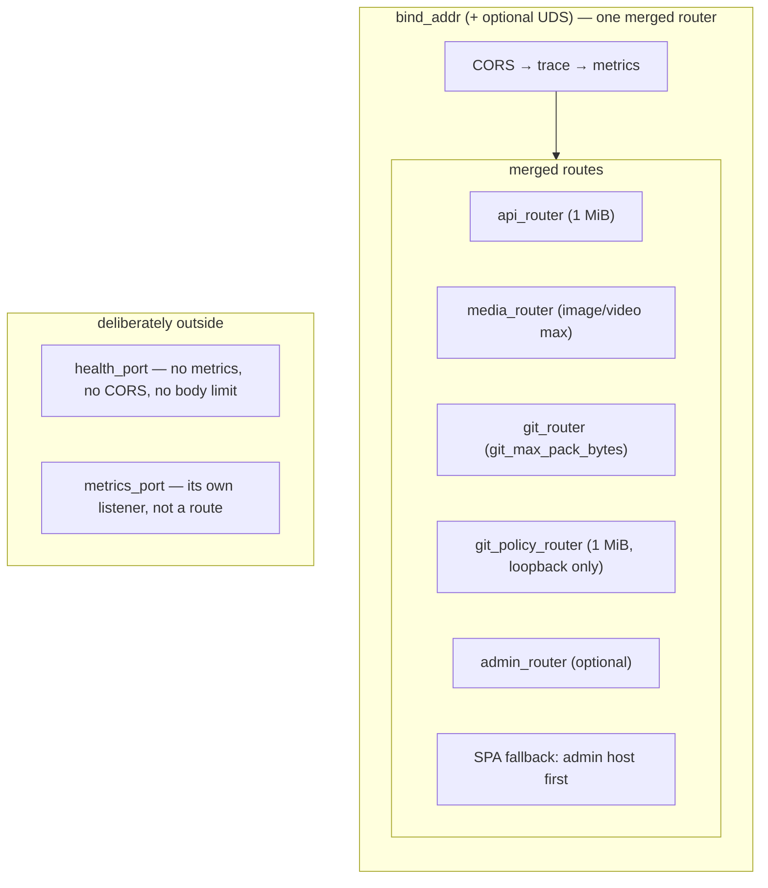

# HTTP as a networking-layer surface

**HTTP is the relay's secondary transport: one merged `axum` route table, served
beside the WebSocket upgrade on the same listener, carrying the small set of
operations that genuinely cannot be a Nostr event.** Everything else on this page
follows from that one sentence — why the surface is small, what is on it, and which
properties every path on it shares whether or not the endpoint's author thought
about them.

This node is about the surface *as a surface*. Individual endpoints have their own
canonical nodes and this one does not restate them; see **Boundary and non-goals**
below for the split, which is deliberate and precise.

## Definition

The HTTP surface is the set of routes `build_router` assembles in
`crates/buzz-relay/src/router.rs`, plus the two listeners that deliberately sit
outside it. `build_router` merges five parts — an `api_router` of individually
registered routes, a `media_router`, a `git_router`, a `git_policy_router`, and an
`admin_router` present only when admin configuration exists — and attaches an SPA
`fallback_service` when a bundle directory is configured. Three layers are then
applied once over the merged whole, in order: metrics, tracing, CORS.

**What it is not.** It is not a REST API for Buzz's domain. `AGENTS.md` states the
rule plainly: model new operations as Nostr event kinds, and reserve HTTP for what
"genuinely need[s] an HTTP-only surface". The surface exists because a handful of
things cannot be expressed as a signed event on a socket — a browser fetching
metadata before it can open a socket, `git` speaking its own wire protocol, a blob
that will not fit in a frame, a third-party service POSTing a webhook, a
Kubernetes probe. The category, not the convenience, is the admission criterion.

**Disambiguation.** "HTTP" here means the relay's inbound HTTP surface. It is not
the transport underneath the WebSocket upgrade (that handshake is HTTP, but the
resulting connection is #1134's subject), and it is not the relay's outbound HTTP
calls to third-party services.

## What is on it

Grouped by why each group is here rather than by route. Route-by-route detail is in
`router.rs` itself, which is short enough to read and is the only inventory that
cannot drift.

| Group | Why it cannot be an event |
|---|---|
| NIP-11 / NIP-05 metadata, `/info` | A client reads them *before* it has a relay connection. |
| The Nostr bridge — `POST /events`, `/query`, `/count` | Callers without a socket need the same operations; the bridge is the exception AGENTS.md names as generic rather than endpoint-specific. |
| Blossom media upload and download | Blob bytes, not frames. |
| Git smart HTTP | An unmodified `git` client speaks its own protocol. |
| Webhook trigger | An external service initiates; `router.rs` marks the route "secret-authenticated, no NIP-98". |
| Health probes | Orchestrator probes are HTTP GETs, not Nostr clients. |
| Operator, invite, moderation, workflow-run and admin routes | Browser-originated management traffic. |
| SPA and static asset serving | A browser must be handed documents before it can run any client code. |

The one route worth naming individually is `/`, because it is where the two
transports meet: `nip11_or_ws_handler` is registered as an ordinary `GET` and
content-negotiates between an admin SPA document, a NIP-11 JSON document, and a
WebSocket upgrade, based on `Host` and `Accept`. Registering `/` explicitly is also
what keeps it away from the SPA fallback.

## Shared properties

These are the properties a new route inherits whether or not its author considered
them — the reason this node exists as a layer concept rather than as a list.

**Body limits are per sub-router, not per surface.** `api_router` gets a flat 1 MiB;
`media_router` gets the larger of the configured image and video maxima; `git_router`
gets `git_max_pack_bytes`; `git_policy_router` gets 1 MiB. A route added to
`api_router` silently inherits 1 MiB, which is correct for a JSON endpoint and wrong
for anything streaming bytes — that is the choice each new group is really making
when it picks which sub-router to join.

**One CORS layer, and its failure mode is worth knowing.** `build_cors_layer` returns
a permissive layer when `BUZZ_CORS_ORIGINS` is unset or empty. When the variable is
set but *no* entry parses as a header value, it logs an error and returns a bare
`CorsLayer::new()` — it refuses to fall back to permissive. A misconfigured origins
list therefore fails closed and looks like broken browser clients, not like an open
relay.

**One metrics middleware, with a deliberate blind spot.** `track_metrics` labels by
the *matched route pattern*, never the raw URI, and skips recording entirely for
`/_*`, `/health`, `/metrics`, and any request that matched no route. The stated
reason is label cardinality: 404 scanner traffic would otherwise mint a new series
per probed path. The consequence to hold onto is that **unmatched traffic is
invisible in `http_requests_total`** — the counter answers "how is each known route
performing", not "what is hitting this relay". `layers-observability-metrics` owns
the metrics layer itself.

**One trace root.** `make_http_span` opens an `http.request` server span per request,
and a test in `router.rs` asserts a datastore span opened inside a handler inherits
that span's trace id and names it as its parent. Anything a handler instruments
lands under the HTTP span rather than beside it.

**Not everything HTTP is on this surface.** Two listeners are outside it by design:
`build_health_router` serves `/_liveness`, `/_readiness`, `/_status` and `/_mesh` on
`health_port` with — in its own words — "No metrics middleware, no auth, no CORS, no
body limit", and the Prometheus scrape endpoint is not a route at all but a listener
`relay_metrics::install` opens on `metrics_port`. A probe or a scrape reaching the
main port is not the same request as one reaching its own port, and only the latter
is what the deployment is configured to use.

**A third listener changes request context.** On Unix, the same router is also served
over a Unix domain socket. The TCP listener is served with
`into_make_service_with_connect_info::<SocketAddr>`; the UDS listener is served with
plain `into_make_service`. Any code reading `ConnectInfo` therefore sees a peer
address on TCP and nothing on UDS. `require_localhost`, which gates
`/internal/git/policy`, treats a missing `ConnectInfo` as non-loopback and rejects —
so that endpoint is unreachable over UDS as well as from remote TCP peers. That
consequence is recorded as an INFERENCE rather than a FACT: it follows from two files
read separately and no test exercises the UDS path.

## Why this matters to a reader

- **Adding an endpoint.** The question is not "where does the route go" but "is this
  in one of the categories HTTP is reserved for". If it is not, `AGENTS.md`'s answer
  is an event kind. If it is, the sub-router chosen decides the body limit inherited.
- **Reading a metric or a trace.** `http_requests_total` covers matched routes only;
  health and metrics traffic is on other ports entirely. Both facts change what an
  absence in a dashboard means.
- **Operating the relay.** Three or four listeners exist, not one, and
  `BUZZ_CORS_ORIGINS` fails closed rather than open when it is malformed.

## Boundary and non-goals

Several merged nodes already own pieces of this surface. **This node is the layer
concept — the surface as a whole and its shared properties — and does not restate
any of their canonical claims.**

| Owned elsewhere | Owner |
|---|---|
| The `POST /events` request lifecycle end to end — tenant binding, NIP-98 auth, replay, admission, ingest, status mapping | `architecture-flows-http-event-submission` |
| The community-boundary test obligation on `POST /events`, its verifying test, and its gated enforcement status | `verification-contracts-http` |
| The git smart-HTTP transport's wire mechanics — `info/refs` negotiation, pkt-line encoding, content types, streaming | `capabilities-git-smart-http` |
| What Blossom media storage lets a user do, and its maturity against BUD-01/02/11 | `capabilities-media-blossom` |
| The relay crate's internal structure | `implementation-crates-buzz-relay` |
| The relay as a deployed container | `architecture-containers-relay` |
| The metrics layer itself — what is emitted, scraped and dashboarded | `layers-observability-metrics` |
| How relay configuration is loaded, defaulted and validated | `layers-configuration-relay-configuration` |

Sibling networking-layer subjects, all filed under Feature #609 and none merged at
the recorded revision, so none is a relationship target here:

| Not covered here | Owned by |
|---|---|
| The WebSocket transport that shares this listener | #1134 |
| TLS termination | #1133 |
| Request routing | #1131 |
| Host-to-community binding, the boundary AGENTS.md says every HTTP path preserves | #1126 |
| The `/hooks/{id}` webhook door and its middleware slice specifically | #1124 |

This node also does not attempt an endpoint-by-endpoint catalogue. That is reference
material, and `router.rs` already is it — a second copy would drift the moment a
route is added, which is exactly the failure a layer concept is supposed to avoid.

## Scope and omissions

**This node covers** why a Nostr-first relay has an HTTP surface at all, what
categories are on it and why each cannot be an event, and the properties every path
shares: per-sub-router body limits, the single CORS layer and its fail-closed
misconfiguration behaviour, the metrics middleware and its cardinality blind spot,
the trace root, the deliberately separate health and metrics listeners, and the way
the UDS listener changes what `ConnectInfo`-dependent middleware sees.

**It does not cover, and these are gaps rather than silence:**

| Not covered here | Owned by |
|---|---|
| The `POST /events` lifecycle — tenant binding, NIP-98, replay, admission, ingest, status mapping | `architecture-flows-http-event-submission` |
| The test obligation on `POST /events` and its gated status | `verification-contracts-http` |
| Blossom media internals — BUD maturity, upload and download semantics | `capabilities-media-blossom` |
| Git smart HTTP — pkt-line framing, `info/refs` negotiation, content types | `capabilities-git-smart-http` |
| The relay crate's overall structure and its NIP-11 document | `implementation-crates-buzz-relay` |
| The admin host's security boundary — the fixed `ADMIN_CSP`, the asset allowlist, the non-browsable bundle, admin-host-first ordering | Not filed as its own task at this revision; see *A second concept found and not folded in* below |
| The `/hooks/{id}` webhook surface as a subject in its own right | A sibling task in Feature #609, unmerged at this revision and therefore carrying no relationship edge |
| Host resolution, connection admission, the WebSocket transport, TLS termination, and in-band Nostr verb dispatch | Sibling tasks in Feature #609 (#1126, #1121, #1134, #1133, #1131), all unmerged at this revision |

**Expected but not verified when this node was written:**

- **Nothing was run.** No relay was started, no request was issued, and no test was
  executed. `router.rs` was read in full and the middleware, config and `main.rs`
  serving code were read at the cited paths; the unit tests in `router.rs` were read
  for their assertions, not run.
- **The UDS consequence for `/internal/git/policy` was not observed.** It is an
  INFERENCE composed from `require_localhost`'s missing-extension default and the two
  different `into_make_service*` calls in `main.rs`. No test in the repository
  exercises a request over the Unix domain socket, so nothing confirms the composition
  holds at runtime.
- **No test was found asserting the body-limit values themselves.** The four limits
  were read from the four `RequestBodyLimitLayer` constructions; a search of
  `router.rs`'s own test module found tests for the routing predicates, the admin
  CSP, the trace parenting and the WebSocket frame limit, but none that issues an
  oversized HTTP body against any sub-router.
- **`build_cors_layer`'s three branches are untested.** The permissive, parsed-list
  and refuse-to-fall-back branches were read from source; no test constructs a router
  with a malformed `BUZZ_CORS_ORIGINS` and asserts the resulting layer.
- **Git history was not consulted.** Every claim above rests on the source as it
  stands at the recorded revision. Issues were consulted (the #609 sibling list and
  #1127's own definition of done, both recorded as `TEAM_KNOWLEDGE` above), but no
  commit, pull request or blame was read to establish *why* any of these choices was
  made — so the rationale offered for the surface's narrowness is `AGENTS.md`'s
  stated position plus one `INFERENCE`, not a reconstructed decision history.
- **Deployment reality was not checked.** Whether `health_port`, `metrics_port` and
  `bind_addr` are actually exposed differently in the staging Kubernetes deployment
  was not verified against the deployment repositories — only against the relay's own
  `serve()`.

**A second concept found and not folded in.** The admin host's fixed
Content-Security-Policy, its allowlisted document and asset paths, and the
"admin host is checked first and can never fall through to the public bundle"
property are a coherent security-boundary subject with its own tests. They are noted
here only as evidence that the fallback is host-aware; the boundary itself is a
candidate for its own node and was not written into this one.
