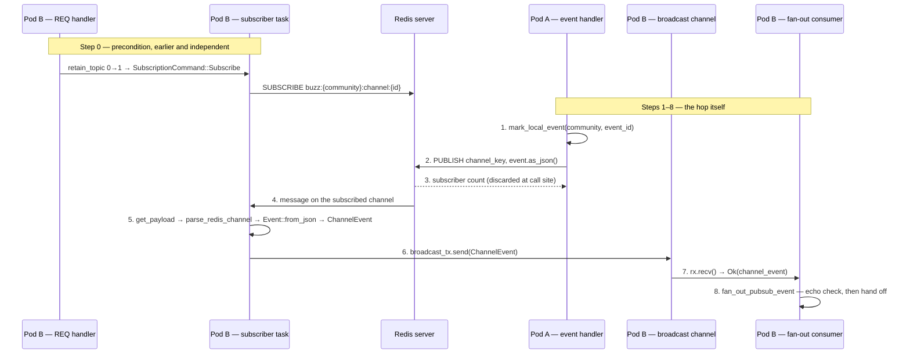

# Redis fan-out: the cross-instance hop

## Flow statement

When one relay instance accepts an event, every *other* instance holding a
subscribed client for that event has to be told. This node narrates that single
hop and nothing either side of it: from the moment pod A's handler calls
`publish_event`, through Redis, through the receiving pod's dedicated pub/sub
connection and its process-local broadcast channel, to the moment pod B's
consumer task hands a `ChannelEvent` to `fan_out_pubsub_event`.

The actors are **pod A** (the instance that accepted the event), the **Redis
server**, and **pod B** (any other instance in the fleet). The trigger is a
`publish_event` call on pod A. The flow's own termination is pod B's consumer
task invoking `fan_out_pubsub_event` — what that function then does with the
event is the tail of `architecture-flows-live-fanout`, not of this node.

The precondition is the part most easily missed, because it happens long before
the trigger and on a different pod: **pod B receives nothing unless it already
holds a live `SUBSCRIBE` for that exact channel name**, and it only holds one if
one of its own connected clients registered a `REQ` that retained the topic.
Cross-instance fan-out is demand-driven, not broadcast-to-all.

## Sequence

**Step 0 — precondition, on pod B, before any of this.** A client's `REQ`
reaches `handlers/req.rs`, which calls `state.pubsub.retain_topic` once per
authorized channel scope, or once for `EventTopic::Global` when no
channel-scoped filter applies. `retain_topic` increments a local
`desired_topics` refcount keyed by the fully scoped `EventTopicKey`; **only** the
0-to-1 transition sends a `SubscriptionCommand::Subscribe` over an `mpsc`
channel. The subscriber task's `select!` picks that command up and issues the
real `sink.subscribe(&channel)`.
(`crates/buzz-relay/src/handlers/req.rs`, `crates/buzz-pubsub/src/lib.rs`,
`crates/buzz-pubsub/src/subscriber.rs`)

**Step 1 — pod A pre-arms echo suppression, then publishes.** The handler calls
`state.mark_local_event(community, event_id)` and immediately afterwards
`state.pubsub.publish_event(tenant, topic, event)`. The pre-arm is what stops pod
A delivering its own event twice if the message comes back to it.
(`crates/buzz-relay/src/handlers/event.rs`)

**Step 2 — one Redis command, and nothing else.**
`publisher::publish_event` takes a connection from the shared
`deadpool_redis::Pool`, builds the channel name with
`EventTopicKey::from_context(ctx, topic).redis_channel()`, takes the payload from
the event's own `event.as_json()`, and issues a single
`redis::cmd("PUBLISH").arg(&key).arg(&payload)`. Nothing is written, nothing is
retained. The command returns an `i64` subscriber count.
(`crates/buzz-pubsub/src/publisher.rs`, `crates/buzz-pubsub/src/topic.rs`)

**Step 3 — the return value is dropped.** Every call site in
`handlers/event.rs` is written `if let Err(e) = ... .publish_event(...)`, which
discards the `Ok(i64)`. Pod A therefore learns whether the *command* succeeded and
nothing about whether anyone was listening.
(`crates/buzz-relay/src/handlers/event.rs`)

**Step 4 — Redis delivers to currently-subscribed connections.** The payload
reaches every connection subscribed to that exact channel name at that instant.
The two names in play are `buzz:{community_id}:channel:{channel_id}` and
`buzz:{community_id}:global`, both built from the `BUZZ_PREFIX` constant
`"buzz"`. (`crates/buzz-pubsub/src/topic.rs`)

**Step 5 — pod B's subscriber decodes the message in four stages.** Inside
`connect_and_subscribe`'s message arm: `msg.get_payload()` to a `String`;
`msg.get_channel_name()` fed to `EventTopicKey::parse_redis_channel` to recover
the community id and the routing scope; `nostr::Event::from_json` on the payload;
then construction of a `ChannelEvent { community_id, topic, event }`. Each of the
first three stages `continue`s the loop with a `warn` on failure rather than
tearing the connection down.
(`crates/buzz-pubsub/src/subscriber.rs`, `crates/buzz-pubsub/src/lib.rs`)

**Step 6 — the wire hop becomes an in-process hop.** The `ChannelEvent` is sent
on the `tokio::sync::broadcast` channel built with capacity 4096 in
`PubSubManager::with_config`. A send with no active receivers is a `trace`-level
non-event, deliberately not a warning.
(`crates/buzz-pubsub/src/lib.rs`, `crates/buzz-pubsub/src/subscriber.rs`)

**Step 7 — pod B's relay consumer picks it up.** `main.rs` spawns one task
looping on `state.pubsub.subscribe_local().recv()`; each `Ok(channel_event)` is
passed to `handlers::event::fan_out_pubsub_event`.
(`crates/buzz-relay/src/main.rs`)

**Step 8 — handoff, and the flow ends.** `fan_out_pubsub_event` maps
`EventTopic::Channel(id)` back to `Some(id)` and `EventTopic::Global` to `None`,
wraps the event in a `StoredEvent`, and checks the `(community_id, event_id)`
local-echo key — a hit invalidates the entry and returns without delivering.
Everything past that point (`fan_out_scoped`, `filter_fanout_by_access`, frame
caching, socket writes) belongs to `architecture-flows-live-fanout`.
(`crates/buzz-relay/src/handlers/event.rs`)

## Diagram

## Outcome

**Success.** Pod B's consumer task holds a `ChannelEvent` whose `community_id`
and `topic` were recovered from the Redis channel name rather than trusted from
the payload, and whose `event` deserialized cleanly. `fan_out_pubsub_event`
increments `buzz_multinode_fanout_total` and proceeds into the delivery path
`architecture-flows-live-fanout` owns. Pod A is unchanged and uninformed: no
acknowledgement travels back along this hop in any form.

**Failure — Redis unreachable at publish time.** `publish_event` returns
`Err`; the calling handler in `handlers/event.rs` invalidates the
`mark_local_event` entry it just set, logs a warning, and continues. The publish
is not retried and nothing compensates for it. Pod A's own locally connected
subscribers still receive the event through its in-process path; every other pod
receives nothing for this event, permanently.
(`crates/buzz-relay/src/handlers/event.rs`)

**Failure — Redis unreachable on the receiving side.**
`connect_and_subscribe` returns and `run_subscriber` sleeps a backoff that starts
at `BACKOFF_INITIAL_SECS = 1` and doubles to a `BACKOFF_MAX_SECS = 30` cap; a
clean stream end resets the backoff to the initial value first, an error path
sleeps the current value and then doubles. On the next successful connect, the
subscription set is rebuilt by snapshotting `desired_topics` for entries with a
refcount above zero — current interest, not the pre-disconnect set. Anything
published to Redis during the gap is simply not delivered to that pod.
(`crates/buzz-pubsub/src/subscriber.rs`)

**Failure — a malformed message.** A payload that cannot be extracted, a channel
name `parse_redis_channel` rejects, or a payload `nostr::Event::from_json`
refuses each produce a `warn` and a `continue`. The connection, its subscription
set, and every other message keep working. This is the one failure class in the
hop that is fully contained. (`crates/buzz-pubsub/src/subscriber.rs`)

**Failure — a subscription command errors.** A `sink.subscribe` or
`sink.unsubscribe` failure while servicing a `SubscriptionCommand` propagates
with `?` out of `connect_and_subscribe`, tearing down the whole connection. The
failed command itself is gone from the `mpsc` queue, but `retain_topic` already
incremented `desired_topics` before sending it, so the reconnect's
snapshot-and-resubscribe restores the topic anyway.
(`crates/buzz-pubsub/src/subscriber.rs`, `crates/buzz-pubsub/src/lib.rs`)

**Failure — the local broadcast channel.** `RecvError::Lagged(n)` on pod B's
consumer increments `buzz_multinode_fanout_lag_total`, logs a warning, and keeps
looping; those `n` events are gone. `RecvError::Closed` logs an error and
`break`s the loop, after which that pod delivers no cross-instance events at all
until the process restarts. (`crates/buzz-relay/src/main.rs`)

**No rollback exists, and none is possible.** Nothing in this hop is
transactional: `PUBLISH` writes no key, the payload is never persisted, and the
durable write that produced the event committed on pod A before `publish_event`
was called. A failure anywhere in steps 2–8 leaves a delivery gap, never an
inconsistent store.

## Boundary

This node does not describe:

- **What happens before step 1 or after step 8.** Ingress, kind branching,
  persistence, the echo-dedup rationale, `fan_out_scoped`,
  `filter_fanout_by_access`, the DM/metric owner gate, backpressure and the
  `grace_limit` disconnect are all `architecture-flows-live-fanout`'s. This node
  narrates the segment that node compresses into one step.
- **The mechanism as a reference rather than a sequence** — the topic table, the
  `PUBLISH`/`SUBSCRIBE`/`UNSUBSCRIBE` command inventory, the refcount and
  debounce lifecycle, and the transport-not-store classification belong to
  `layers-data-redis-channel-pubsub`.
- **Why the subscriber uses a dedicated non-pooled connection**, how many such
  connections a pod holds, and the cache-invalidation and conn-control loops that
  share their shape — `layers-data-redis-dedicated-pubsub-connection`.
- **The comparison between pooled and dedicated recovery**, and the finding that
  `redis::aio::ConnectionManager` is not used anywhere — `layers-data-redis-reconnect-behavior`.
- **The `buzz-pubsub` crate as an implementation unit** — its module inventory,
  divergences and verification posture are `implementation-crates-buzz-pubsub`'s.
- **The standing structure of a relay instance** and how pods are deployed. No
  claim about pod count, placement or scaling is made here; the hop is described
  as it works between any two instances.
- **The Nostr event's own meaning.** What a `kind` denotes, what its tags mean,
  and how the event was validated are outside this hop entirely — the payload is
  an opaque JSON string between `as_json` and `from_json`.

## Trust-boundary crossings

The hop crosses one boundary, and it is not an authorization boundary.
`crates/buzz-pubsub/src/topic.rs`'s module doc states this directly: pub/sub
topics are "a routing/performance boundary, not an authorization boundary,"
tenant identity comes from `TenantContext` on the publish and retain paths, and
the relay re-checks access before local fan-out. The community id embedded in the
channel name is recovered by parsing on receipt and used to scope the subsequent
lookup — it decides *which pods happen to be listening*, never *who may see the
event*. Redis carries the event's plaintext JSON between processes inside the
relay's own trust domain, and the enforcement chokepoint on the far side is
`filter_fanout_by_access`, which `architecture-flows-live-fanout` owns.

## Relationships

- `references`: `architecture-flows-live-fanout` — the end-to-end delivery flow
  this hop is one step of. It owns everything before step 1 and after step 8.
- `references`: `layers-data-redis-channel-pubsub` — the same machinery as a
  reference document: topics, commands, lifecycle, consistency class.
- `references`: `layers-data-redis-dedicated-pubsub-connection` — the connection
  step 5 runs on, and why it is not pooled.
- `references`: `layers-data-redis-reconnect-behavior` — the general recovery
  comparison this node's reconnect paragraph is a single instance of.
- `references`: `implementation-crates-buzz-pubsub` — the crate implementing
  steps 2, 5 and 6.

No `#609` sibling is targeted: none is merged on `origin/launchpad`, and a
`relationships[].target` naming an id no merged node carries is a hard CI error
even when it resolves locally.

## Scope and omissions

**This node covers** the ordered cross-instance hop for one accepted event: the
demand-driven `SUBSCRIBE` precondition on the receiving pod, the single `PUBLISH`
command and its discarded return value, the four decode stages on the receiving
subscriber, the process-local broadcast handoff, the relay consumer's recv loop,
and the handoff into `fan_out_pubsub_event`. It covers the failure branch at each
of those points and the absence of any acknowledgement path back to the
publisher.

**It does not cover, and these are gaps rather than silence:**

| Not covered here | Owned by |
|---|---|
| Ingress, persistence, access filtering and socket delivery | `architecture-flows-live-fanout` |
| Topic/command/lifecycle reference, transport classification | `layers-data-redis-channel-pubsub` |
| Why the pub/sub connection is dedicated, and how many exist | `layers-data-redis-dedicated-pubsub-connection` |
| Pooled-versus-dedicated recovery comparison | `layers-data-redis-reconnect-behavior` |
| The `buzz-pubsub` crate as an implementation unit | `implementation-crates-buzz-pubsub` |
| Cache-invalidation and conn-control pub/sub, presence, rate limiting | `architecture-containers-redis` and the `layers/data/redis/*` siblings |
| The meaning of the Nostr event carried as payload | No event-kind node covering these kinds is merged |

**Expected but not verified when this node was written:**

- **The one end-to-end test of this hop does not run by default.**
  `test_publish_and_subscribe_roundtrip` in `crates/buzz-pubsub/src/lib.rs` is
  annotated `#[ignore = "requires Redis"]`, so a plain `cargo test` never
  exercises steps 2 through 6. It was read, not run — no Redis instance was
  started for this node. The two non-ignored tests in
  `crates/buzz-pubsub/src/subscriber.rs` cover only the `desired_refcount`
  lookup helper and touch neither Redis, a payload, nor the broadcast channel.
  **This hop's happy path has no verification that runs in a default test
  invocation**. A search of `crates/*/tests/` for a test that starts two relay
  instances and asserts an event crosses between them found none — the only
  multi-node file, `crates/buzz-test-client/tests/e2e_mesh_llm.rs`, is about two
  desktop mesh compute nodes, not two relay pods, and is itself `#[ignore]`d.
- **No failure branch in this hop has a test.** Searching for coverage of the
  publish-error path, the three `warn`-and-`continue` decode branches, the
  `sink.subscribe` teardown, or the `RecvError::Closed` consumer stall found
  none. `architecture-flows-live-fanout` independently records the same absence
  for the publish-failure and `Closed` paths; this node confirms it for the
  decode and subscription-command branches too.
- **The self-healing claim for a failed `SubscriptionCommand` is reasoned, not
  observed.** It is marked `INFERENCE` at 0.8 because it chains `retain_topic`'s
  ordering in `lib.rs` against the reconnect snapshot in `subscriber.rs`; no test
  drives a `sink.subscribe` failure to confirm the topic really is restored.
- **Redis's own `PUBLISH` delivery semantics were not checked against Redis
  documentation.** Step 4's description of who receives a message rests on this
  repository's code containing no buffering or replay, not on Redis's own
  specification.
- **No timing or telemetry was gathered.** How long the hop takes, how often
  `buzz_multinode_fanout_lag_total` fires, and whether the 4096-slot broadcast
  channel is ever the binding constraint in production are all unmeasured here.
