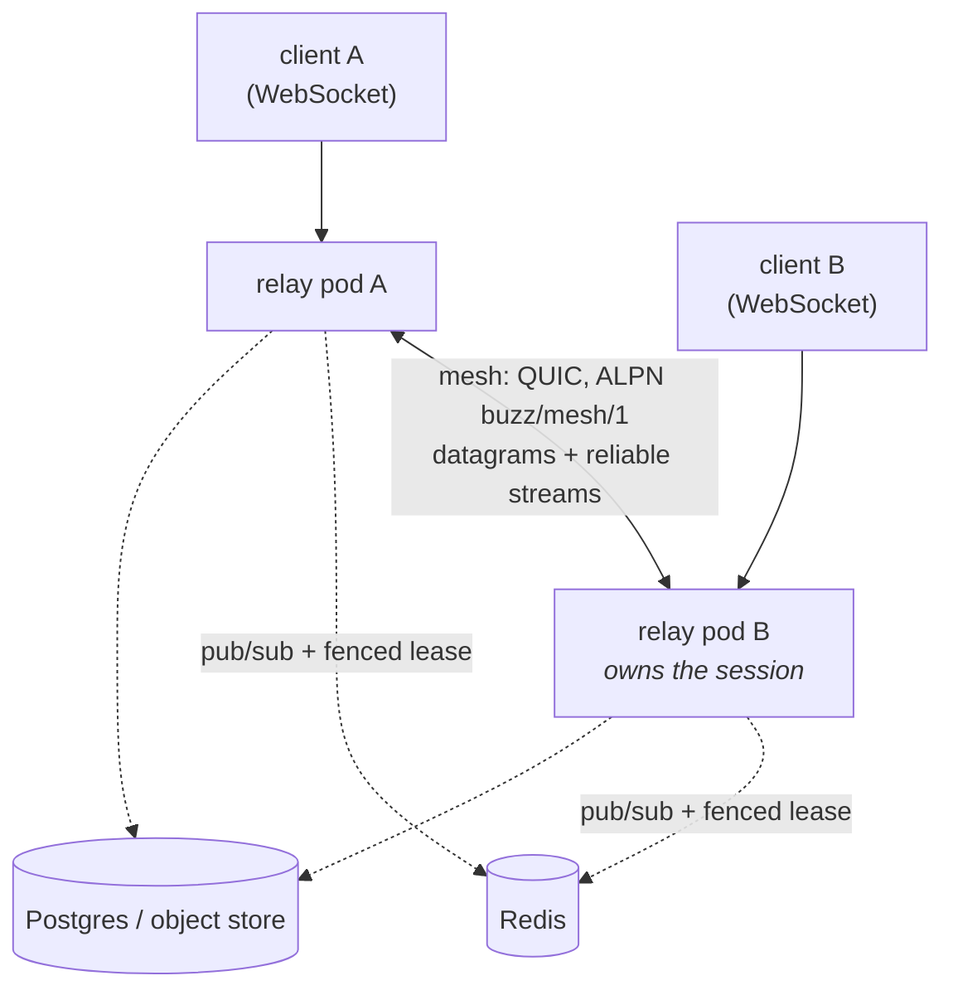

# Relay mesh

**The relay mesh is a direct, authenticated QUIC network between the processes of
one horizontally-scaled relay deployment, so that a live session held on one pod
can be reached by a client connected to another.** It is the relay's second
east-west plane: opt-in, invisible to clients, and carrying only session-bearing
traffic that the always-on Redis-mediated plane structurally cannot.

**Disambiguation — "mesh" names two unrelated things in this repository.** This
node is about `crates/buzz-relay-mesh`, the server-side mesh between relay pods.
It is **not** about mesh compute, the desktop app's MeshLLM-based shared-LLM
inference feature, which shares no code, no trust model and no transport with
this subject (`layers-compute-mesh-compute`). It is also not the Istio service
mesh a cluster may separately be running; the relay's own UDP port is documented
in-crate as something to exclude from that mesh's sidecar capture, which is the
only relationship between the two.

## What "one logical relay" means here

A relay deployment may be served by many interchangeable pods, none of which
holds durable state of its own. Making N processes behave as one relay is not a
single mechanism — it is three planes with different jobs, and the mesh is only
the third. The first two rows below are the neighbouring nodes' subject, restated
here only far enough to place the third:

| Plane | What it carries | Always on? |
|---|---|---|
| Shared durable stores (Postgres, object storage) | Events, repo-name uniqueness, git object/ref state | Yes |
| Redis pub/sub | Cross-pod Nostr event fan-out, presence and typing, cache invalidation, and connection-control commands — `disconnect_pubkey_clusterwide` and `disconnect_community_clusterwide` both publish to a community-scoped `buzz:*:conn-control` channel | Yes, and hard-required beyond one replica |
| **Relay mesh (this node)** | Live, owner-bound session traffic: cross-pod huddle audio and reliable-stream tunnel sessions | **No — opt-in via `BUZZ_MESH`** |

The distinction that defines the mesh is *ownership*. Redis pub/sub broadcasts a
message to whoever happens to be listening and is content to be lossy about it;
a durable row in Postgres is the backstop. A huddle's audio and a tunnel's byte
stream cannot work that way — they belong to one pod at one moment, and a client
that landed elsewhere needs a pipe to *that* pod, not a broadcast to all of them.
The mesh is that pipe.

## How the plane is shaped

**One endpoint per process, on its own port.** Each relay process binds a single
iroh QUIC endpoint (default `0.0.0.0:3478`, UDP) — a distinct transport and a
distinct port from the relay's TCP HTTP/WebSocket listeners. Every frame is
postcard-encoded behind a one-byte protocol version, under a versioned ALPN
(`buzz/mesh/1`) so an old and a new pod never half-speak the protocol during a
rolling deploy.

**Two shapes of traffic.** Realtime media rides QUIC datagrams, one frame per
datagram, lossy by design — a receiver tolerates gaps and reordering and never
waits. Everything state-bearing rides length-delimited bi-streams, whose first
frame must be a `Hello`. Membership gossip is itself one such stream, exactly one
per peer connection.

**Warm, not on-demand.** A reconcile loop periodically dials every known,
non-draining peer the process is not yet connected to. The connections are
already up before they are needed, which is what makes failover "the next frame
goes elsewhere" rather than "wait for a handshake."

**Closed by default, at two gates.** A connection whose negotiated ALPN is not
the mesh ALPN is rejected outright, and an inbound connection is admitted only if
the remote runtime id already appears in the attested membership table — an
unknown id gets one registry rescan and is then refused and logged. A mesh
runtime's identity is a fresh ed25519 keypair generated at process start, not the
secp256k1 relay signing key that every pod of a release shares; reusing the shared
key would give every pod the same identity and collapse the ownership plane
entirely.

**Membership is a hint; Redis is the arbiter.** Every session-bearing frame
carries `{session_id, generation, owner_runtime_id}`, and a receiver must reject a
stale generation at every hop, not only at the directory. The crate states the
rule as its own law: the mesh may say "don't dial" — it may never say "take over."
The lease that actually decides ownership lives relay-side, in the fenced session
directory, not in the mesh at all.

## Why this matters

**It is the difference between scaling out and losing a feature.** Before the
mesh, running more than one relay pod meant two participants in the same huddle
could land on different pods and never hear each other. The relay's answer was to
refuse rather than to split silently: `huddle_audio_available` defaults true so a
single-pod deployment is unaffected, a horizontally-scaled deployment sets
`BUZZ_HUDDLE_AUDIO_AVAILABLE=false`, and the join handler then returns a
`huddle_audio_unavailable` error the client can act on. With the mesh live, the
same handler takes the other branch: own the room locally, or forward this client
to the pod that does.

**It is opt-in, and that is deliberate.** `BUZZ_MESH` must be set explicitly to `on`
(case-insensitive) or to exactly `true` or `1`; an absent variable, `off`, or a typo all
resolve to disabled, so an image upgrade with untouched environment binds no new UDP port
and writes no new Redis key. Note the asymmetry, which matters to an operator choosing a
value: only `on` is compared case-insensitively, so **`BUZZ_MESH=TRUE` leaves the mesh
disabled** while `BUZZ_MESH=ON` enables it. `boot_mesh` is the single construction site, and its `None` return
means the relay behaves exactly as it did before the mesh existed.

**It is diagnosable from outside the process.** `GET /_mesh` returns the live peer
table, connection and suspicion state, per-peer counters and fence-rejection
totals — and returns `{"enabled": false}` when the mesh is off, specifically so an
operator can tell "off" apart from "on with zero peers." Those are different
problems and they look identical without that signal. It sits on the health-only
router beside `/_liveness` and `/_readiness`, not on the application router, so
reading mesh state does not go through the relay's auth, CORS or metrics
middleware.

## Boundaries and non-goals

- **Not the crate's implementation surface.** The module map, the two consumer
  seams, the typed `MeshError` taxonomy and the crate's own unit tests belong to
  `implementation-crates-buzz-relay-mesh`, which documents them at file grain.
  This node states what the plane *is*; that one states how it is built.
- **Not the deployment topology.** Replica counts, the Helm chart's autoscaling
  and PodDisruptionBudget, the install-time guard that refuses a multi-replica
  release without Redis, and the shared data stores belong to
  `architecture-deployment-multi-relay`.
- **Not mesh compute.** `layers-compute-mesh-compute` documents an unrelated
  subsystem that happens to share the word. Neither node's claims transfer to the
  other.
- **Not federation between relays.** The mesh joins the pods of one deployment,
  not independently operated relays or separate communities. The wire carries no
  community identity at all — community scoping enters only relay-side, in the
  Redis lease keys. Relay-to-relay traffic in the Nostr sense is a different
  subject entirely.
- **Not the pairing relay.** `buzz-pair-relay` is a second relay binary in the
  same Helm release for NIP-AB device pairing. It is not a replica of the main
  relay and does not join this mesh.
- **Not a client-facing surface.** No Buzz client speaks the mesh protocol. A
  client's only relationship to the mesh is that a session it opened may be
  served by a pod other than the one holding its socket.
- **Not the ownership mechanism.** How a lease is acquired, renewed, released and
  fenced is the relay-side session directory's, and this node states only the law
  the mesh holds itself to.

## Scope and omissions

**This node covers** what the relay mesh is as a networking-layer concept: which
plane it is among the three that make N relay processes one relay, what shape of
traffic it carries and why that traffic cannot use the others, how it is bounded
(ALPN, attestation, boot-unique identity, the fencing law), what it costs to run
without it, and its boundary against the three neighbouring nodes that use the
same word.

**It does not cover, and these are gaps rather than silence:**

| Not covered here | Owned by |
|---|---|
| The crate's modules, seams, error taxonomy and unit tests | `implementation-crates-buzz-relay-mesh` |
| Chart topology, replicas, autoscaling, disruption budgets, failure and recovery | `architecture-deployment-multi-relay` |
| The huddle audio flow end to end, including the cross-pod case | `architecture-flows-huddle-audio` |
| Redis cross-pod event fan-out mechanics (channel naming, lifecycle, failure behaviour) | `layers-data-redis-channel-pubsub` |
| The MeshLLM shared-compute subsystem that shares the name | `layers-compute-mesh-compute` |
| Redis-mediated cross-pod *connection control* (`ConnControl`, `buzz:*:conn-control`), named here only to draw this node's boundary | Not filed as its own corpus task at this node's recorded revision — see below |

**Expected but not verified when this node was written:**

- **No live multi-pod mesh was exercised.** Every claim above is read from source
  at the recorded revision. No relay was started, no `BUZZ_MESH=on` deployment was
  brought up, and `GET /_mesh` was never called against a running process — the
  claim about its `{"enabled": false}` payload is read from the handler, not
  observed.
- **The repository has no integration or end-to-end test for the relay mesh, and
  this was looked for rather than assumed.** `crates/buzz-test-client/tests/`
  holds nineteen test files; the only one naming "mesh" is `e2e_mesh_llm.rs`,
  which scopes itself to Buzz shared compute — the other subsystem. Coverage for
  this subject exists only as the mesh crate's own in-process unit tests, which
  `implementation-crates-buzz-relay-mesh` catalogues.
- **Whether any deployment currently runs with `BUZZ_MESH=on` was not
  determined.** `architecture-deployment-multi-relay` independently records that
  the local HA testbed does not set it; nothing here establishes what production
  does, and this node claims nothing either way.
- **No specification governs the mesh.** No ADR under `launchpad/decisions/` and
  no NIP under `docs/nips/` was found by `implementation-crates-buzz-relay-mesh`'s
  own search, and this node did not repeat that search. The crate is self-
  specifying, so the definition above rests on code and in-code contract
  documentation rather than on an accepted decision record.
