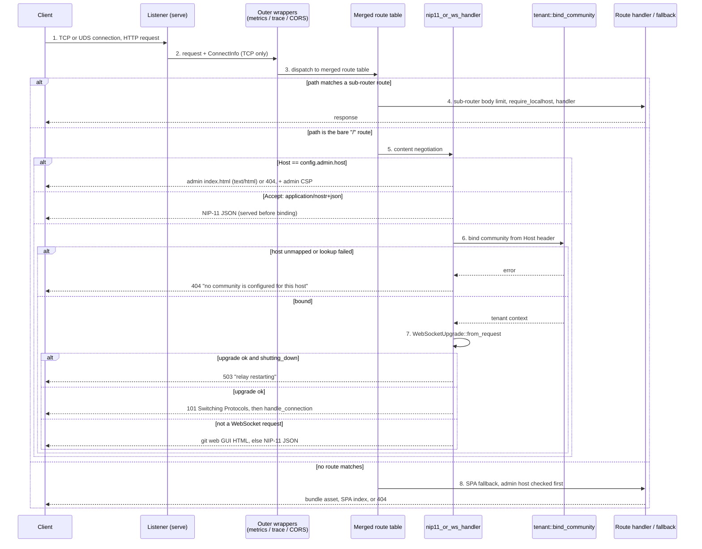

# Request routing: from listener to handler

Every inbound HTTP request to the relay — a WebSocket dial, a NIP-11 metadata
fetch, a media upload, a git fetch, an admin dashboard document — arrives on one
of the same listeners and is dispatched by one composed axum `Router` built by
`build_router`. This node narrates that dispatch: what happens between a byte
stream landing on a socket and a specific handler function being called, in the
order it happens, and where that ordering is load-bearing.

**Trigger.** A client opens a TCP connection to the relay's bind address (or, on
unix with `BUZZ_UDS_PATH` set, to the Unix socket) and sends an HTTP request.

**Preconditions.** The relay has completed startup, `build_router` has produced
the merged router, and `serve` has bound the listeners. Which routes exist at all
is decided at build time from configuration: the admin sub-router is absent
unless `config.admin` is set, and the SPA fallback is absent unless at least one
bundle directory is configured.

**Termination.** One handler produces a response, or the request is rejected by a
route-level guard, the SPA fallback, or the content-negotiation branch inside
`nip11_or_ws_handler` — or, on the one route that upgrades, the HTTP exchange
ends and a long-lived WebSocket connection begins.

## Sequence

1. **The listener accepts the connection and attaches connection info.** `serve`
   binds a TCP listener on `config.bind_addr` and serves the router with
   `into_make_service_with_connect_info::<std::net::SocketAddr>()`, which places
   a `ConnectInfo<SocketAddr>` in each request's extensions. On unix, when
   `BUZZ_UDS_PATH` names a socket, the *same* router is additionally served on a
   `UnixListener` with a plain `into_make_service()` — that path attaches no
   `ConnectInfo` at all. A separate health listener on `config.health_port`
   serves a different router entirely. (`crates/buzz-relay/src/main.rs`)

2. **The outer wrappers run.** The merged router carries three wrappers applied
   once over the whole surface: `track_metrics`, an HTTP trace layer that opens
   an `http.request` span, and a CORS layer built from `config.cors_origins`.
   `track_metrics` records against the `MatchedPath` route pattern rather than
   the raw URI, and skips `/_`-prefixed paths, `/health` and `/metrics`; when
   `MatchedPath` is absent it returns early without recording, so unmatched
   scanner traffic cannot inflate label cardinality.
   (`crates/buzz-relay/src/router.rs`, `crates/buzz-relay/src/metrics.rs`)

3. **The merged route table is consulted.** `build_router` merges four
   sub-routers — the API router (the bare `/` route, `/info`, NIP-05, health,
   the `/events` `/query` `/count` bridge, GIF proxy, workflows, operator,
   invites, moderation reads, webhooks and the huddle audio socket), the media
   router, the git router and the git-policy router — and, when `config.admin`
   is set, an admin router nested at `/api/admin/v1`.
   (`crates/buzz-relay/src/router.rs`)

4. **The matched sub-router's own guards run.** Body limits are attached
   per sub-router before the merge, not globally: 1 MiB on the API router, the
   larger of `max_image_bytes` and `max_video_bytes` on the media router, and
   1 MiB on the git-policy router. The git-policy router additionally carries a
   `require_localhost` middleware that reads `ConnectInfo<SocketAddr>` and
   answers 403 unless the peer is a loopback address.
   (`crates/buzz-relay/src/router.rs`, `crates/buzz-relay/src/api/git/mod.rs`)

5. **On the bare `/` route, `nip11_or_ws_handler` content-negotiates.** This is
   the branch worth reading closely, because one route answers four different
   ways. In order:
   - **Admin authority first.** `is_admin_host` compares the `Host` header for
     exact equality against `config.admin.host`. On a match the handler
     short-circuits: the admin bundle's `index.html` if `Accept` contains
     `text/html`, otherwise 404 — always with the admin CSP attached. The relay
     protocol is never exposed on that authority.
   - **`Accept: application/nostr+json` → NIP-11 JSON.** Served *before* the
     community binding in step 6, and deliberately so.
   - **Otherwise, bind the community, then attempt the upgrade** (steps 6–7).
   (`crates/buzz-relay/src/router.rs`,
   `crates/buzz-relay/src/api/admin/auth.rs`)

6. **The community is bound from the Host header before any frame is read.**
   `tenant::bind_community` resolves the request host to a community context.
   This is the trust-boundary crossing in the flow: it happens *before* the
   WebSocket upgrade so that no frame is ever read on an unbound connection.
   Host resolution itself is owned elsewhere — see *Boundary*.
   (`crates/buzz-relay/src/router.rs`)

7. **The upgrade is attempted, and the shutdown flag is re-checked.**
   `WebSocketUpgrade::from_request` decides whether this is really a WebSocket
   handshake. On success the handler checks `state.shutting_down` and refuses
   with 503 if the pod is draining; otherwise `limit_relay_websocket` pins the
   parser's max message and frame size to `config.max_frame_bytes` before
   `on_upgrade` hands the socket to `handle_connection`. On failure — an
   ordinary browser request, say — the handler falls back to the git web GUI's
   `index.html` when `serve_git_web_gui` is on and `Accept` contains
   `text/html`, and to the NIP-11 document otherwise.
   (`crates/buzz-relay/src/router.rs`)

8. **Unmatched paths reach the SPA fallback, admin host first.** When either
   bundle directory is configured, a `fallback_service` handles everything the
   route table missed. It checks the admin host before anything else so the
   admin authority can never fall through to the public bundle: `/assets/*` and
   `/favicon.svg` come from the admin bundle, `/`, `/reports*` and `/feedback*`
   render its index, and every other path on that authority is 404 — all with
   the admin CSP. Only a non-admin host reaches the public bundle, where
   `/assets/` is served verbatim and `should_serve_spa` admits an invite landing
   path unconditionally but `/`, `/repos` and `/repos/*` only when
   `serve_git_web_gui` is enabled. Anything else is 404.
   (`crates/buzz-relay/src/router.rs`)

## Diagram

## Outcome

**Success.** The client holds a response produced by exactly one handler, and an
`http.request` trace span has been opened for it. A metrics observation keyed to
the matched route pattern is recorded too — but only for a request that matched
a route and whose pattern is not `/health`, `/metrics` or `/_`-prefixed; a
fallback-served or probe request deliberately records none. On the one upgrading
route, the HTTP exchange
has ended with 101 and the connection is now a WebSocket bound to a resolved
community, owned from that point by `handle_connection`.
(`crates/buzz-relay/src/router.rs`, `crates/buzz-relay/src/metrics.rs`)

**Rejection paths present in the code.** Four are worth naming, because each is
a deliberate fail-closed choice rather than an accident:

| Condition | Result | Why it is shaped this way |
|---|---|---|
| Host resolves to no community, or the lookup errors | 404, generic text, host never echoed | The two cases are deliberately indistinguishable so an unauthenticated caller cannot probe which communities a deployment hosts |
| Upgrade negotiated while `shutting_down` is set | 503 "relay restarting" | Readiness only stops Kubernetes routing; direct and in-flight upgrades still reach the handler during the pre-drain window, and clients treat the refusal as a normal dial failure |
| Non-loopback peer, or no `ConnectInfo`, on `/internal/git/policy` | 403 "internal endpoint: localhost only" | Defense in depth for a hook-called internal endpoint; the absence of `ConnectInfo` resolves to `false`, so it fails closed |
| `BUZZ_CORS_ORIGINS` set but no origin parses | Empty `CorsLayer`, error logged | The code explicitly refuses to fall back to permissive CORS on a misconfiguration |

(`crates/buzz-relay/src/router.rs`, `crates/buzz-relay/src/api/git/mod.rs`)

**Representative verification.** `router.rs` carries its own dispatch tests,
which drive `build_router(state).oneshot(request)` and assert that admin-host
documents and assets carry the admin CSP, that `/index.html` and `/nope.svg` on
the admin authority are 404 because the bundle directory is not browsable, that
public-host responses carry no admin CSP, and — as unit tests over the predicate
functions — that `should_serve_spa` admits invite landings unconditionally while
gating the git web GUI paths on `serve_git_web_gui`.
(`crates/buzz-relay/src/router.rs`)

## Boundary

This node narrates **HTTP route dispatch**. It does not describe:

- **Host resolution itself.** How a `Host` header becomes a community context —
  the lookup, its caching, its failure modes — is a separate flow with its own
  node (host routing, `#1126`). This node names `tenant::bind_community` as a
  step that happens and where in the order it happens, and stops there.
- **The HTTP surface as a standing contract.** Which endpoints exist, what each
  one accepts and returns, and why the relay prefers Nostr event kinds to new
  HTTP endpoints, is a concept node (`#1127`), not this flow. The route
  inventory in step 3 is a sketch of what the table contains, not its contract.
- **Connection admission.** What happens *after* `on_upgrade` — the connection
  semaphore, the community-active check, the NIP-42 challenge, the auth timeout
  — is owned by connection admission (`#1121`) and by the merged
  `architecture-flows-websocket-connection` node. This flow ends at the moment
  the socket is handed over.
- **In-band Nostr verb dispatch.** Once a WebSocket exists, a second and quite
  different routing happens: `ClientMessage::parse` turns each JSON frame into
  an `Event`, `Req`, `Count`, `Close` or `Auth` value and `connection.rs`
  matches it to a per-verb handler. That is not HTTP routing, it is owned by the
  merged flow nodes for connection, event ingestion and historical query, and it
  is deliberately excluded here rather than folded in.
- **What any individual handler then does.** `architecture-flows-http-event-submission`
  covers `POST /events` from the route inward; the media, git and admin flows
  have their own nodes or tasks.

## Relationships

- `references: implementation-crates-buzz-relay` — the crate that owns
  `router.rs`, `main.rs` and every handler this flow dispatches into.
- `references: architecture-flows-websocket-connection` — the flow that begins
  where step 7 hands the socket to `handle_connection`.
- `references: architecture-flows-http-event-submission` — a worked example of
  one matched route continuing past this flow's termination.
- `references: architecture-principles-host-selects-community` — the principle
  step 6 enforces.
- `references: layers-configuration-relay-configuration` — the configuration
  that decides which routes and fallbacks exist at all.
- `references: layers-observability-metrics` — what step 2's `track_metrics`
  wrapper feeds.
- `references: layers-lifecycle-graceful-shutdown` — the shutdown state step 7
  re-checks before accepting a socket.

No relationship targets any node authored in the same Feature batch as this one;
every target above was confirmed present on `origin/launchpad` before being
written.

## Scope and omissions

**This node covers** how an inbound HTTP request reaches a handler in the relay:
listener setup and what each listener attaches, the wrappers applied over the
merged router, how the route table is composed from sub-routers and where body
limits and localhost guards sit, the four-way content-negotiation branch on the
bare `/` route, the SPA fallback's admin-host-first ordering, and the rejection
paths present in that code.

**It does not cover, and these are gaps rather than silence:**

| Not covered here | Owned by |
|---|---|
| How a Host header resolves to a community | host routing (`#1126`) |
| The HTTP surface's standing endpoint contract | HTTP surface concept (`#1127`) |
| What happens after `on_upgrade` — semaphore, challenge, auth timeout | connection admission (`#1121`), `architecture-flows-websocket-connection` |
| Nostr verb dispatch inside an established socket | `architecture-flows-event-ingestion`, `architecture-flows-historical-query` |
| Each handler's own behaviour past the route match | the per-flow nodes for events, media, git and admin |
| The metrics, trace and CORS subsystems themselves | `layers-observability-metrics`, `layers-observability-tracing` |

**Expected but not verified when this node was written:**

- **axum's `Router::layer` semantics were not read from axum's own source.** The
  claim that the three wrappers run *after* route matching, and that the
  last-applied wrapper is outermost at request time, is recorded as an
  `INFERENCE` at confidence 0.7. It rests on `track_metrics` depending on
  `MatchedPath` and explicitly handling its absence — strong circumstantial
  evidence, not a reading of the framework.
- **No test exercises the Unix-socket listener.** The claim that
  `/internal/git/policy` is unreachable over UDS follows from
  `into_make_service()` attaching no `ConnectInfo` and `require_localhost`
  resolving the absence to `false`; it is recorded as an `INFERENCE` at
  confidence 0.75. A search of `router.rs` and `api/git/mod.rs` found no test
  covering that combination, and none was written here.
- **No end-to-end test of the full merged router across all sub-routers was
  found.** `router.rs`'s tests build the real router but exercise the SPA
  fallback, the admin CSP and the WebSocket frame limit; the media, git and
  admin sub-routers' merge behaviour is covered, if at all, by tests elsewhere
  that this node did not locate.
- **The `/_mesh/demo/echo` route's runtime gating was not verified.** The router
  registers the route unconditionally and its comment states the handler 404s
  unless two environment flags are set; `api/mesh_demo.rs` was not opened, so
  that gating is repeated here only as a comment, not as a checked claim, and no
  evidence entry asserts it.
- **The relay was not run.** Every claim in this node comes from reading source
  at the recorded revision; no request was dispatched against a live relay to
  observe the ordering described.
