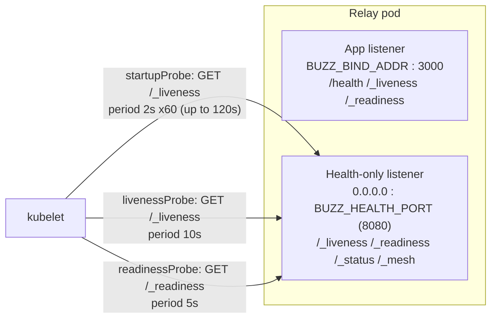

# Health checks

The Buzz relay exposes a small family of HTTP endpoints whose only job is to
answer "is this process okay" for an orchestrator, not for application
clients. This node is the umbrella map of that surface: which endpoints exist,
where they are served from, how Kubernetes is wired to them, and how they
relate to each other and to the relay's shutdown sequence. It intentionally
stays shallow on any single endpoint's internal dependency checks — that depth
belongs to this Feature's sibling nodes once they exist (see *Scope and
omissions*).

## Definition

A **health check**, in this codebase, is one of the relay's unauthenticated
`GET` endpoints — `/health`, `/_liveness`, `/_readiness` (and, on the
dedicated health port only, `/_status` and `/_mesh`) — that reports process or
dependency health as a plain HTTP status code (and a small JSON body for
`/_readiness`), consumed by Kubernetes probes rather than by desktop, mobile,
or CLI clients.

**What a health check is not:**

- **Not application data.** No health endpoint returns Nostr events, channel
  state, or anything a client renders. `/_status` and `/_mesh` return
  service/build and mesh-peer introspection respectively — operationally
  useful, but not "is it healthy" signals, and neither is wired to a
  Kubernetes probe in the Helm chart. They happen to share the health-only
  listener; this node does not treat their payloads as part of the
  health-*check* surface proper.
- **Not compute/agent liveness.** A Buzz agent's own liveness (is a specific
  agent's compute instance still running) is answered entirely differently —
  via relay presence events (`kind:20001`), not any HTTP probe — and is
  `layers/compute/liveness.md`'s subject, not this node's.
- **Not authenticated or community-scoped.** Every other HTTP path in this
  codebase resolves a host-derived community boundary or requires NIP-98
  auth; the health-only router explicitly carries none of that (no auth, no
  CORS, no metrics middleware, no body limit) because a Kubernetes kubelet
  probing a pod has no community context to present.

## The two surfaces

Two different routers carry overlapping route paths, and the distinction
matters operationally:

1. **The main app router** (`build_router`) registers `/health`, `/_liveness`
   and `/_readiness` alongside every other application route, served on the
   relay's primary listener(s) (`BUZZ_BIND_ADDR`, default `0.0.0.0:3000`, plus
   an optional Unix domain socket). Requests here pass through the same CORS
   layer as application traffic, but are explicitly excluded from the
   Prometheus request-metrics middleware (paths starting `/_` or equal to
   `/health` are skipped, "to avoid polluting dashboards").
2. **The health-only router** (`build_health_router`) is a second, separate
   `axum::Router` bound to its own dedicated TCP listener
   (`0.0.0.0:<BUZZ_HEALTH_PORT>`, default `8080`) with no metrics middleware,
   no auth, no CORS, and no body-size limit. It carries `/_liveness` and
   `/_readiness` (the same handlers as the main router) plus two endpoints the
   main router does not expose: `/_status` (service name, version, uptime,
   build identity) and `/_mesh` (mesh peer/connection status). This is the
   listener the Kubernetes chart's probes actually target, via a container
   port named `health`.

`/_liveness` and `/_readiness` therefore each answer twice, from two
independent listeners bound to two different ports, sharing the same handler
code. `/health` exists only on the main app listener and is not referenced by
any probe in the Helm chart.

## How Kubernetes is wired to it

`deploy/charts/buzz/values.yaml` wires all three Kubernetes probe types to the
container's `health` port (named via `service.healthPort: 8080`, plumbed
through `deployment.yaml`'s container port and `service.yaml`'s Service port,
and passed to the process as `BUZZ_HEALTH_PORT`):

| Probe | Target | Timing |
|---|---|---|
| `startupProbe` | `GET /_liveness` | `periodSeconds: 2`, `failureThreshold: 60` — up to 120s grace before liveness/readiness take over |
| `livenessProbe` | `GET /_liveness` | `initialDelaySeconds: 5`, `periodSeconds: 10`, `timeoutSeconds: 3`, `failureThreshold: 3` |
| `readinessProbe` | `GET /_readiness` | `initialDelaySeconds: 5`, `periodSeconds: 5`, `timeoutSeconds: 3`, `failureThreshold: 3` |

The startup probe deliberately targets `/_liveness`, not `/_readiness` —
tolerating a slow-starting process (still connecting to Postgres/Redis)
without the pod being killed, while the liveness probe behind it exists to
eventually catch a process that is truly wedged. Once the startup probe first
succeeds, Kubernetes hands off to the ordinary liveness/readiness probes for
the rest of the pod's life.

## How the endpoints relate to each other

The relay's own handlers draw a sharp, deliberate line between the two probe
paths:

- **`/_liveness` (and `/health`) are unconditional.** Both handlers return
  `200 OK` with no dependency check whatsoever — they can only fail to
  respond if the process itself cannot schedule an async task at all. This is
  exactly why the startup probe targets `/_liveness`: it answers "is the
  process alive," nothing more.
- **`/_readiness` is dependency-gated.** It checks, concurrently and under a
  2-second timeout, the shutdown flag, a Postgres ping, a Redis pool
  checkout, and the deletion-serving catalog's validity — reporting `503`
  with a per-check breakdown if any fail (or time out), and `200 {"status":
  "ready"}` only if all three pass. `architecture-deployment-kubernetes`
  already flags one specific limit of this check: it proves Postgres
  *connectivity*, not schema freshness, so a pod can be ready while running
  against an unmigrated schema if auto-migration is disabled.

This is also the mechanism the relay uses to signal graceful shutdown: on a
shutdown signal, `shutting_down` flips to `true` immediately, which makes
`/_readiness` start returning `503 {"status": "shutting_down"}` on its very
next request — before any listener stops accepting connections. The process
then sleeps 5 seconds (documented specifically so Kubernetes has time to stop
routing new traffic before listeners close) before starting the up-to-30-second
connection drain. Notably, the health-only listener is never itself wrapped
in graceful-shutdown wiring the way the app listeners are — it keeps serving
`/_liveness`/`/_readiness` (now reporting `shutting_down`) for the whole drain,
right up until process exit, which is exactly the behavior the readiness
probe needs during a rolling restart.

## Use cases

- **Debugging a pod stuck in `CrashLoopBackOff` or never becoming `Ready`**:
  knowing that `/_liveness` cannot fail on its own narrows the search to
  `/_readiness`'s three checks (Postgres, Redis, deletion-serving catalog)
  or, for a liveness failure specifically, to the process being genuinely
  wedged rather than merely slow to connect.
- **Reasoning about a rolling restart or `SIGTERM`**: expecting
  `/_readiness` to flip to `503` immediately, before any connection is
  dropped, and to keep answering that way for the whole drain window.
- **Adding a new dependency check** (e.g. a new datastore): deciding whether
  it belongs in `/_readiness`'s concurrent check set (traffic-affecting
  dependencies) versus being irrelevant to this endpoint entirely — the
  existing three checks are the pattern to extend, not `/_liveness`.
- **Writing or reviewing chart changes**: recognizing that all three probe
  types share one container port (`health`) and that changing
  `BUZZ_HEALTH_PORT` without updating `service.healthPort` (or vice versa)
  breaks probe routing silently rather than loudly.

## Scope and omissions

**This document covers** the inventory of health-check-adjacent endpoints
(`/health`, `/_liveness`, `/_readiness`, and the health-only listener's
`/_status`/`/_mesh`), the two-listener/two-router shape that serves them, how
the Helm chart's startup/liveness/readiness probes are wired to them, and how
the endpoints relate to each other and to the relay's graceful-shutdown
sequence.

**It does not cover, and these are gaps rather than silence:**

| Not covered here | Owned by |
|---|---|
| The relay-process liveness probe's own deep dive — history, rationale for an unconditional check, any future evolution | #1138, `layers/observability/liveness.md` (not yet drafted at this node's recorded revision) |
| The readiness probe's deep dive — the specific semantics and failure modes of each of its three dependency checks | #1143, `layers/observability/readiness.md` (not yet drafted at this node's recorded revision) |
| Compute/agent-instance liveness (relay presence events, `kind:20001`) — a same-word, different-question, different-layer mechanism | `layers/compute/liveness.md` (drafted under #1138's sibling issue #1044) |
| `/_status` and `/_mesh` response payload internals | Not claimed by this node; neither is wired to a Kubernetes probe |
| Kubernetes deployment topology generally (replica strategy, resource limits, migrations) | `architecture-deployment-kubernetes` |
| The relay container's full inbound surface and all four listeners in overview | `architecture-containers-relay` |

**No relationships to `#1138`'s or `#1143`'s eventual nodes.** Checked before
declaring none, per this corpus's own convention: at the recorded revision,
`origin/launchpad`'s `launchpad/docs/corpus` tree has no `layers/` directory
at all, so `layers-observability-liveness` and `layers-observability-readiness`
do not exist as mergeable relationship targets yet. Two relationships are
declared instead, to nodes that do exist today and already touch this
subject: `architecture-containers-relay` (states the four-listener shape and
lists the health/liveness/readiness probes as part of the relay's inbound
surface) and `architecture-deployment-kubernetes` (already documents the
readiness probe's DB-connectivity-only limitation).

**Expected but not verified when this node was written:**

- Whether any load balancer, ingress, or external monitoring system (outside
  the Kubernetes chart in this repository) also targets `/health` or
  `/_liveness`/`/_readiness` was not checked — only the in-repo Helm chart's
  probe wiring was verified.
- No automated test exercising `/_liveness`, `/_readiness`, `/_status` or
  `/_mesh` over HTTP was located during this node's authoring; the behavior
  claims above are drawn directly from the handler source, not from an
  observed test run.
- Whether `#1138`'s or `#1143`'s eventual scope will draw exactly the
  boundary this node assumes (relay-process probes for #1138, the readiness
  dependency checks for #1143) is this node's own reasoned placement — like
  the sibling `layers/compute/liveness.md` node's own equivalent disclosure
  about #1138 — not something either issue has itself stated, since neither
  has been drafted yet.
