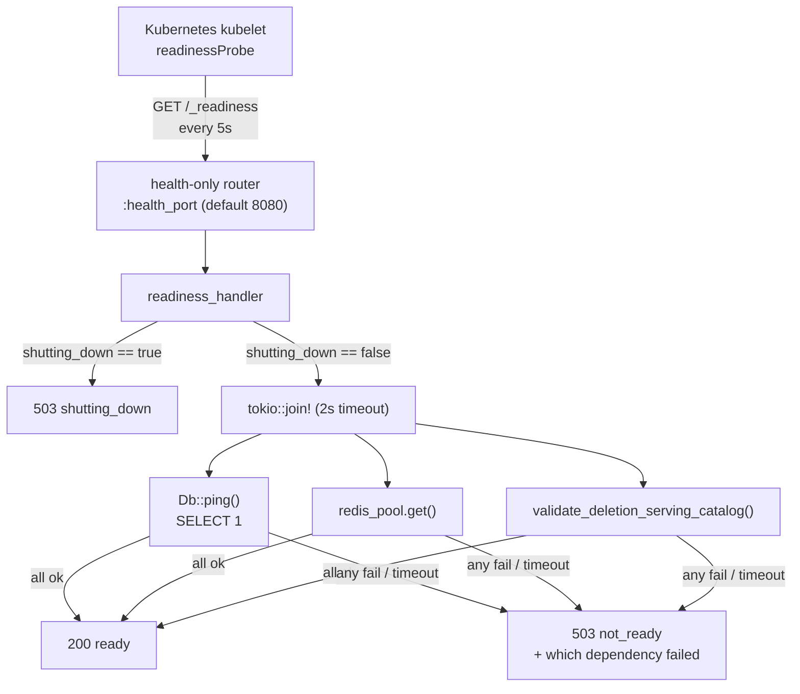

# Concept: Readiness Probe

The readiness probe is how the relay tells its orchestrator "I am running, but not yet
(or no longer) fit to receive traffic" — distinct from merely being alive.

## Definition

The **readiness probe** is the relay's `GET /_readiness` endpoint
(`readiness_handler` in `crates/buzz-relay/src/router.rs`). It answers one question:
*can this pod correctly serve a request right now?* That is a stronger, narrower
claim than "is the process alive" — a process can be alive (accepting TCP
connections, running its event loop) while still being unfit to serve, for example
because its Postgres pool is unreachable or it is mid-shutdown and draining
in-flight work.

Readiness is computed, not assumed. On every poll, the handler:

1. Returns `503` immediately if `state.shutting_down` is `true` — no dependency
   check runs once shutdown has begun; the pod has already decided it is not
   ready.
2. Otherwise runs three checks concurrently, each bounded by one shared 2-second
   timeout: Postgres reachability (`Db::ping`, a bare `SELECT 1`), Redis pool
   availability (`redis_pool.get().await.is_ok()`), and the deletion-fence schema
   shape (`validate_deletion_serving_catalog`, which asserts the `communities`
   table actually carries the `deletion_state`, `deletion_fence_generation`, and
   `deleted_at` columns the deletion-serving code path depends on — a schema-shape
   assertion, not just "can I open a connection").
3. Returns `200 {"status": "ready"}` only if all three pass; otherwise `503` with
   a body naming exactly which dependency failed, so an operator reading the
   response body (not just the status code) can tell Postgres from Redis from a
   missing deletion-fence column.

**What readiness is not.** It is not the same thing as **liveness**
(`GET /_liveness`, `liveness_handler`): liveness takes no application state at all
and unconditionally returns `200 OK`. Liveness answers "should Kubernetes restart
this container" (a hung or crashed process); readiness answers "should Kubernetes
route traffic to this pod right now" (a healthy process that is temporarily unfit
to serve). Conflating the two would make a slow Postgres failover restart every
pod in the deployment instead of simply routing around them — which is exactly
the failure mode separate liveness/readiness probes exist to prevent.

## Where it runs

Both `/_liveness` and `/_readiness` are registered twice: once on the main app
router (reachable over the same port as WebSocket/API traffic) and once on a
dedicated **health-only router**, bound on its own TCP port
(`config.health_port`, default `8080`). The health-only router's own field doc
states the reason directly: it exists so K8s probes bypass Istio and the app's
auth middleware entirely — the orchestrator's probe traffic should never depend
on, or be blocked by, the same auth/service-mesh layers that gate real client
traffic.

## Use cases

- **Rolling deploys and pod restarts.** A newly started pod's dependencies
  (Postgres pool warmup, Redis connection) may not be ready the instant the
  process starts listening. Readiness — gated by the chart's own
  `startupProbe`/`readinessProbe` combination — keeps Kubernetes from routing
  live traffic to a pod before its checks actually pass, without needing the
  liveness probe (and its restart behavior) to also encode that logic.
- **Graceful shutdown.** On `SIGTERM`, `shutting_down` flips to `true`
  immediately, so the very next readiness poll fails — well before the fixed
  5-second grace period and the subsequent connection drain even begin. This is
  the mechanism that lets Kubernetes stop routing *new* traffic to a
  terminating pod while the pod finishes draining the traffic it already has.
- **Dependency-outage isolation.** If one pod's Postgres or Redis connection
  degrades independently of its peers (a partial network partition, a stuck
  connection pool), that pod's readiness fails while its peers keep serving —
  the orchestrator routes around exactly the unhealthy replica instead of an
  operator having to intervene by hand.
- **Operator debugging.** Because the `503 not_ready` body names which
  dependency failed (`postgres`, `redis`, `deletion_catalog`), an operator
  curling `/_readiness` directly (the chart's own `NOTES.txt` documents doing
  exactly this via `kubectl port-forward`) gets a specific answer, not just a
  failing HTTP status.

## Comparison: the relay's four health-adjacent signals

| Endpoint / mechanism | Checks | Answers |
|---|---|---|
| `/_liveness` | Nothing — always `200 OK` | "Is the process alive enough not to be restarted?" |
| `/_readiness` | Shutdown flag, then Postgres, Redis, deletion-fence schema (2s timeout) | "Should traffic be routed to this pod right now?" |
| `/_status` | None of the above — reports service name, version, uptime, build identity | "What build/version is running, and for how long?" |
| Mesh heartbeat gate (`spawn_registry_heartbeat`) | Only the `shutting_down` flag (`!shutting_down`) | A coarser, mesh-internal "would this pod currently pass readiness" proxy — it does not re-run the Postgres/Redis/deletion-catalog checks, so it is not equivalent to a real `/_readiness` poll. |

## Scope and omissions

**This document covers** the readiness probe specifically: what `readiness_handler`
checks, in what order, with what timeout and response shape; where it is served and
why on a separate port; and its boundary against liveness, `/_status`, and the
mesh's own internal readiness proxy.

**It does not cover, and these are gaps rather than silence:**

| Not covered here | Owned by |
|---|---|
| The liveness probe in depth (its own handler, restart semantics, `startupProbe` interaction) | The `layers/observability/liveness.md` node (issue #1138) — not yet merged at the checked revision, so no `relationships` edge is declared here (see below) |
| The umbrella overview of all relay health-check endpoints together | The `layers/observability/health-checks.md` node (issue #1137), being authored in parallel |
| The mesh membership/heartbeat protocol itself, beyond the one `shutting_down`-flag detail cited above | Not this node's subject |
| The graceful-shutdown drain sequence in full (jitter, per-connection close-frame acks, the 30s hard-drain timeout) | `crates/buzz-relay/src/main.rs`'s own `serve`/`GRACEFUL_DRAIN_TIMEOUT` doc comments; a candidate for its own corpus node, not duplicated here |
| The deletion-fence catalog/schema itself (why those three columns exist, what depends on them) | `crates/buzz-db/src/store/deletion.rs`; a candidate for its own corpus node |

**No `relationships` declared.** Checked immediately before finalizing this front
matter: `git ls-tree -r --name-only origin/launchpad -- launchpad/docs/corpus` lists
no `layers/` directory at all yet, so neither the liveness node (#1138) nor any other
sibling observability node has an `id` to resolve against on the branch this change
would merge into. Declaring an edge now would validate on this worktree and still
fail once the corpus's own AGENTS.md-documented merge-target rule applies. The
natural edge — `references` (or a more specific type, once one exists) from this
node to `layers-observability-liveness` — is left for a later backfill pass once
that sibling merges.

**Expected but not verified when this node was written:**

- **No dedicated automated test was found exercising `readiness_handler` directly**
  (no match for `readiness` under any `tests/` directory in `buzz-relay` or
  `buzz-test-client`). Its behavior is documented here from reading the handler's
  source directly, not from a passing test asserting the response shapes described
  above.
- **Whether `BUZZ_GIT_CONFORMANCE_PROBE` is actually enabled by default in every
  deployment** was read from the chart's own README prose, not independently
  re-derived from the relay's own default-config source in this pass.
