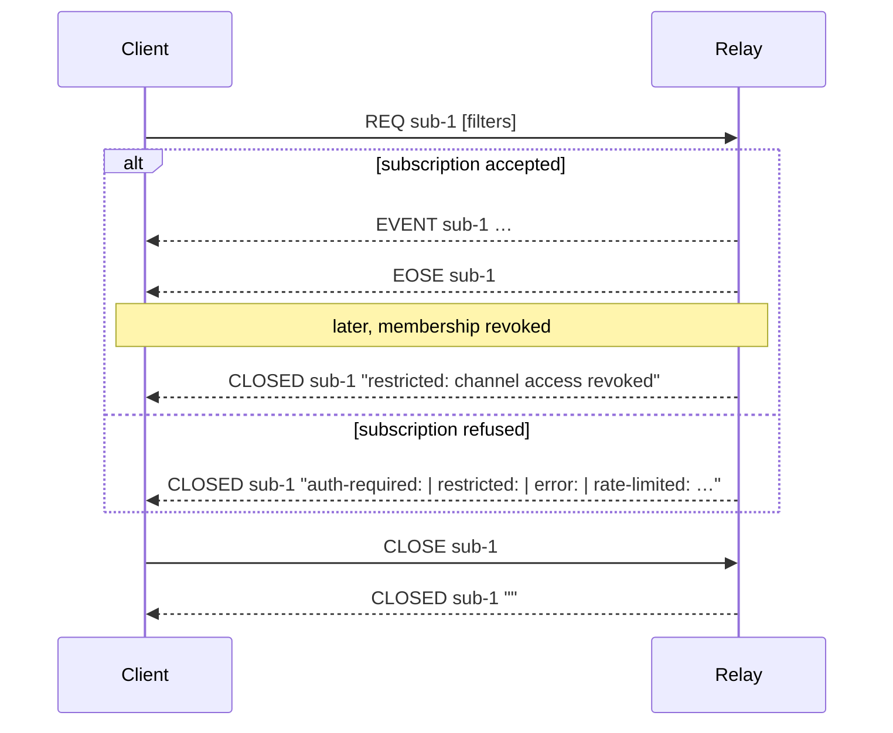

# The `CLOSED` message

`CLOSED` is how a Buzz relay tells one client that one of its subscriptions is
over. It is the only relay-to-client frame that ends a subscription's life, and
its third element carries a machine-readable reason prefix that decides whether
the client should retry, back off, or give up. This node defines the message,
enumerates the reasons this relay actually emits, and describes what the shipped
clients do when they receive one.

## Definition

`CLOSED` is a relay-to-client WebSocket text frame, encoded as the three-element
JSON array `["CLOSED", <subscription_id>, <message>]`. `<subscription_id>`
identifies exactly one of the sending connection's subscriptions; `<message>` is
a human-readable reason that conventionally begins with a machine-readable,
colon-terminated prefix. Receiving it means the named subscription no longer
exists on the relay: no further `EVENT` frames will arrive for that id, and the
client must send a fresh `REQ` if it wants the stream back.

Three things share a name with this message and are **not** it.

**`CLOSE` is a different message travelling the other way.** `CLOSE` is
client-to-relay and asks the relay to end a subscription the client no longer
wants. `CLOSED` is relay-to-client and reports that a subscription has ended.
They are not a request/response pair in general — most `CLOSED` frames this relay
sends were never asked for by a `CLOSE`. The one place they meet is the
acknowledgement: the relay's `CLOSE` handler replies with a `CLOSED` whose reason
is the **empty string**, which is the sole `CLOSED` that reports success rather
than a failure. `CLOSE` itself is documented separately; this node does not cover
its parsing, its handler, or the fan-out deregistration it performs.

**The WebSocket close frame is a different layer.** A transport-level WebSocket
close frame tears down the whole connection and every subscription on it at once. `CLOSED` is an application-layer text frame that ends exactly one
subscription and leaves the socket open and authenticated. A client that conflates
them will either reconnect when it only needed to re-`REQ`, or leave a dead
subscription in its map after the socket has actually gone. Transport-level close
is a separate concern and is not covered here.

**`OK` is the rejection frame for publishing, not for subscribing.** An event that
the relay refuses to store is rejected with `["OK", <event_id>, false, <message>]`,
whose reason uses the *same* prefix vocabulary. Two prefixes in that vocabulary —
`invalid:` and `duplicate:` — are used by this relay only on the ingest path and
reach the client as `OK`, never as `CLOSED`. A reader grepping for a prefix string
therefore has to check which frame carries it.

## Background

`CLOSED` exists because a subscription can fail *after* the relay has accepted the
socket and authenticated the peer. Without it, a relay refusing a `REQ` has only
two bad options: send `NOTICE`, which is connection-scoped and does not say which
subscription died, or drop the socket, which kills every other subscription too.
`CLOSED` is subscription-scoped, so one rejected `REQ` costs one subscription.

That scoping is visible in the relay's own code as a deliberate branch.
`request_rejection_message` in `connection.rs` takes an `Option<&str>`
subscription id and returns a `CLOSED` when one is present and a `NOTICE` when it
is not — the *same* rate-limit reason, routed to whichever frame can carry it.
Its unit test asserts exactly that pairing.

## Reasons this relay emits

Every `RelayMessage::closed` call site in the tree was read to build this table.
Four prefixes are in use, plus the empty reason.

| Prefix | Emitted where | Meaning |
|---|---|---|
| *(empty)* | `handlers/close.rs` | Acknowledgement of a client `CLOSE`. The subscription ended because the client asked. Not a failure. |
| `auth-required:` | `handlers/req.rs`, `handlers/count.rs` | The connection is not `Authenticated`. `REQ` additionally sends a `NOTICE` alongside. |
| `restricted:` | `handlers/req.rs`, `handlers/count.rs`, `handlers/side_effects.rs` | The authenticated peer may not read what the filter asks for: insufficient scope, not a channel member, too many explicit `#h` values, a p-gated / agent-engram / author-only kind requested without the required self-scoping, a COUNT whose filter needs narrowing, or channel access revoked underneath a live subscription. |
| `error:` | `handlers/req.rs`, `handlers/count.rs` | The request is well-formed but the relay cannot serve it. A database failure produces `error: database error` from both handlers; the 1024-subscription cap and mixed search / non-search filters are `REQ`-only; COUNT adds a dynamic `error: {e}` carrying the underlying database error text verbatim. |
| `rate-limited:` | `connection.rs` | Back-pressure: the handler semaphore is exhausted, a per-principal admission quota is spent (`retry in {n}s`), or the shared admission store is unavailable. |

Two properties of that table matter more than the individual strings.

**Only one of these is unsolicited.** Every other `CLOSED` is a reply to a
`REQ`, a `COUNT` or a `CLOSE` the client just sent. The
`restricted: channel access revoked` frame from `side_effects.rs` arrives with no
client message in flight, when a membership change removes a live subscription's
right to exist. A client that only handles `CLOSED` inside a request/response
correlation will miss it.

**`auth-required:` is not permanent.** It is emitted whenever the connection is
not yet `Authenticated`, which includes the window in which a `REQ` races the
NIP-42 handshake after a reconnect. The handshake itself — the challenge, the
kind:22242 response, the 5-second timeout, the per-handler auth checks — is
documented by `architecture-flows-websocket-authentication` and is not restated
here.

## Use cases

**Writing a client that will not spin.** The reason prefix is the whole signal.
The desktop client's `classifyRelayClosed` sorts it three ways — `terminal`
deletes the subscription, `retryable` re-sends the `REQ` on exponential backoff
capped at 30 seconds, and `rate-limited` arms a process-wide gate and waits out
its remaining window instead of the local backoff, so concurrent operations back
off together. Getting this wrong in either direction is expensive: classify a
`restricted:` as retryable and the client re-`REQ`s a filter that can never
succeed, forever; classify an `auth-required:` as terminal and a subscription
that lost one handshake race never comes back. The shipped policy takes the
second risk deliberately and treats `auth-required:` as retryable, relying on a
genuinely unauthenticated session latching terminal at the connection level.

**Reading a relay rejection without a stack trace.** When a `REQ` returns nothing,
the `CLOSED` reason is usually the only diagnostic. `restricted:` points at
authorization — membership, scope, or a self-scoping requirement on a gated kind.
`error: too many subscriptions` points at the client leaking subscriptions rather
than at the relay. `rate-limited:` points at admission, and its `retry in Ns` hint
is a real number the relay computed, parsed by the desktop's gate with the same
regex it uses for HTTP 429 bodies and clamped to 300 seconds.

**Knowing that an empty reason is not an error.** A naive prefix classifier maps
`""` to "no known prefix, therefore retry", which would make every ordinary
unsubscribe trigger a re-subscribe. The desktop avoids this by ordering rather
than by classification: it removes the subscription from its map *before* sending
`CLOSE`, so the acknowledging `CLOSED` finds nothing to recover and is dropped.
Its test suite pins the underlying classification of `""` as retryable, which
makes that ordering load-bearing rather than incidental.

**Consuming `CLOSED` from Rust.** `buzz-ws-client` parses the frame into
`RelayMessage::Closed { subscription_id, message }`, requiring the subscription id
to be present and a string but defaulting a missing reason to `""`. Client
implementations differ in what they do next: the browser web client applies no
classification at all and simply rejects the pending query promise with the
relay's reason text.

## Comparison — terminal-prefix vocabulary, client versus relay

| Prefix | This relay emits it on `CLOSED` | Desktop client treats it as |
|---|---|---|
| `auth-required:` | yes | retryable |
| `rate-limited:` | yes | rate-limited |
| `restricted:` | yes | terminal |
| `error:` | yes | retryable, except `error: mixed search` and `error: too many subscriptions`, which are terminal |
| `blocked:` | no | terminal |
| `pow:` | no | terminal |
| `unsupported:` | no | terminal |
| `invalid:` | no — used on the ingest/`OK` path only | terminal |
| `duplicate:` | no — used on the ingest/`OK` path only | terminal |

The client's list is the wider one. The five prefixes it treats as terminal but
never receives are the standard's vocabulary rather than this relay's behaviour —
defensive coding against a relay that might one day send them, or against a
different relay entirely. That reading is an inference from the two sources, not
a statement recorded anywhere in the code.

## Related resources

The typed `relationships` edges in this node's front matter are the canonical
links: `implementation-crates-buzz-relay` for the emitting crate,
`implementation-crates-buzz-ws-client` for the Rust parser,
`implementation-crates-buzz-pair-relay` for the second, independent relay
implementation, `architecture-flows-websocket-authentication` for the handshake
that `auth-required:` refers to, `architecture-flows-websocket-connection` for the
per-message admission path that produces `rate-limited:`, and
`verification-contracts-websocket` and `verification-e2e-relay` for the conformance
contract and the live-relay tests that exercise these frames.

## Scope and omissions

**Not covered, and who owns it.**

- `CLOSE`, the client-to-relay message — its parsing, its handler's fan-out
  deregistration, and its topic-release behaviour. A sibling node on the same
  protocol surface owns it; this node covers only the `CLOSED` that acknowledges
  it.
- The WebSocket close frame and connection teardown — transport layer, owned by a
  separate networking node.
- The `OK` message and the event-ingest rejection path, including the `invalid:`
  and `duplicate:` reasons that live there. Named here only to keep the prefix
  vocabularies apart.
- The NIP-42 handshake itself, owned by `architecture-flows-websocket-authentication`.
- The subscription registry, fan-out, and topic retain/release machinery that a
  `CLOSED` is the visible edge of.
- The full text of NIP-01. It is not in this repository, so what the standard
  *requires* is recorded here as `TEAM_KNOWLEDGE` attributed to the spec by name,
  never as a `FACT` on a repository path. What *Buzz* does is a `FACT` on Buzz
  source.
- `buzz-pair-relay`'s own `CLOSED` emission beyond the fact that it exists and is
  independently implemented. Its reason set was not enumerated.

**Expected to verify and could not.**

- **No unit test asserts the reason string at any individual relay emit site.**
  `protocol.rs` has one test that `RelayMessage::closed` produces a well-formed
  `["CLOSED", …]` array, and `connection.rs` has one asserting the
  `CLOSED`-versus-`NOTICE` branch. Beyond those, the reason literals in
  `req.rs`, `count.rs` and `side_effects.rs` are unpinned by any test in the
  crate — the e2e tests that check them assert substrings (`"too many"`,
  `"restricted"`) against a live relay and are `#[ignore]`d by default. So an
  edit to a reason string would not fail a default `cargo test` run.
- **No live relay was run.** Every claim about relay behaviour here is read from
  source, not observed on the wire. The `#[ignore]`d e2e tests in
  `crates/buzz-test-client/tests/e2e_relay.rs` were read but not executed; they
  require a running Postgres and Redis.
- **The negative claim in the comparison table is bounded by grep, not by
  proof.** "This relay never emits `blocked:` on a `CLOSED`" rests on reading
  every `RelayMessage::closed` call site at the recorded revision. The dynamic
  `error: {e}` reason in `count.rs` interpolates a database error whose text was
  not enumerated, so a reason string this node did not anticipate can reach a
  client through that one path.
- **Mobile client behaviour was not established.** Only the desktop and browser
  web clients and the Rust `buzz-ws-client` were read; whether the Flutter app
  classifies `CLOSED` reasons at all is unknown.
