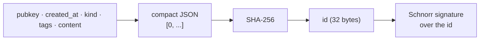

# The event id

An event's **id** is the 32-byte SHA-256 digest of a canonical serialization of the
event's own five signed fields — `pubkey`, `created_at`, `kind`, `tags` and `content`
— carried on the wire as 64 lowercase hex characters. It is not an identifier the
relay assigns; it is a value derived from the event's own bytes, so an event is
**content-addressed** (the same five fields always produce the same id, anywhere,
computed by anyone) and **tamper-evident** (changing any of those fields produces a
different id, which no longer matches the signature).

## What exactly is hashed

The canonical serialization is a six-element JSON array with a literal `0` in the
first position, followed by the five signed fields in a fixed order:

```
[0, pubkey, created_at, kind, tags, content]
```

serialized as compact JSON — no whitespace — and hashed with SHA-256. This is
readable directly in Buzz source: `crates/buzz-pair-relay/src/lib.rs` builds exactly
that array, `serde_json::to_string`s it, and `Sha256::digest`s the result. The
leading `0` and the field order are not decorative — they are what makes the digest
reproducible across independent implementations, which is the whole point of a
content address.

Two things are deliberately **outside** the hash. The `sig` field is not covered:
`crates/buzz-core/src/event.rs` has a test that replaces only `sig` and asserts
`verify_id()` still returns `true`. And the relay-assigned columns the `events` table
carries alongside the id — `received_at`, `channel_id`, `deleted_at` — are not covered
either, because they are assigned after the event was signed and are not among the
five fields.

The relationship between the id and the signature runs in one direction:



The signature is computed and verified **over the digest**, not over the
serialization — `verify_event_sig` passes the 32-byte hash straight to
`verify_schnorr`. So the id is the message the signature actually commits to, and the
chain is: fields determine the id, the id is what was signed. Break the first link and
the second link fails with it.

## Who computes it, and who checks it

**Buzz mostly delegates.** On the relay's real ingest path, `buzz-core`'s
`verify_event` calls the `nostr` crate's `Event::verify_id()`; it only reaches for
`nostr::EventId::new(pubkey, created_at, kind, tags, content)` to recompute the
expected value for the *error message*. The `nostr` crate is an external dependency
pinned at `0.44` in the workspace `Cargo.toml`, and its hashing code is not in this
repository.

**One component does not delegate.** `buzz-pair-relay`, the ephemeral sidecar relay
used for device pairing, implements the commitment, the digest and the comparison by
hand with `serde_json` and `sha2` rather than depending on the `nostr` crate. That is
why the exact serialization is verifiable from inside this repository at all.

**The relay never trusts the submitted id.** It recomputes and compares.

## What happens when the id does not match the content

An event whose `id` is not the correct digest of its own fields is **rejected, not
corrected**. `verify_event` returns `VerificationError::InvalidId { computed, got }`,
whose `Display` text is `invalid event id: computed <hash>, got <hash>`, and the
persistent-event ingest path wraps that as `IngestError::Rejected("invalid: {e}")`.

Two properties of that rejection are worth holding onto:

- **It happens first.** In `ingest_event_inner` the verification call sits ahead of
  the timestamp-drift check, the content-size cap, the pubkey/identity binding and
  the scope check. A mismatched id never reaches any of them.
- **The relay does not repair the id.** It has just computed the correct value — the
  error message contains it — and still refuses the event. It has to: rewriting the
  id would invalidate the signature over it, and a relay that "fixed" an event would
  be forging one.

The accept/reject invariant this sits inside, its enforcement points across the three
ingest surfaces, and the exact `OK` frame a client sees, are
`architecture-principles-signed-events`'s subject, not this node's.

## What the id is used for beyond identity

Because the id is a digest, it is also a **stable, globally comparable 32-byte value**
that every relay derives identically — and Buzz leans on that in four places:

- **Deduplication.** `insert_event` binds `event.id.as_bytes()` and lets
  `ON CONFLICT DO NOTHING` decide; a resubmitted event is absorbed rather than
  duplicated. The `events` table's key shape and what "duplicate" means at that layer
  belong to `layers-data-postgres-events-table`.
- **Deterministic ordering.** `query_events` appends `ORDER BY created_at DESC,
  id ASC` for every caller, so two events sharing a second still page in a fixed
  order.
- **Deterministic conflict resolution.** `created_at` is second-resolution, so ties
  are real. Replaceable-event stale-write protection keeps the lexicographically
  lowest id on a same-second tie — the code's own comment calls this "deterministic
  across relays" — and `migrations/0010_nip_rs_exact_replay_guard.sql` applies the
  same rule inside a Postgres trigger for NIP-RS watermarks, additionally treating an
  exact `(coordinate, created_at, event_id)` match as an idempotent no-op rather than
  a stale write.
- **Replay detection.** The NIP-98 guard's Redis seen-set is keyed on the id:
  `SET buzz:{community}:nip98:{event_id_hex} 1 NX EX <ttl>`. That obligation and its
  tests are `verification-security-replay`'s subject.

## What this must not be confused with

Buzz computes SHA-256 digests in at least three places that are **not** the event id.
The word "hash" alone will not disambiguate them:

| Digest | Over what | Computed by | Node |
|---|---|---|---|
| **Event id** | The canonical serialization of the five signed fields | The author/client; recomputed by the relay | this node |
| **Media content hash** | The raw bytes of an uploaded blob | The server, over bytes it received | `capabilities-media-content-hash` |
| **`content_sha256`** | An event's `content` field bytes alone | `buzz-core`, for private managed agent projections | whichever node eventually covers those projections |

The media content hash is the closest trap, because it is also a content address and
also SHA-256. It differs in both operands and trust model: it hashes raw bytes rather
than a JSON commitment, and it is computed by the server precisely because the
client's claim is not trusted, whereas the event id is computed by the *author* and
the relay's job is only to confirm it.

The id is also not the `e` tag, not the signature, and not the event. An `e` tag
*contains* an id; the signature is over the id; the event is the whole envelope. Each
is its own node.

## Scope and omissions

**This node covers** what the event id is, exactly which fields the digest is taken
over and in what order, whether Buzz computes it or delegates, what happens to an
event whose id does not match its content, how the id is stored and what the system
uses it for beyond naming an event.

**It does not cover, and these are gaps rather than silence:**

| Not covered here | Owned by |
|---|---|
| The Schnorr signature over the id — how it is produced and verified | #1166 |
| The event envelope as a whole and its field set | #1156 |
| The `e` tag, which references an id | #1149 |
| The relay's accept/reject invariant and its enforcement points | `architecture-principles-signed-events` |
| The `events` table's key shape, indexes and duplicate semantics | `layers-data-postgres-events-table` |
| The NIP-98 replay obligation and its verifying tests | `verification-security-replay` |
| The media content hash | `capabilities-media-content-hash` |
| `content_sha256` for private managed agent projections | Whichever node covers those projections; no merged node did at the recorded revision |

**Expected but not verified when this node was written:**

- **The `nostr` crate's own hashing code was never opened.** It is an external
  dependency pinned at `0.44` and is not vendored here, so the byte-level
  serialization described above is evidenced from `buzz-pair-relay`'s independent
  implementation — not from the code the relay actually executes. The two are
  *asserted* to agree by NIP-01; that assertion was not tested here.
- **Nothing asserts the two implementations agree.** `verify_event_sig` appears
  exactly twice in the tree — its definition and one call site in the pair-relay's
  message loop — and no test references it. So the pair-relay's id check has no unit
  test of its own, and no test compares its digest against the `nostr` crate's for the
  same event. A divergence would surface as pairing failures, not as a red build.
- **No upstream NIP text is in this repository.** `git ls-files 'docs/nips/*' | grep
  -E 'NIP-[0-9]'` returns no output and exits 1; `docs/nips/` holds only Buzz's own
  two-letter NIPs. Every claim above about what *NIP-01 requires* is therefore
  attributed to the specification rather than cited to a file, and every claim about
  what *Buzz does* is cited to Buzz source that was opened.
- **No end-to-end wire-level test of an id mismatch was found.** The rejection is
  covered at unit level by `rejects_tampered_id` in `crates/buzz-core/src/verification.rs`,
  but a search of `crates/buzz-test-client/` for `invalid event id`, `event id mismatch`
  and `tampered` returned nothing, so whether the `invalid:` `OK` frame reaches a client
  unchanged was not confirmed here. `architecture-principles-signed-events` records the
  same gap for the invariant as a whole, reached independently.
