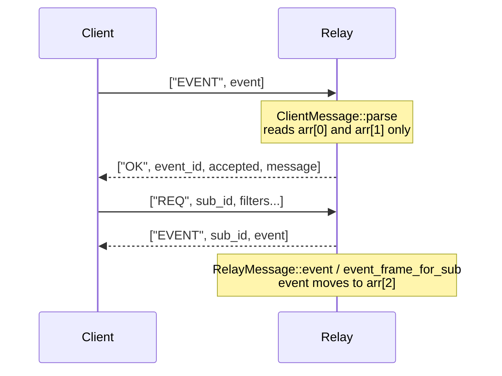

# The `EVENT` wire message

`EVENT` is the WebSocket frame that carries one Nostr event between a Buzz client
and a Buzz relay. It is the only message in the protocol that travels in **both**
directions, and it does not have the same shape in each — which is the whole
reason this node exists.

## Definition

An `EVENT` message is a JSON array whose first element is the literal string
`"EVENT"`. Everything after that depends on which way the frame is going:

| Direction | Shape | Meaning |
|---|---|---|
| client → relay | `["EVENT", <event>]` | *Publish this event.* |
| relay → client | `["EVENT", <sub_id>, <event>]` | *Here is an event matching your subscription `<sub_id>`.* |

Both are defined in `crates/buzz-relay/src/protocol.rs`, whose module doc names
the file as "NIP-01 client/relay message parsing and formatting":
`ClientMessage::parse`'s `"EVENT"` arm reads the inbound form, and
`RelayMessage::event` writes the outbound form.

**The disambiguation.** "The `EVENT` message" is not one thing. Read as a bare
name it is ambiguous, and the ambiguity is not cosmetic — the event object sits at
**index 1** inbound and at **index 2** outbound. Code that treats the two as
interchangeable reads a subscription id where it expects an event, or the reverse.
Whenever this corpus says `EVENT` without qualification, assume the direction is
load-bearing and go and check which one is meant.

Two further name collisions sit next to it and are worth naming once:

- **`EVENT` the message versus the event it carries.** This node is about the
  array wrapper. The signed Nostr object inside it — its fields, its id, its
  signature, its kind — is a separate subject with its own owner (see *Scope and
  omissions*).
- **`RelayMessage` the type.** Two unrelated Rust types share that name in this
  workspace. In `crates/buzz-relay/src/protocol.rs` it is a unit struct of
  relay-side *formatting* helpers, so `RelayMessage::event(...)` **produces** a
  frame. In `crates/buzz-ws-client/src/message.rs` it is a client-side *enum* of
  parsed inbound messages, so `RelayMessage::Event { .. }` is a frame that has
  already been **consumed**. Same name, opposite ends of the wire.

## How the two shapes are parsed and written

**Inbound.** `ClientMessage::parse` requires at least two array elements —
`["EVENT"]` alone is rejected with `EVENT requires event object` — and
deserializes `arr[1]` into a `nostr::Event`, mapping any failure to
`invalid event: {e}`. It reads nothing else. There is no upper bound on the
array's length and no element past index 1 is examined, so a longer array is
neither validated nor rejected on the strength of its length.

**Outbound.** `RelayMessage::event(sub_id, event)` returns
`["EVENT", sub_id, event_json]` built through `serde_json::json!`. On the client
side, `parse_relay_message` mirrors it exactly: `arr[1]` is the subscription id,
`arr[2]` is the event, and a frame missing either is rejected as
`UnexpectedMessage`.

**There are two outbound producers, not one.** Alongside `RelayMessage::event`,
`crates/buzz-relay/src/handlers/event.rs` builds the same frame by string
interpolation in `event_frame_for_sub`, so it can cache one byte buffer per
subscription id and hand the same `Arc<Bytes>` to every matching connection. Both
call sites of `RelayMessage::event` in the relay are in the `REQ` handler — the
stored-event delivery loop and the NIP-50 search loop — while live fan-out goes
through `event_frame_for_sub`. The two agree on the shape; they differ in how the
subscription id is encoded, which is noted under *Scope and omissions* below.

## What a malformed `EVENT` gets back

The direction matters here too, because the answer to an inbound `EVENT` is not
always an `OK`:

| What the client sent | What comes back |
|---|---|
| A valid `["EVENT", <event>]` | An `OK` naming the event's hex id — every branch of `handle_event` read for this node terminates that way |
| `["EVENT"]`, or anything `ClientMessage::parse` rejects | `["NOTICE", "invalid message: <parser error>"]`, and the handler returns — **no `OK` at all** |
| A valid `EVENT` when the handler semaphore is exhausted | `["NOTICE", "rate-limited: too many concurrent requests"]` — again no `OK` |
| A frame over `max_frame_bytes` (default 512 KiB) | `["NOTICE", "error: frame too large (...)"]` and the connection is closed, before parsing is attempted |

The pattern behind that table is worth stating plainly: **an `OK` names an event
id, so the relay can only send one once it has an event to name.** Everything
that fails before `arr[1]` deserializes falls back to a `NOTICE`, which carries no
id — a client correlating publishes by event id gets nothing to correlate against.

**A client that sends the relay's own three-element shape is rejected, but not
informatively.** `arr[1]` would hold the subscription id, a JSON string, which
cannot deserialize into a `nostr::Event`; the client receives
`invalid message: invalid event: ...`. That is a rejection, and it is the right
outcome — but it reports a malformed *event*, not a message sent in the wrong
direction, so the diagnostic points at the payload rather than at the mistake.

## Use cases

Reach for this node when you are writing anything that puts bytes on, or takes
bytes off, a Buzz WebSocket:

- **Writing a client.** You need `["EVENT", <event>]` to publish and you must
  expect `["EVENT", <sub_id>, <event>]` back. Getting the index wrong produces a
  deserialization error whose text describes the wrong problem.
- **Reading a packet capture or a relay log.** Element count tells you the
  direction at a glance: two elements is a publish, three is a delivery.
- **Debugging a publish that "silently failed".** Check whether a `NOTICE` came
  back rather than an `OK`. The table above lists the three ways that happens,
  and none of them produce the `OK false` that a client waiting on an event id is
  usually looking for.
- **Adding a new outbound frame producer.** There are already two; they must
  agree on shape *and* on encoding.

## Related work in this corpus

This node owns the message shape only. The typed edges in its front matter point
at what owns everything around it — the ingestion pipeline an inbound `EVENT`
enters, the fan-out and query paths that emit the outbound form, the crates that
implement both, and the WebSocket contract they are verified against. Follow the
edges rather than looking for a summary here; a restatement would drift from them.

## Scope and omissions

**This document covers** the `EVENT` array's two shapes, where each is parsed and
written, what the relay answers an inbound `EVENT` with when it succeeds and when
it fails, and the name collisions around the term.

**It does not cover, and these are gaps rather than silence:**

| Not covered here | Owned by |
|---|---|
| The signed Nostr event object inside the frame — fields, id, signature, kinds | filed sibling task #1156 |
| The `OK` message's own shape and its `invalid:`/`restricted:`/`auth-required:` reason vocabulary | filed sibling task #1161 |
| The `REQ` message that establishes the subscription id appearing at index 1 outbound | filed sibling task #1165 |
| Subscription lifecycle, limits and `CLOSE`/`CLOSED` | filed sibling task #1167 |
| What happens to an inbound `EVENT` after parsing — validation, storage, counters | `architecture-flows-event-ingestion` |
| How an accepted event reaches live subscribers | `architecture-flows-live-fanout` |
| How stored events are delivered in response to a `REQ` | `architecture-flows-historical-query` |
| Publishing an event over HTTP instead of the WebSocket | `architecture-flows-http-event-submission` |

**A finding this node records but does not resolve.** The two outbound producers
encode the subscription id differently: `RelayMessage::event` passes it through
`serde_json::json!`, which escapes it, while `event_frame_for_sub` interpolates it
directly into a format string. `ClientMessage::parse` constrains a subscription id
only by non-emptiness and a 256-byte limit, and no character check was found
anywhere else, so an id containing a double quote or a backslash would be encoded
correctly on the `REQ` path and would corrupt the frame on the live path. This is
recorded as an observation about the message's encoding, not as a decided defect;
it is being raised separately rather than resolved here.

**Expected but not verified when this node was written:**

- **No test exercises a client sending the relay-to-client three-element shape.**
  `parse_invalid_messages`'s case table was read in full and covers six cases,
  none of them this one. The rejection described above is traced through the code
  path, not observed — which is why it is classified `INFERENCE` rather than
  `FACT`.
- **The unescaped-subscription-id consequence was not reproduced.** No relay was
  run and no `REQ` with a quote-bearing subscription id was opened; the claim
  rests on reading the two serializers side by side.
- **`handlers/event.rs` was not read end to end.** It is 2,496 lines. The claim
  that an inbound `EVENT` is always answered with an `OK` is stated for the
  branches actually read, corroborated by a grep showing 20 `RelayMessage::ok`
  call sites in the file, all outside its test module; a branch that returns
  without answering would not have been seen.
- **Transport-specific differences in which event kinds are accepted** — whether
  the same kind is treated identically over the WebSocket and over `POST /events`
  — were looked for in `crates/buzz-relay/src/api/bridge.rs` and not established
  there. That question belongs to the two flow nodes above, and nothing in this
  node depends on its answer.
- **Upstream NIP-01 was not consulted, because it is not in this repository.**
  `ls docs/nips/ | grep -E '^NIP-[0-9]'` returns nothing; the directory holds only
  Buzz's own two-letter NIPs. Every claim here is therefore about what Buzz's code
  does, not about what the upstream specification requires. Where the two might
  differ, this node cannot tell you.
