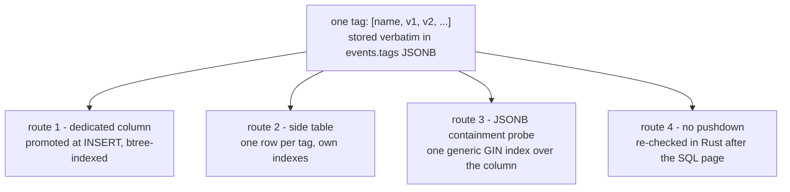

# Event tags

An **event tag** is one entry in a Nostr event's `tags` field: an ordered array of
strings whose first element names the tag and whose remaining elements are its
values, held inside an outer array so a single event carries many of them. This
node is about tags *as a mechanism* — the shape, the single-letter filter
convention, and how a tag stops being inert text and becomes a dimension you can
query on. What any individual tag *means* is not here; see **Scope and omissions**.

## Definition

`tags` is an **array of arrays of strings**. Position 0 of an inner array is the
tag name; position 1 is conventionally its primary value; positions 2 and beyond
are optional extra positional data. Buzz stores that structure verbatim — the
insert path serializes the event's tags straight to JSON and binds them to a
single `JSONB NOT NULL` column on `events`.

Two things follow from that, and they are the whole subject of this node:

1. **Storing a tag is uniform.** The store layer never prunes, reshapes or
   truncates the array — it serializes whatever the signed event carried. Some
   kind-specific ingest validators reject an *event* over its tag counts, but
   nothing removes tags from an event that is accepted.
2. **Querying a tag is not uniform.** A tag becomes queryable only where some
   specific piece of machinery has been built to reach it — a column, a side
   table, an index probe, or a post-filter pass. Those four routes are not
   equivalent, and which route a tag takes is a deliberate per-tag decision, not
   a property of tags in general.

**What this concept is not.** "Tag" here means a positional array inside a signed
event. It is not a database index, not a label on a channel or repository, and
not the `t`-style topic convention that happens to use the same word — that is
one *instance* of the mechanism, and it takes the last of the four routes below.

## How a filter key reaches a tag

NIP-01 filters address tags through keys of the form `#<letter>`. In Buzz the
`nostr` crate's filter type keys its generic-tag map by `SingleLetterTag`, and
every Buzz lookup into that map constructs the key the same way —
`SingleLetterTag::lowercase(Alphabet::…)` — in the core matcher, the REQ handler,
the HTTP bridge and the push runtime alike.

The consequence is sharp and easy to miss: **a multi-letter tag name has no
NIP-01 filter key.** `buzz-acp` says so in its own doc comment, and works around
it by bypassing the typed filter entirely — `query_raw` serializes a raw JSON
filter document verbatim so that `#buzz-channel` survives to the relay. On the
receiving side, the HTTP `/query` bridge honours exactly one multi-letter key:
`extract_buzz_channel` pulls `#buzz-channel` out of the raw JSON *before*
`nostr::Filter` parsing, accepts it only as a single-element array holding one
string, and hands it to the generic containment pushdown. That is the only
multi-letter filter key the relay reads.

A multi-letter tag can still become a first-class query dimension by a different
door. `not_before` — nine letters — is promoted at insert time into its own
`events` column with its own partial index, and is queried as a column, never as
a filter key.

## The four routes from stored to queryable

| Route | Mechanism | Selectivity applied | What it costs |
|---|---|---|---|
| Dedicated column | Extracted at insert and bound to its own `events` column, then indexed like any scalar | In SQL, before `LIMIT` | A schema change and an extractor per tag |
| Side table | One row per tag occurrence, joined back to `events` | In SQL, before `LIMIT`, via an indexed join | A table, its indexes, and write amplification |
| JSONB containment | `tags @> [[name, value]]`, served by the single whole-column GIN index | In SQL, before `LIMIT` | Nothing per tag — the index is generic |
| No pushdown | The constraint is re-applied to fetched rows by the Rust matcher | In Rust, *after* the SQL page was chosen | Correct results, but a page selected without the constraint |

The distinction that matters is the last column of that table, not the first.
Routes 1–3 narrow the candidate set the database returns. Route 4 does not — it
filters what already came back. Results stay correct either way; what changes is
how many rows had to be read to find them, and whether a page can come back
short because the constraint removed most of it.

**The index is generic; the clauses are not.** There is exactly one index over
the whole `tags` column — GIN with `jsonb_path_ops`, whose own migration comment
records that it supports precisely the `@>` operator the query path uses. Because
it indexes the column and not a tag name, it can serve a containment probe for
*any* tag. So the boundary between "queryable" and "merely stored" is drawn by
which clauses the query builder chooses to emit, not by which tags someone
remembered to index. Today the builder emits containment from three fields: the
e-tag list, an arbitrary `(name, value)` pair, and a visibility gate.

**Which filter keys reach SQL is written down in one place.** `filter_fully_pushable`
in the REQ handler both documents and enforces it: `#h` through the caller-injected
channel scope, `#p` only when single-valued, `#d` only when every requested kind is
parameterized-replaceable, and `#e` at any cardinality. Every other generic tag —
its doc comment names `#t` and `#a` — returns false, which is route 4. That same
doc comment ties the distinction to counting: a fully pushable filter is one for
which `count_events()` produces an exact count without post-filtering.

## Positional values: only element 1 travels

Every promotion path in the store layer reads element 0 as the name and element 1
as the value, and ignores everything after: the `d`-tag extractor, the
`not_before` extractor and the mention indexer all test
`parts.len() >= 2 && parts[0] == <name>` and return `parts[1]`. Extra positional
values are preserved in the `tags` JSONB — nothing truncates them — but no
promoted column or side-table row ever carries them.

The containment route behaves differently, and this is a real asymmetry rather
than a detail. JSONB containment matches a **superset**: the code's own comment
on the shared-visibility gate records that `tags @> '[["shared","true"]]'` would
also match `["shared","true","extra"]`, and states that the pushdown is sound only
because an ingest-time exact-shape check prevents such a tag from being stored.
So a positional extra is invisible to routes 1 and 2, and visible-by-tolerance to
route 3.

## Cardinality and length

**Buzz sets no global limit on tags.** The NIP-11 limits document this relay
advertises carries eleven fields — message length, subscription count, filter
count, filter limit, subscription-id length, proof-of-work difficulty, three
policy booleans and two NIP-ER values — and none of them bounds the number of tags on
an event or the length of a tag value. The one whole-event ceiling the ingest
validator enforces is a 256 KB cap compared against `event.content`, not against
the tag array.

**Constraints are per kind instead, and the two enforcement styles differ.** In
Rust, kind validators in the ingest path *reject* events whose `d`, `p` or
`agent` tag counts are not exactly one. In Postgres, migration
`0011_nip_rs_exact_tag_cardinality.sql` uses exact cardinality as a **gate**
rather than a rejection: its trigger functions apply the read-state watermark and
purge logic only to kind 30078 events carrying exactly one `d` tag whose value
equals the stored `d_tag` column and exactly one `["t","read-state"]` tag, and its
opening `DELETE` removes watermark rows whose source event fails that shape. An
event with the wrong tag count is not raised on — it simply falls outside the
guarded branch. The two exceptions that migration *can* raise are a stale-event
rejection and a refusal of a hard delete attempted without the corrected writer's
opt-in, which is how an older relay binary is stopped from deleting a live
read-state coordinate.

The only tag-value **length** bound in the store layer is a 1024-byte ceiling, and
it too is scoped to one tag name rather than to tags generally.

## Use cases

Understanding tags as a mechanism, rather than as a list of known tag names,
matters at three moments:

- **Adding a new tag to an event kind.** The tag will be stored the moment you
  emit it and will appear in every read of that event. Whether anyone can *find*
  events by it is a separate question with four possible answers, and the default
  answer is route 4.
- **Writing a filter and getting back fewer rows than the `limit` asked for.** A
  `#t` or `#a` constraint does not narrow the SQL query. The page is chosen by
  kind, author and time, and the tag constraint is applied to whatever comes
  back. That is not a bug; it is route 4 working as designed.
- **Reaching for a multi-letter tag name.** It cannot be expressed as a NIP-01
  filter key at all. Either accept route 1 (promote it to a column) or follow the
  `#buzz-channel` precedent's raw-JSON path, and know that only that one key is
  read.

## Scope and omissions

**This node covers** the array-of-arrays structure, the single-letter filter-key
convention and its multi-letter exception, the four routes by which a tag becomes
queryable, the positional-element convention shared by every promotion path, and
where tag cardinality and length are constrained.

**It does not cover, and these are gaps rather than silence:**

| Not covered here | Owned by |
|---|---|
| What the `d` tag means, and its parameterized-replaceable addressing semantics | its own sibling node (task #1148) |
| What the `e` tag means, and its threading and reference semantics | its own sibling node (task #1149) |
| What the `h` tag means, and channel scoping — including the `channel_id` fallback in the matcher | its own sibling node (task #1158) |
| What the `p` tag means, and mention and read-authorization semantics | its own sibling node (task #1162) |
| The `events` row shape and the `tags` column's place in it | `layers-data-postgres-events-table` |
| The index inventory, including `idx_events_tags_gin`'s place among the rest | `layers-data-postgres-indexes` |
| Full-text search over event `content`, which is a different column and a different index | `capabilities-search-search-query` |
| The upstream NIP-01 text these conventions implement | Not in this repository — see below |

None of the four sibling tag nodes is merged on `origin/launchpad` at the recorded
revision, so they are named above by subject and issue rather than as
`relationships` targets, which must resolve against the merge target.

**Expected but not verified when this node was written:**

- **`nostr::Tag::content()`'s behaviour for a tag of three or more elements was
  not established.** The `nostr` crate source was not present on the authoring
  machine — no cargo registry cache exists there — so the claim that the
  in-memory matcher compares element 1 is carried as an INFERENCE reasoned from
  Buzz's own call sites, not read from the crate. An author with the crate
  vendored should confirm it and, if it holds, promote the claim.
- **No upstream Nostr specification text is in this repository.** `docs/nips/`
  holds only Buzz's own letter-coded NIPs; `ls docs/nips/NIP-01.md` exits 2 and a
  repo-wide `find . -name 'NIP-01*'` returns nothing. Every claim above is
  therefore made about what Buzz's code does, never about what a standard
  requires — where the two differ, this node describes Buzz.
- **No test was found that asserts a multi-letter filter key is ignored by the
  WebSocket REQ path.** The behaviour is inferred from the `SingleLetterTag`
  keying and from `buzz-acp`'s doc comment explaining why it routes around the
  typed filter. Whether an unrecognised `#foo` key is dropped silently or causes
  the filter to be rejected was not exercised against a running relay.
- **The relative cost of route 4 was not measured.** Migration 0004's own comment
  carries staging numbers for the unindexed e-tag case, but no equivalent
  measurement exists here for a post-filtered `#t` query, so this node describes
  the mechanism's shape and deliberately makes no performance claim about it.
