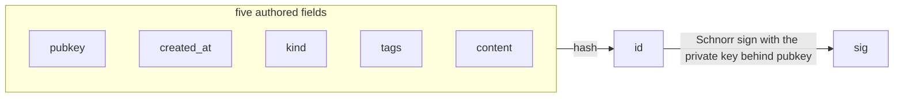

# The Nostr event

A **Nostr event** is a signed, content-addressed JSON object of seven fields, and it is
the unit of data on Buzz's primary API: a chat message, a reaction, a piece of channel
metadata and an agent observer frame are all the same object, distinguished from one
another only by the integer in the `kind` field. The relay's narrow HTTP surface —
Blossom media, git smart HTTP, health probes — moves bytes that are not events; almost
everything else in the system is one.

That first sentence is most of what makes Buzz's architecture the shape it is. This node
explains the object — what its seven fields are, how they hang together, and what
properties follow from that structure. It does not explain any one of those fields in
depth; each has its own node, listed in *Scope and omissions*.

## Definition

An event is a JSON object with exactly seven fields. Five of them are authored by
whoever creates the event; two are derived from those five and from the author's private
key.

| Field | Authored or derived | What it carries |
|---|---|---|
| `pubkey` | authored | The public half of the keypair that signed this event — the author's identity |
| `created_at` | authored | The author's claimed creation time, a Unix timestamp in seconds |
| `kind` | authored | An unsigned integer naming what sort of thing this event is |
| `tags` | authored | An array of string arrays carrying the event's structured references |
| `content` | authored | The event's payload, a string |
| `id` | derived | A hash over the five authored fields — the event's content address |
| `sig` | derived | A Schnorr signature binding `id` to the key named in `pubkey` |

The table above is a field census, not a reference guide: what each field *means* in
Buzz, and what values it may take, belongs to that field's own node.

**The derivation is what makes the object trustworthy.** `verify_event`
(`crates/buzz-core/src/verification.rs`) is the whole of Buzz's answer to "is this event
real": it recomputes the id from `pubkey`, `created_at`, `kind`, `tags` and `content`,
compares it to the `id` the object carries, and then checks that `sig` is a valid
signature over that id. Neither half consults a database, a connection, a clock or any
configuration — the object is checked entirely against itself.

The consequence is that an event is **self-validating**. Given the bytes alone, anyone
can establish that the object has not been altered since it was signed and that whoever
signed it held the private key for the `pubkey` it names. Nothing else needs to be
trusted — not the relay that delivered it, not the transport it arrived on, not the
storage it was read from.

The mechanics behind the two derived fields are deliberately not spelled out here. How
the id's preimage is serialized, and what signature scheme `sig` uses over which curve,
are each their own node.

**What an event is not.** It is not a database row: a relay's storage is a projection of
events, and the row's shape can change without any event changing. It is not a message
envelope: the WebSocket frame that carries an event to the relay is a separate,
unsigned wrapper around it. And it is not mutable: editing any authored field would
change the id, which would invalidate the signature, so any mechanism that appears to
change an event has to work some other way. Which mechanisms exist and how they do it
belongs to the replaceable-form and deletion nodes rather than here; what matters at
this level is that none of them can work by rewriting a signed object.

**Relay-assigned metadata lives outside the object.** When the relay needs to remember
something about an event that the author did not sign — when it arrived, which channel
it landed in, whether verification has run — it wraps the event rather than extending it.
`StoredEvent` (`crates/buzz-core/src/event.rs`) is that wrapper: a `nostr::Event` plus
`received_at`, `channel_id` and a `verified` flag, kept structurally separate so that the
signed object stays byte-identical to what the author signed.

## Where the type comes from

Buzz does not define the event type. `buzz-core` re-exports `nostr::Event` (along with
`EventId`, `Filter`, `Keys`, `Kind` and `PublicKey`) from the external `nostr` crate,
pinned at version 0.44 in the workspace manifest — so the type is available to the rest
of the workspace either through that re-export or from the `nostr` crate directly.
Buzz's own additions are the wrapper (`StoredEvent`), the verification
function, the custom kind registry, and the filter and codec logic around them — the
object itself is upstream's.

Because of that, an event enters the system by **deserialization, not construction**.
`crates/buzz-relay/src/protocol.rs` parses an inbound `EVENT` frame by handing its second
element straight to `serde_json::from_value::<Event>`; a JSON object the `nostr` crate
cannot deserialize is rejected as an invalid message and never becomes an `Event` at all.
Deserialization is therefore the object's first and cheapest gate, and it happens before
any Buzz code has looked at the event.

On the writing side, `buzz-sdk`'s builder functions return an *unsigned*
`nostr::EventBuilder` and document that the caller signs it with their own keys. The SDK
validates inputs and shapes tags; it never holds a private key and never produces a
signed event. That keeps signing at the edge, in the hands of whoever owns the identity.

## Why the seven fields hold together the way they do

The `id`/`sig` derivation gives the object a property the relay depends on structurally:
**an event's internal consistency can be established before anything about its context
is known.** That shows up directly in the order of checks the relay runs. Inside
`ingest_event_inner` (`crates/buzz-relay/src/handlers/ingest.rs`), `verify_event` runs
first; only afterwards does the relay ask the questions that require something outside
the object — whether `created_at` is within 900 seconds of the server's clock, whether
`content` is within the 256 KB cap, and whether `pubkey` matches the authenticated
session. A comment in that function states the ordering is deliberate, requiring command
kinds to be routed "AFTER signature verification, timestamp check, pubkey/auth match, and
scope validation — never before."

That ordering says something about the object rather than about the pipeline: the
cheapest thing to establish about an event is also the thing that needs the least
context, because five of its seven fields determine the other two. The full ordered
pipeline — every step, every rejection path, every outcome — is
`architecture-flows-event-ingestion`'s to document, and the accept/reject invariant
itself is `architecture-principles-signed-events`'s. This node names the ordering only
as evidence about the object's shape.

One operational consequence is worth stating because it is a property of the object, not
of any one call site: verification is **CPU-bound**. `verify_event`'s own doc comment
requires that async callers dispatch it through `tokio::task::spawn_blocking` rather than
running it inline. Schnorr verification is not free, and there is no way to accept an
event without paying for it — which enforcement points bear that cost, on which paths,
is `architecture-principles-signed-events`'s to enumerate.

## The seven-field contract in practice

The repository's root contributor guide (`AGENTS.md`, which `CLAUDE.md` symlinks to)
states that all `buzz-cli` event reads return normalized JSON arrays whose normal output
preserves "the seven canonical signed Nostr event fields (`id`, `pubkey`, `kind`,
`content`, `created_at`, `tags`, `sig`)". That claim holds, with one honest nuance.
`normalize_events` (`crates/buzz-cli/src/client.rs`) rebuilds each event as an object
carrying `id`, `pubkey`, `kind`, `content`, `created_at` and `tags`, and adds `sig` only
when the source value is a JSON string — a missing or non-string signature is *omitted*
rather than filled with a placeholder. So the CLI emits seven fields for a real signed
event and six for anything that is not one, which is the honest behaviour rather than an
inconsistency.

Two unit tests in that file pin the contract from both directions.
`normalize_events_preserves_the_complete_signed_event_shape` injects an extra
`relay_internal` field into a genuinely signed event, normalizes it, then deserializes
the result back into `nostr::Event`, asserts it equals the original, and calls `verify()`
on it — establishing that the seven-field projection is a complete, still-verifiable
signed event and not a lossy summary, and that relay-added fields are dropped.
`normalize_events_omits_missing_or_non_string_signatures` pins the six-field case.

This is the clearest demonstration in the repository of what the seven fields are *for*:
an event that has passed through a relay, been stored, been queried back, and been
reserialized by a different program is still the same object the author signed, and can
still be verified by anyone who holds the bytes.

## Use cases

Understanding the event as one object, rather than as seven separate fields, is what
makes the following make sense:

- **Reading the codebase.** `Event` is the parameter type threaded through the relay's
  handlers. Knowing that the object is immutable and self-validating explains why code
  downstream of ingest does not re-check for tampering: one function at the front already
  did, and nothing between there and the reader could have changed the object without
  breaking it.
- **Adding a feature.** The repository's contributor guide directs new feature work to
  model an operation as a new event kind rather than a new HTTP endpoint, and says that
  doing so inherits realtime fan-out, NIP-29 scoping and the existing auth pipeline for
  free. That advice only makes sense if you know the object is generic — that everything
  distinguishing one operation from another lives inside these same seven fields.
- **Debugging a rejection.** Rejections divide cleanly into the ones the object caused
  (a bad id, a bad signature) and the ones its context caused (clock drift, size, an
  identity mismatch, insufficient scope). Knowing which side of that line a failure sits
  on narrows the search immediately.
- **Reasoning about trust.** Events cross the relay, the database, the pub/sub layer, the
  desktop client and the mobile client. The object's self-validating structure is why
  none of those hops has to be trusted individually.

## A note on citing upstream specifications

Buzz implements Nostr but does not vendor its specifications. `docs/nips/` in this
repository contains only Buzz's *own* NIPs, all of them two-letter codes (`NIP-AA`,
`NIP-AE`, `NIP-AO`, `NIP-PMA`, and so on); no upstream numbered specification text —
NIP-01 included — is present anywhere in the tree. Claims in this node about what
upstream requires are therefore anchored to Buzz source that records it, such as
`kind.rs`'s module doc comment noting that NIP-01 specifies `kind` as an unsigned
integer, rather than to a specification file that does not exist here. A complete
seven-field event object does appear as a worked example in `docs/nips/NIP-AO.md`.

## Scope and omissions

**This node covers** the event as a single object: its seven fields as a set, the
authored/derived split between them, where the type comes from, why the derivation makes
the object self-validating and immutable, and what follows from that for the rest of the
system.

**It does not cover, and these are gaps rather than silence.** Each field and form below
is its own corpus node; this node links to them by subject rather than describing them:

| Not covered here | Owned by, by subject |
|---|---|
| How the `id` is computed — the serialization of the preimage and the hash over it | the corpus node for the event id |
| The signature scheme `sig` uses, and what verifying it establishes cryptographically | the corpus node for the event signature |
| What `kind` integers mean, the Buzz custom registry, and the numeric ranges | the corpus node for event kinds |
| Tag grammar, single-letter indexed tags, and how tags carry references | the corpus node for event tags |
| The `["EVENT", ...]` WebSocket frame that carries an event to the relay | the corpus node for the EVENT wire message |
| Ephemeral events — the kinds that are fanned out but never stored | the corpus node for ephemeral events |
| Replaceable and addressable (parameterized replaceable) event forms | the corpus nodes for those two forms |
| The ordered ingestion pipeline, every rejection path and every outcome | `architecture-flows-event-ingestion` |
| The accept/reject invariant over `id` and `sig` and its enforcement points | `architecture-principles-signed-events` |
| How an accepted event is persisted, and the columns it is projected into | `layers-data-postgres-events-table` |
| What `buzz-core` and `buzz-relay` are each responsible for as crates | `implementation-crates-buzz-core`, `implementation-crates-buzz-relay` |

Those first seven rows name subjects rather than issue numbers deliberately: the nodes
were being authored in parallel with this one and none of them existed on
`origin/launchpad` at the recorded revision, so no relationship edge to them is legal
yet. The edges in this node's front matter point only at nodes already merged.

**Expected but not verified when this node was written:**

- **The `nostr` crate's own `Event` definition was never opened.** The crate is an
  external dependency pinned at 0.44 and its source is not on this machine — there is no
  `~/.cargo/registry` and no `vendor/` directory in the tree. The seven-field claim was
  therefore established indirectly, from Buzz's uses of the type: `verify_event` reads
  six of the seven fields by name, `buzz-db`'s event store reads the seventh (`event.sig`,
  to persist the signature bytes), and all seven appear as `event.<field>` accesses
  across the workspace crates. That is strong evidence
  that the seven exist and are the ones Buzz relies on, but it is **not** proof that the
  upstream struct has no eighth field Buzz simply never touches. A reader who needs that
  guarantee should read the crate.
- **No upstream NIP-01 text is in this repository**, so nothing here restates what the
  specification itself says about the object. The absence was checked directly rather
  than assumed.
- **No test was found asserting the ingest check ordering itself.** The ordering was read
  from `ingest_event_inner` and is corroborated by an in-file comment stating it is
  intentional, but nothing was located that would fail if a future edit moved the
  timestamp or content check ahead of `verify_event`. Whether such a test exists
  elsewhere in the relay's conformance tracing was not established here; a test contract
  for that ordering, if one is wanted, is a separate concern from this node.
- **Immutability is argued structurally, not surveyed.** The claim that no mechanism can
  change an event by rewriting it rests on the derivation (any edit to an authored field
  changes the id and invalidates the signature) plus the ingest path read here. No
  exhaustive search of every write path in every crate for a mutation of a stored event's
  authored fields was performed, and the replaceable and deletion mechanisms themselves
  were deliberately not opened, since they belong to sibling nodes.
