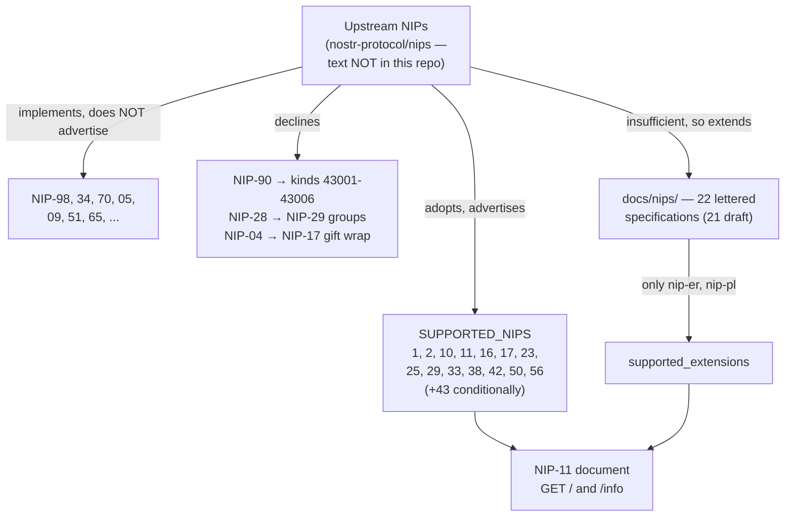

# Nostr, as Buzz uses it

Nostr is the open, relay-and-signed-event protocol Buzz is built on. This node's
subject is not Nostr itself — it is **Buzz's relationship to Nostr**: which parts of
the protocol Buzz adopts, which it extends with specifications of its own, and which
it looks at and refuses.

That distinction is the whole point of the node. A generic explanation of Nostr would
be unverifiable here, because no upstream NIP text exists anywhere in this repository
(`find(path='docs/nips', name='NIP-[0-9]*.md')` returns nothing). What *is*
documentable, and is documented nowhere else in the corpus, is the boundary Buzz has
drawn around the protocol.

## Definition

**A NIP** is one numbered specification in the upstream `nostr-protocol/nips`
repository, each describing one piece of wire behavior a relay or client may support.
(The acronym's expansion is not defined anywhere in this repository, so it is not
stated here.) **A relay's `supported_nips` list**, served in its NIP-11 information
document, is that relay's public claim about which of them it honors.

Buzz relates to that vocabulary in three distinct ways, and this node's job is to keep
them apart:

| Relationship | What it means here | Where it is recorded |
|---|---|---|
| **Adopts** | Buzz implements the upstream NIP and advertises it, so a third-party client may rely on it | `SUPPORTED_NIPS` in `crates/buzz-relay/src/nip11.rs` |
| **Extends** | Buzz needed behavior no upstream NIP covers and wrote its own lettered specification for it | the 22 files in `docs/nips/` |
| **Declines** | Buzz considered an upstream NIP and deliberately did not implement it, or removed it | comments in `crates/buzz-core/src/kind.rs`; `NOSTR.md` |

**What this is not.** "Nostr" here does not mean the public Nostr network of
interconnected relays. Buzz does not federate at the relay level — that boundary is
`architecture-context-nostr-network`'s to state, and this node does not restate it.
Nor does "adopts" mean "conforms": advertising a NIP is a claim made by a constant in
one file, and only the tests in `verification-contracts-nostr` exercise any of it
against a live relay.

## What Buzz adopts

`crates/buzz-relay/src/nip11.rs` declares one unconditional list:

```
SUPPORTED_NIPS: &[u32] = &[1, 2, 10, 11, 16, 17, 23, 25, 29, 33, 38, 42, 50, 56]
```

Fourteen NIPs, sorted (a unit test in the same file asserts the sorting). Each has
implementing code, located and named here rather than assumed:

| NIP | Subject | Corroborated in |
|---|---|---|
| 01 | Base event and client/relay message format | `crates/buzz-relay/src/protocol.rs` — module doc: "NIP-01 client/relay message parsing and formatting" |
| 02 | Contact list (kind:3) | `crates/buzz-core/src/kind.rs` (`KIND_CONTACT_LIST`), reaching `handlers/ingest.rs` scope resolution |
| 10 | Threading markers on `e` tags | `crates/buzz-core/src/nip10.rs` — "Shared NIP-10 thread-marker parsing" |
| 11 | Relay information document | `crates/buzz-relay/src/nip11.rs`, routed at `/` and `/info` |
| 16 | Replaceable events | `crates/buzz-db/src/store/replaceable.rs`; canonical ordering in `event.rs` |
| 17 | Gift-wrapped private DMs (kind:1059) | `crates/buzz-core/src/kind.rs` (`KIND_GIFT_WRAP`) |
| 23 | Long-form content (kind:30023) | `crates/buzz-core/src/kind.rs` (`KIND_LONG_FORM`) |
| 25 | Reactions (kind:7) | `crates/buzz-core/src/kind.rs` (`KIND_REACTION`) |
| 29 | Relay-based groups — the channel model | `crates/buzz-relay/src/handlers/ingest.rs`; surface table in `NOSTR.md` |
| 33 | Parameterized replaceable events | `crates/buzz-db/src/store/replaceable.rs` |
| 38 | User status (kind:30315) | `crates/buzz-core/src/kind.rs` (`KIND_USER_STATUS`), reaching ingest |
| 42 | Client authentication to relays (kind:22242) | `crates/buzz-auth/src/lib.rs` |
| 50 | Search filters | `crates/buzz-search/src/query.rs` — "NIP-50 search query against Postgres FTS" |
| 56 | Reporting (kind:1984) | `crates/buzz-core/src/kind.rs`; queue handling in `handlers/ingest.rs` |

**NIP-43 is the one conditional entry**, and the reason is instructive. It lives in a
separate constant, `NIP_RELAY_MEMBERSHIP = 43`, appended to `supported_nips` only when
the relay both holds a stable signing key and enforces membership. `nip11.rs` states
why in a test: the desktop pairing probe keys off this NIP, so advertising it on an
open relay misroutes pairing peers to a `/pair` sidecar that is not there. A
`debug_assert` in `RelayInfo::build` refuses `advertise_nip43` without a `self` pubkey,
because NIP-43 events are verified against it.

**Advertisement is narrower than implementation.** Several NIPs are implemented and
never advertised — NIP-98 has a dedicated `crates/buzz-auth/src/nip98.rs` verifying
kind:27235 HTTP auth events; NIP-34 governs patch-based git push in
`crates/buzz-core/src/git_perms.rs`; NIP-70's protected-event `-` tag is built in
`buzz-sdk` and checked in `buzz-cli`; NIP-05, NIP-09, NIP-51 and NIP-65 each have named
kind constants or profile-sync behavior. Thirty-nine distinct numbered NIPs are
referenced across the Rust sources against the fourteen advertised. So
`supported_nips` reads as a curated claim about what a third-party client may depend
on, not as an inventory.

**And registration is not use.** `kind.rs` registers `KIND_CHANNEL_METADATA` (kind:41)
with the comment "NIP-01: Channel metadata (replaceable). Not used by Buzz today." A
kind constant existing proves the number is reserved, not that anything emits it.

## What Buzz extends

When Buzz needs behavior no upstream NIP covers, it writes a specification rather than
inventing wire format silently. Those live in `docs/nips/` as 22 Markdown files, all
using lettered codes so they cannot collide with an upstream number. Twenty-one of the
twenty-two declare themselves `draft` and most also `optional`; the exception is
`NIP-FI-MODEL`, an explicitly non-normative companion that "defines no requirement,
invariant, wire value, denial mapping, or conformance claim." Several open with an
explicit **Depends on** line naming the upstream NIPs they build atop — `NIP-CW` on
NIP-01/11/29/98, `NIP-IA` on NIP-01/11/42/43/70 plus `NIP-OA`, `NIP-MP` on
NIP-01/34/09.

| Specification | Subject |
|---|---|
| `NIP-AA` | Agent authentication (depends on NIP-OA, NIP-43, NIP-42) |
| `NIP-AE` | Agent engrams — addressable, encrypted agent memory |
| `NIP-AM` | Agent turn metrics — per-turn token usage and cost |
| `NIP-AO` | Agent observability — ephemeral session telemetry |
| `NIP-AP` | Agent personas — the blueprint an agent is spawned from |
| `NIP-CW` | Channel window |
| `NIP-DV` | DM visibility |
| `NIP-ER` | Event reminders — encrypted, author-only, with a public due time |
| `NIP-FI` | Federated identity authorization, core |
| `NIP-FI-CONF` | Conformance evidence profile for NIP-FI |
| `NIP-FI-DELEG` | Delegated agent authorization profile |
| `NIP-FI-EDGE` | Trusted enterprise edge profile |
| `NIP-FI-LIFECYCLE` | Binding lifecycle profile |
| `NIP-FI-MODEL` | Composed authorization model (explicitly non-normative) |
| `NIP-GS` | Git object signing with Nostr keys |
| `NIP-IA` | Identity archival |
| `NIP-MP` | Multi-repository projects |
| `NIP-OA` | Owner attestation — an owner key authorizing an agent key |
| `NIP-PL` | Push leases |
| `NIP-PMA` | Private managed-agent aggregate |
| `NIP-RS` | Cross-device read state sync |
| `NIP-WP` | Workspace profile |

**These are advertised through a different field.** Only two of the twenty-two ever
reach the NIP-11 document, and not via `supported_nips`: `nip11.rs` seeds a separate
`supported_extensions` array with `"nip-er"` unconditionally and pushes `"nip-pl"` when
a push descriptor is configured (alongside `"buzz-gif"`, which is not a NIP at all).
The other twenty are invisible to a client reading NIP-11.

**Two asymmetries are worth knowing before trusting either list as complete:**

- **NIP-AB is implemented but unwritten.** `crates/buzz-pair-relay`'s crate doc calls
  itself an "Ephemeral sidecar relay for NIP-AB device pairing handshakes" and
  `buzz-core/src/pairing/session.rs` is a "NIP-AB pairing session state machine" — 50
  references across the Rust sources — yet `docs/nips/NIP-AB.md` does not exist.
- **NIP-AA is written but unreferenced.** `docs/nips/NIP-AA.md` specifies agent
  authentication in full, and `NIP-AA` appears zero times in `crates/`.

So `docs/nips/` is neither a superset nor a subset of what the code implements. Read
both.

## What Buzz declines

Refusals are recorded, not merely absent — which is what makes them documentable:

- **NIP-90 (data vending machines).** `crates/buzz-core/src/kind.rs` carries
  `// Not using NIP-90 kinds (5000–6999) — Buzz requires auth chains (depth ≤ 3,
  breadth ≤ 10).` immediately above the agent job protocol kinds Buzz defined instead
  at 43001–43006. The stated reason is a capability the upstream kind range does not
  carry, not a preference.
- **NIP-28 (public chat).** `NOSTR.md`'s opening states "The old NIP-28 compatibility
  proxy has been removed"; NIP-29 relay-based groups is the channel model. `NIP-28` is
  referenced zero times in the Rust sources.
- **NIP-04 (legacy encrypted DMs).** `NOSTR.md`'s *What Doesn't Work* table states
  "NIP-17 gift wraps supported; NIP-04/NIP-44 not implemented" for DMs, with kind:10050
  deferred. `NIP-04` is likewise referenced zero times in the sources.

**One caution on that last row.** The "NIP-44 not implemented" clause is scoped to the
DM path only. NIP-44 v2 *is* implemented elsewhere — it encrypts pairing payloads in
`crates/buzz-core/src/pairing/mod.rs`, and both `NIP-AE` and `NIP-ER` specify NIP-44
encryption for their content. Reading that table row as a repository-wide statement
would be wrong.

**A refusal can also live inside a Buzz specification.** `NIP-PMA` is marked
"protocol/codec reservation only" and states that relays MUST reject kind 30179 until
privacy, transactional CAS, backup/restore, revocation and capability gates are
deployed. A written spec is not a claim that the kind is accepted.

## Diagram



## Use cases

**Answering "does Buzz support NIP-N?"** The honest answer has three parts, and this
node's tables give all three: is it advertised, is it implemented, and was it
explicitly declined. Answering from `SUPPORTED_NIPS` alone will say "no" for NIP-98,
which Buzz implements thoroughly.

**Deciding where new protocol behavior goes.** If an upstream NIP covers it, adopt and
advertise. If none does, the precedent is a lettered draft in `docs/nips/` plus kinds in
`buzz-core/src/kind.rs` — not silent wire format. `development-protocol-changes` and
`development-event-kind-changes` own the procedures.

**Judging third-party client compatibility.** A client that speaks NIP-01, NIP-29 and
NIP-42 can connect. What it will not render is anything in the Buzz-custom kind ranges,
because no lettered NIP is advertised to it in `supported_nips` at all.

**Not mistaking advertisement for conformance.** Nothing in `nip11.rs` tests wire
behavior against upstream spec text; its tests assert which integers are in a list.

## Scope and omissions

**This node covers** the adopt/extend/decline relationship between Buzz and Nostr: the
advertised list and where each entry is implemented, the 22 Buzz-authored lettered
specifications and how the two of them that are advertised reach clients, and the
recorded refusals.

**It does not cover, and these are gaps rather than silence:**

| Not covered here | Owned by |
|---|---|
| The design principle of modelling features as events and keeping HTTP narrow | `architecture-principles-nostr-first` |
| Nostr as an external system — actors, the community/host boundary, non-federation | `architecture-context-nostr-network` |
| Whether the interop behavior is actually exercised against a live relay | `verification-contracts-nostr` |
| Any single protocol primitive — the event, filters, tags, subscriptions, the kind registry, the NIP-11 document as a document, NIP-29 groups, NIP-42 auth | one #609 sibling node each; none merged at this revision, so none is a relationship target here |
| The procedure for changing the protocol or adding a kind | `development-protocol-changes`, `development-event-kind-changes` |
| What any upstream NIP actually requires | `nostr-protocol/nips`, which is not in this repository |

**Expected but not verified when this node was written:**

- **No conformance check was run against upstream NIP text.** Every "adopts" row above
  establishes that implementing code exists and names the NIP — not that the
  implementation satisfies the specification. The specifications are not in this
  repository to check against.
- **The low-frequency tail of unadvertised NIP references was not individually
  confirmed as implementations.** NIP-98, NIP-34, NIP-70, NIP-05, NIP-09, NIP-51 and
  NIP-65 were each traced to a named file or kind constant. Nine further numbered NIPs
  appear exactly once in the sources; a single mention can be a passing reference
  rather than an implementation — NIP-90's single occurrence is precisely that, and it
  is a *refusal*. The 39-against-14 ratio is therefore an INFERENCE about reference
  counts, not a count of implementations.
- **`docs/nips/` has no index or README**, so the subject line for each specification
  was read from that file's own opening abstract. No source cross-checks the 22 against
  each other or against the kind registry.
- **Whether the relay's live `/info` response matches `SUPPORTED_NIPS`** was not
  observed — no relay was run. The claim rests on reading `nip11.rs` and `router.rs`.
- **NIP-AA's zero code references were established by grep on `crates/` only.** Whether
  it is implemented in the desktop, mobile or web trees under a different spelling was
  not checked.
